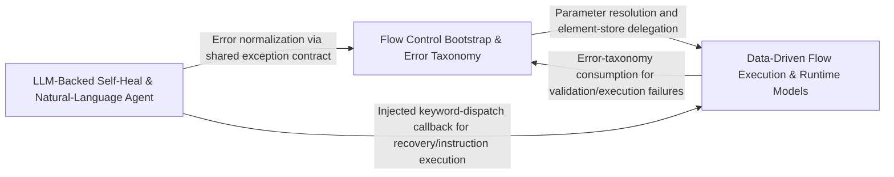

## Details

The LLM-driven last resort of the self-healing ladder and natural-language automation: AISelfHealHandler recovers failed keywords and NaturalLanguageAgent drives full instructions, both backed by LLMInterface and step-curation logic, with flow_control providing loop/conditional keywords and auxiliary developer-tooling scripts.

### Flow Control Bootstrap & Error Taxonomy
Owns FlowControl's construction and session-validation surface, the framework-wide error taxonomy (OpticsError/Code), scalar-parameter resolution utilities, and developer-facing entry points including list_keyword introspection and LiveController for interactive optics live sessions.

**Related Classes/Methods**:

- `optics_framework.api.flow_control.FlowControl.__init__`:44-53
- `optics_framework.common.error.OpticsError`:352-489
- `optics_framework.common.utils.resolve_scalar_param`:25-49

**Source Files:**

- `optics_framework/api/flow_control.py`
  - `optics_framework.api.flow_control.FlowControl` (L41-L1336) - Class
  - `optics_framework.api.flow_control.FlowControl.__init__` (L44-L53) - Method
  - `optics_framework.api.flow_control.FlowControl._resolve_param` (L60-L64) - Method
  - `optics_framework.api.flow_control.FlowControl._execute_keyword_method` (L98-L112) - Method
  - `optics_framework.api.flow_control.FlowControl._parse_variable_iterable_pairs` (L209-L215) - Method
  - `optics_framework.api.flow_control.FlowControl._parse_variable_names` (L217-L231) - Method
  - `optics_framework.api.flow_control.FlowControl._parse_iterables` (L233-L243) - Method
  - `optics_framework.api.flow_control.FlowControl._parse_single_iterable` (L245-L267) - Method
  - `optics_framework.api.flow_control.FlowControl._is_condition_true` (L376-L407) - Method
  - `optics_framework.api.flow_control.FlowControl._resolve_condition` (L409-L426) - Method
  - `optics_framework.api.flow_control.FlowControl._resolve_condition.replacer` (L418-L424) - Function
  - `optics_framework.api.flow_control.FlowControl._load_data_frame` (L475-L490) - Method
  - `optics_framework.api.flow_control.FlowControl._load_env_data` (L492-L529) - Method
  - `optics_framework.api.flow_control.FlowControl._normalize_json_data` (L531-L542) - Method
  - `optics_framework.api.flow_control.FlowControl._try_csv_parsing` (L544-L555) - Method
  - `optics_framework.api.flow_control.FlowControl._load_file_data` (L557-L567) - Method
  - `optics_framework.api.flow_control.FlowControl._resolve_file_path` (L569-L577) - Method
  - `optics_framework.api.flow_control.FlowControl._get_file_extension` (L579-L582) - Method
  - `optics_framework.api.flow_control.FlowControl._check_file_exists` (L584-L587) - Method
  - `optics_framework.api.flow_control.FlowControl._load_csv_file` (L589-L590) - Method
  - `optics_framework.api.flow_control.FlowControl._load_json_file` (L592-L603) - Method
  - `optics_framework.api.flow_control.FlowControl._resolve_query_vars.replacer` (L633-L644) - Function
  - `optics_framework.api.flow_control.FlowControl._format_result` (L670-L681) - Method
  - `optics_framework.api.flow_control.FlowControl._format_result.to_str` (L677-L680) - Function
  - `optics_framework.api.flow_control.FlowControl._load_data_with_query` (L701-L726) - Method
  - `optics_framework.api.flow_control.FlowControl._parse_query` (L728-L740) - Method
  - `optics_framework.api.flow_control.FlowControl._load_csv_as_list` (L742-L750) - Method
  - `optics_framework.api.flow_control.FlowControl._load_data` (L762-L768) - Method
  - `optics_framework.api.flow_control.FlowControl._load_from_csv` (L772-L784) - Method
  - `optics_framework.api.flow_control.FlowControl._extract_csv_data` (L787-L803) - Method
  - `optics_framework.api.flow_control.FlowControl._compute_expression` (L831-L847) - Method
  - `optics_framework.api.flow_control.FlowControl._compute_expression.replace_var` (L839-L844) - Function
  - `optics_framework.api.flow_control.FlowControl._safe_eval` (L849-L901) - Method
  - `optics_framework.api.flow_control.FlowControl.invoke_api` (L991-L1009) - Method
  - `optics_framework.api.flow_control.FlowControl._parse_api_identifier` (L1011-L1016) - Method
  - `optics_framework.api.flow_control.FlowControl._get_api_collection` (L1018-L1027) - Method
  - `optics_framework.api.flow_control.FlowControl._get_api_definition` (L1029-L1034) - Method
  - `optics_framework.api.flow_control.FlowControl._prepare_request_details` (L1036-L1051) - Method
  - `optics_framework.api.flow_control.FlowControl._resolve_placeholders` (L1053-L1063) - Method
  - `optics_framework.api.flow_control.FlowControl._execute_request` (L1065-L1105) - Method
  - `optics_framework.api.flow_control.FlowControl._write_api_log` (L1107-L1120) - Method
  - `optics_framework.api.flow_control.FlowControl._write_api_har` (L1122-L1198) - Method
  - `optics_framework.api.flow_control.FlowControl._create_har_structure` (L1200-L1208) - Method
  - `optics_framework.api.flow_control.FlowControl._process_response` (L1210-L1230) - Method
  - `optics_framework.api.flow_control.FlowControl._parse_response_json` (L1232-L1240) - Method
  - `optics_framework.api.flow_control.FlowControl._log_extraction_attempt` (L1242-L1249) - Method
  - `optics_framework.api.flow_control.FlowControl._extract_values_from_response` (L1251-L1258) - Method
  - `optics_framework.api.flow_control.FlowControl._extract_and_store_single_value` (L1260-L1273) - Method
  - `optics_framework.api.flow_control.FlowControl._get_or_create_session_elements` (L1275-L1280) - Method
  - `optics_framework.api.flow_control.FlowControl._evaluate_jsonpath_assertions` (L1282-L1317) - Method
  - `optics_framework.api.flow_control.FlowControl._extract_from_json` (L1319-L1336) - Method
- `optics_framework/common/error.py`
  - `optics_framework.common.error.Code` (L35-L88) - Class
  - `optics_framework.common.error.ErrorSpec` (L91-L108) - Class
  - `optics_framework.common.error.OpticsError` (L352-L489) - Class
  - `optics_framework.common.error.OpticsError.__init__` (L363-L391) - Method
  - `optics_framework.common.error.OpticsError.log` (L393-L408) - Method
  - `optics_framework.common.error.OpticsError._resolve_log_level` (L410-L415) - Method
  - `optics_framework.common.error.OpticsError._build_log_message` (L417-L428) - Method
  - `optics_framework.common.error.OpticsError._print_rich` (L430-L452) - Method
  - `optics_framework.common.error.OpticsError._log_with_logger` (L454-L463) - Method
  - `optics_framework.common.error.from_code` (L500-L504) - Function
  - `optics_framework.common.error.raise_code` (L507-L511) - Function
- `optics_framework/common/models.py`
  - `optics_framework.common.models.ElementData.get_first` (L187-L190) - Method
- `optics_framework/common/utils.py`
  - `optics_framework.common.utils.resolve_scalar_param` (L25-L49) - Function
- `optics_framework/engines/drivers/appium_platforms.py`
  - `optics_framework.engines.drivers.appium_platforms.supported_on.decorator` (L102-L116) - Function
  - `optics_framework.engines.drivers.appium_platforms.supported_on.decorator.wrapper` (L104-L113) - Function
- `optics_framework/helper/list_keyword.py`
  - `optics_framework.helper.list_keyword.list_api_methods` (L7-L30) - Function
  - `optics_framework.helper.list_keyword.format_methods` (L33-L47) - Function
  - `optics_framework.helper.list_keyword.main` (L51-L56) - Function
- `optics_framework/helper/live.py`
  - `optics_framework.helper.live.LiveController._resolve_value` (L706-L717) - Method

### LLM-Backed Self-Heal & Natural-Language Agent
Core AI component providing screenshot/page-source-driven self-healing recovery via AISelfHealHandler and full-instruction processing via NaturalLanguageAgent. Both leverage SDK-agnostic LLMInterface contract (implemented by GeminiLLM) and share step_curation logic for collapsing action traces into minimal deterministic sequences.

**Related Classes/Methods**:

- `optics_framework.common.ai_self_heal.AISelfHealHandler`:202-466
- `optics_framework.common.nl_agent.NaturalLanguageAgent`:225-533
- `optics_framework.common.llm_interface.LLMInterface`:8-71
- `optics_framework.engines.llm_models.gemini.GeminiLLM`:45-130
- `optics_framework.common.step_curation.curate_steps`:61-85

**Source Files:**

- `optics_framework/common/Junit_eventhandler.py`
  - `optics_framework.common.Junit_eventhandler.LogCaptureBuffer` (L93-L108) - Class
  - `optics_framework.common.Junit_eventhandler.LogCaptureBuffer.__init__` (L97-L99) - Method
  - `optics_framework.common.Junit_eventhandler.LogCaptureBuffer.emit` (L101-L102) - Method
  - `optics_framework.common.Junit_eventhandler.LogCaptureBuffer.clear` (L104-L105) - Method
  - `optics_framework.common.Junit_eventhandler.LogCaptureBuffer.get_records` (L107-L108) - Method
- `optics_framework/common/ai_self_heal.py`
  - `optics_framework.common.ai_self_heal.HealAction` (L84-L91) - Class
  - `optics_framework.common.ai_self_heal.HealResult` (L95-L107) - Class
  - `optics_framework.common.ai_self_heal._DispatchOutcome` (L111-L119) - Class
  - `optics_framework.common.ai_self_heal.AISelfHealHandler` (L202-L466) - Class
  - `optics_framework.common.ai_self_heal.AISelfHealHandler.__init__` (L205-L221) - Method
  - `optics_framework.common.ai_self_heal.AISelfHealHandler._execute_single_step` (L223-L278) - Method
  - `optics_framework.common.ai_self_heal.AISelfHealHandler.heal` (L280-L306) - Method
  - `optics_framework.common.ai_self_heal.AISelfHealHandler._finalize_suggested` (L308-L324) - Method
  - `optics_framework.common.ai_self_heal.AISelfHealHandler._build_curation_prompt` (L327-L350) - Method
  - `optics_framework.common.ai_self_heal.AISelfHealHandler._safe_call` (L355-L362) - Method
  - `optics_framework.common.ai_self_heal.AISelfHealHandler._dispatch` (L364-L390) - Method
  - `optics_framework.common.ai_self_heal.AISelfHealHandler._validate` (L393-L417) - Method
  - `optics_framework.common.ai_self_heal.AISelfHealHandler._build_line` (L420-L424) - Method
  - `optics_framework.common.ai_self_heal.AISelfHealHandler._build_prompt` (L426-L466) - Method
- `optics_framework/common/llm_interface.py`
  - `optics_framework.common.llm_interface.LLMInterface` (L8-L71) - Class
  - `optics_framework.common.llm_interface.LLMInterface.generate` (L19-L40) - Method
  - `optics_framework.common.llm_interface.LLMInterface.generate_json` (L42-L71) - Method
- `optics_framework/common/nl_agent.py`
  - `optics_framework.common.nl_agent.ExecResult` (L36-L42) - Class
  - `optics_framework.common.nl_agent.AgentStep` (L46-L55) - Class
  - `optics_framework.common.nl_agent.AgentResult` (L59-L66) - Class
  - `optics_framework.common.nl_agent._RunState` (L70-L83) - Class
  - `optics_framework.common.nl_agent.NaturalLanguageAgent` (L225-L533) - Class
  - `optics_framework.common.nl_agent.NaturalLanguageAgent.__init__` (L228-L254) - Method
  - `optics_framework.common.nl_agent.NaturalLanguageAgent.run` (L256-L276) - Method
  - `optics_framework.common.nl_agent.NaturalLanguageAgent._run_one_step` (L278-L319) - Method
  - `optics_framework.common.nl_agent.NaturalLanguageAgent._execute_keyword_step` (L321-L385) - Method
  - `optics_framework.common.nl_agent.NaturalLanguageAgent._record_failure` (L388-L401) - Method
  - `optics_framework.common.nl_agent.NaturalLanguageAgent._validate` (L404-L421) - Method
  - `optics_framework.common.nl_agent.NaturalLanguageAgent._build_line` (L424-L427) - Method
  - `optics_framework.common.nl_agent.NaturalLanguageAgent._capture_page_source` (L429-L437) - Method
  - `optics_framework.common.nl_agent.NaturalLanguageAgent._build_prompt` (L439-L481) - Method
  - `optics_framework.common.nl_agent.NaturalLanguageAgent._curate_successful_steps` (L483-L501) - Method
  - `optics_framework.common.nl_agent.NaturalLanguageAgent._build_curation_prompt` (L503-L533) - Method
- `optics_framework/common/step_curation.py`
  - `optics_framework.common.step_curation.curate_steps` (L61-L85) - Function
  - `optics_framework.common.step_curation._select_indices` (L88-L116) - Function
- `optics_framework/engines/llm_models/gemini.py`
  - `optics_framework.engines.llm_models.gemini._image_mime_type` (L24-L42) - Function
  - `optics_framework.engines.llm_models.gemini.GeminiLLM` (L45-L130) - Class
  - `optics_framework.engines.llm_models.gemini.GeminiLLM.__init__` (L55-L94) - Method
  - `optics_framework.engines.llm_models.gemini.GeminiLLM.generate` (L96-L130) - Method
- `scripts/generate_pr_diff.py`
  - `scripts.generate_pr_diff.git` (L17-L20) - Function
  - `scripts.generate_pr_diff.changed_entries` (L23-L37) - Function
  - `scripts.generate_pr_diff.other_changed` (L40-L46) - Function
  - `scripts.generate_pr_diff.file_lines` (L49-L53) - Function
  - `scripts.generate_pr_diff.slug_for` (L56-L62) - Function
  - `scripts.generate_pr_diff.render_url` (L65-L73) - Function
  - `scripts.generate_pr_diff.fit_diff_page` (L106-L111) - Function
  - `scripts.generate_pr_diff.write_diff_page` (L114-L131) - Function
  - `scripts.generate_pr_diff.write_index` (L134-L198) - Function
  - `scripts.generate_pr_diff.main` (L201-L228) - Function
- `tools/moc_camera_tcp.py`
  - `tools.moc_camera_tcp.ScreenshotTcpServer` (L16-L96) - Class
  - `tools.moc_camera_tcp.ScreenshotTcpServer.__init__` (L17-L29) - Method
  - `tools.moc_camera_tcp.ScreenshotTcpServer.start` (L31-L36) - Method
  - `tools.moc_camera_tcp.ScreenshotTcpServer.stop` (L38-L46) - Method
  - `tools.moc_camera_tcp.ScreenshotTcpServer._handle_client` (L48-L96) - Method
  - `tools.moc_camera_tcp._create_dummy_img_bytes` (L99-L107) - Function
  - `tools.moc_camera_tcp.main` (L110-L117) - Function

### Data-Driven Flow Execution & Runtime Models [[Expand]](./Data_Driven_Flow_Execution_Runtime_Models.md)
Runtime engine for FlowControl's loop/conditional/data-driven keywords, providing nested-module dispatch, condition evaluation, single-keyword execution, and CSV/DataFrame-oriented helpers for data-driven test iteration over shared ElementData/ApiCollection models.

**Related Classes/Methods**:

- `optics_framework.api.flow_control.FlowControl._execute_nested_module`:87-96
- `optics_framework.api.flow_control.FlowControl._evaluate_conditions`:298-325
- `optics_framework.common.models.ElementData`:154-236
- `optics_framework.common.models.ApiCollection`:261-275

**Source Files:**

- `optics_framework/api/flow_control.py`
  - `optics_framework.api.flow_control.raw_params` (L27-L38) - Function
  - `optics_framework.api.flow_control.raw_params.decorator` (L30-L36) - Function
  - `optics_framework.api.flow_control.raw_params.decorator.wrapper` (L32-L33) - Function
  - `optics_framework.api.flow_control.FlowControl._ensure_session` (L55-L58) - Method
  - `optics_framework.api.flow_control.FlowControl._get_validated_module_def` (L66-L76) - Method
  - `optics_framework.api.flow_control.FlowControl._try_get_module_definition` (L78-L85) - Method
  - `optics_framework.api.flow_control.FlowControl._execute_nested_module` (L87-L96) - Method
  - `optics_framework.api.flow_control.FlowControl._execute_single_keyword` (L114-L125) - Method
  - `optics_framework.api.flow_control.FlowControl.execute_module` (L127-L139) - Method
  - `optics_framework.api.flow_control.FlowControl.run_loop` (L142-L152) - Method
  - `optics_framework.api.flow_control.FlowControl._loop_by_count` (L154-L173) - Method
  - `optics_framework.api.flow_control.FlowControl._loop_with_variables` (L175-L207) - Method
  - `optics_framework.api.flow_control.FlowControl.condition` (L269-L281) - Method
  - `optics_framework.api.flow_control.FlowControl._split_condition_args` (L283-L296) - Method
  - `optics_framework.api.flow_control.FlowControl._evaluate_conditions` (L298-L325) - Method
  - `optics_framework.api.flow_control.FlowControl._is_module_condition` (L327-L333) - Method
  - `optics_framework.api.flow_control.FlowControl._handle_module_condition` (L335-L366) - Method
  - `optics_framework.api.flow_control.FlowControl._handle_expression_condition` (L368-L374) - Method
  - `optics_framework.api.flow_control.FlowControl.read_data` (L429-L473) - Method
  - `optics_framework.api.flow_control.FlowControl._ensure_df_string` (L605-L608) - Method
  - `optics_framework.api.flow_control.FlowControl._parse_query_string` (L610-L625) - Method
  - `optics_framework.api.flow_control.FlowControl._resolve_query_vars` (L627-L645) - Method
  - `optics_framework.api.flow_control.FlowControl._apply_filter` (L647-L658) - Method
  - `optics_framework.api.flow_control.FlowControl._apply_column_selection` (L660-L668) - Method
  - `optics_framework.api.flow_control.FlowControl._store_result` (L683-L699) - Method
  - `optics_framework.api.flow_control.FlowControl._extract_element_name` (L752-L760) - Method
  - `optics_framework.api.flow_control.FlowControl.evaluate` (L806-L819) - Method
  - `optics_framework.api.flow_control.FlowControl._extract_variable_name` (L821-L829) - Method
  - `optics_framework.api.flow_control.FlowControl._detect_date_format` (L903-L918) - Method
  - `optics_framework.api.flow_control.FlowControl.date_evaluate` (L921-L989) - Method
- `optics_framework/common/models.py`
  - `optics_framework.common.models.ElementData` (L154-L236) - Class
  - `optics_framework.common.models.ElementData.add_element` (L163-L172) - Method
  - `optics_framework.common.models.ElementData.remove_element` (L174-L177) - Method
  - `optics_framework.common.models.ElementData.get_element` (L179-L185) - Method
  - `optics_framework.common.models.ElementData.resolve_with_fallback` (L192-L236) - Method
  - `optics_framework.common.models.ApiCollection` (L261-L275) - Class
  - `optics_framework.common.models.ApiCollection.add_api` (L267-L268) - Method
  - `optics_framework.common.models.ApiCollection.remove_api` (L270-L272) - Method
  - `optics_framework.common.models.ApiCollection.get_api` (L274-L275) - Method
- `tools/mock_remote_ocr/mock_remote_ocr.py`
  - `tools.mock_remote_ocr.mock_remote_ocr.DetectRequest` (L52-L55) - Class
  - `tools.mock_remote_ocr.mock_remote_ocr.MockRemoteOCR` (L58-L329) - Class
  - `tools.mock_remote_ocr.mock_remote_ocr.MockRemoteOCR.HealthResponse` (L65-L79) - Class
  - `tools.mock_remote_ocr.mock_remote_ocr.MockRemoteOCR.HealthResponse.__init__` (L72-L79) - Method
  - `tools.mock_remote_ocr.mock_remote_ocr.MockRemoteOCR.__init__` (L81-L144) - Method
  - `tools.mock_remote_ocr.mock_remote_ocr.MockRemoteOCR.__init__._lazy_and_init` (L111-L124) - Function
  - `tools.mock_remote_ocr.mock_remote_ocr.MockRemoteOCR.__init__._startup_initialize_reader` (L126-L132) - Function
  - `tools.mock_remote_ocr.mock_remote_ocr.MockRemoteOCR.__init__._startup_schedule_reader` (L134-L141) - Function
  - `tools.mock_remote_ocr.mock_remote_ocr.MockRemoteOCR._decode_image_bytes` (L147-L166) - Method
  - `tools.mock_remote_ocr.mock_remote_ocr.MockRemoteOCR._lazy_import_easyocr` (L168-L178) - Method
  - `tools.mock_remote_ocr.mock_remote_ocr.MockRemoteOCR._init_reader_async` (L180-L217) - Method
  - `tools.mock_remote_ocr.mock_remote_ocr.MockRemoteOCR._init_reader_async._init` (L206-L207) - Function
  - `tools.mock_remote_ocr.mock_remote_ocr.MockRemoteOCR._run_readtext_async` (L219-L234) - Method
  - `tools.mock_remote_ocr.mock_remote_ocr.MockRemoteOCR._process_raw_results` (L236-L257) - Method
  - `tools.mock_remote_ocr.mock_remote_ocr.MockRemoteOCR._get_image_bytes` (L259-L265) - Method
  - `tools.mock_remote_ocr.mock_remote_ocr.MockRemoteOCR._make_detect_text` (L268-L290) - Method
  - `tools.mock_remote_ocr.mock_remote_ocr.MockRemoteOCR._make_detect_text.detect_text` (L269-L288) - Function
  - `tools.mock_remote_ocr.mock_remote_ocr.MockRemoteOCR._make_info` (L292-L315) - Method
  - `tools.mock_remote_ocr.mock_remote_ocr.MockRemoteOCR._make_info.info` (L293-L313) - Function
  - `tools.mock_remote_ocr.mock_remote_ocr.MockRemoteOCR._make_health` (L317-L322) - Method
  - `tools.mock_remote_ocr.mock_remote_ocr.MockRemoteOCR._make_health.health` (L318-L320) - Function
  - `tools.mock_remote_ocr.mock_remote_ocr.MockRemoteOCR._make_root` (L324-L329) - Method
  - `tools.mock_remote_ocr.mock_remote_ocr.MockRemoteOCR._make_root.root` (L325-L327) - Function

### [FAQ](https://github.com/CodeBoarding/GeneratedOnBoardings/tree/main?tab=readme-ov-file#faq)