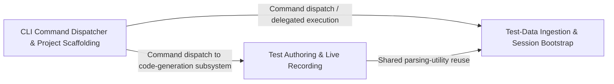

## Details

The command-line front door and test-authoring data pipeline: it parses CLI commands (init/run/generate/config/autocompletion), reads structured test artifacts (CSV/YAML test cases, elements, APIs), and translates them into the models/commands consumed by the execution engine.

### CLI Command Dispatcher & Project Scaffolding
The front-controller of the entire framework — an argparse-based Command pattern implementation that registers and executes every top-level CLI verb (init, execute, dry_run, generate, config, serve, mcp, completion), plus supporting scaffolding, environment setup and shell-integration logic. It also carries the runtime Command/CommandType model used to send retry/skip/pause/resume control signals into a live-running session.

**Related Classes/Methods**:

- `optics_framework.helper.cli.Command`:17-45
- `optics_framework.helper.initialize.create_project`:167-217
- `optics_framework.helper.setup.EngineInstallerApp`:221-324
- `optics_framework.common.events.Command`:54-61

**Source Files:**

- `optics_framework/common/events.py`
  - `optics_framework.common.events.Command` (L54-L61) - Class
- `optics_framework/helper/autocompletion.py`
  - `optics_framework.helper.autocompletion._render` (L222-L231) - Function
  - `optics_framework.helper.autocompletion.write_completion_scripts` (L234-L241) - Function
  - `optics_framework.helper.autocompletion.update_shell_rc` (L243-L270) - Function
- `optics_framework/helper/cli.py`
  - `optics_framework.helper.cli.Command` (L17-L45) - Class
  - `optics_framework.helper.cli.Command.register` (L27-L36) - Method
  - `optics_framework.helper.cli.Command.execute` (L38-L45) - Method
  - `optics_framework.helper.cli.ListCommand` (L48-L56) - Class
  - `optics_framework.helper.cli.ListCommand.register` (L49-L53) - Method
  - `optics_framework.helper.cli.ListCommand.execute` (L55-L56) - Method
  - `optics_framework.helper.cli.AutocompletionCommand` (L58-L66) - Class
  - `optics_framework.helper.cli.AutocompletionCommand.register` (L59-L63) - Method
  - `optics_framework.helper.cli.AutocompletionCommand.execute` (L65-L66) - Method
  - `optics_framework.helper.cli.GenerateArgs` (L68-L80) - Class
  - `optics_framework.helper.cli.GenerateArgs.__init__` (L74-L80) - Method
  - `optics_framework.helper.cli.GenerateCommand` (L83-L108) - Class
  - `optics_framework.helper.cli.GenerateCommand.register` (L84-L99) - Method
  - `optics_framework.helper.cli.GenerateCommand.execute` (L101-L108) - Method
  - `optics_framework.helper.cli.ServerArgs` (L110-L114) - Class
  - `optics_framework.helper.cli.ServerCommand` (L116-L142) - Class
  - `optics_framework.helper.cli.ServerCommand.register` (L117-L130) - Method
  - `optics_framework.helper.cli.ServerCommand.execute` (L132-L142) - Method
  - `optics_framework.helper.cli.MCPArgs` (L145-L149) - Class
  - `optics_framework.helper.cli.MCPCommand` (L152-L182) - Class
  - `optics_framework.helper.cli.MCPCommand.register` (L153-L167) - Method
  - `optics_framework.helper.cli.MCPCommand.execute` (L169-L182) - Method
  - `optics_framework.helper.cli.ConfigCommand` (L184-L190) - Class
  - `optics_framework.helper.cli.ConfigCommand.register` (L185-L187) - Method
  - `optics_framework.helper.cli.ConfigCommand.execute` (L189-L190) - Method
  - `optics_framework.helper.cli.InitArgs` (L193-L199) - Class
  - `optics_framework.helper.cli.InitCommand` (L202-L232) - Class
  - `optics_framework.helper.cli.InitCommand.register` (L203-L222) - Method
  - `optics_framework.helper.cli.InitCommand.execute` (L224-L232) - Method
  - `optics_framework.helper.cli.DryRunArgs` (L235-L239) - Class
  - `optics_framework.helper.cli.DryRunCommand` (L242-L281) - Class
  - `optics_framework.helper.cli.DryRunCommand.register` (L243-L269) - Method
  - `optics_framework.helper.cli.DryRunCommand.execute` (L271-L281) - Method
  - `optics_framework.helper.cli.ExecuteArgs` (L284-L288) - Class
  - `optics_framework.helper.cli.ExecuteCommand` (L291-L331) - Class
  - `optics_framework.helper.cli.ExecuteCommand.register` (L292-L318) - Method
  - `optics_framework.helper.cli.ExecuteCommand.execute` (L320-L331) - Method
  - `optics_framework.helper.cli.LiveArgs` (L334-L336) - Class
  - `optics_framework.helper.cli.LiveCommand` (L339-L359) - Class
  - `optics_framework.helper.cli.LiveCommand.register` (L340-L355) - Method
  - `optics_framework.helper.cli.LiveCommand.execute` (L357-L359) - Method
  - `optics_framework.helper.cli.EngineInstaller` (L362-L392) - Class
  - `optics_framework.helper.cli.EngineInstaller.register` (L363-L372) - Method
  - `optics_framework.helper.cli.EngineInstaller.execute` (L374-L392) - Method
  - `optics_framework.helper.cli.main` (L395-L448) - Function
- `optics_framework/helper/initialize.py`
  - `optics_framework.helper.initialize._is_junk` (L11-L13) - Function
  - `optics_framework.helper.initialize._samples_dir` (L16-L17) - Function
  - `optics_framework.helper.initialize.available_templates` (L20-L30) - Function
  - `optics_framework.helper.initialize._check_and_prepare_directory` (L108-L121) - Function
  - `optics_framework.helper.initialize._scaffold_project` (L124-L140) - Function
  - `optics_framework.helper.initialize._copy_template` (L143-L164) - Function
  - `optics_framework.helper.initialize.create_project` (L167-L217) - Function
- `optics_framework/helper/serve.py`
  - `optics_framework.helper.serve._apply_optics_logging_to_uvicorn` (L12-L55) - Function
  - `optics_framework.helper.serve.run_uvicorn_server` (L58-L104) - Function
- `optics_framework/helper/setup.py`
  - `optics_framework.helper.setup.SetupError` (L17-L20) - Class
  - `optics_framework.helper.setup.EngineBackend` (L23-L33) - Class
  - `optics_framework.helper.setup.EngineCategory` (L36-L38) - Class
  - `optics_framework.helper.setup.InstallRequest` (L41-L47) - Class
  - `optics_framework.helper.setup._norm` (L104-L105) - Function
  - `optics_framework.helper.setup._split_token` (L112-L121) - Function
  - `optics_framework.helper.setup._validate_spec` (L124-L134) - Function
  - `optics_framework.helper.setup._alias_index` (L137-L145) - Function
  - `optics_framework.helper.setup._add_request` (L148-L166) - Function
  - `optics_framework.helper.setup._resolve_token` (L169-L196) - Function
  - `optics_framework.helper.setup.resolve_engines` (L199-L218) - Function
  - `optics_framework.helper.setup.EngineInstallerApp` (L221-L324) - Class
  - `optics_framework.helper.setup.EngineInstallerApp.__init__` (L243-L245) - Method
  - `optics_framework.helper.setup.EngineInstallerApp.compose` (L247-L269) - Method
  - `optics_framework.helper.setup.EngineInstallerApp.on_checkbox_changed` (L271-L285) - Method
  - `optics_framework.helper.setup.EngineInstallerApp.on_button_pressed` (L287-L291) - Method
  - `optics_framework.helper.setup.EngineInstallerApp.install_engines` (L293-L308) - Method
  - `optics_framework.helper.setup.EngineInstallerApp._install_worker` (L311-L314) - Method
  - `optics_framework.helper.setup.EngineInstallerApp._on_install_finished` (L316-L324) - Method
  - `optics_framework.helper.setup._installed_version` (L327-L331) - Function
  - `optics_framework.helper.setup.install_extras` (L334-L383) - Function
  - `optics_framework.helper.setup.list_engines` (L386-L399) - Function

### Test-Data Ingestion & Session Bootstrap
The core test-authoring-to-execution translator. It recursively scans a project folder, sniffs CSV/YAML files by header/key content to categorize them as test cases, modules, elements, APIs, error-definitions, or config, then parses them via CSVDataReader/YAMLDataReader into canonical Pydantic domain models. It builds the linked-list execution plan and instantiates a SessionManager session, driving the ExecutionEngine in batch or dry-run mode.

**Related Classes/Methods**:

- `optics_framework.helper.execute.BaseRunner`:492-657
- `optics_framework.common.runner.data_reader.CSVDataReader`:108-226

**Source Files:**

- `optics_framework/common/models.py`
  - `optics_framework.common.models.ExpectedResultDefinition` (L246-L250) - Class
  - `optics_framework.common.models.TemplateData` (L293-L305) - Class
  - `optics_framework.common.models.TemplateData.add_template` (L297-L298) - Method
  - `optics_framework.common.models.TemplateData.remove_template` (L300-L302) - Method
  - `optics_framework.common.models.ErrorDefinitions` (L308-L320) - Class
  - `optics_framework.common.models.ErrorDefinitions.add_error` (L316-L317) - Method
  - `optics_framework.common.models.ErrorDefinitions.get_all` (L319-L320) - Method
- `optics_framework/common/runner/data_reader.py`
  - `optics_framework.common.runner.data_reader.CSVDataReader` (L108-L226) - Class
  - `optics_framework.common.runner.data_reader.CSVDataReader.read_file` (L111-L122) - Method
  - `optics_framework.common.runner.data_reader.CSVDataReader.read_test_cases` (L124-L144) - Method
  - `optics_framework.common.runner.data_reader.CSVDataReader.read_modules` (L146-L176) - Method
  - `optics_framework.common.runner.data_reader.CSVDataReader.read_elements` (L178-L207) - Method
  - `optics_framework.common.runner.data_reader.CSVDataReader.read_error_definitions` (L209-L226) - Method
  - `optics_framework.common.runner.data_reader.YAMLDataReader` (L229-L431) - Class
  - `optics_framework.common.runner.data_reader.YAMLDataReader.read_file` (L232-L247) - Method
  - `optics_framework.common.runner.data_reader.YAMLDataReader.read_test_cases` (L249-L268) - Method
  - `optics_framework.common.runner.data_reader.YAMLDataReader._parse_module_step` (L270-L290) - Method
  - `optics_framework.common.runner.data_reader.YAMLDataReader._process_module_steps` (L292-L304) - Method
  - `optics_framework.common.runner.data_reader.YAMLDataReader.read_modules` (L306-L330) - Method
  - `optics_framework.common.runner.data_reader.YAMLDataReader.read_elements` (L332-L358) - Method
  - `optics_framework.common.runner.data_reader.YAMLDataReader.read_api_data` (L360-L391) - Method
  - `optics_framework.common.runner.data_reader.YAMLDataReader._merge_global_defaults` (L393-L399) - Method
  - `optics_framework.common.runner.data_reader.YAMLDataReader._merge_collections` (L401-L409) - Method
  - `optics_framework.common.runner.data_reader.YAMLDataReader._merge_collection` (L411-L419) - Method
  - `optics_framework.common.runner.data_reader.YAMLDataReader._merge_api_def` (L421-L431) - Method
  - `optics_framework.common.runner.data_reader.merge_dicts` (L434-L449) - Function
- `optics_framework/common/utils.py`
  - `optics_framework.common.utils.unescape_csv_value` (L129-L149) - Function
- `optics_framework/helper/execute.py`
  - `optics_framework.helper.execute.discover_templates` (L31-L51) - Function
  - `optics_framework.helper.execute.find_files` (L54-L84) - Function
  - `optics_framework.helper.execute._initialize_file_collections` (L87-L95) - Function
  - `optics_framework.helper.execute._process_yaml_file` (L98-L102) - Function
  - `optics_framework.helper.execute._try_load_config_from_yaml` (L105-L118) - Function
  - `optics_framework.helper.execute._is_config_file` (L121-L125) - Function
  - `optics_framework.helper.execute._normalize_element_sources_key` (L128-L132) - Function
  - `optics_framework.helper.execute._process_csv_file` (L135-L137) - Function
  - `optics_framework.helper.execute._categorize_file_by_content` (L140-L153) - Function
  - `optics_framework.helper.execute._identify_csv_content` (L156-L173) - Function
  - `optics_framework.helper.execute._identify_yaml_content` (L176-L195) - Function
  - `optics_framework.helper.execute._normalize_yaml_keys` (L198-L207) - Function
  - `optics_framework.helper.execute.identify_file_content` (L210-L227) - Function
  - `optics_framework.helper.execute.read_csv_headers` (L230-L243) - Function
  - `optics_framework.helper.execute.validate_required_files` (L246-L265) - Function
  - `optics_framework.helper.execute._should_include_test_case` (L268-L283) - Function
  - `optics_framework.helper.execute.filter_test_cases` (L286-L316) - Function
  - `optics_framework.helper.execute.RunnerArgs` (L469-L489) - Class
  - `optics_framework.helper.execute.RunnerArgs.folder_path_must_exist` (L478-L483) - Method
  - `optics_framework.helper.execute.RunnerArgs.strip_runner` (L487-L489) - Method
  - `optics_framework.helper.execute.BaseRunner` (L492-L657) - Class
  - `optics_framework.helper.execute.BaseRunner.__init__` (L495-L534) - Method
  - `optics_framework.helper.execute.BaseRunner._init_data_readers` (L536-L538) - Method
  - `optics_framework.helper.execute.BaseRunner._load_test_cases` (L540-L547) - Method
  - `optics_framework.helper.execute.BaseRunner._load_elements` (L561-L574) - Method
  - `optics_framework.helper.execute.BaseRunner._add_or_merge_element` (L576-L588) - Method
  - `optics_framework.helper.execute.BaseRunner._load_api_data` (L590-L594) - Method
  - `optics_framework.helper.execute.BaseRunner._load_error_definitions` (L596-L601) - Method
  - `optics_framework.helper.execute.BaseRunner._load_templates` (L603-L607) - Method
  - `optics_framework.helper.execute.BaseRunner._filter_and_build_execution_queue` (L611-L619) - Method
  - `optics_framework.helper.execute.BaseRunner.run` (L633-L650) - Method
  - `optics_framework.helper.execute.BaseRunner.cleanup` (L652-L657) - Method
  - `optics_framework.helper.execute.ExecuteRunner` (L660-L663) - Class
  - `optics_framework.helper.execute.ExecuteRunner.execute` (L661-L663) - Method
  - `optics_framework.helper.execute.DryRunRunner` (L666-L669) - Class
  - `optics_framework.helper.execute.DryRunRunner.execute` (L667-L669) - Method
  - `optics_framework.helper.execute.execute_main` (L672-L678) - Function
  - `optics_framework.helper.execute.dryrun_main` (L681-L687) - Function
- `optics_framework/optics.py`
  - `optics_framework.optics.Optics.discover_templates` (L336-L356) - Method
  - `optics_framework.optics.Optics.add_error_definitions` (L524-L563) - Method

### Test Authoring & Live Recording
The generative/authoring counterpart to ingestion — produces standalone test code (pytest/Robot Framework scripts) from declarative test-case/module/element definitions, or produces new CSV/YAML test artifacts by recording an interactive optics live session against a real driver. It reuses the DataReader hierarchy for project-wide file discovery and hands recorded keyword steps back into framework-compatible module/test-case CSVs.

**Related Classes/Methods**:

- `optics_framework.helper.generate.TestFrameworkGenerator`:195-259
- `optics_framework.helper.generate.PytestGenerator`:262-379
- `optics_framework.helper.generate.detect_file_type`:580-590

**Source Files:**

- `optics_framework/common/runner/data_reader.py`
  - `optics_framework.common.runner.data_reader.DataReader` (L15-L105) - Class
  - `optics_framework.common.runner.data_reader.DataReader.read_file` (L19-L28) - Method
  - `optics_framework.common.runner.data_reader.DataReader.get_keyword_params` (L31-L40) - Method
  - `optics_framework.common.runner.data_reader.DataReader.get_positional_params` (L43-L51) - Method
  - `optics_framework.common.runner.data_reader.DataReader.is_keyword_param` (L54-L66) - Method
  - `optics_framework.common.runner.data_reader.DataReader.read_test_cases` (L69-L79) - Method
  - `optics_framework.common.runner.data_reader.DataReader.read_modules` (L82-L92) - Method
  - `optics_framework.common.runner.data_reader.DataReader.read_elements` (L95-L105) - Method
- `optics_framework/helper/generate.py`
  - `optics_framework.helper.generate.DataReader` (L21-L38) - Class
  - `optics_framework.helper.generate.DataReader.read_test_cases` (L25-L26) - Method
  - `optics_framework.helper.generate.DataReader.read_modules` (L29-L30) - Method
  - `optics_framework.helper.generate.DataReader.read_elements` (L33-L34) - Method
  - `optics_framework.helper.generate.DataReader.read_config` (L37-L38) - Method
  - `optics_framework.helper.generate.CSVDataReader` (L41-L94) - Class
  - `optics_framework.helper.generate.CSVDataReader.read_test_cases` (L44-L51) - Method
  - `optics_framework.helper.generate.CSVDataReader.read_modules` (L53-L74) - Method
  - `optics_framework.helper.generate.CSVDataReader._format_param_value` (L76-L78) - Method
  - `optics_framework.helper.generate.CSVDataReader.read_elements` (L80-L90) - Method
  - `optics_framework.helper.generate.CSVDataReader.read_elements._ensure_str_and_unescape` (L82-L83) - Function
  - `optics_framework.helper.generate.CSVDataReader.read_config` (L92-L94) - Method
  - `optics_framework.helper.generate.YAMLDataReader` (L97-L192) - Class
  - `optics_framework.helper.generate.YAMLDataReader.read_test_cases` (L100-L111) - Method
  - `optics_framework.helper.generate.YAMLDataReader._parse_step` (L113-L130) - Method
  - `optics_framework.helper.generate.YAMLDataReader.read_modules` (L132-L183) - Method
  - `optics_framework.helper.generate.YAMLDataReader.read_elements` (L185-L188) - Method
  - `optics_framework.helper.generate.YAMLDataReader.read_config` (L190-L192) - Method
  - `optics_framework.helper.generate.TestFrameworkGenerator` (L195-L259) - Class
  - `optics_framework.helper.generate.TestFrameworkGenerator.__init__` (L198-L233) - Method
  - `optics_framework.helper.generate.TestFrameworkGenerator.generate` (L236-L243) - Method
  - `optics_framework.helper.generate.TestFrameworkGenerator._resolve_params` (L245-L259) - Method
  - `optics_framework.helper.generate.PytestGenerator` (L262-L379) - Class
  - `optics_framework.helper.generate.PytestGenerator.generate` (L265-L288) - Method
  - `optics_framework.helper.generate.PytestGenerator._generate_header` (L290-L300) - Method
  - `optics_framework.helper.generate.PytestGenerator._generate_config` (L302-L335) - Method
  - `optics_framework.helper.generate.PytestGenerator._generate_elements` (L337-L342) - Method
  - `optics_framework.helper.generate.PytestGenerator._generate_setup` (L344-L355) - Method
  - `optics_framework.helper.generate.PytestGenerator._generate_module_function` (L357-L369) - Method
  - `optics_framework.helper.generate.PytestGenerator._generate_test_function` (L371-L379) - Method
  - `optics_framework.helper.generate.RobotGenerator` (L382-L520) - Class
  - `optics_framework.helper.generate.RobotGenerator.generate` (L385-L398) - Method
  - `optics_framework.helper.generate.RobotGenerator._generate_header` (L400-L409) - Method
  - `optics_framework.helper.generate.RobotGenerator._transform_config_structure` (L411-L437) - Method
  - `optics_framework.helper.generate.RobotGenerator._escape_json_for_robot` (L439-L455) - Method
  - `optics_framework.helper.generate.RobotGenerator._generate_variables` (L457-L479) - Method
  - `optics_framework.helper.generate.RobotGenerator._generate_test_cases` (L481-L490) - Method
  - `optics_framework.helper.generate.RobotGenerator._generate_keywords` (L492-L520) - Method
  - `optics_framework.helper.generate.FileWriter` (L523-L577) - Class
  - `optics_framework.helper.generate.FileWriter.write` (L526-L549) - Method
  - `optics_framework.helper.generate.FileWriter.copy_input_templates` (L551-L577) - Method
  - `optics_framework.helper.generate.detect_file_type` (L580-L590) - Function
  - `optics_framework.helper.generate._detect_csv_type` (L593-L605) - Function
  - `optics_framework.helper.generate._detect_yaml_type` (L608-L622) - Function
  - `optics_framework.helper.generate._assign_yaml_files` (L625-L637) - Function
  - `optics_framework.helper.generate._iter_project_files` (L644-L662) - Function
  - `optics_framework.helper.generate.find_all_files` (L665-L704) - Function
  - `optics_framework.helper.generate.find_files` (L707-L729) - Function
  - `optics_framework.helper.generate.read_mixed_data` (L732-L767) - Function
  - `optics_framework.helper.generate.generate_test_file` (L770-L825) - Function
- `optics_framework/helper/live.py`
  - `optics_framework.helper.live.LiveController._resolve_candidate` (L693-L704) - Method

### [FAQ](https://github.com/CodeBoarding/GeneratedOnBoardings/tree/main?tab=readme-ov-file#faq)