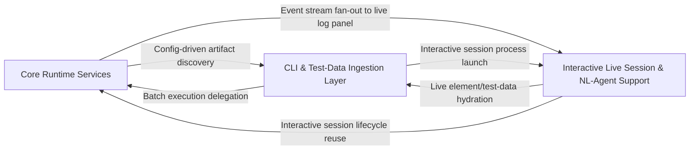

## Details

The shared plumbing layer providing configuration loading/merging, structured error payloads, event/notification system, JUnit result reporting, execution/runner engine, and REST/logging surface that other layers depend on.

### Core Runtime Services [[Expand]](./Core_Runtime_Services.md)
The foundational infrastructure layer providing configuration resolution, typed error payloads, the pub/sub event system, JUnit XML reporting, the keyword/test-case execution engine, and the FastAPI REST surface that exposes sessions and execution to external callers.

**Related Classes/Methods**:

- `optics_framework.common.config_handler.ConfigHandler`:113-225
- `optics_framework.common.error.ErrorPayload`:341-349
- `optics_framework.common.events.EventManager`:71-171
- `optics_framework.common.Junit_eventhandler.JUnitEventHandler`:110-288
- `optics_framework.common.execution.ExecutionEngine`:285-428

**Source Files:**

- `optics_framework/common/Junit_eventhandler.py`
  - `optics_framework.common.Junit_eventhandler.JUnitHandlerRegistry` (L14-L74) - Class
  - `optics_framework.common.Junit_eventhandler.JUnitHandlerRegistry.__init__` (L17-L19) - Method
  - `optics_framework.common.Junit_eventhandler.JUnitHandlerRegistry.setup_junit_for_session` (L21-L43) - Method
  - `optics_framework.common.Junit_eventhandler.JUnitHandlerRegistry._get_session_junit_path` (L45-L56) - Method
  - `optics_framework.common.Junit_eventhandler.JUnitHandlerRegistry.cleanup_session` (L58-L64) - Method
  - `optics_framework.common.Junit_eventhandler.JUnitHandlerRegistry.get_handler` (L66-L69) - Method
  - `optics_framework.common.Junit_eventhandler.JUnitHandlerRegistry.get_active_sessions` (L71-L74) - Method
  - `optics_framework.common.Junit_eventhandler.setup_junit` (L78-L80) - Function
  - `optics_framework.common.Junit_eventhandler.cleanup_junit` (L82-L84) - Function
  - `optics_framework.common.Junit_eventhandler.get_junit_handler_registry` (L86-L88) - Function
  - `optics_framework.common.Junit_eventhandler.JUnitEventHandler` (L110-L288) - Class
  - `optics_framework.common.Junit_eventhandler.JUnitEventHandler.__init__` (L111-L122) - Method
  - `optics_framework.common.Junit_eventhandler.JUnitEventHandler.on_event` (L125-L150) - Method
  - `optics_framework.common.Junit_eventhandler.JUnitEventHandler._handle_test_case_event` (L152-L180) - Method
  - `optics_framework.common.Junit_eventhandler.JUnitEventHandler._handle_module_event` (L182-L195) - Method
  - `optics_framework.common.Junit_eventhandler.JUnitEventHandler._handle_keyword_event` (L197-L223) - Method
  - `optics_framework.common.Junit_eventhandler.JUnitEventHandler._update_testcase_status` (L225-L241) - Method
  - `optics_framework.common.Junit_eventhandler.JUnitEventHandler.add_detected_errors` (L243-L270) - Method
  - `optics_framework.common.Junit_eventhandler.JUnitEventHandler.flush` (L272-L285) - Method
  - `optics_framework.common.Junit_eventhandler.JUnitEventHandler.close` (L287-L288) - Method
- `optics_framework/common/config_handler.py`
  - `optics_framework.common.config_handler.DependencyConfig` (L11-L19) - Class
  - `optics_framework.common.config_handler.DependencyConfig.Config` (L17-L19) - Class
  - `optics_framework.common.config_handler.Config` (L22-L87) - Class
  - `optics_framework.common.config_handler.Config.__init__` (L45-L77) - Method
  - `optics_framework.common.config_handler.Config.Config` (L79-L81) - Class
  - `optics_framework.common.config_handler.deep_merge` (L89-L110) - Function
  - `optics_framework.common.config_handler.deep_merge._merge_dicts` (L96-L107) - Function
  - `optics_framework.common.config_handler.ConfigHandler` (L113-L225) - Class
  - `optics_framework.common.config_handler.ConfigHandler.__init__` (L123-L140) - Method
  - `optics_framework.common.config_handler.ConfigHandler.set_project` (L142-L143) - Method
  - `optics_framework.common.config_handler.ConfigHandler._ensure_global_config` (L146-L150) - Method
  - `optics_framework.common.config_handler.ConfigHandler.load` (L152-L164) - Method
  - `optics_framework.common.config_handler.ConfigHandler.update_config` (L166-L180) - Method
  - `optics_framework.common.config_handler.ConfigHandler._load_yaml` (L183-L192) - Method
  - `optics_framework.common.config_handler.ConfigHandler._is_enabled` (L194-L196) - Method
  - `optics_framework.common.config_handler.ConfigHandler._precompute_enabled_configs` (L198-L206) - Method
  - `optics_framework.common.config_handler.ConfigHandler.get_dependency_config` (L208-L215) - Method
  - `optics_framework.common.config_handler.ConfigHandler.get` (L217-L220) - Method
  - `optics_framework.common.config_handler.ConfigHandler.save_config` (L222-L225) - Method
- `optics_framework/common/error.py`
  - `optics_framework.common.error.Category` (L23-L32) - Class
  - `optics_framework.common.error.ErrorPayload` (L341-L349) - Class
  - `optics_framework.common.error.OpticsError.to_payload` (L465-L489) - Method
  - `optics_framework.common.error.register_error` (L492-L497) - Function
- `optics_framework/common/events.py`
  - `optics_framework.common.events.EventStatus` (L13-L21) - Class
  - `optics_framework.common.events.CommandType` (L24-L30) - Class
  - `optics_framework.common.events.Event` (L33-L52) - Class
  - `optics_framework.common.events.EventSubscriber` (L64-L68) - Class
  - `optics_framework.common.events.EventSubscriber.on_event` (L67-L68) - Method
  - `optics_framework.common.events.EventManager` (L71-L171) - Class
  - `optics_framework.common.events.EventManager.__init__` (L73-L79) - Method
  - `optics_framework.common.events.EventManager.start` (L81-L89) - Method
  - `optics_framework.common.events.EventManager.stop` (L91-L97) - Method
  - `optics_framework.common.events.EventManager._process_events` (L99-L121) - Method
  - `optics_framework.common.events.EventManager.publish_event` (L123-L126) - Method
  - `optics_framework.common.events.EventManager.publish_command` (L128-L135) - Method
  - `optics_framework.common.events.EventManager.subscribe` (L137-L140) - Method
  - `optics_framework.common.events.EventManager.unsubscribe` (L142-L145) - Method
  - `optics_framework.common.events.EventManager.get_command` (L147-L151) - Method
  - `optics_framework.common.events.EventManager.dump_state` (L153-L156) - Method
  - `optics_framework.common.events.EventManager.shutdown` (L158-L171) - Method
  - `optics_framework.common.events.EventManagerRegistry` (L174-L202) - Class
  - `optics_framework.common.events.EventManagerRegistry.__init__` (L177-L179) - Method
  - `optics_framework.common.events.EventManagerRegistry.get_event_manager` (L181-L188) - Method
  - `optics_framework.common.events.EventManagerRegistry.remove_session` (L190-L197) - Method
  - `optics_framework.common.events.EventManagerRegistry.get_active_sessions` (L199-L202) - Method
  - `optics_framework.common.events.get_event_manager` (L206-L208) - Function
  - `optics_framework.common.events.get_event_manager_registry` (L210-L212) - Function
- `optics_framework/common/execution.py`
  - `optics_framework.common.execution.ExecutionParams` (L22-L31) - Class
  - `optics_framework.common.execution.Executor` (L34-L38) - Class
  - `optics_framework.common.execution.Executor.execute` (L37-L38) - Method
  - `optics_framework.common.execution.BatchExecutor` (L41-L89) - Class
  - `optics_framework.common.execution.BatchExecutor.__init__` (L44-L48) - Method
  - `optics_framework.common.execution.BatchExecutor.execute` (L50-L89) - Method
  - `optics_framework.common.execution.DryRunExecutor` (L92-L129) - Class
  - `optics_framework.common.execution.DryRunExecutor.__init__` (L95-L99) - Method
  - `optics_framework.common.execution.DryRunExecutor.execute` (L101-L129) - Method
  - `optics_framework.common.execution._deserialize_single_param` (L132-L140) - Function
  - `optics_framework.common.execution._deserialize_params` (L143-L160) - Function
  - `optics_framework.common.execution.KeywordExecutor` (L163-L232) - Class
  - `optics_framework.common.execution.KeywordExecutor.__init__` (L166-L169) - Method
  - `optics_framework.common.execution.KeywordExecutor.execute` (L171-L232) - Method
  - `optics_framework.common.execution.RunnerFactory` (L235-L268) - Class
  - `optics_framework.common.execution.RunnerFactory.create_runner` (L238-L268) - Method
  - `optics_framework.common.execution._execution_event` (L271-L282) - Function
  - `optics_framework.common.execution.ExecutionEngine` (L285-L428) - Class
  - `optics_framework.common.execution.ExecutionEngine.__init__` (L288-L290) - Method
  - `optics_framework.common.execution.ExecutionEngine._validate_execution_params` (L292-L313) - Method
  - `optics_framework.common.execution.ExecutionEngine._create_executor` (L315-L331) - Method
  - `optics_framework.common.execution.ExecutionEngine._create_keyword_executor` (L333-L352) - Method
  - `optics_framework.common.execution.ExecutionEngine._run_executor` (L354-L369) - Method
  - `optics_framework.common.execution.ExecutionEngine._drain_events_and_shutdown` (L371-L387) - Method
  - `optics_framework.common.execution.ExecutionEngine.execute` (L389-L428) - Method
- `optics_framework/common/expose_api.py`
  - `optics_framework.common.expose_api.ExecuteRequest` (L124-L137) - Class
  - `optics_framework.common.expose_api.SessionResponse` (L147-L154) - Class
  - `optics_framework.common.expose_api.ExecutionResponse` (L157-L170) - Class
  - `optics_framework.common.expose_api.TerminationResponse` (L173-L178) - Class
  - `optics_framework.common.expose_api.ExecutionEvent` (L181-L188) - Class
  - `optics_framework.common.expose_api.KeywordParameter` (L196-L199) - Class
  - `optics_framework.common.expose_api.KeywordInfo` (L202-L206) - Class
  - `optics_framework.common.expose_api._humanize_keyword` (L209-L218) - Function
  - `optics_framework.common.expose_api._make_dependency_entry` (L221-L245) - Function
  - `optics_framework.common.expose_api.SessionConfig` (L247-L311) - Class
  - `optics_framework.common.expose_api.SessionConfig._normalize_item` (L275-L295) - Method
  - `optics_framework.common.expose_api.SessionConfig.normalize_sources` (L297-L311) - Method
  - `optics_framework.common.expose_api._parse_api_data_to_model` (L314-L327) - Function
  - `optics_framework.common.expose_api._get_keyword_parameters` (L330-L351) - Function
  - `optics_framework.common.expose_api._extract_keywords_from_class` (L353-L370) - Function
  - `optics_framework.common.expose_api._extract_keywords_from_module` (L372-L378) - Function
  - `optics_framework.common.expose_api.discover_keywords` (L380-L393) - Function
  - `optics_framework.common.expose_api._env_self_heal_defaults` (L411-L424) - Function
  - `optics_framework.common.expose_api._resolve_self_heal_settings` (L427-L446) - Function
  - `optics_framework.common.expose_api.create_session` (L457-L544) - Function
  - `optics_framework.common.expose_api._normalize_param_value` (L547-L579) - Function
  - `optics_framework.common.expose_api._resolve_named_to_positional` (L582-L619) - Function
  - `optics_framework.common.expose_api._NamedParamsContext` (L622-L629) - Class
  - `optics_framework.common.expose_api._keyword_execution_params` (L632-L641) - Function
  - `optics_framework.common.expose_api._should_reraise` (L644-L646) - Function
  - `optics_framework.common.expose_api._decode_template_base64` (L649-L656) - Function
  - `optics_framework.common.expose_api._write_bytes_to_path` (L659-L662) - Function
  - `optics_framework.common.expose_api._safe_template_filename` (L665-L678) - Function
  - `optics_framework.common.expose_api._build_named_param_context` (L681-L714) - Function
  - `optics_framework.common.expose_api._build_positional_normalized` (L717-L721) - Function
  - `optics_framework.common.expose_api._combo_to_positional_named` (L724-L740) - Function
  - `optics_framework.common.expose_api._execute_no_params` (L743-L752) - Function
  - `optics_framework.common.expose_api._try_combos_named` (L755-L774) - Function
  - `optics_framework.common.expose_api._try_combos_positional` (L777-L797) - Function
  - `optics_framework.common.expose_api._execute_keyword_with_fallback` (L800-L837) - Function
  - `optics_framework.common.expose_api._setup_request_template_overrides` (L840-L861) - Function
  - `optics_framework.common.expose_api._handle_execution_failure` (L864-L875) - Function
  - `optics_framework.common.expose_api.execute_keyword` (L886-L952) - Function
  - `optics_framework.common.expose_api.upload_template` (L962-L983) - Function
  - `optics_framework.common.expose_api.add_session_api` (L994-L1010) - Function
  - `optics_framework.common.expose_api.run_keyword_endpoint` (L1014-L1025) - Function
  - `optics_framework.common.expose_api.capture_screenshot` (L1029-L1034) - Function
  - `optics_framework.common.expose_api.get_driver_session_id` (L1037-L1042) - Function
  - `optics_framework.common.expose_api.get_elements` (L1045-L1069) - Function
  - `optics_framework.common.expose_api.get_pagesource` (L1072-L1077) - Function
  - `optics_framework.common.expose_api.screen_elements` (L1080-L1085) - Function
  - `optics_framework.common.expose_api.stream_events` (L1093-L1102) - Function
  - `optics_framework.common.expose_api.stream_workspace` (L1105-L1124) - Function
  - `optics_framework.common.expose_api.list_keywords` (L1127-L1131) - Function
  - `optics_framework.common.expose_api._compute_workspace_hash` (L1194-L1208) - Function
  - `optics_framework.common.expose_api.workspace_generator` (L1210-L1267) - Function
  - `optics_framework.common.expose_api.event_generator` (L1269-L1320) - Function
  - `optics_framework.common.expose_api.delete_session` (L1329-L1351) - Function
- `optics_framework/common/logging_config.py`
  - `optics_framework.common.logging_config.LoggingConfig` (L12-L16) - Class
  - `optics_framework.common.logging_config.LoggingManager` (L19-L111) - Class
  - `optics_framework.common.logging_config.LoggingManager.initialize_handlers` (L20-L46) - Method
  - `optics_framework.common.logging_config.LoggingManager.stop_listeners` (L48-L70) - Method
  - `optics_framework.common.logging_config.LoggingManager.stop_listeners.safe_stop` (L49-L66) - Function
  - `optics_framework.common.logging_config.LoggingManager.shutdown_logging` (L72-L78) - Method
  - `optics_framework.common.logging_config.LoggingManager.disable_logger` (L80-L81) - Method
  - `optics_framework.common.logging_config.LoggingManager.get_internal_logger` (L83-L84) - Method
  - `optics_framework.common.logging_config.LoggingManager.get_execution_logger` (L86-L87) - Method
  - `optics_framework.common.logging_config.LoggingManager.get_listeners` (L89-L90) - Method
  - `optics_framework.common.logging_config.LoggingManager.__init__` (L92-L111) - Method
  - `optics_framework.common.logging_config.SensitiveDataFormatter` (L113-L123) - Class
  - `optics_framework.common.logging_config.SensitiveDataFormatter.format` (L114-L119) - Method
  - `optics_framework.common.logging_config.SensitiveDataFormatter._sanitize` (L121-L123) - Method
  - `optics_framework.common.logging_config.SessionLoggerAdapter` (L132-L138) - Class
  - `optics_framework.common.logging_config.SessionLoggerAdapter.process` (L133-L138) - Method
  - `optics_framework.common.logging_config.LoggerContext` (L159-L178) - Class
  - `optics_framework.common.logging_config.LoggerContext.__init__` (L160-L163) - Method
  - `optics_framework.common.logging_config.LoggerContext.__enter__` (L165-L170) - Method
  - `optics_framework.common.logging_config.LoggerContext.__exit__` (L172-L178) - Method
  - `optics_framework.common.logging_config.create_file_handler` (L180-L188) - Function
  - `optics_framework.common.logging_config.initialize_handlers` (L196-L200) - Function
  - `optics_framework.common.logging_config.shutdown_logging` (L202-L211) - Function
  - `optics_framework.common.logging_config.disable_logger` (L214-L216) - Function
  - `optics_framework.common.logging_config.stop_listeners` (L219-L221) - Function
  - `optics_framework.common.logging_config.wait_for_threads` (L224-L233) - Function
  - `optics_framework.common.logging_config.is_thread_alive` (L236-L238) - Function
  - `optics_framework.common.logging_config.check_thread_status` (L241-L246) - Function
  - `optics_framework.common.logging_config.flush_handlers` (L248-L262) - Function
  - `optics_framework.common.logging_config.clear_queues` (L265-L271) - Function
  - `optics_framework.common.logging_config.reconfigure_logging` (L279-L281) - Function
- `optics_framework/common/models.py`
  - `optics_framework.common.models.State` (L9-L16) - Class
  - `optics_framework.common.models.Node` (L19-L25) - Class
  - `optics_framework.common.models.KeywordNode` (L28-L31) - Class
  - `optics_framework.common.models.ModuleNode` (L34-L66) - Class
  - `optics_framework.common.models.ModuleNode.add_keyword` (L38-L45) - Method
  - `optics_framework.common.models.ModuleNode.remove_keyword` (L47-L58) - Method
  - `optics_framework.common.models.ModuleNode.get_keyword` (L60-L66) - Method
  - `optics_framework.common.models.TestCaseNode` (L69-L101) - Class
  - `optics_framework.common.models.TestCaseNode.add_module` (L73-L80) - Method
  - `optics_framework.common.models.TestCaseNode.remove_module` (L82-L93) - Method
  - `optics_framework.common.models.TestCaseNode.get_module` (L95-L101) - Method
  - `optics_framework.common.models.TestSuite` (L104-L135) - Class
  - `optics_framework.common.models.TestSuite.add_test_case` (L107-L114) - Method
  - `optics_framework.common.models.TestSuite.remove_test_case` (L116-L127) - Method
  - `optics_framework.common.models.TestSuite.get_test_case` (L129-L135) - Method
  - `optics_framework.common.models.ModuleData` (L139-L151) - Class
  - `optics_framework.common.models.ModuleData.add_module_definition` (L143-L144) - Method
  - `optics_framework.common.models.ModuleData.remove_module_definition` (L146-L148) - Method
  - `optics_framework.common.models.ModuleData.get_module_definition` (L150-L151) - Method
  - `optics_framework.common.models.RequestDefinition` (L239-L243) - Class
  - `optics_framework.common.models.ApiDefinition` (L253-L258) - Class
  - `optics_framework.common.models.ApiData` (L278-L290) - Class
  - `optics_framework.common.models.ApiData.add_collection` (L282-L283) - Method
  - `optics_framework.common.models.ApiData.remove_collection` (L285-L287) - Method
  - `optics_framework.common.models.ApiData.get_collection` (L289-L290) - Method
- `optics_framework/common/optics_builder.py`
  - `optics_framework.common.optics_builder.OpticsBuilder.build` (L192-L201) - Method
- `optics_framework/common/runner/keyword_register.py`
  - `optics_framework.common.runner.keyword_register.KeywordRegistry` (L5-L52) - Class
  - `optics_framework.common.runner.keyword_register.KeywordRegistry.__init__` (L13-L20) - Method
  - `optics_framework.common.runner.keyword_register.KeywordRegistry.register` (L22-L40) - Method
  - `optics_framework.common.runner.keyword_register.KeywordRegistry.get_method` (L42-L52) - Method
- `optics_framework/common/runner/printers.py`
  - `optics_framework.common.runner.printers.TestCaseResult` (L15-L21) - Class
  - `optics_framework.common.runner.printers.KeywordResult` (L24-L30) - Class
  - `optics_framework.common.runner.printers.ModuleResult` (L33-L37) - Class
  - `optics_framework.common.runner.printers.IResultPrinter` (L40-L69) - Class
  - `optics_framework.common.runner.printers.IResultPrinter.test_state` (L48-L49) - Method
  - `optics_framework.common.runner.printers.IResultPrinter.print_tree_log` (L52-L53) - Method
  - `optics_framework.common.runner.printers.IResultPrinter.print_event_log` (L56-L57) - Method
  - `optics_framework.common.runner.printers.IResultPrinter.start_live` (L60-L61) - Method
  - `optics_framework.common.runner.printers.IResultPrinter.stop_live` (L64-L65) - Method
  - `optics_framework.common.runner.printers.IResultPrinter.start_run` (L68-L69) - Method
  - `optics_framework.common.runner.printers.NullResultPrinter` (L72-L122) - Class
  - `optics_framework.common.runner.printers.NullResultPrinter.__init__` (L75-L76) - Method
  - `optics_framework.common.runner.printers.NullResultPrinter.test_state` (L85-L88) - Method
  - `optics_framework.common.runner.printers.NullResultPrinter.print_tree_log` (L90-L95) - Method
  - `optics_framework.common.runner.printers.NullResultPrinter.print_event_log` (L97-L101) - Method
  - `optics_framework.common.runner.printers.NullResultPrinter.start_live` (L103-L108) - Method
  - `optics_framework.common.runner.printers.NullResultPrinter.stop_live` (L110-L115) - Method
  - `optics_framework.common.runner.printers.NullResultPrinter.start_run` (L117-L122) - Method
  - `optics_framework.common.runner.printers.TerminalWidthProvider` (L125-L127) - Class
  - `optics_framework.common.runner.printers.TerminalWidthProvider.get_terminal_width` (L126-L127) - Method
  - `optics_framework.common.runner.printers.TreeResultPrinter` (L130-L246) - Class
  - `optics_framework.common.runner.printers.TreeResultPrinter.__init__` (L143-L151) - Method
  - `optics_framework.common.runner.printers.TreeResultPrinter.get_instance` (L154-L159) - Method
  - `optics_framework.common.runner.printers.TreeResultPrinter.test_state` (L166-L167) - Method
  - `optics_framework.common.runner.printers.TreeResultPrinter.start_run` (L169-L171) - Method
  - `optics_framework.common.runner.printers.TreeResultPrinter.create_label` (L173-L193) - Method
  - `optics_framework.common.runner.printers.TreeResultPrinter._render_tree` (L195-L220) - Method
  - `optics_framework.common.runner.printers.TreeResultPrinter.print_tree_log` (L222-L225) - Method
  - `optics_framework.common.runner.printers.TreeResultPrinter.print_event_log` (L227-L233) - Method
  - `optics_framework.common.runner.printers.TreeResultPrinter.start_live` (L235-L241) - Method
  - `optics_framework.common.runner.printers.TreeResultPrinter.stop_live` (L243-L246) - Method
- `optics_framework/common/session_manager.py`
  - `optics_framework.common.session_manager._maybe_setup_junit` (L40-L51) - Function
  - `optics_framework.common.session_manager.SessionHandler` (L54-L72) - Class
  - `optics_framework.common.session_manager.SessionHandler.create_session` (L57-L64) - Method
  - `optics_framework.common.session_manager.SessionHandler.get_session` (L67-L68) - Method
  - `optics_framework.common.session_manager.SessionHandler.terminate_session` (L71-L72) - Method
  - `optics_framework.common.session_manager.SessionManager` (L149-L185) - Class
  - `optics_framework.common.session_manager.SessionManager.__init__` (L152-L153) - Method
  - `optics_framework.common.session_manager.SessionManager.create_session` (L155-L165) - Method
  - `optics_framework.common.session_manager.SessionManager.get_session` (L167-L169) - Method
  - `optics_framework.common.session_manager.SessionManager.terminate_session` (L171-L185) - Method
- `optics_framework/common/utils.py`
  - `optics_framework.common.utils._is_list_type` (L803-L830) - Function
  - `optics_framework.common.utils._is_list_type._is_list_like` (L813-L815) - Function
- `optics_framework/helper/config_manager.py`
  - `optics_framework.helper.config_manager.QuitConfirmScreen` (L9-L24) - Class
  - `optics_framework.helper.config_manager.QuitConfirmScreen.compose` (L12-L21) - Method
  - `optics_framework.helper.config_manager.QuitConfirmScreen.on_button_pressed` (L23-L24) - Method
  - `optics_framework.helper.config_manager.ErrorScreen` (L27-L43) - Class
  - `optics_framework.helper.config_manager.ErrorScreen.__init__` (L30-L32) - Method
  - `optics_framework.helper.config_manager.ErrorScreen.compose` (L34-L39) - Method
  - `optics_framework.helper.config_manager.ErrorScreen.on_button_pressed` (L41-L43) - Method
  - `optics_framework.helper.config_manager.LoggerTUI` (L46-L212) - Class
  - `optics_framework.helper.config_manager.LoggerTUI.__init__` (L107-L112) - Method
  - `optics_framework.helper.config_manager.LoggerTUI.compose` (L114-L124) - Method
  - `optics_framework.helper.config_manager.LoggerTUI.on_mount` (L126-L127) - Method
  - `optics_framework.helper.config_manager.LoggerTUI.get_value` (L129-L134) - Method
  - `optics_framework.helper.config_manager.LoggerTUI.action_move_up` (L136-L138) - Method
  - `optics_framework.helper.config_manager.LoggerTUI.action_move_down` (L140-L143) - Method
  - `optics_framework.helper.config_manager.LoggerTUI.refresh_list` (L145-L150) - Method
  - `optics_framework.helper.config_manager.LoggerTUI.action_edit` (L152-L165) - Method
  - `optics_framework.helper.config_manager.LoggerTUI.on_input_submitted` (L167-L168) - Method
  - `optics_framework.helper.config_manager.LoggerTUI.on_button_pressed` (L170-L173) - Method
  - `optics_framework.helper.config_manager.LoggerTUI.handle_edit_confirm` (L175-L197) - Method
  - `optics_framework.helper.config_manager.LoggerTUI.action_save` (L199-L205) - Method
  - `optics_framework.helper.config_manager.LoggerTUI.action_quit` (L207-L208) - Method
  - `optics_framework.helper.config_manager.LoggerTUI.handle_quit` (L210-L212) - Method
  - `optics_framework.helper.config_manager.main` (L215-L216) - Function
- `optics_framework/helper/execute.py`
  - `optics_framework.helper.execute.categorize_test_cases` (L319-L353) - Function
  - `optics_framework.helper.execute.get_execution_queue` (L356-L384) - Function
  - `optics_framework.helper.execute.create_test_case_nodes` (L387-L398) - Function
  - `optics_framework.helper.execute.populate_module_nodes` (L401-L423) - Function
  - `optics_framework.helper.execute.load_api_data` (L426-L437) - Function
  - `optics_framework.helper.execute.build_linked_list` (L440-L467) - Function
  - `optics_framework.helper.execute.BaseRunner._load_modules` (L549-L559) - Method
  - `optics_framework.helper.execute.BaseRunner._setup_session` (L621-L632) - Method
- `optics_framework/helper/live.py`
  - `optics_framework.helper.live._config_from_yaml` (L193-L221) - Function
  - `optics_framework.helper.live._load_partial_config` (L224-L233) - Function
  - `optics_framework.helper.live._has_enabled` (L236-L237) - Function
  - `optics_framework.helper.live._enabled_drivers` (L240-L247) - Function
  - `optics_framework.helper.live._compose_config` (L250-L285) - Function
  - `optics_framework.helper.live.LiveController.__init__` (L295-L361) - Method
  - `optics_framework.helper.live.LiveController._setup_live_logging` (L365-L403) - Method
  - `optics_framework.helper.live.LiveController._build_registry` (L424-L433) - Method
  - `optics_framework.helper.live.LiveController._enabled_driver_name` (L926-L933) - Method
  - `optics_framework.helper.live.LiveController.supports_device_switching` (L965-L972) - Method
  - `optics_framework.helper.live.LiveController.switch_device` (L1043-L1077) - Method
  - `optics_framework.helper.live.LiveController.natural_language_available` (L1112-L1120) - Method
- `optics_framework/helper/mcp_server.py`
  - `optics_framework.helper.mcp_server._require_fastmcp` (L84-L89) - Function
  - `optics_framework.helper.mcp_server._http_detail` (L92-L99) - Function
  - `optics_framework.helper.mcp_server._stringify_params` (L102-L116) - Function
  - `optics_framework.helper.mcp_server._reflect_keyword_params` (L119-L128) - Function
  - `optics_framework.helper.mcp_server._make_keyword_tool` (L131-L195) - Function
  - `optics_framework.helper.mcp_server._make_keyword_tool.wrapper` (L139-L158) - Function
  - `optics_framework.helper.mcp_server._iter_keyword_tools` (L198-L212) - Function
  - `optics_framework.helper.mcp_server._observe` (L215-L222) - Function
  - `optics_framework.helper.mcp_server._decode_screenshot` (L225-L232) - Function
  - `optics_framework.helper.mcp_server.build_server` (L235-L345) - Function
  - `optics_framework.helper.mcp_server.build_server.start_session` (L241-L290) - Function
  - `optics_framework.helper.mcp_server.build_server.terminate_session` (L292-L298) - Function
  - `optics_framework.helper.mcp_server.build_server.screenshot` (L300-L307) - Function
  - `optics_framework.helper.mcp_server.build_server.keywords_catalog` (L319-L321) - Function
  - `optics_framework.helper.mcp_server.build_server.screenshot_resource` (L324-L326) - Function
  - `optics_framework.helper.mcp_server.build_server.page_source` (L329-L331) - Function
  - `optics_framework.helper.mcp_server.build_server.interactive_elements` (L334-L336) - Function
  - `optics_framework.helper.mcp_server.build_server.screen_elements` (L341-L343) - Function
  - `optics_framework.helper.mcp_server.run_mcp_server` (L348-L368) - Function
- `optics_framework/optics.py`
  - `optics_framework.optics.Optics._initialize_session_and_keywords` (L358-L393) - Method

### CLI & Test-Data Ingestion Layer [[Expand]](./CLI_Test_Data_Ingestion_Layer.md)
The command-line front door and test-authoring data pipeline: it parses CLI commands (init/run/generate/config/autocompletion), reads structured test artifacts (CSV/YAML test cases, elements, APIs), and translates them into the models/commands consumed by the execution engine.

**Related Classes/Methods**:

- `optics_framework.helper.cli.Command`:17-45
- `optics_framework.common.events.Command`:54-61
- `optics_framework.common.models.ErrorDefinitions`:308-320

**Source Files:**

- `optics_framework/common/events.py`
  - `optics_framework.common.events.Command` (L54-L61) - Class
- `optics_framework/common/models.py`
  - `optics_framework.common.models.ExpectedResultDefinition` (L246-L250) - Class
  - `optics_framework.common.models.TemplateData` (L293-L305) - Class
  - `optics_framework.common.models.TemplateData.add_template` (L297-L298) - Method
  - `optics_framework.common.models.TemplateData.remove_template` (L300-L302) - Method
  - `optics_framework.common.models.ErrorDefinitions` (L308-L320) - Class
  - `optics_framework.common.models.ErrorDefinitions.add_error` (L316-L317) - Method
  - `optics_framework.common.models.ErrorDefinitions.get_all` (L319-L320) - Method
- `optics_framework/common/runner/data_reader.py`
  - `optics_framework.common.runner.data_reader.DataReader` (L15-L105) - Class
  - `optics_framework.common.runner.data_reader.DataReader.read_file` (L19-L28) - Method
  - `optics_framework.common.runner.data_reader.DataReader.get_keyword_params` (L31-L40) - Method
  - `optics_framework.common.runner.data_reader.DataReader.get_positional_params` (L43-L51) - Method
  - `optics_framework.common.runner.data_reader.DataReader.is_keyword_param` (L54-L66) - Method
  - `optics_framework.common.runner.data_reader.DataReader.read_test_cases` (L69-L79) - Method
  - `optics_framework.common.runner.data_reader.DataReader.read_modules` (L82-L92) - Method
  - `optics_framework.common.runner.data_reader.DataReader.read_elements` (L95-L105) - Method
  - `optics_framework.common.runner.data_reader.CSVDataReader` (L108-L226) - Class
  - `optics_framework.common.runner.data_reader.CSVDataReader.read_file` (L111-L122) - Method
  - `optics_framework.common.runner.data_reader.CSVDataReader.read_test_cases` (L124-L144) - Method
  - `optics_framework.common.runner.data_reader.CSVDataReader.read_modules` (L146-L176) - Method
  - `optics_framework.common.runner.data_reader.CSVDataReader.read_elements` (L178-L207) - Method
  - `optics_framework.common.runner.data_reader.CSVDataReader.read_error_definitions` (L209-L226) - Method
  - `optics_framework.common.runner.data_reader.YAMLDataReader` (L229-L431) - Class
  - `optics_framework.common.runner.data_reader.YAMLDataReader.read_file` (L232-L247) - Method
  - `optics_framework.common.runner.data_reader.YAMLDataReader.read_test_cases` (L249-L268) - Method
  - `optics_framework.common.runner.data_reader.YAMLDataReader._parse_module_step` (L270-L290) - Method
  - `optics_framework.common.runner.data_reader.YAMLDataReader._process_module_steps` (L292-L304) - Method
  - `optics_framework.common.runner.data_reader.YAMLDataReader.read_modules` (L306-L330) - Method
  - `optics_framework.common.runner.data_reader.YAMLDataReader.read_elements` (L332-L358) - Method
  - `optics_framework.common.runner.data_reader.YAMLDataReader.read_api_data` (L360-L391) - Method
  - `optics_framework.common.runner.data_reader.YAMLDataReader._merge_global_defaults` (L393-L399) - Method
  - `optics_framework.common.runner.data_reader.YAMLDataReader._merge_collections` (L401-L409) - Method
  - `optics_framework.common.runner.data_reader.YAMLDataReader._merge_collection` (L411-L419) - Method
  - `optics_framework.common.runner.data_reader.YAMLDataReader._merge_api_def` (L421-L431) - Method
  - `optics_framework.common.runner.data_reader.merge_dicts` (L434-L449) - Function
- `optics_framework/common/utils.py`
  - `optics_framework.common.utils.unescape_csv_value` (L129-L149) - Function
- `optics_framework/helper/autocompletion.py`
  - `optics_framework.helper.autocompletion._render` (L222-L231) - Function
  - `optics_framework.helper.autocompletion.write_completion_scripts` (L234-L241) - Function
  - `optics_framework.helper.autocompletion.update_shell_rc` (L243-L270) - Function
- `optics_framework/helper/cli.py`
  - `optics_framework.helper.cli.Command` (L17-L45) - Class
  - `optics_framework.helper.cli.Command.register` (L27-L36) - Method
  - `optics_framework.helper.cli.Command.execute` (L38-L45) - Method
  - `optics_framework.helper.cli.ListCommand` (L48-L56) - Class
  - `optics_framework.helper.cli.ListCommand.register` (L49-L53) - Method
  - `optics_framework.helper.cli.ListCommand.execute` (L55-L56) - Method
  - `optics_framework.helper.cli.AutocompletionCommand` (L58-L66) - Class
  - `optics_framework.helper.cli.AutocompletionCommand.register` (L59-L63) - Method
  - `optics_framework.helper.cli.AutocompletionCommand.execute` (L65-L66) - Method
  - `optics_framework.helper.cli.GenerateArgs` (L68-L80) - Class
  - `optics_framework.helper.cli.GenerateArgs.__init__` (L74-L80) - Method
  - `optics_framework.helper.cli.GenerateCommand` (L83-L108) - Class
  - `optics_framework.helper.cli.GenerateCommand.register` (L84-L99) - Method
  - `optics_framework.helper.cli.GenerateCommand.execute` (L101-L108) - Method
  - `optics_framework.helper.cli.ServerArgs` (L110-L114) - Class
  - `optics_framework.helper.cli.ServerCommand` (L116-L142) - Class
  - `optics_framework.helper.cli.ServerCommand.register` (L117-L130) - Method
  - `optics_framework.helper.cli.ServerCommand.execute` (L132-L142) - Method
  - `optics_framework.helper.cli.MCPArgs` (L145-L149) - Class
  - `optics_framework.helper.cli.MCPCommand` (L152-L182) - Class
  - `optics_framework.helper.cli.MCPCommand.register` (L153-L167) - Method
  - `optics_framework.helper.cli.MCPCommand.execute` (L169-L182) - Method
  - `optics_framework.helper.cli.ConfigCommand` (L184-L190) - Class
  - `optics_framework.helper.cli.ConfigCommand.register` (L185-L187) - Method
  - `optics_framework.helper.cli.ConfigCommand.execute` (L189-L190) - Method
  - `optics_framework.helper.cli.InitArgs` (L193-L199) - Class
  - `optics_framework.helper.cli.InitCommand` (L202-L232) - Class
  - `optics_framework.helper.cli.InitCommand.register` (L203-L222) - Method
  - `optics_framework.helper.cli.InitCommand.execute` (L224-L232) - Method
  - `optics_framework.helper.cli.DryRunArgs` (L235-L239) - Class
  - `optics_framework.helper.cli.DryRunCommand` (L242-L281) - Class
  - `optics_framework.helper.cli.DryRunCommand.register` (L243-L269) - Method
  - `optics_framework.helper.cli.DryRunCommand.execute` (L271-L281) - Method
  - `optics_framework.helper.cli.ExecuteArgs` (L284-L288) - Class
  - `optics_framework.helper.cli.ExecuteCommand` (L291-L331) - Class
  - `optics_framework.helper.cli.ExecuteCommand.register` (L292-L318) - Method
  - `optics_framework.helper.cli.ExecuteCommand.execute` (L320-L331) - Method
  - `optics_framework.helper.cli.LiveArgs` (L334-L336) - Class
  - `optics_framework.helper.cli.LiveCommand` (L339-L359) - Class
  - `optics_framework.helper.cli.LiveCommand.register` (L340-L355) - Method
  - `optics_framework.helper.cli.LiveCommand.execute` (L357-L359) - Method
  - `optics_framework.helper.cli.EngineInstaller` (L362-L392) - Class
  - `optics_framework.helper.cli.EngineInstaller.register` (L363-L372) - Method
  - `optics_framework.helper.cli.EngineInstaller.execute` (L374-L392) - Method
  - `optics_framework.helper.cli.main` (L395-L448) - Function
- `optics_framework/helper/execute.py`
  - `optics_framework.helper.execute.discover_templates` (L31-L51) - Function
  - `optics_framework.helper.execute.find_files` (L54-L84) - Function
  - `optics_framework.helper.execute._initialize_file_collections` (L87-L95) - Function
  - `optics_framework.helper.execute._process_yaml_file` (L98-L102) - Function
  - `optics_framework.helper.execute._try_load_config_from_yaml` (L105-L118) - Function
  - `optics_framework.helper.execute._is_config_file` (L121-L125) - Function
  - `optics_framework.helper.execute._normalize_element_sources_key` (L128-L132) - Function
  - `optics_framework.helper.execute._process_csv_file` (L135-L137) - Function
  - `optics_framework.helper.execute._categorize_file_by_content` (L140-L153) - Function
  - `optics_framework.helper.execute._identify_csv_content` (L156-L173) - Function
  - `optics_framework.helper.execute._identify_yaml_content` (L176-L195) - Function
  - `optics_framework.helper.execute._normalize_yaml_keys` (L198-L207) - Function
  - `optics_framework.helper.execute.identify_file_content` (L210-L227) - Function
  - `optics_framework.helper.execute.read_csv_headers` (L230-L243) - Function
  - `optics_framework.helper.execute.validate_required_files` (L246-L265) - Function
  - `optics_framework.helper.execute._should_include_test_case` (L268-L283) - Function
  - `optics_framework.helper.execute.filter_test_cases` (L286-L316) - Function
  - `optics_framework.helper.execute.RunnerArgs` (L469-L489) - Class
  - `optics_framework.helper.execute.RunnerArgs.folder_path_must_exist` (L478-L483) - Method
  - `optics_framework.helper.execute.RunnerArgs.strip_runner` (L487-L489) - Method
  - `optics_framework.helper.execute.BaseRunner` (L492-L657) - Class
  - `optics_framework.helper.execute.BaseRunner.__init__` (L495-L534) - Method
  - `optics_framework.helper.execute.BaseRunner._init_data_readers` (L536-L538) - Method
  - `optics_framework.helper.execute.BaseRunner._load_test_cases` (L540-L547) - Method
  - `optics_framework.helper.execute.BaseRunner._load_elements` (L561-L574) - Method
  - `optics_framework.helper.execute.BaseRunner._add_or_merge_element` (L576-L588) - Method
  - `optics_framework.helper.execute.BaseRunner._load_api_data` (L590-L594) - Method
  - `optics_framework.helper.execute.BaseRunner._load_error_definitions` (L596-L601) - Method
  - `optics_framework.helper.execute.BaseRunner._load_templates` (L603-L607) - Method
  - `optics_framework.helper.execute.BaseRunner._filter_and_build_execution_queue` (L611-L619) - Method
  - `optics_framework.helper.execute.BaseRunner.run` (L633-L650) - Method
  - `optics_framework.helper.execute.BaseRunner.cleanup` (L652-L657) - Method
  - `optics_framework.helper.execute.ExecuteRunner` (L660-L663) - Class
  - `optics_framework.helper.execute.ExecuteRunner.execute` (L661-L663) - Method
  - `optics_framework.helper.execute.DryRunRunner` (L666-L669) - Class
  - `optics_framework.helper.execute.DryRunRunner.execute` (L667-L669) - Method
  - `optics_framework.helper.execute.execute_main` (L672-L678) - Function
  - `optics_framework.helper.execute.dryrun_main` (L681-L687) - Function
- `optics_framework/helper/generate.py`
  - `optics_framework.helper.generate.DataReader` (L21-L38) - Class
  - `optics_framework.helper.generate.DataReader.read_test_cases` (L25-L26) - Method
  - `optics_framework.helper.generate.DataReader.read_modules` (L29-L30) - Method
  - `optics_framework.helper.generate.DataReader.read_elements` (L33-L34) - Method
  - `optics_framework.helper.generate.DataReader.read_config` (L37-L38) - Method
  - `optics_framework.helper.generate.CSVDataReader` (L41-L94) - Class
  - `optics_framework.helper.generate.CSVDataReader.read_test_cases` (L44-L51) - Method
  - `optics_framework.helper.generate.CSVDataReader.read_modules` (L53-L74) - Method
  - `optics_framework.helper.generate.CSVDataReader._format_param_value` (L76-L78) - Method
  - `optics_framework.helper.generate.CSVDataReader.read_elements` (L80-L90) - Method
  - `optics_framework.helper.generate.CSVDataReader.read_elements._ensure_str_and_unescape` (L82-L83) - Function
  - `optics_framework.helper.generate.CSVDataReader.read_config` (L92-L94) - Method
  - `optics_framework.helper.generate.YAMLDataReader` (L97-L192) - Class
  - `optics_framework.helper.generate.YAMLDataReader.read_test_cases` (L100-L111) - Method
  - `optics_framework.helper.generate.YAMLDataReader._parse_step` (L113-L130) - Method
  - `optics_framework.helper.generate.YAMLDataReader.read_modules` (L132-L183) - Method
  - `optics_framework.helper.generate.YAMLDataReader.read_elements` (L185-L188) - Method
  - `optics_framework.helper.generate.YAMLDataReader.read_config` (L190-L192) - Method
  - `optics_framework.helper.generate.TestFrameworkGenerator` (L195-L259) - Class
  - `optics_framework.helper.generate.TestFrameworkGenerator.__init__` (L198-L233) - Method
  - `optics_framework.helper.generate.TestFrameworkGenerator.generate` (L236-L243) - Method
  - `optics_framework.helper.generate.TestFrameworkGenerator._resolve_params` (L245-L259) - Method
  - `optics_framework.helper.generate.PytestGenerator` (L262-L379) - Class
  - `optics_framework.helper.generate.PytestGenerator.generate` (L265-L288) - Method
  - `optics_framework.helper.generate.PytestGenerator._generate_header` (L290-L300) - Method
  - `optics_framework.helper.generate.PytestGenerator._generate_config` (L302-L335) - Method
  - `optics_framework.helper.generate.PytestGenerator._generate_elements` (L337-L342) - Method
  - `optics_framework.helper.generate.PytestGenerator._generate_setup` (L344-L355) - Method
  - `optics_framework.helper.generate.PytestGenerator._generate_module_function` (L357-L369) - Method
  - `optics_framework.helper.generate.PytestGenerator._generate_test_function` (L371-L379) - Method
  - `optics_framework.helper.generate.RobotGenerator` (L382-L520) - Class
  - `optics_framework.helper.generate.RobotGenerator.generate` (L385-L398) - Method
  - `optics_framework.helper.generate.RobotGenerator._generate_header` (L400-L409) - Method
  - `optics_framework.helper.generate.RobotGenerator._transform_config_structure` (L411-L437) - Method
  - `optics_framework.helper.generate.RobotGenerator._escape_json_for_robot` (L439-L455) - Method
  - `optics_framework.helper.generate.RobotGenerator._generate_variables` (L457-L479) - Method
  - `optics_framework.helper.generate.RobotGenerator._generate_test_cases` (L481-L490) - Method
  - `optics_framework.helper.generate.RobotGenerator._generate_keywords` (L492-L520) - Method
  - `optics_framework.helper.generate.FileWriter` (L523-L577) - Class
  - `optics_framework.helper.generate.FileWriter.write` (L526-L549) - Method
  - `optics_framework.helper.generate.FileWriter.copy_input_templates` (L551-L577) - Method
  - `optics_framework.helper.generate.detect_file_type` (L580-L590) - Function
  - `optics_framework.helper.generate._detect_csv_type` (L593-L605) - Function
  - `optics_framework.helper.generate._detect_yaml_type` (L608-L622) - Function
  - `optics_framework.helper.generate._assign_yaml_files` (L625-L637) - Function
  - `optics_framework.helper.generate._iter_project_files` (L644-L662) - Function
  - `optics_framework.helper.generate.find_all_files` (L665-L704) - Function
  - `optics_framework.helper.generate.find_files` (L707-L729) - Function
  - `optics_framework.helper.generate.read_mixed_data` (L732-L767) - Function
  - `optics_framework.helper.generate.generate_test_file` (L770-L825) - Function
- `optics_framework/helper/initialize.py`
  - `optics_framework.helper.initialize._is_junk` (L11-L13) - Function
  - `optics_framework.helper.initialize._samples_dir` (L16-L17) - Function
  - `optics_framework.helper.initialize.available_templates` (L20-L30) - Function
  - `optics_framework.helper.initialize._check_and_prepare_directory` (L108-L121) - Function
  - `optics_framework.helper.initialize._scaffold_project` (L124-L140) - Function
  - `optics_framework.helper.initialize._copy_template` (L143-L164) - Function
  - `optics_framework.helper.initialize.create_project` (L167-L217) - Function
- `optics_framework/helper/live.py`
  - `optics_framework.helper.live.LiveController._resolve_candidate` (L693-L704) - Method
- `optics_framework/helper/serve.py`
  - `optics_framework.helper.serve._apply_optics_logging_to_uvicorn` (L12-L55) - Function
  - `optics_framework.helper.serve.run_uvicorn_server` (L58-L104) - Function
- `optics_framework/helper/setup.py`
  - `optics_framework.helper.setup.SetupError` (L17-L20) - Class
  - `optics_framework.helper.setup.EngineBackend` (L23-L33) - Class
  - `optics_framework.helper.setup.EngineCategory` (L36-L38) - Class
  - `optics_framework.helper.setup.InstallRequest` (L41-L47) - Class
  - `optics_framework.helper.setup._norm` (L104-L105) - Function
  - `optics_framework.helper.setup._split_token` (L112-L121) - Function
  - `optics_framework.helper.setup._validate_spec` (L124-L134) - Function
  - `optics_framework.helper.setup._alias_index` (L137-L145) - Function
  - `optics_framework.helper.setup._add_request` (L148-L166) - Function
  - `optics_framework.helper.setup._resolve_token` (L169-L196) - Function
  - `optics_framework.helper.setup.resolve_engines` (L199-L218) - Function
  - `optics_framework.helper.setup.EngineInstallerApp` (L221-L324) - Class
  - `optics_framework.helper.setup.EngineInstallerApp.__init__` (L243-L245) - Method
  - `optics_framework.helper.setup.EngineInstallerApp.compose` (L247-L269) - Method
  - `optics_framework.helper.setup.EngineInstallerApp.on_checkbox_changed` (L271-L285) - Method
  - `optics_framework.helper.setup.EngineInstallerApp.on_button_pressed` (L287-L291) - Method
  - `optics_framework.helper.setup.EngineInstallerApp.install_engines` (L293-L308) - Method
  - `optics_framework.helper.setup.EngineInstallerApp._install_worker` (L311-L314) - Method
  - `optics_framework.helper.setup.EngineInstallerApp._on_install_finished` (L316-L324) - Method
  - `optics_framework.helper.setup._installed_version` (L327-L331) - Function
  - `optics_framework.helper.setup.install_extras` (L334-L383) - Function
  - `optics_framework.helper.setup.list_engines` (L386-L399) - Function
- `optics_framework/optics.py`
  - `optics_framework.optics.Optics.discover_templates` (L336-L356) - Method
  - `optics_framework.optics.Optics.add_error_definitions` (L524-L563) - Method

### Interactive Live Session & NL-Agent Support [[Expand]](./Interactive_Live_Session_NL_Agent_Support.md)
Supports interactive/human-in-the-loop execution — an in-process live controller that runs keyword steps derived from natural-language instructions, tracks step/session results for the TUI, and buffers logs for live display, bridging the NL-agent's keyword specifications to the runtime.

**Related Classes/Methods**:

- `optics_framework.helper.live.LiveController`:288-1277
- `optics_framework.helper.live.NLStep`:129-134
- `optics_framework.common.nl_agent.KeywordSpec`:28-32
- `optics_framework.common.logging_config.LogCaptureBuffer`:140-155

**Source Files:**

- `optics_framework/common/logging_config.py`
  - `optics_framework.common.logging_config.LogCaptureBuffer` (L140-L155) - Class
  - `optics_framework.common.logging_config.LogCaptureBuffer.__init__` (L144-L146) - Method
  - `optics_framework.common.logging_config.LogCaptureBuffer.emit` (L148-L149) - Method
  - `optics_framework.common.logging_config.LogCaptureBuffer.clear` (L151-L152) - Method
  - `optics_framework.common.logging_config.LogCaptureBuffer.get_records` (L154-L155) - Method
- `optics_framework/common/nl_agent.py`
  - `optics_framework.common.nl_agent.KeywordSpec` (L28-L32) - Class
- `optics_framework/common/utils.py`
  - `optics_framework.common.utils.escape_csv_value` (L152-L163) - Function
- `optics_framework/helper/live.py`
  - `optics_framework.helper.live.ActionStatus` (L75-L81) - Class
  - `optics_framework.helper.live.NLRunStatus` (L84-L90) - Class
  - `optics_framework.helper.live.NLStepKind` (L93-L98) - Class
  - `optics_framework.helper.live.ActionResult` (L111-L125) - Class
  - `optics_framework.helper.live.NLStep` (L129-L134) - Class
  - `optics_framework.helper.live.NLSummary` (L138-L145) - Class
  - `optics_framework.helper.live.keyword_to_title` (L148-L153) - Function
  - `optics_framework.helper.live.SaveConflictError` (L156-L168) - Class
  - `optics_framework.helper.live.SaveConflictError.__init__` (L165-L168) - Method
  - `optics_framework.helper.live.SaveResult` (L172-L183) - Class
  - `optics_framework.helper.live.LiveController` (L288-L1277) - Class
  - `optics_framework.helper.live.LiveController._teardown_live_logging` (L405-L420) - Method
  - `optics_framework.helper.live.LiveController.keyword_names` (L437-L439) - Method
  - `optics_framework.helper.live.LiveController.keyword_signature` (L441-L467) - Method
  - `optics_framework.helper.live.LiveController._iter_element_files` (L471-L477) - Method
  - `optics_framework.helper.live.LiveController._merge_elements` (L480-L486) - Method
  - `optics_framework.helper.live.LiveController.ensure_elements_loaded` (L488-L504) - Method
  - `optics_framework.helper.live.LiveController.element_names` (L506-L511) - Method
  - `optics_framework.helper.live.LiveController.element_first_locator` (L513-L517) - Method
  - `optics_framework.helper.live.LiveController.run_keyword` (L521-L529) - Method
  - `optics_framework.helper.live.LiveController._execute_line` (L531-L601) - Method
  - `optics_framework.helper.live.LiveController._is_fallback_error` (L604-L610) - Method
  - `optics_framework.helper.live.LiveController._run_single_combo` (L612-L635) - Method
  - `optics_framework.helper.live.LiveController._attempt_combos` (L637-L674) - Method
  - `optics_framework.helper.live.LiveController._build_candidates` (L676-L691) - Method
  - `optics_framework.helper.live.LiveController._find_error_log` (L720-L734) - Method
  - `optics_framework.helper.live.LiveController._winning_strategy` (L737-L748) - Method
  - `optics_framework.helper.live.LiveController._format_error` (L751-L759) - Method
  - `optics_framework.helper.live.LiveController.save` (L763-L839) - Method
  - `optics_framework.helper.live.LiveController._sanitize_name` (L842-L844) - Method
  - `optics_framework.helper.live.LiveController._read_rows` (L847-L852) - Method
  - `optics_framework.helper.live.LiveController._existing_names` (L854-L860) - Method
  - `optics_framework.helper.live.LiveController._write_rows` (L863-L869) - Method
  - `optics_framework.helper.live.LiveController._append_module_csv` (L871-L895) - Method
  - `optics_framework.helper.live.LiveController._append_test_case_csv` (L897-L906) - Method
  - `optics_framework.helper.live.LiveController._ensure_elements_stub` (L909-L914) - Method
  - `optics_framework.helper.live.LiveController._enabled_driver_caps` (L918-L924) - Method
  - `optics_framework.helper.live.LiveController._get_target_id_from_config` (L935-L953) - Method
  - `optics_framework.helper.live.LiveController.active_target` (L955-L963) - Method
  - `optics_framework.helper.live.LiveController.supports_adb_hotplug` (L974-L983) - Method
  - `optics_framework.helper.live.LiveController.list_android_devices` (L986-L1003) - Method
  - `optics_framework.helper.live.LiveController.list_ios_devices` (L1006-L1028) - Method
  - `optics_framework.helper.live.LiveController.list_devices` (L1031-L1041) - Method
  - `optics_framework.helper.live.LiveController.capture_screenshot` (L1081-L1097) - Method
  - `optics_framework.helper.live.LiveController.screenshot_png_bytes` (L1099-L1108) - Method
  - `optics_framework.helper.live.LiveController._nl_catalog` (L1122-L1126) - Method
  - `optics_framework.helper.live.LiveController.page_source` (L1128-L1145) - Method
  - `optics_framework.helper.live.LiveController._nl_execute` (L1147-L1155) - Method
  - `optics_framework.helper.live.LiveController._get_nl_agent` (L1157-L1176) - Method
  - `optics_framework.helper.live.LiveController._nl_action_result` (L1179-L1197) - Method
  - `optics_framework.helper.live.LiveController._emit_nl_step` (L1199-L1208) - Method
  - `optics_framework.helper.live.LiveController.run_natural_language` (L1210-L1255) - Method
  - `optics_framework.helper.live.LiveController.teardown` (L1259-L1277) - Method
  - `optics_framework.helper.live._silence_console_logging` (L1295-L1359) - Function
  - `optics_framework.helper.live._silence_console_logging._is_console_handler` (L1306-L1310) - Function
  - `optics_framework.helper.live._redirect_stderr_fd` (L1363-L1408) - Function
  - `optics_framework.helper.live.live_main` (L1411-L1448) - Function
- `optics_framework/helper/live_tui.py`
  - `optics_framework.helper.live_tui.LiveCompleter` (L117-L165) - Class
  - `optics_framework.helper.live_tui.LiveCompleter.__init__` (L120-L122) - Method
  - `optics_framework.helper.live_tui.LiveCompleter._element_completions` (L124-L134) - Method
  - `optics_framework.helper.live_tui.LiveCompleter._keyword_completions` (L136-L153) - Method
  - `optics_framework.helper.live_tui.LiveCompleter.get_completions` (L155-L165) - Method
  - `optics_framework.helper.live_tui.LiveTUI` (L168-L887) - Class
  - `optics_framework.helper.live_tui.LiveTUI.__init__` (L171-L205) - Method
  - `optics_framework.helper.live_tui.LiveTUI._render_history` (L209-L215) - Method
  - `optics_framework.helper.live_tui.LiveTUI._render_entry` (L218-L253) - Method
  - `optics_framework.helper.live_tui.LiveTUI._history_cursor` (L255-L257) - Method
  - `optics_framework.helper.live_tui.LiveTUI._ghost_text` (L261-L277) - Method
  - `optics_framework.helper.live_tui.LiveTUI._render_status` (L281-L293) - Method
  - `optics_framework.helper.live_tui.LiveTUI._render_overlay` (L297-L306) - Method
  - `optics_framework.helper.live_tui.LiveTUI._overlay_cursor` (L308-L309) - Method
  - `optics_framework.helper.live_tui.LiveTUI.open_overlay` (L311-L317) - Method
  - `optics_framework.helper.live_tui.LiveTUI.close_overlays` (L319-L322) - Method
  - `optics_framework.helper.live_tui.LiveTUI.open_popup` (L324-L328) - Method
  - `optics_framework.helper.live_tui.LiveTUI._build_application` (L332-L421) - Method
  - `optics_framework.helper.live_tui.LiveTUI._input_prefix` (L423-L426) - Method
  - `optics_framework.helper.live_tui.LiveTUI._on_enter` (L430-L439) - Method
  - `optics_framework.helper.live_tui.LiveTUI._on_tab` (L441-L446) - Method
  - `optics_framework.helper.live_tui.LiveTUI._on_shift_tab` (L448-L451) - Method
  - `optics_framework.helper.live_tui.LiveTUI._move_overlay` (L453-L455) - Method
  - `optics_framework.helper.live_tui.LiveTUI._recall_history` (L457-L463) - Method
  - `optics_framework.helper.live_tui.LiveTUI._on_overlay_enter` (L465-L470) - Method
  - `optics_framework.helper.live_tui.LiveTUI._build_key_bindings` (L472-L531) - Method
  - `optics_framework.helper.live_tui.LiveTUI._build_key_bindings._` (L528-L529) - Function
  - `optics_framework.helper.live_tui.LiveTUI._append` (L535-L537) - Method
  - `optics_framework.helper.live_tui.LiveTUI._info` (L539-L540) - Method
  - `optics_framework.helper.live_tui.LiveTUI._submit` (L542-L554) - Method
  - `optics_framework.helper.live_tui.LiveTUI._run_keyword_async` (L556-L580) - Method
  - `optics_framework.helper.live_tui.LiveTUI._run_keyword_async.task` (L562-L577) - Function
  - `optics_framework.helper.live_tui.LiveTUI._toggle_nl_mode` (L584-L599) - Method
  - `optics_framework.helper.live_tui.LiveTUI._abort_nl` (L601-L606) - Method
  - `optics_framework.helper.live_tui.LiveTUI._nl_summary_message` (L609-L623) - Method
  - `optics_framework.helper.live_tui.LiveTUI._run_nl_async` (L625-L672) - Method
  - `optics_framework.helper.live_tui.LiveTUI._run_nl_async.on_step` (L634-L647) - Function
  - `optics_framework.helper.live_tui.LiveTUI._run_nl_async.on_step._apply` (L643-L645) - Function
  - `optics_framework.helper.live_tui.LiveTUI._run_nl_async.task` (L649-L669) - Function
  - `optics_framework.helper.live_tui.LiveTUI._handle_command` (L674-L691) - Method
  - `optics_framework.helper.live_tui.LiveTUI._cmd_save` (L693-L724) - Method
  - `optics_framework.helper.live_tui.LiveTUI._cmd_device` (L726-L748) - Method
  - `optics_framework.helper.live_tui.LiveTUI._switch_device` (L750-L757) - Method
  - `optics_framework.helper.live_tui.LiveTUI._cmd_elements` (L759-L774) - Method
  - `optics_framework.helper.live_tui.LiveTUI._cmd_screenshot` (L776-L799) - Method
  - `optics_framework.helper.live_tui.LiveTUI._cmd_screenshot.task` (L785-L796) - Function
  - `optics_framework.helper.live_tui.LiveTUI._cmd_help` (L801-L803) - Method
  - `optics_framework.helper.live_tui.LiveTUI._cmd_quit` (L805-L806) - Method
  - `optics_framework.helper.live_tui.LiveTUI._request_quit` (L808-L817) - Method
  - `optics_framework.helper.live_tui.LiveTUI._open_keyword_browser` (L821-L824) - Method
  - `optics_framework.helper.live_tui.LiveTUI._pick_keyword` (L826-L828) - Method
  - `optics_framework.helper.live_tui.LiveTUI._auto_init_device` (L832-L848) - Method
  - `optics_framework.helper.live_tui.LiveTUI._start_device_monitor` (L850-L873) - Method
  - `optics_framework.helper.live_tui.LiveTUI._start_device_monitor._poll_devices` (L854-L858) - Function
  - `optics_framework.helper.live_tui.LiveTUI._start_device_monitor._monitor` (L860-L871) - Function
  - `optics_framework.helper.live_tui.LiveTUI._on_startup` (L875-L884) - Method
  - `optics_framework.helper.live_tui.LiveTUI.run` (L886-L887) - Method

### [FAQ](https://github.com/CodeBoarding/GeneratedOnBoardings/tree/main?tab=readme-ov-file#faq)