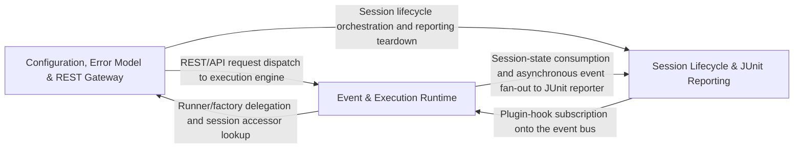

## Details

The foundational infrastructure layer providing configuration resolution, typed error payloads, the pub/sub event system, JUnit XML reporting, the keyword/test-case execution engine, and the FastAPI REST surface that exposes sessions and execution to external callers.

### Configuration, Error Model & REST Gateway
Resolves layered YAML configuration into typed Config objects, defines typed error payloads for API/CLI error propagation, wires the Builder/Factory layer (runner selection, event-manager registry), and exposes the FastAPI-based REST surface (requests, responses, keyword catalog) that external callers use to create sessions and trigger execution.

**Related Classes/Methods**:

- `optics_framework.common.config_handler.ConfigHandler`:113-225
- `optics_framework.common.error.ErrorPayload`:341-349
- `optics_framework.common.execution.RunnerFactory`:235-268
- `optics_framework.common.expose_api.ExecuteRequest`:124-137

**Source Files:**

- `optics_framework/common/config_handler.py`
  - `optics_framework.common.config_handler.DependencyConfig` (L11-L19) - Class
  - `optics_framework.common.config_handler.DependencyConfig.Config` (L17-L19) - Class
  - `optics_framework.common.config_handler.Config` (L22-L87) - Class
  - `optics_framework.common.config_handler.Config.__init__` (L45-L77) - Method
  - `optics_framework.common.config_handler.Config.Config` (L79-L81) - Class
  - `optics_framework.common.config_handler.deep_merge` (L89-L110) - Function
  - `optics_framework.common.config_handler.deep_merge._merge_dicts` (L96-L107) - Function
  - `optics_framework.common.config_handler.ConfigHandler` (L113-L225) - Class
  - `optics_framework.common.config_handler.ConfigHandler.__init__` (L123-L140) - Method
  - `optics_framework.common.config_handler.ConfigHandler.set_project` (L142-L143) - Method
  - `optics_framework.common.config_handler.ConfigHandler._ensure_global_config` (L146-L150) - Method
  - `optics_framework.common.config_handler.ConfigHandler.load` (L152-L164) - Method
  - `optics_framework.common.config_handler.ConfigHandler.update_config` (L166-L180) - Method
  - `optics_framework.common.config_handler.ConfigHandler._load_yaml` (L183-L192) - Method
  - `optics_framework.common.config_handler.ConfigHandler._is_enabled` (L194-L196) - Method
  - `optics_framework.common.config_handler.ConfigHandler._precompute_enabled_configs` (L198-L206) - Method
  - `optics_framework.common.config_handler.ConfigHandler.get_dependency_config` (L208-L215) - Method
  - `optics_framework.common.config_handler.ConfigHandler.get` (L217-L220) - Method
  - `optics_framework.common.config_handler.ConfigHandler.save_config` (L222-L225) - Method
- `optics_framework/common/error.py`
  - `optics_framework.common.error.Category` (L23-L32) - Class
  - `optics_framework.common.error.ErrorPayload` (L341-L349) - Class
  - `optics_framework.common.error.OpticsError.to_payload` (L465-L489) - Method
  - `optics_framework.common.error.register_error` (L492-L497) - Function
- `optics_framework/common/events.py`
  - `optics_framework.common.events.EventStatus` (L13-L21) - Class
  - `optics_framework.common.events.CommandType` (L24-L30) - Class
  - `optics_framework.common.events.get_event_manager_registry` (L210-L212) - Function
- `optics_framework/common/execution.py`
  - `optics_framework.common.execution.RunnerFactory` (L235-L268) - Class
  - `optics_framework.common.execution.RunnerFactory.create_runner` (L238-L268) - Method
- `optics_framework/common/expose_api.py`
  - `optics_framework.common.expose_api.ExecuteRequest` (L124-L137) - Class
  - `optics_framework.common.expose_api.SessionResponse` (L147-L154) - Class
  - `optics_framework.common.expose_api.ExecutionResponse` (L157-L170) - Class
  - `optics_framework.common.expose_api.TerminationResponse` (L173-L178) - Class
  - `optics_framework.common.expose_api.ExecutionEvent` (L181-L188) - Class
  - `optics_framework.common.expose_api.KeywordParameter` (L196-L199) - Class
  - `optics_framework.common.expose_api.KeywordInfo` (L202-L206) - Class
  - `optics_framework.common.expose_api._humanize_keyword` (L209-L218) - Function
  - `optics_framework.common.expose_api._make_dependency_entry` (L221-L245) - Function
  - `optics_framework.common.expose_api.SessionConfig` (L247-L311) - Class
  - `optics_framework.common.expose_api.SessionConfig._normalize_item` (L275-L295) - Method
  - `optics_framework.common.expose_api.SessionConfig.normalize_sources` (L297-L311) - Method
  - `optics_framework.common.expose_api._parse_api_data_to_model` (L314-L327) - Function
  - `optics_framework.common.expose_api._get_keyword_parameters` (L330-L351) - Function
  - `optics_framework.common.expose_api._extract_keywords_from_class` (L353-L370) - Function
  - `optics_framework.common.expose_api._extract_keywords_from_module` (L372-L378) - Function
  - `optics_framework.common.expose_api.discover_keywords` (L380-L393) - Function
  - `optics_framework.common.expose_api._env_self_heal_defaults` (L411-L424) - Function
  - `optics_framework.common.expose_api._resolve_self_heal_settings` (L427-L446) - Function
  - `optics_framework.common.expose_api.create_session` (L457-L544) - Function
  - `optics_framework.common.expose_api._decode_template_base64` (L649-L656) - Function
  - `optics_framework.common.expose_api._write_bytes_to_path` (L659-L662) - Function
  - `optics_framework.common.expose_api._safe_template_filename` (L665-L678) - Function
  - `optics_framework.common.expose_api._setup_request_template_overrides` (L840-L861) - Function
  - `optics_framework.common.expose_api._handle_execution_failure` (L864-L875) - Function
  - `optics_framework.common.expose_api.execute_keyword` (L886-L952) - Function
  - `optics_framework.common.expose_api.upload_template` (L962-L983) - Function
  - `optics_framework.common.expose_api.add_session_api` (L994-L1010) - Function
  - `optics_framework.common.expose_api.run_keyword_endpoint` (L1014-L1025) - Function
  - `optics_framework.common.expose_api.capture_screenshot` (L1029-L1034) - Function
  - `optics_framework.common.expose_api.get_driver_session_id` (L1037-L1042) - Function
  - `optics_framework.common.expose_api.get_elements` (L1045-L1069) - Function
  - `optics_framework.common.expose_api.get_pagesource` (L1072-L1077) - Function
  - `optics_framework.common.expose_api.screen_elements` (L1080-L1085) - Function
  - `optics_framework.common.expose_api.stream_events` (L1093-L1102) - Function
  - `optics_framework.common.expose_api.stream_workspace` (L1105-L1124) - Function
  - `optics_framework.common.expose_api.list_keywords` (L1127-L1131) - Function
  - `optics_framework.common.expose_api._compute_workspace_hash` (L1194-L1208) - Function
  - `optics_framework.common.expose_api.workspace_generator` (L1210-L1267) - Function
  - `optics_framework.common.expose_api.event_generator` (L1269-L1320) - Function
  - `optics_framework.common.expose_api.delete_session` (L1329-L1351) - Function
- `optics_framework/common/logging_config.py`
  - `optics_framework.common.logging_config.initialize_handlers` (L196-L200) - Function
  - `optics_framework.common.logging_config.reconfigure_logging` (L279-L281) - Function
- `optics_framework/common/models.py`
  - `optics_framework.common.models.State` (L9-L16) - Class
  - `optics_framework.common.models.Node` (L19-L25) - Class
  - `optics_framework.common.models.KeywordNode` (L28-L31) - Class
  - `optics_framework.common.models.ModuleNode` (L34-L66) - Class
  - `optics_framework.common.models.ModuleNode.add_keyword` (L38-L45) - Method
  - `optics_framework.common.models.ModuleNode.remove_keyword` (L47-L58) - Method
  - `optics_framework.common.models.ModuleNode.get_keyword` (L60-L66) - Method
  - `optics_framework.common.models.TestCaseNode` (L69-L101) - Class
  - `optics_framework.common.models.TestCaseNode.add_module` (L73-L80) - Method
  - `optics_framework.common.models.TestCaseNode.remove_module` (L82-L93) - Method
  - `optics_framework.common.models.TestCaseNode.get_module` (L95-L101) - Method
  - `optics_framework.common.models.TestSuite` (L104-L135) - Class
  - `optics_framework.common.models.TestSuite.add_test_case` (L107-L114) - Method
  - `optics_framework.common.models.TestSuite.remove_test_case` (L116-L127) - Method
  - `optics_framework.common.models.TestSuite.get_test_case` (L129-L135) - Method
  - `optics_framework.common.models.ModuleData` (L139-L151) - Class
  - `optics_framework.common.models.ModuleData.add_module_definition` (L143-L144) - Method
  - `optics_framework.common.models.ModuleData.remove_module_definition` (L146-L148) - Method
  - `optics_framework.common.models.ModuleData.get_module_definition` (L150-L151) - Method
  - `optics_framework.common.models.RequestDefinition` (L239-L243) - Class
  - `optics_framework.common.models.ApiDefinition` (L253-L258) - Class
  - `optics_framework.common.models.ApiData` (L278-L290) - Class
  - `optics_framework.common.models.ApiData.add_collection` (L282-L283) - Method
  - `optics_framework.common.models.ApiData.remove_collection` (L285-L287) - Method
  - `optics_framework.common.models.ApiData.get_collection` (L289-L290) - Method
- `optics_framework/common/optics_builder.py`
  - `optics_framework.common.optics_builder.OpticsBuilder.build` (L192-L201) - Method
- `optics_framework/common/runner/keyword_register.py`
  - `optics_framework.common.runner.keyword_register.KeywordRegistry` (L5-L52) - Class
  - `optics_framework.common.runner.keyword_register.KeywordRegistry.__init__` (L13-L20) - Method
  - `optics_framework.common.runner.keyword_register.KeywordRegistry.register` (L22-L40) - Method
  - `optics_framework.common.runner.keyword_register.KeywordRegistry.get_method` (L42-L52) - Method
- `optics_framework/common/runner/printers.py`
  - `optics_framework.common.runner.printers.TerminalWidthProvider` (L125-L127) - Class
  - `optics_framework.common.runner.printers.TerminalWidthProvider.get_terminal_width` (L126-L127) - Method
  - `optics_framework.common.runner.printers.TreeResultPrinter` (L130-L246) - Class
  - `optics_framework.common.runner.printers.TreeResultPrinter.__init__` (L143-L151) - Method
  - `optics_framework.common.runner.printers.TreeResultPrinter.get_instance` (L154-L159) - Method
  - `optics_framework.common.runner.printers.TreeResultPrinter.test_state` (L166-L167) - Method
  - `optics_framework.common.runner.printers.TreeResultPrinter.start_run` (L169-L171) - Method
  - `optics_framework.common.runner.printers.TreeResultPrinter.create_label` (L173-L193) - Method
  - `optics_framework.common.runner.printers.TreeResultPrinter._render_tree` (L195-L220) - Method
  - `optics_framework.common.runner.printers.TreeResultPrinter.print_tree_log` (L222-L225) - Method
  - `optics_framework.common.runner.printers.TreeResultPrinter.print_event_log` (L227-L233) - Method
  - `optics_framework.common.runner.printers.TreeResultPrinter.start_live` (L235-L241) - Method
  - `optics_framework.common.runner.printers.TreeResultPrinter.stop_live` (L243-L246) - Method
- `optics_framework/common/session_manager.py`
  - `optics_framework.common.session_manager.SessionHandler` (L54-L72) - Class
  - `optics_framework.common.session_manager.SessionHandler.create_session` (L57-L64) - Method
  - `optics_framework.common.session_manager.SessionHandler.get_session` (L67-L68) - Method
  - `optics_framework.common.session_manager.SessionHandler.terminate_session` (L71-L72) - Method
  - `optics_framework.common.session_manager.SessionManager` (L149-L185) - Class
  - `optics_framework.common.session_manager.SessionManager.__init__` (L152-L153) - Method
  - `optics_framework.common.session_manager.SessionManager.create_session` (L155-L165) - Method
  - `optics_framework.common.session_manager.SessionManager.get_session` (L167-L169) - Method
  - `optics_framework.common.session_manager.SessionManager.terminate_session` (L171-L185) - Method
- `optics_framework/helper/config_manager.py`
  - `optics_framework.helper.config_manager.QuitConfirmScreen` (L9-L24) - Class
  - `optics_framework.helper.config_manager.QuitConfirmScreen.compose` (L12-L21) - Method
  - `optics_framework.helper.config_manager.QuitConfirmScreen.on_button_pressed` (L23-L24) - Method
  - `optics_framework.helper.config_manager.ErrorScreen` (L27-L43) - Class
  - `optics_framework.helper.config_manager.ErrorScreen.__init__` (L30-L32) - Method
  - `optics_framework.helper.config_manager.ErrorScreen.compose` (L34-L39) - Method
  - `optics_framework.helper.config_manager.ErrorScreen.on_button_pressed` (L41-L43) - Method
  - `optics_framework.helper.config_manager.LoggerTUI` (L46-L212) - Class
  - `optics_framework.helper.config_manager.LoggerTUI.__init__` (L107-L112) - Method
  - `optics_framework.helper.config_manager.LoggerTUI.compose` (L114-L124) - Method
  - `optics_framework.helper.config_manager.LoggerTUI.on_mount` (L126-L127) - Method
  - `optics_framework.helper.config_manager.LoggerTUI.get_value` (L129-L134) - Method
  - `optics_framework.helper.config_manager.LoggerTUI.action_move_up` (L136-L138) - Method
  - `optics_framework.helper.config_manager.LoggerTUI.action_move_down` (L140-L143) - Method
  - `optics_framework.helper.config_manager.LoggerTUI.refresh_list` (L145-L150) - Method
  - `optics_framework.helper.config_manager.LoggerTUI.action_edit` (L152-L165) - Method
  - `optics_framework.helper.config_manager.LoggerTUI.on_input_submitted` (L167-L168) - Method
  - `optics_framework.helper.config_manager.LoggerTUI.on_button_pressed` (L170-L173) - Method
  - `optics_framework.helper.config_manager.LoggerTUI.handle_edit_confirm` (L175-L197) - Method
  - `optics_framework.helper.config_manager.LoggerTUI.action_save` (L199-L205) - Method
  - `optics_framework.helper.config_manager.LoggerTUI.action_quit` (L207-L208) - Method
  - `optics_framework.helper.config_manager.LoggerTUI.handle_quit` (L210-L212) - Method
  - `optics_framework.helper.config_manager.main` (L215-L216) - Function
- `optics_framework/helper/execute.py`
  - `optics_framework.helper.execute.categorize_test_cases` (L319-L353) - Function
  - `optics_framework.helper.execute.get_execution_queue` (L356-L384) - Function
  - `optics_framework.helper.execute.create_test_case_nodes` (L387-L398) - Function
  - `optics_framework.helper.execute.populate_module_nodes` (L401-L423) - Function
  - `optics_framework.helper.execute.load_api_data` (L426-L437) - Function
  - `optics_framework.helper.execute.build_linked_list` (L440-L467) - Function
  - `optics_framework.helper.execute.BaseRunner._load_modules` (L549-L559) - Method
  - `optics_framework.helper.execute.BaseRunner._setup_session` (L621-L632) - Method
- `optics_framework/helper/live.py`
  - `optics_framework.helper.live._config_from_yaml` (L193-L221) - Function
  - `optics_framework.helper.live._load_partial_config` (L224-L233) - Function
  - `optics_framework.helper.live._has_enabled` (L236-L237) - Function
  - `optics_framework.helper.live._enabled_drivers` (L240-L247) - Function
  - `optics_framework.helper.live._compose_config` (L250-L285) - Function
  - `optics_framework.helper.live.LiveController.__init__` (L295-L361) - Method
  - `optics_framework.helper.live.LiveController._setup_live_logging` (L365-L403) - Method
  - `optics_framework.helper.live.LiveController._build_registry` (L424-L433) - Method
  - `optics_framework.helper.live.LiveController._enabled_driver_name` (L926-L933) - Method
  - `optics_framework.helper.live.LiveController.supports_device_switching` (L965-L972) - Method
  - `optics_framework.helper.live.LiveController.switch_device` (L1043-L1077) - Method
  - `optics_framework.helper.live.LiveController.natural_language_available` (L1112-L1120) - Method
- `optics_framework/helper/mcp_server.py`
  - `optics_framework.helper.mcp_server._require_fastmcp` (L84-L89) - Function
  - `optics_framework.helper.mcp_server._http_detail` (L92-L99) - Function
  - `optics_framework.helper.mcp_server._stringify_params` (L102-L116) - Function
  - `optics_framework.helper.mcp_server._reflect_keyword_params` (L119-L128) - Function
  - `optics_framework.helper.mcp_server._make_keyword_tool` (L131-L195) - Function
  - `optics_framework.helper.mcp_server._make_keyword_tool.wrapper` (L139-L158) - Function
  - `optics_framework.helper.mcp_server._iter_keyword_tools` (L198-L212) - Function
  - `optics_framework.helper.mcp_server._observe` (L215-L222) - Function
  - `optics_framework.helper.mcp_server._decode_screenshot` (L225-L232) - Function
  - `optics_framework.helper.mcp_server.build_server` (L235-L345) - Function
  - `optics_framework.helper.mcp_server.build_server.start_session` (L241-L290) - Function
  - `optics_framework.helper.mcp_server.build_server.terminate_session` (L292-L298) - Function
  - `optics_framework.helper.mcp_server.build_server.screenshot` (L300-L307) - Function
  - `optics_framework.helper.mcp_server.build_server.keywords_catalog` (L319-L321) - Function
  - `optics_framework.helper.mcp_server.build_server.screenshot_resource` (L324-L326) - Function
  - `optics_framework.helper.mcp_server.build_server.page_source` (L329-L331) - Function
  - `optics_framework.helper.mcp_server.build_server.interactive_elements` (L334-L336) - Function
  - `optics_framework.helper.mcp_server.build_server.screen_elements` (L341-L343) - Function
  - `optics_framework.helper.mcp_server.run_mcp_server` (L348-L368) - Function
- `optics_framework/optics.py`
  - `optics_framework.optics.Optics._initialize_session_and_keywords` (L358-L393) - Method

### Event & Execution Runtime
Implements the async pub/sub event bus that decouples execution from reporting/observers, and the execution engine itself, which validates parameters, selects a Strategy-pattern Executor (batch/dry-run/keyword), runs it against a session, and drains/publishes lifecycle events; includes live console/result printers consumed during execution.

**Related Classes/Methods**:

- `optics_framework.common.events.EventManager`:71-171
- `optics_framework.common.events.EventManagerRegistry`:174-202
- `optics_framework.common.execution.ExecutionEngine`:285-428
- `optics_framework.common.execution.Executor`:34-38

**Source Files:**

- `optics_framework/common/events.py`
  - `optics_framework.common.events.Event` (L33-L52) - Class
  - `optics_framework.common.events.EventSubscriber` (L64-L68) - Class
  - `optics_framework.common.events.EventSubscriber.on_event` (L67-L68) - Method
  - `optics_framework.common.events.EventManager` (L71-L171) - Class
  - `optics_framework.common.events.EventManager.__init__` (L73-L79) - Method
  - `optics_framework.common.events.EventManager.start` (L81-L89) - Method
  - `optics_framework.common.events.EventManager.stop` (L91-L97) - Method
  - `optics_framework.common.events.EventManager._process_events` (L99-L121) - Method
  - `optics_framework.common.events.EventManager.publish_event` (L123-L126) - Method
  - `optics_framework.common.events.EventManager.publish_command` (L128-L135) - Method
  - `optics_framework.common.events.EventManager.subscribe` (L137-L140) - Method
  - `optics_framework.common.events.EventManager.unsubscribe` (L142-L145) - Method
  - `optics_framework.common.events.EventManager.get_command` (L147-L151) - Method
  - `optics_framework.common.events.EventManager.dump_state` (L153-L156) - Method
  - `optics_framework.common.events.EventManager.shutdown` (L158-L171) - Method
  - `optics_framework.common.events.EventManagerRegistry` (L174-L202) - Class
  - `optics_framework.common.events.EventManagerRegistry.__init__` (L177-L179) - Method
  - `optics_framework.common.events.EventManagerRegistry.get_event_manager` (L181-L188) - Method
  - `optics_framework.common.events.EventManagerRegistry.remove_session` (L190-L197) - Method
  - `optics_framework.common.events.EventManagerRegistry.get_active_sessions` (L199-L202) - Method
  - `optics_framework.common.events.get_event_manager` (L206-L208) - Function
- `optics_framework/common/execution.py`
  - `optics_framework.common.execution.ExecutionParams` (L22-L31) - Class
  - `optics_framework.common.execution.Executor` (L34-L38) - Class
  - `optics_framework.common.execution.Executor.execute` (L37-L38) - Method
  - `optics_framework.common.execution.BatchExecutor` (L41-L89) - Class
  - `optics_framework.common.execution.BatchExecutor.__init__` (L44-L48) - Method
  - `optics_framework.common.execution.BatchExecutor.execute` (L50-L89) - Method
  - `optics_framework.common.execution.DryRunExecutor` (L92-L129) - Class
  - `optics_framework.common.execution.DryRunExecutor.__init__` (L95-L99) - Method
  - `optics_framework.common.execution.DryRunExecutor.execute` (L101-L129) - Method
  - `optics_framework.common.execution._deserialize_single_param` (L132-L140) - Function
  - `optics_framework.common.execution._deserialize_params` (L143-L160) - Function
  - `optics_framework.common.execution.KeywordExecutor` (L163-L232) - Class
  - `optics_framework.common.execution.KeywordExecutor.__init__` (L166-L169) - Method
  - `optics_framework.common.execution.KeywordExecutor.execute` (L171-L232) - Method
  - `optics_framework.common.execution._execution_event` (L271-L282) - Function
  - `optics_framework.common.execution.ExecutionEngine` (L285-L428) - Class
  - `optics_framework.common.execution.ExecutionEngine.__init__` (L288-L290) - Method
  - `optics_framework.common.execution.ExecutionEngine._validate_execution_params` (L292-L313) - Method
  - `optics_framework.common.execution.ExecutionEngine._create_executor` (L315-L331) - Method
  - `optics_framework.common.execution.ExecutionEngine._create_keyword_executor` (L333-L352) - Method
  - `optics_framework.common.execution.ExecutionEngine._run_executor` (L354-L369) - Method
  - `optics_framework.common.execution.ExecutionEngine._drain_events_and_shutdown` (L371-L387) - Method
  - `optics_framework.common.execution.ExecutionEngine.execute` (L389-L428) - Method
- `optics_framework/common/expose_api.py`
  - `optics_framework.common.expose_api._normalize_param_value` (L547-L579) - Function
  - `optics_framework.common.expose_api._resolve_named_to_positional` (L582-L619) - Function
  - `optics_framework.common.expose_api._NamedParamsContext` (L622-L629) - Class
  - `optics_framework.common.expose_api._keyword_execution_params` (L632-L641) - Function
  - `optics_framework.common.expose_api._should_reraise` (L644-L646) - Function
  - `optics_framework.common.expose_api._build_named_param_context` (L681-L714) - Function
  - `optics_framework.common.expose_api._build_positional_normalized` (L717-L721) - Function
  - `optics_framework.common.expose_api._combo_to_positional_named` (L724-L740) - Function
  - `optics_framework.common.expose_api._execute_no_params` (L743-L752) - Function
  - `optics_framework.common.expose_api._try_combos_named` (L755-L774) - Function
  - `optics_framework.common.expose_api._try_combos_positional` (L777-L797) - Function
  - `optics_framework.common.expose_api._execute_keyword_with_fallback` (L800-L837) - Function
- `optics_framework/common/logging_config.py`
  - `optics_framework.common.logging_config.SessionLoggerAdapter` (L132-L138) - Class
  - `optics_framework.common.logging_config.SessionLoggerAdapter.process` (L133-L138) - Method
  - `optics_framework.common.logging_config.LoggerContext` (L159-L178) - Class
  - `optics_framework.common.logging_config.LoggerContext.__init__` (L160-L163) - Method
  - `optics_framework.common.logging_config.LoggerContext.__enter__` (L165-L170) - Method
  - `optics_framework.common.logging_config.LoggerContext.__exit__` (L172-L178) - Method
- `optics_framework/common/runner/printers.py`
  - `optics_framework.common.runner.printers.TestCaseResult` (L15-L21) - Class
  - `optics_framework.common.runner.printers.KeywordResult` (L24-L30) - Class
  - `optics_framework.common.runner.printers.ModuleResult` (L33-L37) - Class
  - `optics_framework.common.runner.printers.IResultPrinter` (L40-L69) - Class
  - `optics_framework.common.runner.printers.IResultPrinter.test_state` (L48-L49) - Method
  - `optics_framework.common.runner.printers.IResultPrinter.print_tree_log` (L52-L53) - Method
  - `optics_framework.common.runner.printers.IResultPrinter.print_event_log` (L56-L57) - Method
  - `optics_framework.common.runner.printers.IResultPrinter.start_live` (L60-L61) - Method
  - `optics_framework.common.runner.printers.IResultPrinter.stop_live` (L64-L65) - Method
  - `optics_framework.common.runner.printers.IResultPrinter.start_run` (L68-L69) - Method
  - `optics_framework.common.runner.printers.NullResultPrinter` (L72-L122) - Class
  - `optics_framework.common.runner.printers.NullResultPrinter.__init__` (L75-L76) - Method
  - `optics_framework.common.runner.printers.NullResultPrinter.test_state` (L85-L88) - Method
  - `optics_framework.common.runner.printers.NullResultPrinter.print_tree_log` (L90-L95) - Method
  - `optics_framework.common.runner.printers.NullResultPrinter.print_event_log` (L97-L101) - Method
  - `optics_framework.common.runner.printers.NullResultPrinter.start_live` (L103-L108) - Method
  - `optics_framework.common.runner.printers.NullResultPrinter.stop_live` (L110-L115) - Method
  - `optics_framework.common.runner.printers.NullResultPrinter.start_run` (L117-L122) - Method
- `optics_framework/common/utils.py`
  - `optics_framework.common.utils._is_list_type` (L803-L830) - Function
  - `optics_framework.common.utils._is_list_type._is_list_like` (L813-L815) - Function

### Session Lifecycle & JUnit Reporting
Manages the lifecycle of Session objects independent of execution mode, and subscribes to the event bus to incrementally build a JUnit-compatible XML report (testsuites → testcases → module/keyword nodes with logs, args, timing, failures) that is flushed to disk on session close.

**Related Classes/Methods**:

- `optics_framework.common.Junit_eventhandler.JUnitEventHandler`:110-288
- `optics_framework.common.Junit_eventhandler.JUnitHandlerRegistry`:14-74

**Source Files:**

- `optics_framework/common/Junit_eventhandler.py`
  - `optics_framework.common.Junit_eventhandler.JUnitHandlerRegistry` (L14-L74) - Class
  - `optics_framework.common.Junit_eventhandler.JUnitHandlerRegistry.__init__` (L17-L19) - Method
  - `optics_framework.common.Junit_eventhandler.JUnitHandlerRegistry.setup_junit_for_session` (L21-L43) - Method
  - `optics_framework.common.Junit_eventhandler.JUnitHandlerRegistry._get_session_junit_path` (L45-L56) - Method
  - `optics_framework.common.Junit_eventhandler.JUnitHandlerRegistry.cleanup_session` (L58-L64) - Method
  - `optics_framework.common.Junit_eventhandler.JUnitHandlerRegistry.get_handler` (L66-L69) - Method
  - `optics_framework.common.Junit_eventhandler.JUnitHandlerRegistry.get_active_sessions` (L71-L74) - Method
  - `optics_framework.common.Junit_eventhandler.setup_junit` (L78-L80) - Function
  - `optics_framework.common.Junit_eventhandler.cleanup_junit` (L82-L84) - Function
  - `optics_framework.common.Junit_eventhandler.get_junit_handler_registry` (L86-L88) - Function
  - `optics_framework.common.Junit_eventhandler.JUnitEventHandler` (L110-L288) - Class
  - `optics_framework.common.Junit_eventhandler.JUnitEventHandler.__init__` (L111-L122) - Method
  - `optics_framework.common.Junit_eventhandler.JUnitEventHandler.on_event` (L125-L150) - Method
  - `optics_framework.common.Junit_eventhandler.JUnitEventHandler._handle_test_case_event` (L152-L180) - Method
  - `optics_framework.common.Junit_eventhandler.JUnitEventHandler._handle_module_event` (L182-L195) - Method
  - `optics_framework.common.Junit_eventhandler.JUnitEventHandler._handle_keyword_event` (L197-L223) - Method
  - `optics_framework.common.Junit_eventhandler.JUnitEventHandler._update_testcase_status` (L225-L241) - Method
  - `optics_framework.common.Junit_eventhandler.JUnitEventHandler.add_detected_errors` (L243-L270) - Method
  - `optics_framework.common.Junit_eventhandler.JUnitEventHandler.flush` (L272-L285) - Method
  - `optics_framework.common.Junit_eventhandler.JUnitEventHandler.close` (L287-L288) - Method
- `optics_framework/common/logging_config.py`
  - `optics_framework.common.logging_config.LoggingConfig` (L12-L16) - Class
  - `optics_framework.common.logging_config.LoggingManager` (L19-L111) - Class
  - `optics_framework.common.logging_config.LoggingManager.initialize_handlers` (L20-L46) - Method
  - `optics_framework.common.logging_config.LoggingManager.stop_listeners` (L48-L70) - Method
  - `optics_framework.common.logging_config.LoggingManager.stop_listeners.safe_stop` (L49-L66) - Function
  - `optics_framework.common.logging_config.LoggingManager.shutdown_logging` (L72-L78) - Method
  - `optics_framework.common.logging_config.LoggingManager.disable_logger` (L80-L81) - Method
  - `optics_framework.common.logging_config.LoggingManager.get_internal_logger` (L83-L84) - Method
  - `optics_framework.common.logging_config.LoggingManager.get_execution_logger` (L86-L87) - Method
  - `optics_framework.common.logging_config.LoggingManager.get_listeners` (L89-L90) - Method
  - `optics_framework.common.logging_config.LoggingManager.__init__` (L92-L111) - Method
  - `optics_framework.common.logging_config.SensitiveDataFormatter` (L113-L123) - Class
  - `optics_framework.common.logging_config.SensitiveDataFormatter.format` (L114-L119) - Method
  - `optics_framework.common.logging_config.SensitiveDataFormatter._sanitize` (L121-L123) - Method
  - `optics_framework.common.logging_config.create_file_handler` (L180-L188) - Function
  - `optics_framework.common.logging_config.shutdown_logging` (L202-L211) - Function
  - `optics_framework.common.logging_config.disable_logger` (L214-L216) - Function
  - `optics_framework.common.logging_config.stop_listeners` (L219-L221) - Function
  - `optics_framework.common.logging_config.wait_for_threads` (L224-L233) - Function
  - `optics_framework.common.logging_config.is_thread_alive` (L236-L238) - Function
  - `optics_framework.common.logging_config.check_thread_status` (L241-L246) - Function
  - `optics_framework.common.logging_config.flush_handlers` (L248-L262) - Function
  - `optics_framework.common.logging_config.clear_queues` (L265-L271) - Function
- `optics_framework/common/session_manager.py`
  - `optics_framework.common.session_manager._maybe_setup_junit` (L40-L51) - Function

### [FAQ](https://github.com/CodeBoarding/GeneratedOnBoardings/tree/main?tab=readme-ov-file#faq)