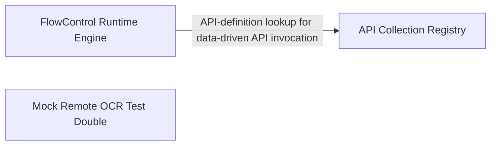

## Details

Runtime engine for FlowControl's loop/conditional/data-driven keywords, providing nested-module dispatch, condition evaluation, single-keyword execution, and CSV/DataFrame-oriented helpers for data-driven test iteration over shared ElementData/ApiCollection models.

### FlowControl Runtime Engine
Implements the imperative execution logic for FlowControl keywords — dispatching nested modules, evaluating loop/conditional expressions, running single keywords, and preparing/filtering CSV-backed ElementData for data-driven iteration.

**Related Classes/Methods**:

- `optics_framework.api.flow_control.FlowControl._execute_nested_module`:87-96
- `optics_framework.api.flow_control.FlowControl._evaluate_conditions`:298-325
- `optics_framework.api.flow_control.FlowControl._execute_single_keyword`:114-125
- `optics_framework.common.models.ElementData`:154-236

**Source Files:**

- `optics_framework/api/flow_control.py`
  - `optics_framework.api.flow_control.raw_params` (L27-L38) - Function
  - `optics_framework.api.flow_control.raw_params.decorator` (L30-L36) - Function
  - `optics_framework.api.flow_control.raw_params.decorator.wrapper` (L32-L33) - Function
  - `optics_framework.api.flow_control.FlowControl._ensure_session` (L55-L58) - Method
  - `optics_framework.api.flow_control.FlowControl._get_validated_module_def` (L66-L76) - Method
  - `optics_framework.api.flow_control.FlowControl._try_get_module_definition` (L78-L85) - Method
  - `optics_framework.api.flow_control.FlowControl._execute_nested_module` (L87-L96) - Method
  - `optics_framework.api.flow_control.FlowControl._execute_single_keyword` (L114-L125) - Method
  - `optics_framework.api.flow_control.FlowControl.execute_module` (L127-L139) - Method
  - `optics_framework.api.flow_control.FlowControl.run_loop` (L142-L152) - Method
  - `optics_framework.api.flow_control.FlowControl._loop_by_count` (L154-L173) - Method
  - `optics_framework.api.flow_control.FlowControl._loop_with_variables` (L175-L207) - Method
  - `optics_framework.api.flow_control.FlowControl.condition` (L269-L281) - Method
  - `optics_framework.api.flow_control.FlowControl._split_condition_args` (L283-L296) - Method
  - `optics_framework.api.flow_control.FlowControl._evaluate_conditions` (L298-L325) - Method
  - `optics_framework.api.flow_control.FlowControl._is_module_condition` (L327-L333) - Method
  - `optics_framework.api.flow_control.FlowControl._handle_module_condition` (L335-L366) - Method
  - `optics_framework.api.flow_control.FlowControl._handle_expression_condition` (L368-L374) - Method
  - `optics_framework.api.flow_control.FlowControl.read_data` (L429-L473) - Method
  - `optics_framework.api.flow_control.FlowControl._ensure_df_string` (L605-L608) - Method
  - `optics_framework.api.flow_control.FlowControl._parse_query_string` (L610-L625) - Method
  - `optics_framework.api.flow_control.FlowControl._resolve_query_vars` (L627-L645) - Method
  - `optics_framework.api.flow_control.FlowControl._apply_filter` (L647-L658) - Method
  - `optics_framework.api.flow_control.FlowControl._apply_column_selection` (L660-L668) - Method
  - `optics_framework.api.flow_control.FlowControl._store_result` (L683-L699) - Method
  - `optics_framework.api.flow_control.FlowControl._extract_element_name` (L752-L760) - Method
  - `optics_framework.api.flow_control.FlowControl.evaluate` (L806-L819) - Method
  - `optics_framework.api.flow_control.FlowControl._extract_variable_name` (L821-L829) - Method
  - `optics_framework.api.flow_control.FlowControl._detect_date_format` (L903-L918) - Method
  - `optics_framework.api.flow_control.FlowControl.date_evaluate` (L921-L989) - Method
- `optics_framework/common/models.py`
  - `optics_framework.common.models.ElementData` (L154-L236) - Class
  - `optics_framework.common.models.ElementData.add_element` (L163-L172) - Method
  - `optics_framework.common.models.ElementData.remove_element` (L174-L177) - Method
  - `optics_framework.common.models.ElementData.get_element` (L179-L185) - Method
  - `optics_framework.common.models.ElementData.resolve_with_fallback` (L192-L236) - Method

### Mock Remote OCR Test Double
A standalone FastAPI-based mock service that simulates a remote OCR backend (health check, text-detection, image decoding) used to exercise flow-execution paths that depend on vision/OCR fallback without hitting a real cloud OCR provider.

**Related Classes/Methods**:

- `tools.mock_remote_ocr.mock_remote_ocr.MockRemoteOCR`:58-329
- `tools.mock_remote_ocr.mock_remote_ocr.MockRemoteOCR._make_detect_text`:268-290
- `tools.mock_remote_ocr.mock_remote_ocr.MockRemoteOCR._decode_image_bytes`:147-166
- `tools.mock_remote_ocr.mock_remote_ocr.MockRemoteOCR.HealthResponse`:65-79

**Source Files:**

- `tools/mock_remote_ocr/mock_remote_ocr.py`
  - `tools.mock_remote_ocr.mock_remote_ocr.DetectRequest` (L52-L55) - Class
  - `tools.mock_remote_ocr.mock_remote_ocr.MockRemoteOCR` (L58-L329) - Class
  - `tools.mock_remote_ocr.mock_remote_ocr.MockRemoteOCR.HealthResponse` (L65-L79) - Class
  - `tools.mock_remote_ocr.mock_remote_ocr.MockRemoteOCR.HealthResponse.__init__` (L72-L79) - Method
  - `tools.mock_remote_ocr.mock_remote_ocr.MockRemoteOCR.__init__` (L81-L144) - Method
  - `tools.mock_remote_ocr.mock_remote_ocr.MockRemoteOCR.__init__._lazy_and_init` (L111-L124) - Function
  - `tools.mock_remote_ocr.mock_remote_ocr.MockRemoteOCR.__init__._startup_initialize_reader` (L126-L132) - Function
  - `tools.mock_remote_ocr.mock_remote_ocr.MockRemoteOCR.__init__._startup_schedule_reader` (L134-L141) - Function
  - `tools.mock_remote_ocr.mock_remote_ocr.MockRemoteOCR._decode_image_bytes` (L147-L166) - Method
  - `tools.mock_remote_ocr.mock_remote_ocr.MockRemoteOCR._lazy_import_easyocr` (L168-L178) - Method
  - `tools.mock_remote_ocr.mock_remote_ocr.MockRemoteOCR._init_reader_async` (L180-L217) - Method
  - `tools.mock_remote_ocr.mock_remote_ocr.MockRemoteOCR._init_reader_async._init` (L206-L207) - Function
  - `tools.mock_remote_ocr.mock_remote_ocr.MockRemoteOCR._run_readtext_async` (L219-L234) - Method
  - `tools.mock_remote_ocr.mock_remote_ocr.MockRemoteOCR._process_raw_results` (L236-L257) - Method
  - `tools.mock_remote_ocr.mock_remote_ocr.MockRemoteOCR._get_image_bytes` (L259-L265) - Method
  - `tools.mock_remote_ocr.mock_remote_ocr.MockRemoteOCR._make_detect_text` (L268-L290) - Method
  - `tools.mock_remote_ocr.mock_remote_ocr.MockRemoteOCR._make_detect_text.detect_text` (L269-L288) - Function
  - `tools.mock_remote_ocr.mock_remote_ocr.MockRemoteOCR._make_info` (L292-L315) - Method
  - `tools.mock_remote_ocr.mock_remote_ocr.MockRemoteOCR._make_info.info` (L293-L313) - Function
  - `tools.mock_remote_ocr.mock_remote_ocr.MockRemoteOCR._make_health` (L317-L322) - Method
  - `tools.mock_remote_ocr.mock_remote_ocr.MockRemoteOCR._make_health.health` (L318-L320) - Function
  - `tools.mock_remote_ocr.mock_remote_ocr.MockRemoteOCR._make_root` (L324-L329) - Method
  - `tools.mock_remote_ocr.mock_remote_ocr.MockRemoteOCR._make_root.root` (L325-L327) - Function

### API Collection Registry
A minimal in-memory registry model for managing reusable API definitions (add/get/remove) that data-driven flows can reference when iterating over API-backed test steps.

**Related Classes/Methods**:

- `optics_framework.common.models.ApiCollection`:261-275
- `optics_framework.common.models.ApiCollection.add_api`:267-268
- `optics_framework.common.models.ApiCollection.get_api`:274-275
- `optics_framework.common.models.ApiCollection.remove_api`:270-272

**Source Files:**

- `optics_framework/common/models.py`
  - `optics_framework.common.models.ApiCollection` (L261-L275) - Class
  - `optics_framework.common.models.ApiCollection.add_api` (L267-L268) - Method
  - `optics_framework.common.models.ApiCollection.remove_api` (L270-L272) - Method
  - `optics_framework.common.models.ApiCollection.get_api` (L274-L275) - Method

### [FAQ](https://github.com/CodeBoarding/GeneratedOnBoardings/tree/main?tab=readme-ov-file#faq)