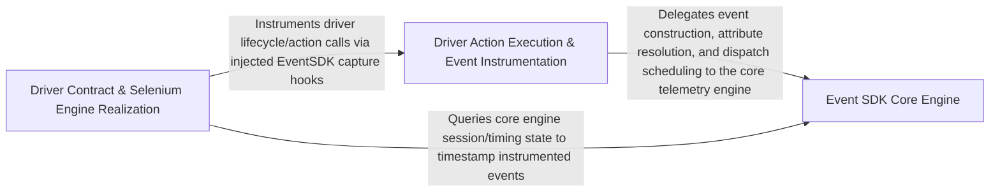

## Details

The abstract DriverInterface contract that mandates the full set of UI-interaction primitives (press, swipe, text entry, app lifecycle, script execution) that every engine must implement, paired with the concrete driver classes (Appium, Selenium, BLE) that realize this contract for their respective automation backends.

### Driver Action Execution & Event Instrumentation
Concrete engine implementations (Appium, BLE, and parts of Selenium) that execute UI interaction primitives against their respective backends while instrumenting each action with event-capture calls into EventSDK, tightly coupling driver execution with telemetry emission.

**Related Classes/Methods**:

- `optics_framework.engines.drivers.ble.BLEDriver`:38-787
- `optics_framework.common.eventSDK.EventSDK.capture_event`:225-253
- `optics_framework.common.eventSDK.EventSDK.send_all_events`:286-313

**Source Files:**

- `optics_framework/common/eventSDK.py`
  - `optics_framework.common.eventSDK.EventSDK.merge_dictionaries` (L204-L205) - Method
  - `optics_framework.common.eventSDK.EventSDK.print_event` (L217-L223) - Method
  - `optics_framework.common.eventSDK.EventSDK.capture_event` (L225-L253) - Method
  - `optics_framework.common.eventSDK.EventSDK.send_all_events` (L286-L313) - Method
- `optics_framework/engines/drivers/appium.py`
  - `optics_framework.engines.drivers.appium.Appium.force_terminate_app` (L498-L517) - Method
  - `optics_framework.engines.drivers.appium.Appium.terminate` (L519-L531) - Method
  - `optics_framework.engines.drivers.appium.Appium.clear_text_element` (L987-L991) - Method
- `optics_framework/engines/drivers/ble.py`
  - `optics_framework.engines.drivers.ble.CapabilitiesConfig` (L15-L35) - Class
  - `optics_framework.engines.drivers.ble.CapabilitiesConfig.Config` (L34-L35) - Class
  - `optics_framework.engines.drivers.ble.BLEDriver` (L38-L787) - Class
  - `optics_framework.engines.drivers.ble.BLEDriver.get_port_by_name` (L134-L144) - Method
  - `optics_framework.engines.drivers.ble.BLEDriver.__init__` (L146-L199) - Method
  - `optics_framework.engines.drivers.ble.BLEDriver._send_mouse_reset` (L201-L203) - Method
  - `optics_framework.engines.drivers.ble.BLEDriver._send_mouse_press` (L205-L207) - Method
  - `optics_framework.engines.drivers.ble.BLEDriver._send_mouse_release` (L209-L211) - Method
  - `optics_framework.engines.drivers.ble.BLEDriver.send_mouse_command` (L213-L224) - Method
  - `optics_framework.engines.drivers.ble.BLEDriver.get_driver_session_id` (L226-L228) - Method
  - `optics_framework.engines.drivers.ble.BLEDriver.execute_script` (L230-L245) - Method
  - `optics_framework.engines.drivers.ble.BLEDriver.translate_coordinates_relative` (L247-L281) - Method
  - `optics_framework.engines.drivers.ble.BLEDriver.mouse_reset_position` (L283-L295) - Method
  - `optics_framework.engines.drivers.ble.BLEDriver.mouse_tap` (L297-L303) - Method
  - `optics_framework.engines.drivers.ble.BLEDriver.mouse_double_tap` (L305-L310) - Method
  - `optics_framework.engines.drivers.ble.BLEDriver.convert_pixel_to_mickeys` (L312-L326) - Method
  - `optics_framework.engines.drivers.ble.BLEDriver.translate_coordinates_relative_pixel` (L328-L340) - Method
  - `optics_framework.engines.drivers.ble.BLEDriver.move_tap` (L342-L362) - Method
  - `optics_framework.engines.drivers.ble.BLEDriver.swipe_ble` (L364-L402) - Method
  - `optics_framework.engines.drivers.ble.BLEDriver.swipe_ble.drag` (L374-L385) - Function
  - `optics_framework.engines.drivers.ble.BLEDriver.press_coordinates` (L404-L418) - Method
  - `optics_framework.engines.drivers.ble.BLEDriver.send_keyboard_command` (L456-L464) - Method
  - `optics_framework.engines.drivers.ble.BLEDriver.keyboard` (L466-L503) - Method
  - `optics_framework.engines.drivers.ble.BLEDriver.launch_app` (L505-L517) - Method
  - `optics_framework.engines.drivers.ble.BLEDriver.launch_other_app` (L519-L520) - Method
  - `optics_framework.engines.drivers.ble.BLEDriver.get_app_version` (L522-L523) - Method
  - `optics_framework.engines.drivers.ble.BLEDriver.press_element` (L525-L528) - Method
  - `optics_framework.engines.drivers.ble.BLEDriver.press_percentage_coordinates` (L530-L562) - Method
  - `optics_framework.engines.drivers.ble.BLEDriver.enter_text` (L564-L576) - Method
  - `optics_framework.engines.drivers.ble.BLEDriver.press_keycode` (L578-L590) - Method
  - `optics_framework.engines.drivers.ble.BLEDriver.enter_text_element` (L592-L595) - Method
  - `optics_framework.engines.drivers.ble.BLEDriver.enter_text_using_keyboard` (L597-L625) - Method
  - `optics_framework.engines.drivers.ble.BLEDriver.clear_text` (L627-L638) - Method
  - `optics_framework.engines.drivers.ble.BLEDriver.clear_text_element` (L640-L645) - Method
  - `optics_framework.engines.drivers.ble.BLEDriver.swipe` (L647-L675) - Method
  - `optics_framework.engines.drivers.ble.BLEDriver.swipe_percentage` (L677-L708) - Method
  - `optics_framework.engines.drivers.ble.BLEDriver.swipe_element` (L710-L711) - Method
  - `optics_framework.engines.drivers.ble.BLEDriver.scroll` (L713-L742) - Method
  - `optics_framework.engines.drivers.ble.BLEDriver.get_text_element` (L746-L749) - Method
  - `optics_framework.engines.drivers.ble.BLEDriver.force_terminate_app` (L751-L769) - Method
  - `optics_framework.engines.drivers.ble.BLEDriver.terminate` (L771-L787) - Method
- `optics_framework/engines/drivers/selenium.py`
  - `optics_framework.engines.drivers.selenium.SeleniumDriver.terminate` (L120-L134) - Method
  - `optics_framework.engines.drivers.selenium.SeleniumDriver.force_terminate_app` (L136-L154) - Method
  - `optics_framework.engines.drivers.selenium.SeleniumDriver.launch_other_app` (L181-L193) - Method
  - `optics_framework.engines.drivers.selenium.SeleniumDriver.clear_text` (L314-L324) - Method
  - `optics_framework.engines.drivers.selenium.SeleniumDriver.clear_text_element` (L327-L335) - Method
  - `optics_framework.engines.drivers.selenium.SeleniumDriver.scroll` (L347-L362) - Method
  - `optics_framework.engines.drivers.selenium.SeleniumDriver.execute_script` (L381-L406) - Method

### Driver Contract & Selenium Engine Realization
The abstract DriverInterface defining the mandatory UI-automation API surface (press, swipe, text entry, app lifecycle, script execution) alongside the Selenium driver's concrete method implementations that directly fulfill this contract for web automation.

**Related Classes/Methods**:

- `optics_framework.common.driver_interface.DriverInterface`:4-280
- `optics_framework.common.driver_interface.DriverInterface.enter_text_element`:119-129
- `optics_framework.common.driver_interface.DriverInterface.press_coordinates`:54-65

**Source Files:**

- `optics_framework/common/driver_interface.py`
  - `optics_framework.common.driver_interface.DriverInterface` (L4-L280) - Class
  - `optics_framework.common.driver_interface.DriverInterface.launch_app` (L13-L28) - Method
  - `optics_framework.common.driver_interface.DriverInterface.launch_other_app` (L31-L41) - Method
  - `optics_framework.common.driver_interface.DriverInterface.get_app_version` (L44-L51) - Method
  - `optics_framework.common.driver_interface.DriverInterface.press_coordinates` (L54-L65) - Method
  - `optics_framework.common.driver_interface.DriverInterface.press_element` (L68-L77) - Method
  - `optics_framework.common.driver_interface.DriverInterface.press_percentage_coordinates` (L80-L91) - Method
  - `optics_framework.common.driver_interface.DriverInterface.enter_text` (L94-L104) - Method
  - `optics_framework.common.driver_interface.DriverInterface.press_keycode` (L107-L116) - Method
  - `optics_framework.common.driver_interface.DriverInterface.enter_text_element` (L119-L129) - Method
  - `optics_framework.common.driver_interface.DriverInterface.enter_text_using_keyboard` (L132-L141) - Method
  - `optics_framework.common.driver_interface.DriverInterface.clear_text` (L144-L153) - Method
  - `optics_framework.common.driver_interface.DriverInterface.clear_text_element` (L156-L165) - Method
  - `optics_framework.common.driver_interface.DriverInterface.swipe` (L168-L180) - Method
  - `optics_framework.common.driver_interface.DriverInterface.swipe_percentage` (L183-L195) - Method
  - `optics_framework.common.driver_interface.DriverInterface.swipe_element` (L198-L209) - Method
  - `optics_framework.common.driver_interface.DriverInterface.scroll` (L212-L222) - Method
  - `optics_framework.common.driver_interface.DriverInterface.get_text_element` (L225-L232) - Method
  - `optics_framework.common.driver_interface.DriverInterface.force_terminate_app` (L235-L244) - Method
  - `optics_framework.common.driver_interface.DriverInterface.terminate` (L247-L253) - Method
  - `optics_framework.common.driver_interface.DriverInterface.get_driver_session_id` (L256-L264) - Method
  - `optics_framework.common.driver_interface.DriverInterface.execute_script` (L267-L280) - Method
- `optics_framework/engines/drivers/selenium.py`
  - `optics_framework.engines.drivers.selenium.SeleniumDriver` (L13-L406) - Class
  - `optics_framework.engines.drivers.selenium.SeleniumDriver.__init__` (L19-L39) - Method
  - `optics_framework.engines.drivers.selenium.SeleniumDriver.start_session` (L41-L78) - Method
  - `optics_framework.engines.drivers.selenium.SeleniumDriver._get_browser_name` (L80-L86) - Method
  - `optics_framework.engines.drivers.selenium.SeleniumDriver._get_browser_options` (L88-L106) - Method
  - `optics_framework.engines.drivers.selenium.SeleniumDriver._update_browser_url` (L108-L111) - Method
  - `optics_framework.engines.drivers.selenium.SeleniumDriver._merge_capabilities` (L113-L114) - Method
  - `optics_framework.engines.drivers.selenium.SeleniumDriver._set_options_capabilities` (L116-L118) - Method
  - `optics_framework.engines.drivers.selenium.SeleniumDriver.launch_app` (L156-L179) - Method
  - `optics_framework.engines.drivers.selenium.SeleniumDriver.get_app_version` (L219-L220) - Method
  - `optics_framework.engines.drivers.selenium.SeleniumDriver.press_coordinates` (L222-L236) - Method
  - `optics_framework.engines.drivers.selenium.SeleniumDriver.press_percentage_coordinates` (L238-L247) - Method
  - `optics_framework.engines.drivers.selenium.SeleniumDriver.press_keycode` (L288-L290) - Method
  - `optics_framework.engines.drivers.selenium.SeleniumDriver.swipe` (L338-L339) - Method
  - `optics_framework.engines.drivers.selenium.SeleniumDriver.swipe_percentage` (L341-L342) - Method
  - `optics_framework.engines.drivers.selenium.SeleniumDriver.swipe_element` (L344-L345) - Method
  - `optics_framework.engines.drivers.selenium.SeleniumDriver.get_text_element` (L364-L371) - Method
  - `optics_framework.engines.drivers.selenium.SeleniumDriver._raise_action_not_supported` (L373-L375) - Method
  - `optics_framework.engines.drivers.selenium.SeleniumDriver.get_driver_session_id` (L377-L379) - Method

### Event SDK Core Engine
The internal event-lifecycle engine of EventSDK responsible for initializing session state, loading event-attribute configuration, constructing and batching event payloads, and managing send scheduling (real-time vs. post-execution) independent of any specific driver.

**Related Classes/Methods**:

- `optics_framework.common.eventSDK.EventSDK.__init__`:14-19
- `optics_framework.common.eventSDK.EventSDK._load_event_attributes_json`:21-32
- `optics_framework.common.eventSDK.EventSDK.create_events_dictionary`:184-185
- `optics_framework.common.eventSDK.EventSDK.convert_to_json`:177-182

**Source Files:**

- `optics_framework/common/eventSDK.py`
  - `optics_framework.common.eventSDK.EventSDK` (L13-L322) - Class
  - `optics_framework.common.eventSDK.EventSDK.__init__` (L14-L19) - Method
  - `optics_framework.common.eventSDK.EventSDK._load_event_attributes_json` (L21-L32) - Method
  - `optics_framework.common.eventSDK.EventSDK.check_file_availability` (L45-L50) - Method
  - `optics_framework.common.eventSDK.EventSDK.get_json_attribute` (L52-L65) - Method
  - `optics_framework.common.eventSDK.EventSDK.get_event_attributes` (L67-L79) - Method
  - `optics_framework.common.eventSDK.EventSDK.set_event_name` (L81-L82) - Method
  - `optics_framework.common.eventSDK.EventSDK.form_event_name` (L84-L89) - Method
  - `optics_framework.common.eventSDK.EventSDK.form_event_attributes` (L91-L99) - Method
  - `optics_framework.common.eventSDK.EventSDK.submit_single_event` (L101-L109) - Method
  - `optics_framework.common.eventSDK.EventSDK.event_sdk_initializer` (L111-L115) - Method
  - `optics_framework.common.eventSDK.EventSDK.send_real_time_events` (L117-L123) - Method
  - `optics_framework.common.eventSDK.EventSDK.send_events_after_execution` (L125-L132) - Method
  - `optics_framework.common.eventSDK.EventSDK.send_batch_events` (L134-L168) - Method
  - `optics_framework.common.eventSDK.EventSDK.add_to_array` (L170-L175) - Method
  - `optics_framework.common.eventSDK.EventSDK.convert_to_json` (L177-L182) - Method
  - `optics_framework.common.eventSDK.EventSDK.create_events_dictionary` (L184-L185) - Method
  - `optics_framework.common.eventSDK.EventSDK.nested_dictionary` (L187-L188) - Method
  - `optics_framework.common.eventSDK.EventSDK.user_event_attributes` (L190-L199) - Method
  - `optics_framework.common.eventSDK.EventSDK.mozark_event_attributes` (L201-L202) - Method
  - `optics_framework.common.eventSDK.EventSDK.merge_nested_dictionaries` (L207-L215) - Method
  - `optics_framework.common.eventSDK.EventSDK.get_test_case_name` (L315-L316) - Method
  - `optics_framework.common.eventSDK.EventSDK.get_application_name` (L318-L319) - Method
  - `optics_framework.common.eventSDK.EventSDK.get_app_version` (L321-L322) - Method

### [FAQ](https://github.com/CodeBoarding/GeneratedOnBoardings/tree/main?tab=readme-ov-file#faq)