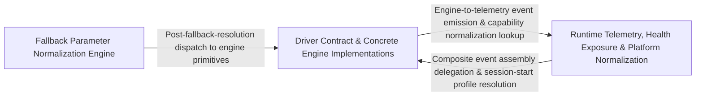

## Details

The abstract contract layer that engines must implement (DriverInterface), together with event SDK, health-check exposure, and fallback-parameter normalization logic that drives the XPath→text→OCR→image escalation ladder.

### Driver Contract & Concrete Engine Implementations [[Expand]](./Driver_Contract_Concrete_Engine_Implementations.md)
The abstract DriverInterface contract that mandates the full set of UI-interaction primitives (press, swipe, text entry, app lifecycle, script execution) that every engine must implement, paired with the concrete driver classes (Appium, Selenium, BLE) that realize this contract for their respective automation backends.

**Related Classes/Methods**:

- `optics_framework.common.driver_interface.DriverInterface`:4-280
- `optics_framework.common.eventSDK.EventSDK`:13-322

**Source Files:**

- `optics_framework/common/driver_interface.py`
  - `optics_framework.common.driver_interface.DriverInterface` (L4-L280) - Class
  - `optics_framework.common.driver_interface.DriverInterface.launch_app` (L13-L28) - Method
  - `optics_framework.common.driver_interface.DriverInterface.launch_other_app` (L31-L41) - Method
  - `optics_framework.common.driver_interface.DriverInterface.get_app_version` (L44-L51) - Method
  - `optics_framework.common.driver_interface.DriverInterface.press_coordinates` (L54-L65) - Method
  - `optics_framework.common.driver_interface.DriverInterface.press_element` (L68-L77) - Method
  - `optics_framework.common.driver_interface.DriverInterface.press_percentage_coordinates` (L80-L91) - Method
  - `optics_framework.common.driver_interface.DriverInterface.enter_text` (L94-L104) - Method
  - `optics_framework.common.driver_interface.DriverInterface.press_keycode` (L107-L116) - Method
  - `optics_framework.common.driver_interface.DriverInterface.enter_text_element` (L119-L129) - Method
  - `optics_framework.common.driver_interface.DriverInterface.enter_text_using_keyboard` (L132-L141) - Method
  - `optics_framework.common.driver_interface.DriverInterface.clear_text` (L144-L153) - Method
  - `optics_framework.common.driver_interface.DriverInterface.clear_text_element` (L156-L165) - Method
  - `optics_framework.common.driver_interface.DriverInterface.swipe` (L168-L180) - Method
  - `optics_framework.common.driver_interface.DriverInterface.swipe_percentage` (L183-L195) - Method
  - `optics_framework.common.driver_interface.DriverInterface.swipe_element` (L198-L209) - Method
  - `optics_framework.common.driver_interface.DriverInterface.scroll` (L212-L222) - Method
  - `optics_framework.common.driver_interface.DriverInterface.get_text_element` (L225-L232) - Method
  - `optics_framework.common.driver_interface.DriverInterface.force_terminate_app` (L235-L244) - Method
  - `optics_framework.common.driver_interface.DriverInterface.terminate` (L247-L253) - Method
  - `optics_framework.common.driver_interface.DriverInterface.get_driver_session_id` (L256-L264) - Method
  - `optics_framework.common.driver_interface.DriverInterface.execute_script` (L267-L280) - Method
- `optics_framework/common/eventSDK.py`
  - `optics_framework.common.eventSDK.EventSDK` (L13-L322) - Class
  - `optics_framework.common.eventSDK.EventSDK.__init__` (L14-L19) - Method
  - `optics_framework.common.eventSDK.EventSDK._load_event_attributes_json` (L21-L32) - Method
  - `optics_framework.common.eventSDK.EventSDK.check_file_availability` (L45-L50) - Method
  - `optics_framework.common.eventSDK.EventSDK.get_json_attribute` (L52-L65) - Method
  - `optics_framework.common.eventSDK.EventSDK.get_event_attributes` (L67-L79) - Method
  - `optics_framework.common.eventSDK.EventSDK.set_event_name` (L81-L82) - Method
  - `optics_framework.common.eventSDK.EventSDK.form_event_name` (L84-L89) - Method
  - `optics_framework.common.eventSDK.EventSDK.form_event_attributes` (L91-L99) - Method
  - `optics_framework.common.eventSDK.EventSDK.submit_single_event` (L101-L109) - Method
  - `optics_framework.common.eventSDK.EventSDK.event_sdk_initializer` (L111-L115) - Method
  - `optics_framework.common.eventSDK.EventSDK.send_real_time_events` (L117-L123) - Method
  - `optics_framework.common.eventSDK.EventSDK.send_events_after_execution` (L125-L132) - Method
  - `optics_framework.common.eventSDK.EventSDK.send_batch_events` (L134-L168) - Method
  - `optics_framework.common.eventSDK.EventSDK.add_to_array` (L170-L175) - Method
  - `optics_framework.common.eventSDK.EventSDK.convert_to_json` (L177-L182) - Method
  - `optics_framework.common.eventSDK.EventSDK.create_events_dictionary` (L184-L185) - Method
  - `optics_framework.common.eventSDK.EventSDK.nested_dictionary` (L187-L188) - Method
  - `optics_framework.common.eventSDK.EventSDK.user_event_attributes` (L190-L199) - Method
  - `optics_framework.common.eventSDK.EventSDK.mozark_event_attributes` (L201-L202) - Method
  - `optics_framework.common.eventSDK.EventSDK.merge_dictionaries` (L204-L205) - Method
  - `optics_framework.common.eventSDK.EventSDK.merge_nested_dictionaries` (L207-L215) - Method
  - `optics_framework.common.eventSDK.EventSDK.print_event` (L217-L223) - Method
  - `optics_framework.common.eventSDK.EventSDK.capture_event` (L225-L253) - Method
  - `optics_framework.common.eventSDK.EventSDK.send_all_events` (L286-L313) - Method
  - `optics_framework.common.eventSDK.EventSDK.get_test_case_name` (L315-L316) - Method
  - `optics_framework.common.eventSDK.EventSDK.get_application_name` (L318-L319) - Method
  - `optics_framework.common.eventSDK.EventSDK.get_app_version` (L321-L322) - Method
- `optics_framework/engines/drivers/appium.py`
  - `optics_framework.engines.drivers.appium.Appium.force_terminate_app` (L498-L517) - Method
  - `optics_framework.engines.drivers.appium.Appium.terminate` (L519-L531) - Method
  - `optics_framework.engines.drivers.appium.Appium.clear_text_element` (L987-L991) - Method
- `optics_framework/engines/drivers/ble.py`
  - `optics_framework.engines.drivers.ble.CapabilitiesConfig` (L15-L35) - Class
  - `optics_framework.engines.drivers.ble.CapabilitiesConfig.Config` (L34-L35) - Class
  - `optics_framework.engines.drivers.ble.BLEDriver` (L38-L787) - Class
  - `optics_framework.engines.drivers.ble.BLEDriver.get_port_by_name` (L134-L144) - Method
  - `optics_framework.engines.drivers.ble.BLEDriver.__init__` (L146-L199) - Method
  - `optics_framework.engines.drivers.ble.BLEDriver._send_mouse_reset` (L201-L203) - Method
  - `optics_framework.engines.drivers.ble.BLEDriver._send_mouse_press` (L205-L207) - Method
  - `optics_framework.engines.drivers.ble.BLEDriver._send_mouse_release` (L209-L211) - Method
  - `optics_framework.engines.drivers.ble.BLEDriver.send_mouse_command` (L213-L224) - Method
  - `optics_framework.engines.drivers.ble.BLEDriver.get_driver_session_id` (L226-L228) - Method
  - `optics_framework.engines.drivers.ble.BLEDriver.execute_script` (L230-L245) - Method
  - `optics_framework.engines.drivers.ble.BLEDriver.translate_coordinates_relative` (L247-L281) - Method
  - `optics_framework.engines.drivers.ble.BLEDriver.mouse_reset_position` (L283-L295) - Method
  - `optics_framework.engines.drivers.ble.BLEDriver.mouse_tap` (L297-L303) - Method
  - `optics_framework.engines.drivers.ble.BLEDriver.mouse_double_tap` (L305-L310) - Method
  - `optics_framework.engines.drivers.ble.BLEDriver.convert_pixel_to_mickeys` (L312-L326) - Method
  - `optics_framework.engines.drivers.ble.BLEDriver.translate_coordinates_relative_pixel` (L328-L340) - Method
  - `optics_framework.engines.drivers.ble.BLEDriver.move_tap` (L342-L362) - Method
  - `optics_framework.engines.drivers.ble.BLEDriver.swipe_ble` (L364-L402) - Method
  - `optics_framework.engines.drivers.ble.BLEDriver.swipe_ble.drag` (L374-L385) - Function
  - `optics_framework.engines.drivers.ble.BLEDriver.press_coordinates` (L404-L418) - Method
  - `optics_framework.engines.drivers.ble.BLEDriver.send_keyboard_command` (L456-L464) - Method
  - `optics_framework.engines.drivers.ble.BLEDriver.keyboard` (L466-L503) - Method
  - `optics_framework.engines.drivers.ble.BLEDriver.launch_app` (L505-L517) - Method
  - `optics_framework.engines.drivers.ble.BLEDriver.launch_other_app` (L519-L520) - Method
  - `optics_framework.engines.drivers.ble.BLEDriver.get_app_version` (L522-L523) - Method
  - `optics_framework.engines.drivers.ble.BLEDriver.press_element` (L525-L528) - Method
  - `optics_framework.engines.drivers.ble.BLEDriver.press_percentage_coordinates` (L530-L562) - Method
  - `optics_framework.engines.drivers.ble.BLEDriver.enter_text` (L564-L576) - Method
  - `optics_framework.engines.drivers.ble.BLEDriver.press_keycode` (L578-L590) - Method
  - `optics_framework.engines.drivers.ble.BLEDriver.enter_text_element` (L592-L595) - Method
  - `optics_framework.engines.drivers.ble.BLEDriver.enter_text_using_keyboard` (L597-L625) - Method
  - `optics_framework.engines.drivers.ble.BLEDriver.clear_text` (L627-L638) - Method
  - `optics_framework.engines.drivers.ble.BLEDriver.clear_text_element` (L640-L645) - Method
  - `optics_framework.engines.drivers.ble.BLEDriver.swipe` (L647-L675) - Method
  - `optics_framework.engines.drivers.ble.BLEDriver.swipe_percentage` (L677-L708) - Method
  - `optics_framework.engines.drivers.ble.BLEDriver.swipe_element` (L710-L711) - Method
  - `optics_framework.engines.drivers.ble.BLEDriver.scroll` (L713-L742) - Method
  - `optics_framework.engines.drivers.ble.BLEDriver.get_text_element` (L746-L749) - Method
  - `optics_framework.engines.drivers.ble.BLEDriver.force_terminate_app` (L751-L769) - Method
  - `optics_framework.engines.drivers.ble.BLEDriver.terminate` (L771-L787) - Method
- `optics_framework/engines/drivers/selenium.py`
  - `optics_framework.engines.drivers.selenium.SeleniumDriver` (L13-L406) - Class
  - `optics_framework.engines.drivers.selenium.SeleniumDriver.__init__` (L19-L39) - Method
  - `optics_framework.engines.drivers.selenium.SeleniumDriver.start_session` (L41-L78) - Method
  - `optics_framework.engines.drivers.selenium.SeleniumDriver._get_browser_name` (L80-L86) - Method
  - `optics_framework.engines.drivers.selenium.SeleniumDriver._get_browser_options` (L88-L106) - Method
  - `optics_framework.engines.drivers.selenium.SeleniumDriver._update_browser_url` (L108-L111) - Method
  - `optics_framework.engines.drivers.selenium.SeleniumDriver._merge_capabilities` (L113-L114) - Method
  - `optics_framework.engines.drivers.selenium.SeleniumDriver._set_options_capabilities` (L116-L118) - Method
  - `optics_framework.engines.drivers.selenium.SeleniumDriver.terminate` (L120-L134) - Method
  - `optics_framework.engines.drivers.selenium.SeleniumDriver.force_terminate_app` (L136-L154) - Method
  - `optics_framework.engines.drivers.selenium.SeleniumDriver.launch_app` (L156-L179) - Method
  - `optics_framework.engines.drivers.selenium.SeleniumDriver.launch_other_app` (L181-L193) - Method
  - `optics_framework.engines.drivers.selenium.SeleniumDriver.get_app_version` (L219-L220) - Method
  - `optics_framework.engines.drivers.selenium.SeleniumDriver.press_coordinates` (L222-L236) - Method
  - `optics_framework.engines.drivers.selenium.SeleniumDriver.press_percentage_coordinates` (L238-L247) - Method
  - `optics_framework.engines.drivers.selenium.SeleniumDriver.press_keycode` (L288-L290) - Method
  - `optics_framework.engines.drivers.selenium.SeleniumDriver.clear_text` (L314-L324) - Method
  - `optics_framework.engines.drivers.selenium.SeleniumDriver.clear_text_element` (L327-L335) - Method
  - `optics_framework.engines.drivers.selenium.SeleniumDriver.swipe` (L338-L339) - Method
  - `optics_framework.engines.drivers.selenium.SeleniumDriver.swipe_percentage` (L341-L342) - Method
  - `optics_framework.engines.drivers.selenium.SeleniumDriver.swipe_element` (L344-L345) - Method
  - `optics_framework.engines.drivers.selenium.SeleniumDriver.scroll` (L347-L362) - Method
  - `optics_framework.engines.drivers.selenium.SeleniumDriver.get_text_element` (L364-L371) - Method
  - `optics_framework.engines.drivers.selenium.SeleniumDriver._raise_action_not_supported` (L373-L375) - Method
  - `optics_framework.engines.drivers.selenium.SeleniumDriver.get_driver_session_id` (L377-L379) - Method
  - `optics_framework.engines.drivers.selenium.SeleniumDriver.execute_script` (L381-L406) - Method

### Runtime Telemetry, Health Exposure & Platform Normalization
The runtime support layer that lets drivers emit timestamped user/action events, exposes a REST health-check endpoint reporting subsystem liveness/version, and normalizes platform-specific driver capabilities (Android/iOS/Tizen/webOS) so the Appium engine can operate uniformly across device families.

**Related Classes/Methods**:

- `optics_framework.common.expose_api.health_check`:397-402
- `optics_framework.common.eventSDK.EventSDK.capture_event_with_time_input`:255-284
- `optics_framework.engines.drivers.appium_platforms.PlatformProfile`:49-74
- `optics_framework.engines.drivers.appium_platforms.get_profile`:89-90
- `optics_framework.common.utils.strip_sensitive_prefix`:595-598

**Source Files:**

- `optics_framework/common/eventSDK.py`
  - `optics_framework.common.eventSDK.EventSDK.get_current_time_for_events` (L34-L43) - Method
  - `optics_framework.common.eventSDK.EventSDK.capture_event_with_time_input` (L255-L284) - Method
- `optics_framework/common/expose_api.py`
  - `optics_framework.common.expose_api.HealthCheckResponse` (L191-L193) - Class
  - `optics_framework.common.expose_api.health_check` (L397-L402) - Function
- `optics_framework/common/utils.py`
  - `optics_framework.common.utils.strip_sensitive_prefix` (L595-L598) - Function
- `optics_framework/engines/drivers/appium.py`
  - `optics_framework.engines.drivers.appium.Appium` (L32-L1343) - Class
  - `optics_framework.engines.drivers.appium.Appium.__init__` (L91-L112) - Method
  - `optics_framework.engines.drivers.appium.Appium._require_driver` (L114-L119) - Method
  - `optics_framework.engines.drivers.appium.Appium._active_platform` (L121-L137) - Method
  - `optics_framework.engines.drivers.appium.Appium._require_profile` (L139-L147) - Method
  - `optics_framework.engines.drivers.appium.Appium._cleanup_existing_driver` (L149-L161) - Method
  - `optics_framework.engines.drivers.appium.Appium._apply_app_identifier_caps` (L163-L182) - Method
  - `optics_framework.engines.drivers.appium.Appium._try_attach_or_clear_session_caps` (L184-L210) - Method
  - `optics_framework.engines.drivers.appium.Appium._create_new_driver_session` (L212-L240) - Method
  - `optics_framework.engines.drivers.appium.Appium.start_session` (L242-L269) - Method
  - `optics_framework.engines.drivers.appium.Appium.get_session_id` (L271-L276) - Method
  - `optics_framework.engines.drivers.appium.Appium.get_driver_session_id` (L278-L280) - Method
  - `optics_framework.engines.drivers.appium.Appium._normalize_args` (L282-L295) - Method
  - `optics_framework.engines.drivers.appium.Appium._execute_script_with_args` (L297-L310) - Method
  - `optics_framework.engines.drivers.appium.Appium._handle_script_execution_error` (L312-L335) - Method
  - `optics_framework.engines.drivers.appium.Appium.execute_script` (L337-L366) - Method
  - `optics_framework.engines.drivers.appium.Appium._get_options_for_attach` (L368-L374) - Method
  - `optics_framework.engines.drivers.appium.Appium._populate_attached_driver_capabilities` (L376-L389) - Method
  - `optics_framework.engines.drivers.appium.Appium.attach_to_session` (L391-L470) - Method
  - `optics_framework.engines.drivers.appium.Appium.attach_to_session.SessionAttachmentWebDriver` (L421-L444) - Class
  - `optics_framework.engines.drivers.appium.Appium.attach_to_session.SessionAttachmentWebDriver.__init__` (L422-L434) - Method
  - `optics_framework.engines.drivers.appium.Appium.attach_to_session.SessionAttachmentWebDriver.execute` (L436-L444) - Method
  - `optics_framework.engines.drivers.appium.Appium._get_platform_and_options` (L473-L496) - Method
  - `optics_framework.engines.drivers.appium.Appium.get_app_version` (L533-L551) - Method
  - `optics_framework.engines.drivers.appium.Appium._get_android_device_serial` (L553-L564) - Method
  - `optics_framework.engines.drivers.appium.Appium._get_ios_device_udid` (L566-L575) - Method
  - `optics_framework.engines.drivers.appium.Appium._get_android_app_version` (L577-L625) - Method
  - `optics_framework.engines.drivers.appium.Appium._get_ios_app_version` (L627-L678) - Method
  - `optics_framework.engines.drivers.appium.Appium.initialise_setup` (L680-L683) - Method
  - `optics_framework.engines.drivers.appium.Appium.launch_app` (L685-L701) - Method
  - `optics_framework.engines.drivers.appium.Appium.launch_other_app` (L703-L739) - Method
  - `optics_framework.engines.drivers.appium.Appium.get_driver` (L742-L744) - Method
  - `optics_framework.engines.drivers.appium.Appium.click_element` (L748-L759) - Method
  - `optics_framework.engines.drivers.appium.Appium.tap_at_coordinates` (L762-L774) - Method
  - `optics_framework.engines.drivers.appium.Appium.swipe` (L777-L842) - Method
  - `optics_framework.engines.drivers.appium.Appium.swipe_percentage` (L846-L868) - Method
  - `optics_framework.engines.drivers.appium.Appium.swipe_element` (L871-L926) - Method
  - `optics_framework.engines.drivers.appium.Appium.scroll` (L929-L962) - Method
  - `optics_framework.engines.drivers.appium.Appium.enter_text_element` (L965-L984) - Method
  - `optics_framework.engines.drivers.appium.Appium.enter_text` (L994-L1015) - Method
  - `optics_framework.engines.drivers.appium.Appium.clear_text` (L1018-L1023) - Method
  - `optics_framework.engines.drivers.appium.Appium.press_keycode` (L1025-L1037) - Method
  - `optics_framework.engines.drivers.appium.Appium._handle_special_key_keyboard_input` (L1039-L1051) - Method
  - `optics_framework.engines.drivers.appium.Appium._handle_string_keyboard_input` (L1053-L1064) - Method
  - `optics_framework.engines.drivers.appium.Appium._flush_keyboard_buffer` (L1066-L1075) - Method
  - `optics_framework.engines.drivers.appium.Appium._press_keycode_or_type_char` (L1077-L1090) - Method
  - `optics_framework.engines.drivers.appium.Appium.enter_text_using_keyboard` (L1093-L1108) - Method
  - `optics_framework.engines.drivers.appium.Appium.get_char_as_keycode` (L1110-L1154) - Method
  - `optics_framework.engines.drivers.appium.Appium.get_text_element` (L1157-L1167) - Method
  - `optics_framework.engines.drivers.appium.Appium.pixel_2_appium` (L1170-L1183) - Method
  - `optics_framework.engines.drivers.appium.Appium.press_element` (L1188-L1198) - Method
  - `optics_framework.engines.drivers.appium.Appium.press_coordinates` (L1201-L1213) - Method
  - `optics_framework.engines.drivers.appium.Appium.press_percentage_coordinates` (L1216-L1232) - Method
  - `optics_framework.engines.drivers.appium.Appium.press_xpath_using_coordinates` (L1235-L1255) - Method
  - `optics_framework.engines.drivers.appium.Appium._is_deeplink` (L1270-L1271) - Method
  - `optics_framework.engines.drivers.appium.Appium._open_deeplink` (L1273-L1303) - Method
  - `optics_framework.engines.drivers.appium.Appium._open_android_deeplink` (L1305-L1326) - Method
  - `optics_framework.engines.drivers.appium.Appium._open_ios_deeplink` (L1328-L1343) - Method
- `optics_framework/engines/drivers/appium_platforms.py`
  - `optics_framework.engines.drivers.appium_platforms.PlatformProfile` (L49-L74) - Class
  - `optics_framework.engines.drivers.appium_platforms.PlatformProfile.resolve_rc_key` (L63-L74) - Method
  - `optics_framework.engines.drivers.appium_platforms.register_profile` (L80-L82) - Function
  - `optics_framework.engines.drivers.appium_platforms.normalize_platform` (L85-L86) - Function
  - `optics_framework.engines.drivers.appium_platforms.get_profile` (L89-L90) - Function
  - `optics_framework.engines.drivers.appium_platforms.supported_platforms` (L93-L94) - Function
  - `optics_framework.engines.drivers.appium_platforms.supported_on` (L98-L118) - Function
- `optics_framework/engines/drivers/selenium.py`
  - `optics_framework.engines.drivers.selenium.SeleniumDriver.press_element` (L195-L215) - Method
  - `optics_framework.engines.drivers.selenium.SeleniumDriver.enter_text` (L250-L269) - Method
  - `optics_framework.engines.drivers.selenium.SeleniumDriver.enter_text_element` (L271-L286) - Method
  - `optics_framework.engines.drivers.selenium.SeleniumDriver.enter_text_using_keyboard` (L292-L312) - Method

### Fallback Parameter Normalization Engine
The decorator-driven mechanism that inspects a keyword method's signature, extracts which parameters support fallback values (e.g., element locators), normalizes them into ordered candidate lists, and sequentially retries the wrapped call across all combinations — implementing the core XPath→Text→OCR→Image escalation logic at the call-site level.

**Related Classes/Methods**:

- `optics_framework.optics._extract_fallback_keys`:76-82
- `optics_framework.optics._normalize_fallback_values`:85-96
- `optics_framework.optics.fallback_params.wrapper`:101-141

**Source Files:**

- `optics_framework/optics.py`
  - `optics_framework.optics._extract_fallback_keys` (L76-L82) - Function
  - `optics_framework.optics._normalize_fallback_values` (L85-L96) - Function
  - `optics_framework.optics.fallback_params.wrapper` (L101-L141) - Function

### [FAQ](https://github.com/CodeBoarding/GeneratedOnBoardings/tree/main?tab=readme-ov-file#faq)