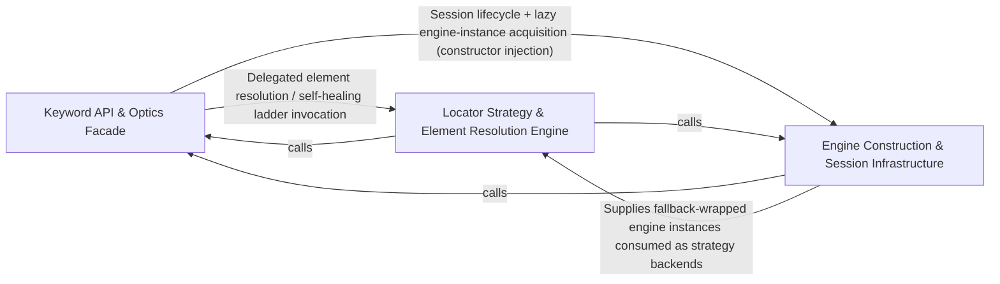

## Details

The primary keyword-driven API surface that test authors call — the Optics top-level facade plus ActionKeyword, AppManagement, and Verifier keyword implementations that perform UI actions, app lifecycle control, and assertions.

### Keyword API & Optics Facade [[Expand]](./Keyword_API_Optics_Facade.md)
The top-level facade and keyword implementation layer that test flows and interfaces call directly. Exposes Optics as the single entry point wiring together action, verification, and app-management keyword sets, while ActionKeyword, AppManagement, and Verifier implement concrete keyword-driven operations (tap/swipe/type, app launch/terminate, assertions/waits) that test authors invoke, including AI-based self-healing fallback for element location.

**Related Classes/Methods**:

- `optics_framework.optics.Optics`:147-1307
- `optics_framework.api.action_keyword.ActionKeyword`:182-1178
- `optics_framework.api.app_management.AppManagement`:7-96
- `optics_framework.api.verifier.Verifier`:11-369

**Source Files:**

- `optics_framework/api/action_keyword.py`
  - `optics_framework.api.action_keyword._parse_aoi_param` (L37-L40) - Function
  - `optics_framework.api.action_keyword._maybe_save_aoi_screenshot` (L43-L50) - Function
  - `optics_framework.api.action_keyword._bounds_area` (L102-L113) - Function
  - `optics_framework.api.action_keyword._find_dropdown_container` (L116-L135) - Function
  - `optics_framework.api.action_keyword._raise_option_not_found` (L138-L151) - Function
  - `optics_framework.api.action_keyword._HealProviders` (L154-L179) - Class
  - `optics_framework.api.action_keyword._HealProviders.__init__` (L161-L163) - Method
  - `optics_framework.api.action_keyword._HealProviders.screenshot` (L165-L172) - Method
  - `optics_framework.api.action_keyword._HealProviders.pagesource` (L174-L179) - Method
  - `optics_framework.api.action_keyword.ActionKeyword` (L182-L1178) - Class
  - `optics_framework.api.action_keyword.ActionKeyword.__init__` (L192-L228) - Method
  - `optics_framework.api.action_keyword.ActionKeyword._record_successful_step` (L230-L231) - Method
  - `optics_framework.api.action_keyword.ActionKeyword._ai_self_heal` (L233-L269) - Method
  - `optics_framework.api.action_keyword.ActionKeyword._ai_self_heal_ready` (L271-L275) - Method
  - `optics_framework.api.action_keyword.ActionKeyword._log_heal_outcome` (L277-L309) - Method
  - `optics_framework.api.action_keyword.ActionKeyword._render_heal_step` (L312-L314) - Method
  - `optics_framework.api.action_keyword.ActionKeyword._pop_last_heal_info` (L316-L323) - Method
  - `optics_framework.api.action_keyword.ActionKeyword._heal_execute` (L327-L360) - Method
  - `optics_framework.api.action_keyword.ActionKeyword._heal_catalog` (L362-L367) - Method
  - `optics_framework.api.action_keyword.ActionKeyword._heal_keyword_signature` (L370-L387) - Method
  - `optics_framework.api.action_keyword.ActionKeyword._capture_screenshot_safe` (L389-L395) - Method
  - `optics_framework.api.action_keyword.ActionKeyword._save_screenshot_if_available` (L397-L400) - Method
  - `optics_framework.api.action_keyword.ActionKeyword._locate_and_act` (L402-L440) - Method
  - `optics_framework.api.action_keyword.ActionKeyword._act_until_success` (L442-L496) - Method
  - `optics_framework.api.action_keyword.ActionKeyword.press_element` (L499-L531) - Method
  - `optics_framework.api.action_keyword.ActionKeyword.press_element.act` (L517-L526) - Function
  - `optics_framework.api.action_keyword.ActionKeyword.press_by_percentage` (L533-L546) - Method
  - `optics_framework.api.action_keyword.ActionKeyword.press_by_coordinates` (L548-L560) - Method
  - `optics_framework.api.action_keyword.ActionKeyword.detect_and_press` (L563-L581) - Method
  - `optics_framework.api.action_keyword.ActionKeyword.press_checkbox` (L583-L600) - Method
  - `optics_framework.api.action_keyword.ActionKeyword.press_radio_button` (L602-L619) - Method
  - `optics_framework.api.action_keyword.ActionKeyword.select_dropdown_option` (L621-L667) - Method
  - `optics_framework.api.action_keyword.ActionKeyword._find_option_element` (L669-L682) - Method
  - `optics_framework.api.action_keyword.ActionKeyword._safe_get_interactive_elements` (L684-L694) - Method
  - `optics_framework.api.action_keyword.ActionKeyword._safe_pagesource_hash` (L696-L707) - Method
  - `optics_framework.api.action_keyword.ActionKeyword._scroll_dropdown_until_found` (L709-L748) - Method
  - `optics_framework.api.action_keyword.ActionKeyword.swipe` (L751-L764) - Method
  - `optics_framework.api.action_keyword.ActionKeyword.swipe_by_percentage` (L766-L779) - Method
  - `optics_framework.api.action_keyword.ActionKeyword.swipe_seekbar_to_right_android` (L781-L795) - Method
  - `optics_framework.api.action_keyword.ActionKeyword.swipe_until_element_appears` (L797-L823) - Method
  - `optics_framework.api.action_keyword.ActionKeyword.swipe_from_element` (L825-L854) - Method
  - `optics_framework.api.action_keyword.ActionKeyword.swipe_from_element.act` (L841-L849) - Function
  - `optics_framework.api.action_keyword.ActionKeyword.scroll` (L856-L866) - Method
  - `optics_framework.api.action_keyword.ActionKeyword.scroll_until_element_appears` (L868-L897) - Method
  - `optics_framework.api.action_keyword.ActionKeyword.scroll_from_element` (L899-L928) - Method
  - `optics_framework.api.action_keyword.ActionKeyword.scroll_from_element.act` (L915-L923) - Function
  - `optics_framework.api.action_keyword.ActionKeyword.enter_text` (L931-L962) - Method
  - `optics_framework.api.action_keyword.ActionKeyword.enter_text.act` (L949-L957) - Function
  - `optics_framework.api.action_keyword.ActionKeyword.enter_text_direct` (L964-L977) - Method
  - `optics_framework.api.action_keyword.ActionKeyword.enter_text_using_keyboard` (L979-L999) - Method
  - `optics_framework.api.action_keyword.ActionKeyword.enter_number` (L1001-L1028) - Method
  - `optics_framework.api.action_keyword.ActionKeyword.enter_number.act` (L1015-L1023) - Function
  - `optics_framework.api.action_keyword.ActionKeyword.press_keycode` (L1030-L1044) - Method
  - `optics_framework.api.action_keyword.ActionKeyword.clear_element_text` (L1047-L1074) - Method
  - `optics_framework.api.action_keyword.ActionKeyword.clear_element_text.act` (L1060-L1069) - Function
  - `optics_framework.api.action_keyword.ActionKeyword.get_text` (L1076-L1101) - Method
  - `optics_framework.api.action_keyword.ActionKeyword.get_text.act` (L1089-L1096) - Function
  - `optics_framework.api.action_keyword.ActionKeyword.sleep` (L1103-L1109) - Method
  - `optics_framework.api.action_keyword.ActionKeyword._parse_script_and_args` (L1111-L1146) - Method
  - `optics_framework.api.action_keyword.ActionKeyword.execute_script` (L1148-L1178) - Method
- `optics_framework/api/app_management.py`
  - `optics_framework.api.app_management.AppManagement` (L7-L96) - Class
  - `optics_framework.api.app_management.AppManagement.initialise_setup` (L25-L35) - Method
  - `optics_framework.api.app_management.AppManagement.launch_app` (L37-L47) - Method
  - `optics_framework.api.app_management.AppManagement.start_appium_session` (L49-L55) - Method
  - `optics_framework.api.app_management.AppManagement.get_driver_session_id` (L57-L59) - Method
  - `optics_framework.api.app_management.AppManagement.launch_other_app` (L61-L68) - Method
  - `optics_framework.api.app_management.AppManagement.close_and_terminate_app` (L70-L79) - Method
  - `optics_framework.api.app_management.AppManagement.force_terminate_app` (L81-L88) - Method
  - `optics_framework.api.app_management.AppManagement.get_app_version` (L90-L96) - Method
- `optics_framework/api/verifier.py`
  - `optics_framework.api.verifier.Verifier` (L11-L369) - Class
  - `optics_framework.api.verifier.Verifier.validate_element` (L29-L46) - Method
  - `optics_framework.api.verifier.Verifier.is_element` (L48-L103) - Method
  - `optics_framework.api.verifier.Verifier._resolve_param` (L105-L107) - Method
  - `optics_framework.api.verifier.Verifier.assert_equality` (L109-L124) - Method
  - `optics_framework.api.verifier.Verifier.assert_presence` (L127-L137) - Method
  - `optics_framework.api.verifier.Verifier.assert_visibility` (L139-L151) - Method
  - `optics_framework.api.verifier.Verifier._assert_common` (L153-L170) - Method
  - `optics_framework.api.verifier.Verifier._group_elements_by_type` (L172-L178) - Method
  - `optics_framework.api.verifier.Verifier._process_element_groups` (L180-L196) - Method
  - `optics_framework.api.verifier.Verifier._save_annotated_screenshot` (L198-L205) - Method
  - `optics_framework.api.verifier.Verifier._evaluate_rule` (L207-L209) - Method
  - `optics_framework.api.verifier.Verifier._handle_result` (L211-L217) - Method
  - `optics_framework.api.verifier.Verifier._capture_success_event` (L219-L223) - Method
  - `optics_framework.api.verifier.Verifier.validate_screen` (L226-L245) - Method
  - `optics_framework.api.verifier.Verifier.capture_screenshot` (L247-L265) - Method
  - `optics_framework.api.verifier.Verifier.capture_pagesource` (L268-L284) - Method
  - `optics_framework.api.verifier.Verifier._safe_capture_screenshot_np` (L286-L296) - Method
  - `optics_framework.api.verifier.Verifier._bounds_need_screenshot` (L298-L306) - Method
  - `optics_framework.api.verifier.Verifier._collect_interactive_elements` (L308-L329) - Method
  - `optics_framework.api.verifier.Verifier.get_interactive_elements` (L331-L346) - Method
  - `optics_framework.api.verifier.Verifier.get_screen_elements` (L348-L369) - Method
- `optics_framework/common/ai_self_heal.py`
  - `optics_framework.common.ai_self_heal.KeywordExecResult` (L35-L44) - Class
  - `optics_framework.common.ai_self_heal.HealKeywordSpec` (L53-L56) - Class
  - `optics_framework.common.ai_self_heal.HealContext` (L72-L80) - Class
- `optics_framework/common/config_handler.py`
  - `optics_framework.common.config_handler.Config.get` (L83-L87) - Method
- `optics_framework/common/expose_api.py`
  - `optics_framework.common.expose_api.AppiumUpdateRequest` (L114-L121) - Class
  - `optics_framework.common.expose_api.TemplateUploadRequest` (L140-L144) - Class
  - `optics_framework.common.expose_api._empty_workspace_data` (L1134-L1143) - Function
  - `optics_framework.common.expose_api._capture_source_safe` (L1146-L1153) - Function
  - `optics_framework.common.expose_api._gather_workspace_data` (L1156-L1192) - Function
- `optics_framework/common/image_interface.py`
  - `optics_framework.common.image_interface.ImageInterface` (L5-L71) - Class
  - `optics_framework.common.image_interface.ImageInterface.element_exist` (L18-L35) - Method
  - `optics_framework.common.image_interface.ImageInterface.find_element` (L38-L57) - Method
  - `optics_framework.common.image_interface.ImageInterface.assert_elements` (L60-L71) - Method
- `optics_framework/common/models.py`
  - `optics_framework.common.models.TemplateData.get_template_path` (L304-L305) - Method
- `optics_framework/common/session_manager.py`
  - `optics_framework.common.session_manager.SessionTemplateResolver` (L75-L97) - Class
  - `optics_framework.common.session_manager.SessionTemplateResolver.__init__` (L82-L83) - Method
  - `optics_framework.common.session_manager.SessionTemplateResolver.get_template_path` (L85-L97) - Method
- `optics_framework/common/strategies.py`
  - `optics_framework.common.strategies.StrategyManager.capture_screenshot` (L810-L821) - Method
- `optics_framework/common/text_interface.py`
  - `optics_framework.common.text_interface.TextInterface` (L5-L68) - Class
  - `optics_framework.common.text_interface.TextInterface.element_exist` (L18-L32) - Method
  - `optics_framework.common.text_interface.TextInterface.find_element` (L35-L54) - Method
  - `optics_framework.common.text_interface.TextInterface.detect_text` (L57-L68) - Method
- `optics_framework/common/utils.py`
  - `optics_framework.common.utils.SpecialKey` (L52-L122) - Class
  - `optics_framework.common.utils.encode_numpy_to_png_bytes` (L213-L228) - Function
  - `optics_framework.common.utils.encode_numpy_to_base64` (L231-L238) - Function
  - `optics_framework.common.utils.save_screenshot` (L331-L357) - Function
  - `optics_framework.common.utils._short_class` (L407-L410) - Function
  - `optics_framework.common.utils._is_interesting` (L413-L432) - Function
  - `optics_framework.common.utils._descriptor_text` (L435-L442) - Function
  - `optics_framework.common.utils._descriptor_id` (L445-L451) - Function
  - `optics_framework.common.utils._descriptor_bounds` (L454-L462) - Function
  - `optics_framework.common.utils._descriptor` (L465-L476) - Function
  - `optics_framework.common.utils._walk` (L479-L490) - Function
  - `optics_framework.common.utils.strip_page_source` (L493-L526) - Function
  - `optics_framework.common.utils.save_interactable_elements` (L601-L615) - Function
  - `optics_framework.common.utils.parse_special_key` (L635-L652) - Function
  - `optics_framework.common.utils.scale_interactive_element_bounds` (L1073-L1120) - Function
- `optics_framework/engines/vision_models/base_methods.py`
  - `optics_framework.engines.vision_models.base_methods.load_template` (L6-L31) - Function
- `optics_framework/engines/vision_models/image_models/remote_oir.py`
  - `optics_framework.engines.vision_models.image_models.remote_oir.RemoteImageDetection` (L12-L253) - Class
  - `optics_framework.engines.vision_models.image_models.remote_oir.RemoteImageDetection.__init__` (L16-L29) - Method
  - `optics_framework.engines.vision_models.image_models.remote_oir.RemoteImageDetection.detect_images` (L31-L81) - Method
  - `optics_framework.engines.vision_models.image_models.remote_oir.RemoteImageDetection.find_element` (L83-L151) - Method
  - `optics_framework.engines.vision_models.image_models.remote_oir.RemoteImageDetection.element_exist` (L153-L165) - Method
  - `optics_framework.engines.vision_models.image_models.remote_oir.RemoteImageDetection.locate` (L167-L180) - Method
  - `optics_framework.engines.vision_models.image_models.remote_oir.RemoteImageDetection.assert_elements` (L182-L214) - Method
  - `optics_framework.engines.vision_models.image_models.remote_oir.RemoteImageDetection._prepare_encoded_templates` (L216-L229) - Method
  - `optics_framework.engines.vision_models.image_models.remote_oir.RemoteImageDetection._detect_and_match_template` (L231-L253) - Method
- `optics_framework/engines/vision_models/image_models/templatematch.py`
  - `optics_framework.engines.vision_models.image_models.templatematch.TemplateMatchingHelper` (L9-L253) - Class
  - `optics_framework.engines.vision_models.image_models.templatematch.TemplateMatchingHelper.__init__` (L17-L28) - Method
  - `optics_framework.engines.vision_models.image_models.templatematch.TemplateMatchingHelper.find_element` (L30-L112) - Method
  - `optics_framework.engines.vision_models.image_models.templatematch.TemplateMatchingHelper.assert_elements` (L114-L152) - Method
  - `optics_framework.engines.vision_models.image_models.templatematch.TemplateMatchingHelper.element_exist` (L154-L253) - Method
- `optics_framework/engines/vision_models/ocr_models/easyocr.py`
  - `optics_framework.engines.vision_models.ocr_models.easyocr.EasyOCRHelper` (L9-L133) - Class
  - `optics_framework.engines.vision_models.ocr_models.easyocr.EasyOCRHelper.__init__` (L17-L35) - Method
  - `optics_framework.engines.vision_models.ocr_models.easyocr.EasyOCRHelper.find_element` (L37-L104) - Method
  - `optics_framework.engines.vision_models.ocr_models.easyocr.EasyOCRHelper.detect_text` (L106-L130) - Method
  - `optics_framework.engines.vision_models.ocr_models.easyocr.EasyOCRHelper.element_exist` (L132-L133) - Method
- `optics_framework/engines/vision_models/ocr_models/googlevision.py`
  - `optics_framework.engines.vision_models.ocr_models.googlevision.GoogleVisionHelper` (L8-L109) - Class
  - `optics_framework.engines.vision_models.ocr_models.googlevision.GoogleVisionHelper.__init__` (L16-L25) - Method
  - `optics_framework.engines.vision_models.ocr_models.googlevision.GoogleVisionHelper.find_element` (L27-L72) - Method
  - `optics_framework.engines.vision_models.ocr_models.googlevision.GoogleVisionHelper.element_exist` (L75-L76) - Method
  - `optics_framework.engines.vision_models.ocr_models.googlevision.GoogleVisionHelper.detect_text` (L79-L109) - Method
- `optics_framework/engines/vision_models/ocr_models/pytesseract.py`
  - `optics_framework.engines.vision_models.ocr_models.pytesseract.PytesseractHelper` (L8-L105) - Class
  - `optics_framework.engines.vision_models.ocr_models.pytesseract.PytesseractHelper.__init__` (L16-L28) - Method
  - `optics_framework.engines.vision_models.ocr_models.pytesseract.PytesseractHelper.find_element` (L32-L75) - Method
  - `optics_framework.engines.vision_models.ocr_models.pytesseract.PytesseractHelper.detect_text` (L77-L101) - Method
  - `optics_framework.engines.vision_models.ocr_models.pytesseract.PytesseractHelper.element_exist` (L103-L105) - Method
- `optics_framework/engines/vision_models/ocr_models/remote_ocr.py`
  - `optics_framework.engines.vision_models.ocr_models.remote_ocr.RemoteOCR` (L13-L221) - Class
  - `optics_framework.engines.vision_models.ocr_models.remote_ocr.RemoteOCR.__init__` (L17-L39) - Method
  - `optics_framework.engines.vision_models.ocr_models.remote_ocr.RemoteOCR.detect_text` (L41-L78) - Method
  - `optics_framework.engines.vision_models.ocr_models.remote_ocr.RemoteOCR._encode_image` (L80-L92) - Method
  - `optics_framework.engines.vision_models.ocr_models.remote_ocr.RemoteOCR._parse_ocr_results` (L94-L121) - Method
  - `optics_framework.engines.vision_models.ocr_models.remote_ocr.RemoteOCR.find_element` (L123-L149) - Method
  - `optics_framework.engines.vision_models.ocr_models.remote_ocr.RemoteOCR._decode_image_for_annotation` (L151-L164) - Method
  - `optics_framework.engines.vision_models.ocr_models.remote_ocr.RemoteOCR._find_matching_elements` (L166-L178) - Method
  - `optics_framework.engines.vision_models.ocr_models.remote_ocr.RemoteOCR._select_matching_result` (L180-L191) - Method
  - `optics_framework.engines.vision_models.ocr_models.remote_ocr.RemoteOCR._annotate_and_save` (L193-L208) - Method
  - `optics_framework.engines.vision_models.ocr_models.remote_ocr.RemoteOCR.element_exist` (L210-L221) - Method
- `optics_framework/optics.py`
  - `optics_framework.optics.keyword` (L54-L63) - Function
  - `optics_framework.optics.keyword.decorator` (L55-L60) - Function
  - `optics_framework.optics.keyword.decorator.wrapper` (L57-L58) - Function
  - `optics_framework.optics.library` (L65-L70) - Function
  - `optics_framework.optics.library.decorator` (L66-L67) - Function
  - `optics_framework.optics.fallback_params` (L99-L143) - Function
  - `optics_framework.optics.Optics` (L147-L1307) - Class
  - `optics_framework.optics.Optics.__init__` (L155-L168) - Method
  - `optics_framework.optics.Optics._parse_config_string` (L170-L185) - Method
  - `optics_framework.optics.Optics._create_dependency_config` (L187-L203) - Method
  - `optics_framework.optics.Optics._process_config_list` (L205-L221) - Method
  - `optics_framework.optics.Optics._resolve_param` (L223-L244) - Method
  - `optics_framework.optics.Optics.setup` (L247-L270) - Method
  - `optics_framework.optics.Optics._extract_config_data` (L272-L334) - Method
  - `optics_framework.optics.Optics.setup_from_file` (L396-L433) - Method
  - `optics_framework.optics.Optics._validate_required_keys` (L435-L452) - Method
  - `optics_framework.optics.Optics.add_element` (L455-L463) - Method
  - `optics_framework.optics.Optics.get_element_value` (L466-L474) - Method
  - `optics_framework.optics.Optics.add_api` (L477-L499) - Method
  - `optics_framework.optics.Optics.add_testcase` (L502-L510) - Method
  - `optics_framework.optics.Optics.add_module` (L513-L521) - Method
  - `optics_framework.optics.Optics.launch_app` (L618-L631) - Method
  - `optics_framework.optics.Optics.launch_other_app` (L635-L639) - Method
  - `optics_framework.optics.Optics.start_appium_session` (L643-L649) - Method
  - `optics_framework.optics.Optics.get_driver_session_id` (L653-L657) - Method
  - `optics_framework.optics.Optics.close_and_terminate_app` (L660-L664) - Method
  - `optics_framework.optics.Optics.force_terminate_app` (L668-L681) - Method
  - `optics_framework.optics.Optics.get_app_version` (L684-L688) - Method
  - `optics_framework.optics.Optics.press_element` (L693-L735) - Method
  - `optics_framework.optics.Optics.press_element._parse_aoi_value` (L714-L717) - Function
  - `optics_framework.optics.Optics.press_by_percentage` (L739-L754) - Method
  - `optics_framework.optics.Optics.press_by_coordinates` (L758-L773) - Method
  - `optics_framework.optics.Optics.press_element_with_index` (L777-L786) - Method
  - `optics_framework.optics.Optics.detect_and_press` (L790-L801) - Method
  - `optics_framework.optics.Optics.swipe` (L805-L822) - Method
  - `optics_framework.optics.Optics.swipe_by_percentage` (L826-L843) - Method
  - `optics_framework.optics.Optics.swipe_until_element_appears` (L847-L862) - Method
  - `optics_framework.optics.Optics.swipe_from_element` (L866-L881) - Method
  - `optics_framework.optics.Optics.scroll` (L885-L895) - Method
  - `optics_framework.optics.Optics.scroll_until_element_appears` (L899-L914) - Method
  - `optics_framework.optics.Optics.scroll_from_element` (L918-L933) - Method
  - `optics_framework.optics.Optics.enter_text` (L937-L950) - Method
  - `optics_framework.optics.Optics.enter_text_direct` (L954-L962) - Method
  - `optics_framework.optics.Optics.enter_text_using_keyboard` (L966-L974) - Method
  - `optics_framework.optics.Optics.enter_number` (L978-L991) - Method
  - `optics_framework.optics.Optics.press_keycode` (L995-L1003) - Method
  - `optics_framework.optics.Optics.clear_element_text` (L1007-L1015) - Method
  - `optics_framework.optics.Optics.get_text` (L1019-L1023) - Method
  - `optics_framework.optics.Optics.select_dropdown_option` (L1027-L1042) - Method
  - `optics_framework.optics.Optics.sleep` (L1046-L1050) - Method
  - `optics_framework.optics.Optics.execute_script` (L1054-L1075) - Method
  - `optics_framework.optics.Optics.validate_element` (L1080-L1095) - Method
  - `optics_framework.optics.Optics.assert_presence` (L1099-L1114) - Method
  - `optics_framework.optics.Optics.assert_visibility` (L1118-L1133) - Method
  - `optics_framework.optics.Optics.validate_screen` (L1137-L1152) - Method
  - `optics_framework.optics.Optics.assert_equality` (L1156-L1169) - Method
  - `optics_framework.optics.Optics.is_element` (L1173-L1188) - Method
  - `optics_framework.optics.Optics.get_interactive_elements` (L1191-L1207) - Method
  - `optics_framework.optics.Optics.capture_screenshot` (L1210-L1214) - Method
  - `optics_framework.optics.Optics.capture_pagesource` (L1217-L1221) - Method
  - `optics_framework.optics.Optics.get_screen_elements` (L1224-L1228) - Method
  - `optics_framework.optics.Optics.invoke_api` (L1232-L1236) - Method
  - `optics_framework.optics.Optics.read_data` (L1240-L1248) - Method
  - `optics_framework.optics.Optics.run_loop` (L1251-L1255) - Method
  - `optics_framework.optics.Optics.condition` (L1258-L1262) - Method
  - `optics_framework.optics.Optics.evaluate` (L1265-L1269) - Method
  - `optics_framework.optics.Optics.date_evaluate` (L1272-L1278) - Method
  - `optics_framework.optics.Optics.quit` (L1281-L1294) - Method
  - `optics_framework.optics.Optics.__enter__` (L1296-L1298) - Method
  - `optics_framework.optics.Optics.__exit__` (L1300-L1307) - Method

### Locator Strategy & Element Resolution Engine [[Expand]](./Locator_Strategy_Element_Resolution_Engine.md)
The strategy and chain-of-responsibility layer implementing the fallback locator ladder and screenshot/page-source acquisition. Resolves abstract 'find this element/screen state' requests issued by ActionKeyword into concrete UI targets by orchestrating pluggable LocatorStrategy implementations (XPath → text → image/OCR) against element sources, screenshots, and page sources, and records execution traces of resolution attempts.

**Related Classes/Methods**:

- `optics_framework.common.strategies.LocatorStrategy`:26-151
- `optics_framework.common.strategies.PagesourceStrategy`:439-470
- `optics_framework.common.elementsource_interface.ElementSourceInterface`:5-134
- `optics_framework.common.execution_tracer.ExecutionTracer`:4-32

**Source Files:**

- `optics_framework/api/action_keyword.py`
  - `optics_framework.api.action_keyword._locate_element` (L53-L62) - Function
  - `optics_framework.api.action_keyword._save_annotated_for_result` (L65-L99) - Function
- `optics_framework/common/elementsource_interface.py`
  - `optics_framework.common.elementsource_interface.ElementSourceInterface` (L5-L134) - Class
  - `optics_framework.common.elementsource_interface.ElementSourceInterface.capture` (L18-L25) - Method
  - `optics_framework.common.elementsource_interface.ElementSourceInterface.capture_screenshot_bytes` (L27-L41) - Method
  - `optics_framework.common.elementsource_interface.ElementSourceInterface.locate` (L44-L53) - Method
  - `optics_framework.common.elementsource_interface.ElementSourceInterface.assert_elements` (L56-L70) - Method
  - `optics_framework.common.elementsource_interface.ElementSourceInterface.get_element_bboxes` (L72-L81) - Method
  - `optics_framework.common.elementsource_interface.ElementSourceInterface.get_bbox_for_element` (L83-L92) - Method
  - `optics_framework.common.elementsource_interface.ElementSourceInterface.get_page_source` (L94-L104) - Method
  - `optics_framework.common.elementsource_interface.ElementSourceInterface.assert_elements_visible` (L106-L122) - Method
  - `optics_framework.common.elementsource_interface.ElementSourceInterface.get_interactive_elements` (L125-L134) - Method
- `optics_framework/common/execution_tracer.py`
  - `optics_framework.common.execution_tracer.ExecutionTracer` (L4-L32) - Class
  - `optics_framework.common.execution_tracer.ExecutionTracer.log_attempt` (L10-L32) - Method
- `optics_framework/common/screenshot_stream.py`
  - `optics_framework.common.screenshot_stream.ScreenshotStream` (L9-L247) - Class
  - `optics_framework.common.screenshot_stream.ScreenshotStream.__init__` (L10-L28) - Method
  - `optics_framework.common.screenshot_stream.ScreenshotStream.capture_stream` (L30-L61) - Method
  - `optics_framework.common.screenshot_stream.ScreenshotStream._process_frame_for_deduplication` (L63-L83) - Method
  - `optics_framework.common.screenshot_stream.ScreenshotStream.process_screenshot_queue` (L85-L112) - Method
  - `optics_framework.common.screenshot_stream.ScreenshotStream.start_capture` (L114-L133) - Method
  - `optics_framework.common.screenshot_stream.ScreenshotStream.stop_capture` (L135-L162) - Method
  - `optics_framework.common.screenshot_stream.ScreenshotStream.get_latest_screenshot` (L164-L177) - Method
  - `optics_framework.common.screenshot_stream.ScreenshotStream.get_all_available_screenshots` (L179-L197) - Method
  - `optics_framework.common.screenshot_stream.ScreenshotStream.fetch_frames_from_queue` (L200-L217) - Method
  - `optics_framework.common.screenshot_stream.ScreenshotStream.clear_queues` (L219-L235) - Method
  - `optics_framework.common.screenshot_stream.ScreenshotStream.get_queue_sizes` (L237-L247) - Method
- `optics_framework/common/strategies.py`
  - `optics_framework.common.strategies.LocateValueWithFrame` (L20-L23) - Class
  - `optics_framework.common.strategies.LocatorStrategy` (L26-L151) - Class
  - `optics_framework.common.strategies.LocatorStrategy.element_source` (L31-L32) - Method
  - `optics_framework.common.strategies.LocatorStrategy.locate` (L35-L45) - Method
  - `optics_framework.common.strategies.LocatorStrategy.assert_elements` (L48-L52) - Method
  - `optics_framework.common.strategies.LocatorStrategy.assert_elements_visible` (L54-L64) - Method
  - `optics_framework.common.strategies.LocatorStrategy.supports` (L69-L76) - Method
  - `optics_framework.common.strategies.LocatorStrategy._is_method_implemented` (L79-L113) - Method
  - `optics_framework.common.strategies.LocatorStrategy._assert_elements_locator_style` (L115-L151) - Method
  - `optics_framework.common.strategies.XPathStrategy` (L154-L180) - Class
  - `optics_framework.common.strategies.XPathStrategy.__init__` (L157-L159) - Method
  - `optics_framework.common.strategies.XPathStrategy.element_source` (L162-L163) - Method
  - `optics_framework.common.strategies.XPathStrategy.locate` (L165-L166) - Method
  - `optics_framework.common.strategies.XPathStrategy.assert_elements` (L168-L171) - Method
  - `optics_framework.common.strategies.XPathStrategy.assert_elements_visible` (L173-L176) - Method
  - `optics_framework.common.strategies.XPathStrategy.supports` (L179-L180) - Method
  - `optics_framework.common.strategies.TextElementStrategy` (L183-L210) - Class
  - `optics_framework.common.strategies.TextElementStrategy.__init__` (L186-L188) - Method
  - `optics_framework.common.strategies.TextElementStrategy.element_source` (L191-L192) - Method
  - `optics_framework.common.strategies.TextElementStrategy.locate` (L194-L195) - Method
  - `optics_framework.common.strategies.TextElementStrategy.assert_elements` (L197-L200) - Method
  - `optics_framework.common.strategies.TextElementStrategy.assert_elements_visible` (L202-L205) - Method
  - `optics_framework.common.strategies.TextElementStrategy.supports` (L208-L210) - Method
  - `optics_framework.common.strategies.TextDetectionStrategy` (L212-L330) - Class
  - `optics_framework.common.strategies.TextDetectionStrategy.__init__` (L215-L219) - Method
  - `optics_framework.common.strategies.TextDetectionStrategy.element_source` (L222-L223) - Method
  - `optics_framework.common.strategies.TextDetectionStrategy.locate` (L225-L240) - Method
  - `optics_framework.common.strategies.TextDetectionStrategy.locate_with_aoi` (L242-L290) - Method
  - `optics_framework.common.strategies.TextDetectionStrategy.assert_elements` (L292-L326) - Method
  - `optics_framework.common.strategies.TextDetectionStrategy.supports` (L329-L330) - Method
  - `optics_framework.common.strategies.ImageDetectionStrategy` (L333-L437) - Class
  - `optics_framework.common.strategies.ImageDetectionStrategy.__init__` (L336-L340) - Method
  - `optics_framework.common.strategies.ImageDetectionStrategy.element_source` (L343-L344) - Method
  - `optics_framework.common.strategies.ImageDetectionStrategy.locate` (L346-L357) - Method
  - `optics_framework.common.strategies.ImageDetectionStrategy.locate_with_aoi` (L359-L404) - Method
  - `optics_framework.common.strategies.ImageDetectionStrategy.assert_elements` (L406-L433) - Method
  - `optics_framework.common.strategies.ImageDetectionStrategy.supports` (L436-L437) - Method
  - `optics_framework.common.strategies.PagesourceStrategy` (L439-L470) - Class
  - `optics_framework.common.strategies.PagesourceStrategy.__init__` (L440-L441) - Method
  - `optics_framework.common.strategies.PagesourceStrategy.capture_pagesource` (L443-L458) - Method
  - `optics_framework.common.strategies.PagesourceStrategy.get_interactive_elements` (L460-L466) - Method
  - `optics_framework.common.strategies.PagesourceStrategy.supports` (L469-L470) - Method
  - `optics_framework.common.strategies.ScreenshotStrategy` (L473-L498) - Class
  - `optics_framework.common.strategies.ScreenshotStrategy.__init__` (L474-L475) - Method
  - `optics_framework.common.strategies.ScreenshotStrategy.capture` (L477-L488) - Method
  - `optics_framework.common.strategies.ScreenshotStrategy.capture_stream` (L490-L494) - Method
  - `optics_framework.common.strategies.ScreenshotStrategy.supports` (L497-L498) - Method
  - `optics_framework.common.strategies.StrategyFactory` (L500-L520) - Class
  - `optics_framework.common.strategies.StrategyFactory.__init__` (L502-L511) - Method
  - `optics_framework.common.strategies.StrategyFactory.create_strategies` (L513-L520) - Method
  - `optics_framework.common.strategies.PagesourceFactory` (L522-L527) - Class
  - `optics_framework.common.strategies.PagesourceFactory.__init__` (L523-L524) - Method
  - `optics_framework.common.strategies.PagesourceFactory.create_strategies` (L526-L527) - Method
  - `optics_framework.common.strategies.ScreenshotFactory` (L530-L535) - Class
  - `optics_framework.common.strategies.ScreenshotFactory.__init__` (L531-L532) - Method
  - `optics_framework.common.strategies.ScreenshotFactory.create_strategies` (L534-L535) - Method
  - `optics_framework.common.strategies.LocateResult` (L538-L550) - Class
  - `optics_framework.common.strategies.LocateResult.__init__` (L541-L550) - Method
  - `optics_framework.common.strategies.StrategyManager` (L553-L905) - Class
  - `optics_framework.common.strategies.StrategyManager.__init__` (L554-L565) - Method
  - `optics_framework.common.strategies.StrategyManager._build_locator_strategies` (L567-L571) - Method
  - `optics_framework.common.strategies.StrategyManager._build_screenshot_strategies` (L573-L577) - Method
  - `optics_framework.common.strategies.StrategyManager._build_pagesource_strategies` (L579-L583) - Method
  - `optics_framework.common.strategies.StrategyManager._validate_aoi` (L585-L599) - Method
  - `optics_framework.common.strategies.StrategyManager._within_aoi` (L601-L635) - Method
  - `optics_framework.common.strategies.StrategyManager._try_strategy_locate` (L637-L677) - Method
  - `optics_framework.common.strategies.StrategyManager.locate` (L679-L697) - Method
  - `optics_framework.common.strategies.StrategyManager._alloc_time_for_strategy` (L699-L715) - Method
  - `optics_framework.common.strategies.StrategyManager.assert_presence` (L717-L719) - Method
  - `optics_framework.common.strategies.StrategyManager.assert_visibility` (L721-L723) - Method
  - `optics_framework.common.strategies.StrategyManager._assert` (L725-L768) - Method
  - `optics_framework.common.strategies.StrategyManager._validate_rule` (L770-L774) - Method
  - `optics_framework.common.strategies.StrategyManager._can_strategy_assert_elements` (L776-L787) - Method
  - `optics_framework.common.strategies.StrategyManager._try_assert_with_strategy` (L789-L807) - Method
  - `optics_framework.common.strategies.StrategyManager.capture_screenshot_bytes` (L823-L842) - Method
  - `optics_framework.common.strategies.StrategyManager.capture_screenshot_stream` (L844-L857) - Method
  - `optics_framework.common.strategies.StrategyManager.stop_screenshot_stream` (L859-L866) - Method
  - `optics_framework.common.strategies.StrategyManager.capture_pagesource` (L868-L876) - Method
  - `optics_framework.common.strategies.StrategyManager._can_strategy_get_interactive_elements` (L879-L890) - Method
  - `optics_framework.common.strategies.StrategyManager.get_interactive_elements` (L892-L905) - Method
- `optics_framework/common/utils.py`
  - `optics_framework.common.utils.parse_text_only_prefix` (L195-L199) - Function
  - `optics_framework.common.utils.capture_base64_screenshot_bytes` (L249-L274) - Function
  - `optics_framework.common.utils.detect_change` (L281-L291) - Function
  - `optics_framework.common.utils.annotate` (L360-L376) - Function
  - `optics_framework.common.utils.is_black_screen` (L378-L382) - Function
  - `optics_framework.common.utils.annotate_element` (L384-L390) - Function
  - `optics_framework.common.utils.load_config` (L617-L633) - Function
  - `optics_framework.common.utils.calculate_aoi_bounds` (L655-L696) - Function
  - `optics_framework.common.utils.crop_screenshot_to_aoi` (L699-L725) - Function
  - `optics_framework.common.utils.adjust_coordinates_for_aoi` (L728-L753) - Function
  - `optics_framework.common.utils.annotate_aoi_region` (L756-L800) - Function
  - `optics_framework.common.utils._window_size_from_source` (L913-L942) - Function
  - `optics_framework.common.utils._pixel_scale_for_source` (L952-L1008) - Function
  - `optics_framework.common.utils._apply_scale_to_bbox` (L1011-L1033) - Function
  - `optics_framework.common.utils.scale_bboxes_for_screenshot` (L1036-L1070) - Function
- `optics_framework/engines/elementsources/appium_screenshot.py`
  - `optics_framework.engines.elementsources.appium_screenshot.AppiumScreenshot` (L10-L94) - Class
  - `optics_framework.engines.elementsources.appium_screenshot.AppiumScreenshot.__init__` (L18-L24) - Method
  - `optics_framework.engines.elementsources.appium_screenshot.AppiumScreenshot._require_driver` (L26-L38) - Method
  - `optics_framework.engines.elementsources.appium_screenshot.AppiumScreenshot.capture` (L40-L47) - Method
  - `optics_framework.engines.elementsources.appium_screenshot.AppiumScreenshot.capture_screenshot_bytes` (L49-L60) - Method
  - `optics_framework.engines.elementsources.appium_screenshot.AppiumScreenshot.get_interactive_elements` (L62-L66) - Method
  - `optics_framework.engines.elementsources.appium_screenshot.AppiumScreenshot.capture_screenshot_as_numpy` (L68-L80) - Method
  - `optics_framework.engines.elementsources.appium_screenshot.AppiumScreenshot.assert_elements` (L82-L84) - Method
  - `optics_framework.engines.elementsources.appium_screenshot.AppiumScreenshot.locate` (L87-L89) - Method
  - `optics_framework.engines.elementsources.appium_screenshot.AppiumScreenshot.locate_using_index` (L92-L94) - Method
- `optics_framework/engines/elementsources/camera_screenshot.py`
  - `optics_framework.engines.elementsources.camera_screenshot.CapabilitiesConfig` (L10-L35) - Class
  - `optics_framework.engines.elementsources.camera_screenshot.CapabilitiesConfig.Config` (L30-L31) - Class
  - `optics_framework.engines.elementsources.camera_screenshot.CapabilitiesConfig.has_camera_index_or_url` (L34-L35) - Method
  - `optics_framework.engines.elementsources.camera_screenshot.CameraScreenshot` (L38-L371) - Class
  - `optics_framework.engines.elementsources.camera_screenshot.CameraScreenshot.__init__` (L46-L102) - Method
  - `optics_framework.engines.elementsources.camera_screenshot.CameraScreenshot.capture` (L104-L142) - Method
  - `optics_framework.engines.elementsources.camera_screenshot.CameraScreenshot.__del__` (L144-L149) - Method
  - `optics_framework.engines.elementsources.camera_screenshot.CameraScreenshot.locate` (L151-L157) - Method
  - `optics_framework.engines.elementsources.camera_screenshot.CameraScreenshot.assert_elements` (L159-L165) - Method
  - `optics_framework.engines.elementsources.camera_screenshot.CameraScreenshot.get_interactive_elements` (L167-L173) - Method
  - `optics_framework.engines.elementsources.camera_screenshot.CameraScreenshot.create_tcp_connection` (L175-L199) - Method
  - `optics_framework.engines.elementsources.camera_screenshot.CameraScreenshot.take_screenshot` (L201-L288) - Method
  - `optics_framework.engines.elementsources.camera_screenshot.CameraScreenshot.deskew_image` (L290-L323) - Method
  - `optics_framework.engines.elementsources.camera_screenshot.CameraScreenshot.rotate` (L325-L355) - Method
  - `optics_framework.engines.elementsources.camera_screenshot.CameraScreenshot.take_ext_screenshot` (L357-L371) - Method
- `optics_framework/engines/elementsources/selenium_screenshot.py`
  - `optics_framework.engines.elementsources.selenium_screenshot.SeleniumScreenshot` (L9-L72) - Class
  - `optics_framework.engines.elementsources.selenium_screenshot.SeleniumScreenshot.__init__` (L14-L20) - Method
  - `optics_framework.engines.elementsources.selenium_screenshot.SeleniumScreenshot._require_driver` (L22-L26) - Method
  - `optics_framework.engines.elementsources.selenium_screenshot.SeleniumScreenshot.capture` (L28-L34) - Method
  - `optics_framework.engines.elementsources.selenium_screenshot.SeleniumScreenshot.get_interactive_elements` (L36-L38) - Method
  - `optics_framework.engines.elementsources.selenium_screenshot.SeleniumScreenshot.capture_screenshot_bytes` (L40-L50) - Method
  - `optics_framework.engines.elementsources.selenium_screenshot.SeleniumScreenshot.capture_screenshot_as_numpy` (L52-L64) - Method
  - `optics_framework.engines.elementsources.selenium_screenshot.SeleniumScreenshot.assert_elements` (L66-L68) - Method
  - `optics_framework.engines.elementsources.selenium_screenshot.SeleniumScreenshot.locate` (L70-L72) - Method
- `optics_framework/engines/vision_models/base_methods.py`
  - `optics_framework.engines.vision_models.base_methods.match_and_annotate` (L33-L65) - Function

### Engine Construction & Session Infrastructure [[Expand]](./Engine_Construction_Session_Infrastructure.md)
The builder, factory, and session layer that assembles and configures concrete engines the API and strategy layers depend on. Reads config.yaml-driven configuration to construct and bind concrete driver/element-source/vision/text/LLM engine instances per test session via factories and OpticsBuilder, manages session lifecycle state, and provides text-based error/state detection utilities consumed by the Verifier.

**Related Classes/Methods**:

- `optics_framework.common.optics_builder.OpticsBuilder`:31-201
- `optics_framework.common.session_manager.Session`:100-146
- `optics_framework.common.factories.DeviceFactory`:11-28
- `optics_framework.common.error_detection.detect_errors_in_text`:80-119

**Source Files:**

- `optics_framework/api/app_management.py`
  - `optics_framework.api.app_management.AppManagement.__init__` (L18-L21) - Method
- `optics_framework/api/verifier.py`
  - `optics_framework.api.verifier.Verifier.__init__` (L16-L27) - Method
- `optics_framework/common/base_factory.py`
  - `optics_framework.common.base_factory.GenericFactory` (L14-L204) - Class
  - `optics_framework.common.base_factory.GenericFactory.ModuleRegistry` (L15-L21) - Class
  - `optics_framework.common.base_factory.GenericFactory.ModuleRegistry.Config` (L20-L21) - Class
  - `optics_framework.common.base_factory.GenericFactory.register_package` (L26-L31) - Method
  - `optics_framework.common.base_factory.GenericFactory._load_package` (L34-L41) - Method
  - `optics_framework.common.base_factory.GenericFactory._register_submodules` (L44-L51) - Method
  - `optics_framework.common.base_factory.GenericFactory._register_subpackage` (L54-L61) - Method
  - `optics_framework.common.base_factory.GenericFactory._locate_implementation` (L64-L69) - Method
  - `optics_framework.common.base_factory.GenericFactory.create_instance_dynamic` (L72-L112) - Method
  - `optics_framework.common.base_factory.GenericFactory.create_instance` (L115-L119) - Method
  - `optics_framework.common.base_factory.GenericFactory._create_or_retrieve` (L122-L158) - Method
  - `optics_framework.common.base_factory.GenericFactory._load_module` (L161-L171) - Method
  - `optics_framework.common.base_factory.GenericFactory._extract_names` (L174-L188) - Method
  - `optics_framework.common.base_factory.GenericFactory._create_fallback` (L191-L198) - Method
  - `optics_framework.common.base_factory.GenericFactory.clear_instances` (L201-L204) - Method
  - `optics_framework.common.base_factory.InstanceFallback` (L207-L252) - Class
  - `optics_framework.common.base_factory.InstanceFallback.Config` (L212-L213) - Class
  - `optics_framework.common.base_factory.InstanceFallback.__init__` (L215-L217) - Method
  - `optics_framework.common.base_factory.InstanceFallback.active_instance` (L220-L229) - Method
  - `optics_framework.common.base_factory.InstanceFallback.__getattr__` (L231-L252) - Method
  - `optics_framework.common.base_factory.InstanceFallback.__getattr__.fallback_method` (L232-L251) - Function
- `optics_framework/common/error_detection.py`
  - `optics_framework.common.error_detection.extract_visible_text` (L35-L77) - Function
  - `optics_framework.common.error_detection.detect_errors_in_text` (L80-L119) - Function
- `optics_framework/common/factories.py`
  - `optics_framework.common.factories.DeviceFactory` (L11-L28) - Class
  - `optics_framework.common.factories.DeviceFactory.get_driver` (L15-L28) - Method
  - `optics_framework.common.factories.ElementSourceFactory` (L31-L79) - Class
  - `optics_framework.common.factories.ElementSourceFactory.get_driver` (L35-L49) - Method
  - `optics_framework.common.factories.ElementSourceFactory._load_element_source_implementation` (L52-L58) - Method
  - `optics_framework.common.factories.ElementSourceFactory._find_matching_driver` (L61-L71) - Method
  - `optics_framework.common.factories.ElementSourceFactory._build_driver_kwargs` (L74-L79) - Method
  - `optics_framework.common.factories.ImageFactory` (L82-L88) - Class
  - `optics_framework.common.factories.ImageFactory.get_driver` (L86-L88) - Method
  - `optics_framework.common.factories.TextFactory` (L91-L97) - Class
  - `optics_framework.common.factories.TextFactory.get_driver` (L95-L97) - Method
  - `optics_framework.common.factories.LLMFactory` (L100-L106) - Class
  - `optics_framework.common.factories.LLMFactory.get_driver` (L104-L106) - Method
- `optics_framework/common/optics_builder.py`
  - `optics_framework.common.optics_builder.OpticsConfig` (L21-L28) - Class
  - `optics_framework.common.optics_builder.OpticsBuilder` (L31-L201) - Class
  - `optics_framework.common.optics_builder.OpticsBuilder.__init__` (L36-L42) - Method
  - `optics_framework.common.optics_builder.OpticsBuilder.normalise_config` (L44-L67) - Method
  - `optics_framework.common.optics_builder.OpticsBuilder.add_driver` (L70-L72) - Method
  - `optics_framework.common.optics_builder.OpticsBuilder.add_element_source` (L74-L78) - Method
  - `optics_framework.common.optics_builder.OpticsBuilder.add_image_detection` (L80-L94) - Method
  - `optics_framework.common.optics_builder.OpticsBuilder.add_text_detection` (L96-L106) - Method
  - `optics_framework.common.optics_builder.OpticsBuilder.add_llm` (L108-L112) - Method
  - `optics_framework.common.optics_builder.OpticsBuilder.instantiate_driver` (L115-L124) - Method
  - `optics_framework.common.optics_builder.OpticsBuilder.instantiate_element_source` (L126-L136) - Method
  - `optics_framework.common.optics_builder.OpticsBuilder.instantiate_image_detection` (L138-L146) - Method
  - `optics_framework.common.optics_builder.OpticsBuilder.instantiate_text_detection` (L148-L156) - Method
  - `optics_framework.common.optics_builder.OpticsBuilder.instantiate_llm` (L158-L164) - Method
  - `optics_framework.common.optics_builder.OpticsBuilder.get_driver` (L167-L170) - Method
  - `optics_framework.common.optics_builder.OpticsBuilder.get_element_source` (L172-L175) - Method
  - `optics_framework.common.optics_builder.OpticsBuilder.get_image_detection` (L177-L180) - Method
  - `optics_framework.common.optics_builder.OpticsBuilder.get_text_detection` (L182-L185) - Method
  - `optics_framework.common.optics_builder.OpticsBuilder.get_llm` (L187-L190) - Method
- `optics_framework/common/session_manager.py`
  - `optics_framework.common.session_manager._to_dict_list` (L18-L26) - Function
  - `optics_framework.common.session_manager._get_enabled_config_list` (L29-L37) - Function
  - `optics_framework.common.session_manager.Session` (L100-L146) - Class
  - `optics_framework.common.session_manager.Session.__init__` (L103-L146) - Method
- `optics_framework/optics.py`
  - `optics_framework.optics.Optics.capture_and_detect` (L566-L613) - Method

### [FAQ](https://github.com/CodeBoarding/GeneratedOnBoardings/tree/main?tab=readme-ov-file#faq)