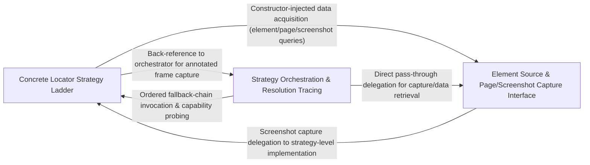

## Details

The strategy and chain-of-responsibility layer implementing the fallback locator ladder and screenshot/page-source acquisition. Resolves abstract 'find this element/screen state' requests issued by ActionKeyword into concrete UI targets by orchestrating pluggable LocatorStrategy implementations (XPath → text → image/OCR) against element sources, screenshots, and page sources, and records execution traces of resolution attempts.

### Concrete Locator Strategy Ladder
Implements the individual fallback rungs of the locator ladder — the concrete LocatorStrategy subclasses that attempt element resolution via XPath, native text elements, OCR-based text detection, and image/template matching — plus the geometric/coordinate utilities needed to translate raw detection results into actionable screen coordinates.

**Related Classes/Methods**:

- `optics_framework.common.strategies.LocatorStrategy`:26-151
- `optics_framework.common.strategies.XPathStrategy`:154-180
- `optics_framework.common.strategies.TextElementStrategy`:183-210
- `optics_framework.common.strategies.ImageDetectionStrategy`:333-437
- `optics_framework.common.utils.adjust_coordinates_for_aoi`:728-753

**Source Files:**

- `optics_framework/api/action_keyword.py`
  - `optics_framework.api.action_keyword._save_annotated_for_result` (L65-L99) - Function
- `optics_framework/common/elementsource_interface.py`
  - `optics_framework.common.elementsource_interface.ElementSourceInterface.capture` (L18-L25) - Method
  - `optics_framework.common.elementsource_interface.ElementSourceInterface.locate` (L44-L53) - Method
- `optics_framework/common/strategies.py`
  - `optics_framework.common.strategies.LocateValueWithFrame` (L20-L23) - Class
  - `optics_framework.common.strategies.LocatorStrategy` (L26-L151) - Class
  - `optics_framework.common.strategies.LocatorStrategy.element_source` (L31-L32) - Method
  - `optics_framework.common.strategies.LocatorStrategy.locate` (L35-L45) - Method
  - `optics_framework.common.strategies.LocatorStrategy.assert_elements` (L48-L52) - Method
  - `optics_framework.common.strategies.LocatorStrategy.assert_elements_visible` (L54-L64) - Method
  - `optics_framework.common.strategies.LocatorStrategy.supports` (L69-L76) - Method
  - `optics_framework.common.strategies.LocatorStrategy._is_method_implemented` (L79-L113) - Method
  - `optics_framework.common.strategies.LocatorStrategy._assert_elements_locator_style` (L115-L151) - Method
  - `optics_framework.common.strategies.XPathStrategy` (L154-L180) - Class
  - `optics_framework.common.strategies.XPathStrategy.__init__` (L157-L159) - Method
  - `optics_framework.common.strategies.XPathStrategy.element_source` (L162-L163) - Method
  - `optics_framework.common.strategies.XPathStrategy.locate` (L165-L166) - Method
  - `optics_framework.common.strategies.XPathStrategy.assert_elements` (L168-L171) - Method
  - `optics_framework.common.strategies.XPathStrategy.assert_elements_visible` (L173-L176) - Method
  - `optics_framework.common.strategies.XPathStrategy.supports` (L179-L180) - Method
  - `optics_framework.common.strategies.TextElementStrategy` (L183-L210) - Class
  - `optics_framework.common.strategies.TextElementStrategy.__init__` (L186-L188) - Method
  - `optics_framework.common.strategies.TextElementStrategy.element_source` (L191-L192) - Method
  - `optics_framework.common.strategies.TextElementStrategy.locate` (L194-L195) - Method
  - `optics_framework.common.strategies.TextElementStrategy.assert_elements` (L197-L200) - Method
  - `optics_framework.common.strategies.TextElementStrategy.assert_elements_visible` (L202-L205) - Method
  - `optics_framework.common.strategies.TextElementStrategy.supports` (L208-L210) - Method
  - `optics_framework.common.strategies.TextDetectionStrategy` (L212-L330) - Class
  - `optics_framework.common.strategies.TextDetectionStrategy.__init__` (L215-L219) - Method
  - `optics_framework.common.strategies.TextDetectionStrategy.element_source` (L222-L223) - Method
  - `optics_framework.common.strategies.TextDetectionStrategy.locate` (L225-L240) - Method
  - `optics_framework.common.strategies.TextDetectionStrategy.locate_with_aoi` (L242-L290) - Method
  - `optics_framework.common.strategies.TextDetectionStrategy.assert_elements` (L292-L326) - Method
  - `optics_framework.common.strategies.TextDetectionStrategy.supports` (L329-L330) - Method
  - `optics_framework.common.strategies.ImageDetectionStrategy` (L333-L437) - Class
  - `optics_framework.common.strategies.ImageDetectionStrategy.__init__` (L336-L340) - Method
  - `optics_framework.common.strategies.ImageDetectionStrategy.element_source` (L343-L344) - Method
  - `optics_framework.common.strategies.ImageDetectionStrategy.locate` (L346-L357) - Method
  - `optics_framework.common.strategies.ImageDetectionStrategy.locate_with_aoi` (L359-L404) - Method
  - `optics_framework.common.strategies.ImageDetectionStrategy.assert_elements` (L406-L433) - Method
  - `optics_framework.common.strategies.ImageDetectionStrategy.supports` (L436-L437) - Method
  - `optics_framework.common.strategies.LocateResult` (L538-L550) - Class
  - `optics_framework.common.strategies.LocateResult.__init__` (L541-L550) - Method
  - `optics_framework.common.strategies.StrategyManager._within_aoi` (L601-L635) - Method
  - `optics_framework.common.strategies.StrategyManager._try_strategy_locate` (L637-L677) - Method
- `optics_framework/common/utils.py`
  - `optics_framework.common.utils.detect_change` (L281-L291) - Function
  - `optics_framework.common.utils.annotate` (L360-L376) - Function
  - `optics_framework.common.utils.annotate_element` (L384-L390) - Function
  - `optics_framework.common.utils.load_config` (L617-L633) - Function
  - `optics_framework.common.utils.calculate_aoi_bounds` (L655-L696) - Function
  - `optics_framework.common.utils.crop_screenshot_to_aoi` (L699-L725) - Function
  - `optics_framework.common.utils.adjust_coordinates_for_aoi` (L728-L753) - Function
  - `optics_framework.common.utils.annotate_aoi_region` (L756-L800) - Function
  - `optics_framework.common.utils._window_size_from_source` (L913-L942) - Function
  - `optics_framework.common.utils._pixel_scale_for_source` (L952-L1008) - Function
  - `optics_framework.common.utils._apply_scale_to_bbox` (L1011-L1033) - Function
  - `optics_framework.common.utils.scale_bboxes_for_screenshot` (L1036-L1070) - Function
- `optics_framework/engines/vision_models/base_methods.py`
  - `optics_framework.engines.vision_models.base_methods.match_and_annotate` (L33-L65) - Function

### Strategy Orchestration & Resolution Tracing
The orchestration core of the subsystem — builds and executes the ordered chain of locator strategies via factories, coordinates screenshot/page-source acquisition needed by each rung, and records a structured execution trace of every resolution attempt for diagnostics and self-healing feedback.

**Related Classes/Methods**:

- `optics_framework.common.strategies.StrategyManager`:553-905
- `optics_framework.common.strategies.StrategyFactory`:500-520
- `optics_framework.common.execution_tracer.ExecutionTracer`:4-32
- `optics_framework.common.screenshot_stream.ScreenshotStream`:9-247
- `optics_framework.api.action_keyword._locate_element`:53-62

**Source Files:**

- `optics_framework/api/action_keyword.py`
  - `optics_framework.api.action_keyword._locate_element` (L53-L62) - Function
- `optics_framework/common/execution_tracer.py`
  - `optics_framework.common.execution_tracer.ExecutionTracer` (L4-L32) - Class
  - `optics_framework.common.execution_tracer.ExecutionTracer.log_attempt` (L10-L32) - Method
- `optics_framework/common/screenshot_stream.py`
  - `optics_framework.common.screenshot_stream.ScreenshotStream` (L9-L247) - Class
  - `optics_framework.common.screenshot_stream.ScreenshotStream.__init__` (L10-L28) - Method
  - `optics_framework.common.screenshot_stream.ScreenshotStream.capture_stream` (L30-L61) - Method
  - `optics_framework.common.screenshot_stream.ScreenshotStream._process_frame_for_deduplication` (L63-L83) - Method
  - `optics_framework.common.screenshot_stream.ScreenshotStream.process_screenshot_queue` (L85-L112) - Method
  - `optics_framework.common.screenshot_stream.ScreenshotStream.start_capture` (L114-L133) - Method
  - `optics_framework.common.screenshot_stream.ScreenshotStream.stop_capture` (L135-L162) - Method
  - `optics_framework.common.screenshot_stream.ScreenshotStream.get_latest_screenshot` (L164-L177) - Method
  - `optics_framework.common.screenshot_stream.ScreenshotStream.get_all_available_screenshots` (L179-L197) - Method
  - `optics_framework.common.screenshot_stream.ScreenshotStream.fetch_frames_from_queue` (L200-L217) - Method
  - `optics_framework.common.screenshot_stream.ScreenshotStream.clear_queues` (L219-L235) - Method
  - `optics_framework.common.screenshot_stream.ScreenshotStream.get_queue_sizes` (L237-L247) - Method
- `optics_framework/common/strategies.py`
  - `optics_framework.common.strategies.PagesourceStrategy.supports` (L469-L470) - Method
  - `optics_framework.common.strategies.ScreenshotStrategy` (L473-L498) - Class
  - `optics_framework.common.strategies.ScreenshotStrategy.__init__` (L474-L475) - Method
  - `optics_framework.common.strategies.ScreenshotStrategy.capture` (L477-L488) - Method
  - `optics_framework.common.strategies.ScreenshotStrategy.capture_stream` (L490-L494) - Method
  - `optics_framework.common.strategies.ScreenshotStrategy.supports` (L497-L498) - Method
  - `optics_framework.common.strategies.StrategyFactory` (L500-L520) - Class
  - `optics_framework.common.strategies.StrategyFactory.__init__` (L502-L511) - Method
  - `optics_framework.common.strategies.StrategyFactory.create_strategies` (L513-L520) - Method
  - `optics_framework.common.strategies.PagesourceFactory` (L522-L527) - Class
  - `optics_framework.common.strategies.PagesourceFactory.__init__` (L523-L524) - Method
  - `optics_framework.common.strategies.PagesourceFactory.create_strategies` (L526-L527) - Method
  - `optics_framework.common.strategies.ScreenshotFactory` (L530-L535) - Class
  - `optics_framework.common.strategies.ScreenshotFactory.__init__` (L531-L532) - Method
  - `optics_framework.common.strategies.ScreenshotFactory.create_strategies` (L534-L535) - Method
  - `optics_framework.common.strategies.StrategyManager` (L553-L905) - Class
  - `optics_framework.common.strategies.StrategyManager.__init__` (L554-L565) - Method
  - `optics_framework.common.strategies.StrategyManager._build_locator_strategies` (L567-L571) - Method
  - `optics_framework.common.strategies.StrategyManager._build_screenshot_strategies` (L573-L577) - Method
  - `optics_framework.common.strategies.StrategyManager._build_pagesource_strategies` (L579-L583) - Method
  - `optics_framework.common.strategies.StrategyManager._validate_aoi` (L585-L599) - Method
  - `optics_framework.common.strategies.StrategyManager.locate` (L679-L697) - Method
  - `optics_framework.common.strategies.StrategyManager._alloc_time_for_strategy` (L699-L715) - Method
  - `optics_framework.common.strategies.StrategyManager.assert_presence` (L717-L719) - Method
  - `optics_framework.common.strategies.StrategyManager.assert_visibility` (L721-L723) - Method
  - `optics_framework.common.strategies.StrategyManager._assert` (L725-L768) - Method
  - `optics_framework.common.strategies.StrategyManager._validate_rule` (L770-L774) - Method
  - `optics_framework.common.strategies.StrategyManager._can_strategy_assert_elements` (L776-L787) - Method
  - `optics_framework.common.strategies.StrategyManager._try_assert_with_strategy` (L789-L807) - Method
  - `optics_framework.common.strategies.StrategyManager.capture_screenshot_bytes` (L823-L842) - Method
  - `optics_framework.common.strategies.StrategyManager.capture_screenshot_stream` (L844-L857) - Method
  - `optics_framework.common.strategies.StrategyManager.stop_screenshot_stream` (L859-L866) - Method
  - `optics_framework.common.strategies.StrategyManager._can_strategy_get_interactive_elements` (L879-L890) - Method
  - `optics_framework.common.strategies.StrategyManager.get_interactive_elements` (L892-L905) - Method
- `optics_framework/common/utils.py`
  - `optics_framework.common.utils.parse_text_only_prefix` (L195-L199) - Function
  - `optics_framework.common.utils.is_black_screen` (L378-L382) - Function

### Element Source & Page/Screenshot Capture Interface
Defines the pluggable contract for element sources and implements driver-specific acquisition of page source and screenshots, giving the strategy ladder a uniform way to query interactive elements, bounding boxes, and raw screen/page data regardless of the underlying automation backend (Appium, Selenium, camera-based capture).

**Related Classes/Methods**:

- `optics_framework.common.elementsource_interface.ElementSourceInterface`:5-134
- `optics_framework.common.strategies.PagesourceStrategy`:439-470
- `optics_framework.common.utils.capture_base64_screenshot_bytes`:249-274

**Source Files:**

- `optics_framework/common/elementsource_interface.py`
  - `optics_framework.common.elementsource_interface.ElementSourceInterface` (L5-L134) - Class
  - `optics_framework.common.elementsource_interface.ElementSourceInterface.capture_screenshot_bytes` (L27-L41) - Method
  - `optics_framework.common.elementsource_interface.ElementSourceInterface.assert_elements` (L56-L70) - Method
  - `optics_framework.common.elementsource_interface.ElementSourceInterface.get_element_bboxes` (L72-L81) - Method
  - `optics_framework.common.elementsource_interface.ElementSourceInterface.get_bbox_for_element` (L83-L92) - Method
  - `optics_framework.common.elementsource_interface.ElementSourceInterface.get_page_source` (L94-L104) - Method
  - `optics_framework.common.elementsource_interface.ElementSourceInterface.assert_elements_visible` (L106-L122) - Method
  - `optics_framework.common.elementsource_interface.ElementSourceInterface.get_interactive_elements` (L125-L134) - Method
- `optics_framework/common/strategies.py`
  - `optics_framework.common.strategies.PagesourceStrategy` (L439-L470) - Class
  - `optics_framework.common.strategies.PagesourceStrategy.__init__` (L440-L441) - Method
  - `optics_framework.common.strategies.PagesourceStrategy.capture_pagesource` (L443-L458) - Method
  - `optics_framework.common.strategies.PagesourceStrategy.get_interactive_elements` (L460-L466) - Method
  - `optics_framework.common.strategies.StrategyManager.capture_pagesource` (L868-L876) - Method
- `optics_framework/common/utils.py`
  - `optics_framework.common.utils.capture_base64_screenshot_bytes` (L249-L274) - Function
- `optics_framework/engines/elementsources/appium_screenshot.py`
  - `optics_framework.engines.elementsources.appium_screenshot.AppiumScreenshot` (L10-L94) - Class
  - `optics_framework.engines.elementsources.appium_screenshot.AppiumScreenshot.__init__` (L18-L24) - Method
  - `optics_framework.engines.elementsources.appium_screenshot.AppiumScreenshot._require_driver` (L26-L38) - Method
  - `optics_framework.engines.elementsources.appium_screenshot.AppiumScreenshot.capture` (L40-L47) - Method
  - `optics_framework.engines.elementsources.appium_screenshot.AppiumScreenshot.capture_screenshot_bytes` (L49-L60) - Method
  - `optics_framework.engines.elementsources.appium_screenshot.AppiumScreenshot.get_interactive_elements` (L62-L66) - Method
  - `optics_framework.engines.elementsources.appium_screenshot.AppiumScreenshot.capture_screenshot_as_numpy` (L68-L80) - Method
  - `optics_framework.engines.elementsources.appium_screenshot.AppiumScreenshot.assert_elements` (L82-L84) - Method
  - `optics_framework.engines.elementsources.appium_screenshot.AppiumScreenshot.locate` (L87-L89) - Method
  - `optics_framework.engines.elementsources.appium_screenshot.AppiumScreenshot.locate_using_index` (L92-L94) - Method
- `optics_framework/engines/elementsources/camera_screenshot.py`
  - `optics_framework.engines.elementsources.camera_screenshot.CapabilitiesConfig` (L10-L35) - Class
  - `optics_framework.engines.elementsources.camera_screenshot.CapabilitiesConfig.Config` (L30-L31) - Class
  - `optics_framework.engines.elementsources.camera_screenshot.CapabilitiesConfig.has_camera_index_or_url` (L34-L35) - Method
  - `optics_framework.engines.elementsources.camera_screenshot.CameraScreenshot` (L38-L371) - Class
  - `optics_framework.engines.elementsources.camera_screenshot.CameraScreenshot.__init__` (L46-L102) - Method
  - `optics_framework.engines.elementsources.camera_screenshot.CameraScreenshot.capture` (L104-L142) - Method
  - `optics_framework.engines.elementsources.camera_screenshot.CameraScreenshot.__del__` (L144-L149) - Method
  - `optics_framework.engines.elementsources.camera_screenshot.CameraScreenshot.locate` (L151-L157) - Method
  - `optics_framework.engines.elementsources.camera_screenshot.CameraScreenshot.assert_elements` (L159-L165) - Method
  - `optics_framework.engines.elementsources.camera_screenshot.CameraScreenshot.get_interactive_elements` (L167-L173) - Method
  - `optics_framework.engines.elementsources.camera_screenshot.CameraScreenshot.create_tcp_connection` (L175-L199) - Method
  - `optics_framework.engines.elementsources.camera_screenshot.CameraScreenshot.take_screenshot` (L201-L288) - Method
  - `optics_framework.engines.elementsources.camera_screenshot.CameraScreenshot.deskew_image` (L290-L323) - Method
  - `optics_framework.engines.elementsources.camera_screenshot.CameraScreenshot.rotate` (L325-L355) - Method
  - `optics_framework.engines.elementsources.camera_screenshot.CameraScreenshot.take_ext_screenshot` (L357-L371) - Method
- `optics_framework/engines/elementsources/selenium_screenshot.py`
  - `optics_framework.engines.elementsources.selenium_screenshot.SeleniumScreenshot` (L9-L72) - Class
  - `optics_framework.engines.elementsources.selenium_screenshot.SeleniumScreenshot.__init__` (L14-L20) - Method
  - `optics_framework.engines.elementsources.selenium_screenshot.SeleniumScreenshot._require_driver` (L22-L26) - Method
  - `optics_framework.engines.elementsources.selenium_screenshot.SeleniumScreenshot.capture` (L28-L34) - Method
  - `optics_framework.engines.elementsources.selenium_screenshot.SeleniumScreenshot.get_interactive_elements` (L36-L38) - Method
  - `optics_framework.engines.elementsources.selenium_screenshot.SeleniumScreenshot.capture_screenshot_bytes` (L40-L50) - Method
  - `optics_framework.engines.elementsources.selenium_screenshot.SeleniumScreenshot.capture_screenshot_as_numpy` (L52-L64) - Method
  - `optics_framework.engines.elementsources.selenium_screenshot.SeleniumScreenshot.assert_elements` (L66-L68) - Method
  - `optics_framework.engines.elementsources.selenium_screenshot.SeleniumScreenshot.locate` (L70-L72) - Method

### [FAQ](https://github.com/CodeBoarding/GeneratedOnBoardings/tree/main?tab=readme-ov-file#faq)