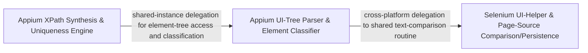

## Details

Provides platform-specific UI-tree traversal, XPath synthesis, and page-source serialization for Appium and Selenium, plus shared text/page-source comparison and persistence utilities used to detect UI-state changes and support the self-healing locator strategies.

### Appium UI-Tree Parser & Element Classifier
Traverses the Appium (Android/iOS) accessibility/UIAutomator XML page-source tree, extracts element bounds/attributes, and classifies nodes (button, text, image, input, interactive) to build the normalized element model consumed by locator strategies.

**Related Classes/Methods**:

- `optics_framework.engines.drivers.appium_UI_helper.UIHelper`:100-1303
- `optics_framework.engines.drivers.appium_UI_helper.UIHelper._extract_bounds`:938-977
- `optics_framework.engines.drivers.appium_UI_helper.UIHelper._is_button`:1252-1257
- `optics_framework.engines.drivers.appium_UI_helper.UIHelper._is_probably_interactive`:1287-1303
- `optics_framework.common.utils.save_page_source`:529-565

**Source Files:**

- `optics_framework/common/utils.py`
  - `optics_framework.common.utils.save_page_source` (L529-L565) - Function
- `optics_framework/engines/drivers/appium_UI_helper.py`
  - `optics_framework.engines.drivers.appium_UI_helper.UIHelper` (L100-L1303) - Class
  - `optics_framework.engines.drivers.appium_UI_helper.UIHelper.__init__` (L101-L108) - Method
  - `optics_framework.engines.drivers.appium_UI_helper.UIHelper.get_page_source` (L110-L120) - Method
  - `optics_framework.engines.drivers.appium_UI_helper.UIHelper.find_xpath_from_text` (L144-L161) - Method
  - `optics_framework.engines.drivers.appium_UI_helper.UIHelper.find_xpath` (L163-L228) - Method
  - `optics_framework.engines.drivers.appium_UI_helper.UIHelper.find_exact` (L230-L239) - Method
  - `optics_framework.engines.drivers.appium_UI_helper.UIHelper.find_relative` (L241-L255) - Method
  - `optics_framework.engines.drivers.appium_UI_helper.UIHelper.make_relative` (L257-L280) - Method
  - `optics_framework.engines.drivers.appium_UI_helper.UIHelper.make_partial_match` (L282-L319) - Method
  - `optics_framework.engines.drivers.appium_UI_helper.UIHelper.find_partial` (L321-L335) - Method
  - `optics_framework.engines.drivers.appium_UI_helper.UIHelper.fuzzy_match_prefix` (L337-L339) - Method
  - `optics_framework.engines.drivers.appium_UI_helper.UIHelper.find_attribute_match` (L341-L407) - Method
  - `optics_framework.engines.drivers.appium_UI_helper.UIHelper.split_element` (L409-L411) - Method
  - `optics_framework.engines.drivers.appium_UI_helper.UIHelper.extract_attribute` (L413-L421) - Method
  - `optics_framework.engines.drivers.appium_UI_helper.UIHelper.simplify_xpath` (L423-L452) - Method
  - `optics_framework.engines.drivers.appium_UI_helper.UIHelper.extract_key_attributes` (L454-L485) - Method
  - `optics_framework.engines.drivers.appium_UI_helper.UIHelper._find_exact_or_suffix_match` (L487-L515) - Method
  - `optics_framework.engines.drivers.appium_UI_helper.UIHelper.get_locator_and_strategy` (L517-L569) - Method
  - `optics_framework.engines.drivers.appium_UI_helper.UIHelper.get_view_locator` (L571-L652) - Method
  - `optics_framework.engines.drivers.appium_UI_helper.UIHelper.get_locator_and_strategy_using_index` (L654-L764) - Method
  - `optics_framework.engines.drivers.appium_UI_helper.UIHelper.parse_bounds` (L766-L783) - Method
  - `optics_framework.engines.drivers.appium_UI_helper.UIHelper.get_bounding_box_for_text` (L785-L805) - Method
  - `optics_framework.engines.drivers.appium_UI_helper.UIHelper.get_bounding_box_for_xpath` (L807-L863) - Method
  - `optics_framework.engines.drivers.appium_UI_helper.UIHelper.get_element_attributes_by_xpath` (L865-L888) - Method
  - `optics_framework.engines.drivers.appium_UI_helper.UIHelper._extract_bounds` (L938-L977) - Method
  - `optics_framework.engines.drivers.appium_UI_helper.UIHelper._extract_bounds._to_int` (L962-L969) - Function
  - `optics_framework.engines.drivers.appium_UI_helper.UIHelper._should_include_element` (L1215-L1250) - Method
  - `optics_framework.engines.drivers.appium_UI_helper.UIHelper._is_button` (L1252-L1257) - Method
  - `optics_framework.engines.drivers.appium_UI_helper.UIHelper._is_input` (L1259-L1268) - Method
  - `optics_framework.engines.drivers.appium_UI_helper.UIHelper._is_image` (L1270-L1275) - Method
  - `optics_framework.engines.drivers.appium_UI_helper.UIHelper._is_text` (L1277-L1285) - Method
  - `optics_framework.engines.drivers.appium_UI_helper.UIHelper._is_probably_interactive` (L1287-L1303) - Method

### Selenium UI-Helper & Page-Source Comparison/Persistence
Provides DOM-tree parsing/element-matching for Selenium-driven web pages (via BeautifulSoup) alongside the shared page-source persistence and text-comparison utilities used across both platforms to detect UI-state changes for self-healing.

**Related Classes/Methods**:

- `optics_framework.engines.drivers.selenium_UI_helper.UIHelper`:15-259
- `optics_framework.engines.elementsources.selenium_page_source.SeleniumPageSource`:9-219
- `optics_framework.engines.drivers.selenium_UI_helper.UIHelper._get_html_soup`:109-116
- `optics_framework.engines.drivers.selenium_UI_helper.UIHelper._find_element_by_text`:243-245
- `optics_framework.common.utils.compare_text`:293-329

**Source Files:**

- `optics_framework/common/utils.py`
  - `optics_framework.common.utils.compare_text` (L293-L329) - Function
  - `optics_framework.common.utils.save_page_source_html` (L568-L593) - Function
- `optics_framework/engines/drivers/selenium_UI_helper.py`
  - `optics_framework.engines.drivers.selenium_UI_helper.UIHelper` (L15-L259) - Class
  - `optics_framework.engines.drivers.selenium_UI_helper.UIHelper.__init__` (L16-L20) - Method
  - `optics_framework.engines.drivers.selenium_UI_helper.UIHelper.get_page_source` (L24-L34) - Method
  - `optics_framework.engines.drivers.selenium_UI_helper.UIHelper.find_element_by_text` (L36-L71) - Method
  - `optics_framework.engines.drivers.selenium_UI_helper.UIHelper.find_html_element_by_text` (L74-L106) - Method
  - `optics_framework.engines.drivers.selenium_UI_helper.UIHelper._get_html_soup` (L109-L116) - Method
  - `optics_framework.engines.drivers.selenium_UI_helper.UIHelper._collect_matching_tags` (L119-L137) - Method
  - `optics_framework.engines.drivers.selenium_UI_helper.UIHelper._matches_visible_text` (L140-L142) - Method
  - `optics_framework.engines.drivers.selenium_UI_helper.UIHelper._match_tag_attributes` (L145-L156) - Method
  - `optics_framework.engines.drivers.selenium_UI_helper.UIHelper._build_match_result` (L159-L166) - Method
  - `optics_framework.engines.drivers.selenium_UI_helper.UIHelper.find_html_element_by_xpath` (L169-L198) - Method
  - `optics_framework.engines.drivers.selenium_UI_helper.UIHelper.convert_to_selenium_element` (L200-L240) - Method
  - `optics_framework.engines.drivers.selenium_UI_helper.UIHelper._find_element_by_text` (L243-L245) - Method
  - `optics_framework.engines.drivers.selenium_UI_helper.UIHelper._find_element_by_attribute` (L248-L259) - Method
- `optics_framework/engines/elementsources/selenium_page_source.py`
  - `optics_framework.engines.elementsources.selenium_page_source.SeleniumPageSource` (L9-L219) - Class
  - `optics_framework.engines.elementsources.selenium_page_source.SeleniumPageSource.__init__` (L23-L34) - Method
  - `optics_framework.engines.elementsources.selenium_page_source.SeleniumPageSource._require_webdriver` (L36-L42) - Method
  - `optics_framework.engines.elementsources.selenium_page_source.SeleniumPageSource.capture` (L44-L50) - Method
  - `optics_framework.engines.elementsources.selenium_page_source.SeleniumPageSource.get_page_source` (L54-L67) - Method
  - `optics_framework.engines.elementsources.selenium_page_source.SeleniumPageSource.get_interactive_elements` (L69-L72) - Method
  - `optics_framework.engines.elementsources.selenium_page_source.SeleniumPageSource.locate` (L74-L113) - Method
  - `optics_framework.engines.elementsources.selenium_page_source.SeleniumPageSource.get_element_bboxes` (L115-L126) - Method
  - `optics_framework.engines.elementsources.selenium_page_source.SeleniumPageSource.get_element_bboxes.locate_safe` (L120-L124) - Function
  - `optics_framework.engines.elementsources.selenium_page_source.SeleniumPageSource.get_bbox_for_element` (L128-L132) - Method
  - `optics_framework.engines.elementsources.selenium_page_source.SeleniumPageSource._find_element_by_any` (L134-L158) - Method
  - `optics_framework.engines.elementsources.selenium_page_source.SeleniumPageSource.locate_using_index` (L161-L164) - Method
  - `optics_framework.engines.elementsources.selenium_page_source.SeleniumPageSource.assert_elements` (L167-L198) - Method
  - `optics_framework.engines.elementsources.selenium_page_source.SeleniumPageSource._is_text_found` (L201-L209) - Method
  - `optics_framework.engines.elementsources.selenium_page_source.SeleniumPageSource._is_xpath_found` (L211-L219) - Method

### Appium XPath Synthesis & Uniqueness Engine
Generates robust, structurally-unique XPath expressions for Appium elements by permuting attribute combinations and validating uniqueness against the parsed page-source, underpinning the XPath-first tier of the self-healing fallback ladder.

**Related Classes/Methods**:

- `optics_framework.engines.drivers.appium_UI_helper.XPathUniquenessIndex`:21-97
- `optics_framework.engines.drivers.appium_UI_helper.UIHelper._build_structural_xpath`:1194-1213
- `optics_framework.engines.drivers.appium_UI_helper.UIHelper._xpath_from_attr_pair`:1035-1044
- `optics_framework.engines.drivers.appium_UI_helper.UIHelper._xpath_try_attributes_for_unique`:1046-1073
- `optics_framework.engines.drivers.appium_UI_helper.UIHelper._escape_for_xpath_literal`:1154-1171

**Source Files:**

- `optics_framework/engines/drivers/appium_UI_helper.py`
  - `optics_framework.engines.drivers.appium_UI_helper.XPathUniquenessIndex` (L21-L97) - Class
  - `optics_framework.engines.drivers.appium_UI_helper.XPathUniquenessIndex.__init__` (L39-L61) - Method
  - `optics_framework.engines.drivers.appium_UI_helper.XPathUniquenessIndex.matches` (L63-L83) - Method
  - `optics_framework.engines.drivers.appium_UI_helper.XPathUniquenessIndex.position_of` (L85-L97) - Method
  - `optics_framework.engines.drivers.appium_UI_helper.UIHelper.get_interactive_elements` (L891-L936) - Method
  - `optics_framework.engines.drivers.appium_UI_helper.UIHelper._extract_display_text` (L979-L1007) - Method
  - `optics_framework.engines.drivers.appium_UI_helper.UIHelper._extract_display_text.norm` (L987-L991) - Function
  - `optics_framework.engines.drivers.appium_UI_helper.UIHelper._build_extra_metadata` (L1009-L1023) - Method
  - `optics_framework.engines.drivers.appium_UI_helper.UIHelper._xpath_from_single_attr` (L1025-L1033) - Method
  - `optics_framework.engines.drivers.appium_UI_helper.UIHelper._xpath_from_attr_pair` (L1035-L1044) - Method
  - `optics_framework.engines.drivers.appium_UI_helper.UIHelper._xpath_try_attributes_for_unique` (L1046-L1073) - Method
  - `optics_framework.engines.drivers.appium_UI_helper.UIHelper._xpath_try_node_name` (L1075-L1081) - Method
  - `optics_framework.engines.drivers.appium_UI_helper.UIHelper._xpath_attribute_pairs_permutations` (L1083-L1086) - Method
  - `optics_framework.engines.drivers.appium_UI_helper.UIHelper._xpath_try_cases_for_unique` (L1088-L1108) - Method
  - `optics_framework.engines.drivers.appium_UI_helper.UIHelper._xpath_build_hierarchical` (L1110-L1125) - Method
  - `optics_framework.engines.drivers.appium_UI_helper.UIHelper.get_xpath` (L1127-L1152) - Method
  - `optics_framework.engines.drivers.appium_UI_helper.UIHelper._escape_for_xpath_literal` (L1154-L1171) - Method
  - `optics_framework.engines.drivers.appium_UI_helper.UIHelper._build_attribute_condition` (L1173-L1192) - Method
  - `optics_framework.engines.drivers.appium_UI_helper.UIHelper._build_structural_xpath` (L1194-L1213) - Method

### [FAQ](https://github.com/CodeBoarding/GeneratedOnBoardings/tree/main?tab=readme-ov-file#faq)