```mermaid
graph LR
    Core_Infrastructure_Execution_Services["Core Infrastructure & Execution Services"]
    Keyword_Action_API_Optics_Facade["Keyword Action API & Optics Facade"]
    Driver_Element_Source_Engines["Driver & Element-Source Engines"]
    Driver_Interface_Fallback_Strategy_Layer["Driver Interface & Fallback Strategy Layer"]
    AI_Self_Healing_Natural_Language_Agent_Layer["AI Self-Healing & Natural-Language Agent Layer"]
    Core_Infrastructure_Execution_Services -- "dynamically instantiates via config-driven reflection" --> Driver_Element_Source_Engines
    Core_Infrastructure_Execution_Services -- "constructs and initializes" --> Keyword_Action_API_Optics_Facade
    Core_Infrastructure_Execution_Services -- "calls" --> AI_Self_Healing_Natural_Language_Agent_Layer
    Keyword_Action_API_Optics_Facade -- "calls" --> Core_Infrastructure_Execution_Services
    Keyword_Action_API_Optics_Facade -- "calls" --> Driver_Element_Source_Engines
    Keyword_Action_API_Optics_Facade -- "calls" --> Driver_Interface_Fallback_Strategy_Layer
    Keyword_Action_API_Optics_Facade -- "calls" --> AI_Self_Healing_Natural_Language_Agent_Layer
    Driver_Element_Source_Engines -- "calls" --> Driver_Interface_Fallback_Strategy_Layer
    Driver_Element_Source_Engines -- "calls" --> AI_Self_Healing_Natural_Language_Agent_Layer
    Driver_Interface_Fallback_Strategy_Layer -- "calls" --> Core_Infrastructure_Execution_Services
    Driver_Interface_Fallback_Strategy_Layer -- "calls" --> Driver_Element_Source_Engines
    Driver_Interface_Fallback_Strategy_Layer -- "calls" --> AI_Self_Healing_Natural_Language_Agent_Layer
    AI_Self_Healing_Natural_Language_Agent_Layer -- "calls" --> Core_Infrastructure_Execution_Services
    click Core_Infrastructure_Execution_Services href "./Core_Infrastructure_Execution_Services.md" "Details"
    click Keyword_Action_API_Optics_Facade href "./Keyword_Action_API_Optics_Facade.md" "Details"
    click Driver_Element_Source_Engines href "./Driver_Element_Source_Engines.md" "Details"
    click Driver_Interface_Fallback_Strategy_Layer href "./Driver_Interface_Fallback_Strategy_Layer.md" "Details"
    click AI_Self_Healing_Natural_Language_Agent_Layer href "./AI_Self_Healing_Natural_Language_Agent_Layer.md" "Details"
```

## Details

A self-healing, vision-powered UI test automation engine organized around a keyword-driven testing model. Test authors invoke the Optics facade through multiple interfaces (CLI, REST, Robot Framework, MCP, TUI, or Python library), which resolves keywords into calls against the Keyword Action API. UI element location is performed through a multi-tier fallback ladder (XPath → text → OCR → image) implemented via the Driver/Fallback Interface Layer, fulfilled by concrete Driver & Element-Source Engines (Appium, Selenium, Playwright). When deterministic strategies are exhausted, the AI Self-Healing & Agent Layer uses LLMs to reason over screenshots and page-source to recover failing steps or drive entire flows from natural-language instructions. Core Infrastructure & Execution Services provide configuration loading, structured error handling, JUnit reporting, REST health exposure, and the execution engine that ties test data to keyword invocation.

### Core Infrastructure & Execution Services [[Expand]](./Core_Infrastructure_Execution_Services.md)
The shared plumbing layer providing configuration loading/merging, structured error payloads, event/notification system, JUnit result reporting, execution/runner engine, and REST/logging surface that other layers depend on.

**Related Classes/Methods**:

- `optics_framework.common.config_handler.ConfigHandler`:113-225
- `optics_framework.common.Junit_eventhandler.JUnitEventHandler`:110-288
- `optics_framework.common.error.ErrorPayload`:341-349
- `optics_framework.common.events.Command`:54-61

**Source Files:**

- `optics_framework/common/Junit_eventhandler.py`
  - `optics_framework.common.Junit_eventhandler.JUnitHandlerRegistry` (L14-L74) - Class
  - `optics_framework.common.Junit_eventhandler.JUnitHandlerRegistry.__init__` (L17-L19) - Method
  - `optics_framework.common.Junit_eventhandler.JUnitHandlerRegistry.setup_junit_for_session` (L21-L43) - Method
  - `optics_framework.common.Junit_eventhandler.JUnitHandlerRegistry._get_session_junit_path` (L45-L56) - Method
  - `optics_framework.common.Junit_eventhandler.JUnitHandlerRegistry.cleanup_session` (L58-L64) - Method
  - `optics_framework.common.Junit_eventhandler.JUnitHandlerRegistry.get_handler` (L66-L69) - Method
  - `optics_framework.common.Junit_eventhandler.JUnitHandlerRegistry.get_active_sessions` (L71-L74) - Method
  - `optics_framework.common.Junit_eventhandler.setup_junit` (L78-L80) - Function
  - `optics_framework.common.Junit_eventhandler.cleanup_junit` (L82-L84) - Function
  - `optics_framework.common.Junit_eventhandler.get_junit_handler_registry` (L86-L88) - Function
  - `optics_framework.common.Junit_eventhandler.JUnitEventHandler` (L110-L288) - Class
  - `optics_framework.common.Junit_eventhandler.JUnitEventHandler.__init__` (L111-L122) - Method
  - `optics_framework.common.Junit_eventhandler.JUnitEventHandler.on_event` (L125-L150) - Method
  - `optics_framework.common.Junit_eventhandler.JUnitEventHandler._handle_test_case_event` (L152-L180) - Method
  - `optics_framework.common.Junit_eventhandler.JUnitEventHandler._handle_module_event` (L182-L195) - Method
  - `optics_framework.common.Junit_eventhandler.JUnitEventHandler._handle_keyword_event` (L197-L223) - Method
  - `optics_framework.common.Junit_eventhandler.JUnitEventHandler._update_testcase_status` (L225-L241) - Method
  - `optics_framework.common.Junit_eventhandler.JUnitEventHandler.add_detected_errors` (L243-L270) - Method
  - `optics_framework.common.Junit_eventhandler.JUnitEventHandler.flush` (L272-L285) - Method
  - `optics_framework.common.Junit_eventhandler.JUnitEventHandler.close` (L287-L288) - Method
- `optics_framework/common/config_handler.py`
  - `optics_framework.common.config_handler.DependencyConfig` (L11-L19) - Class
  - `optics_framework.common.config_handler.DependencyConfig.Config` (L17-L19) - Class
  - `optics_framework.common.config_handler.Config` (L22-L87) - Class
  - `optics_framework.common.config_handler.Config.__init__` (L45-L77) - Method
  - `optics_framework.common.config_handler.Config.Config` (L79-L81) - Class
  - `optics_framework.common.config_handler.deep_merge` (L89-L110) - Function
  - `optics_framework.common.config_handler.deep_merge._merge_dicts` (L96-L107) - Function
  - `optics_framework.common.config_handler.ConfigHandler` (L113-L225) - Class
  - `optics_framework.common.config_handler.ConfigHandler.__init__` (L123-L140) - Method
  - `optics_framework.common.config_handler.ConfigHandler.set_project` (L142-L143) - Method
  - `optics_framework.common.config_handler.ConfigHandler._ensure_global_config` (L146-L150) - Method
  - `optics_framework.common.config_handler.ConfigHandler.load` (L152-L164) - Method
  - `optics_framework.common.config_handler.ConfigHandler.update_config` (L166-L180) - Method
  - `optics_framework.common.config_handler.ConfigHandler._load_yaml` (L183-L192) - Method
  - `optics_framework.common.config_handler.ConfigHandler._is_enabled` (L194-L196) - Method
  - `optics_framework.common.config_handler.ConfigHandler._precompute_enabled_configs` (L198-L206) - Method
  - `optics_framework.common.config_handler.ConfigHandler.get_dependency_config` (L208-L215) - Method
  - `optics_framework.common.config_handler.ConfigHandler.get` (L217-L220) - Method
  - `optics_framework.common.config_handler.ConfigHandler.save_config` (L222-L225) - Method
- `optics_framework/common/error.py`
  - `optics_framework.common.error.Category` (L23-L32) - Class
  - `optics_framework.common.error.ErrorPayload` (L341-L349) - Class
  - `optics_framework.common.error.OpticsError.to_payload` (L465-L489) - Method
  - `optics_framework.common.error.register_error` (L492-L497) - Function
- `optics_framework/common/events.py`
  - `optics_framework.common.events.EventStatus` (L13-L21) - Class
  - `optics_framework.common.events.CommandType` (L24-L30) - Class
  - `optics_framework.common.events.Event` (L33-L52) - Class
  - `optics_framework.common.events.Command` (L54-L61) - Class
  - `optics_framework.common.events.EventSubscriber` (L64-L68) - Class
  - `optics_framework.common.events.EventSubscriber.on_event` (L67-L68) - Method
  - `optics_framework.common.events.EventManager` (L71-L171) - Class
  - `optics_framework.common.events.EventManager.__init__` (L73-L79) - Method
  - `optics_framework.common.events.EventManager.start` (L81-L89) - Method
  - `optics_framework.common.events.EventManager.stop` (L91-L97) - Method
  - `optics_framework.common.events.EventManager._process_events` (L99-L121) - Method
  - `optics_framework.common.events.EventManager.publish_event` (L123-L126) - Method
  - `optics_framework.common.events.EventManager.publish_command` (L128-L135) - Method
  - `optics_framework.common.events.EventManager.subscribe` (L137-L140) - Method
  - `optics_framework.common.events.EventManager.unsubscribe` (L142-L145) - Method
  - `optics_framework.common.events.EventManager.get_command` (L147-L151) - Method
  - `optics_framework.common.events.EventManager.dump_state` (L153-L156) - Method
  - `optics_framework.common.events.EventManager.shutdown` (L158-L171) - Method
  - `optics_framework.common.events.EventManagerRegistry` (L174-L202) - Class
  - `optics_framework.common.events.EventManagerRegistry.__init__` (L177-L179) - Method
  - `optics_framework.common.events.EventManagerRegistry.get_event_manager` (L181-L188) - Method
  - `optics_framework.common.events.EventManagerRegistry.remove_session` (L190-L197) - Method
  - `optics_framework.common.events.EventManagerRegistry.get_active_sessions` (L199-L202) - Method
  - `optics_framework.common.events.get_event_manager` (L206-L208) - Function
  - `optics_framework.common.events.get_event_manager_registry` (L210-L212) - Function
- `optics_framework/common/execution.py`
  - `optics_framework.common.execution.ExecutionParams` (L22-L31) - Class
  - `optics_framework.common.execution.Executor` (L34-L38) - Class
  - `optics_framework.common.execution.Executor.execute` (L37-L38) - Method
  - `optics_framework.common.execution.BatchExecutor` (L41-L89) - Class
  - `optics_framework.common.execution.BatchExecutor.__init__` (L44-L48) - Method
  - `optics_framework.common.execution.BatchExecutor.execute` (L50-L89) - Method
  - `optics_framework.common.execution.DryRunExecutor` (L92-L129) - Class
  - `optics_framework.common.execution.DryRunExecutor.__init__` (L95-L99) - Method
  - `optics_framework.common.execution.DryRunExecutor.execute` (L101-L129) - Method
  - `optics_framework.common.execution._deserialize_single_param` (L132-L140) - Function
  - `optics_framework.common.execution._deserialize_params` (L143-L160) - Function
  - `optics_framework.common.execution.KeywordExecutor` (L163-L232) - Class
  - `optics_framework.common.execution.KeywordExecutor.__init__` (L166-L169) - Method
  - `optics_framework.common.execution.KeywordExecutor.execute` (L171-L232) - Method
  - `optics_framework.common.execution.RunnerFactory` (L235-L268) - Class
  - `optics_framework.common.execution.RunnerFactory.create_runner` (L238-L268) - Method
  - `optics_framework.common.execution._execution_event` (L271-L282) - Function
  - `optics_framework.common.execution.ExecutionEngine` (L285-L428) - Class
  - `optics_framework.common.execution.ExecutionEngine.__init__` (L288-L290) - Method
  - `optics_framework.common.execution.ExecutionEngine._validate_execution_params` (L292-L313) - Method
  - `optics_framework.common.execution.ExecutionEngine._create_executor` (L315-L331) - Method
  - `optics_framework.common.execution.ExecutionEngine._create_keyword_executor` (L333-L352) - Method
  - `optics_framework.common.execution.ExecutionEngine._run_executor` (L354-L369) - Method
  - `optics_framework.common.execution.ExecutionEngine._drain_events_and_shutdown` (L371-L387) - Method
  - `optics_framework.common.execution.ExecutionEngine.execute` (L389-L428) - Method
- `optics_framework/common/expose_api.py`
  - `optics_framework.common.expose_api.ExecuteRequest` (L124-L137) - Class
  - `optics_framework.common.expose_api.SessionResponse` (L147-L154) - Class
  - `optics_framework.common.expose_api.ExecutionResponse` (L157-L170) - Class
  - `optics_framework.common.expose_api.TerminationResponse` (L173-L178) - Class
  - `optics_framework.common.expose_api.ExecutionEvent` (L181-L188) - Class
  - `optics_framework.common.expose_api.KeywordParameter` (L196-L199) - Class
  - `optics_framework.common.expose_api.KeywordInfo` (L202-L206) - Class
  - `optics_framework.common.expose_api._humanize_keyword` (L209-L218) - Function
  - `optics_framework.common.expose_api._make_dependency_entry` (L221-L245) - Function
  - `optics_framework.common.expose_api.SessionConfig` (L247-L311) - Class
  - `optics_framework.common.expose_api.SessionConfig._normalize_item` (L275-L295) - Method
  - `optics_framework.common.expose_api.SessionConfig.normalize_sources` (L297-L311) - Method
  - `optics_framework.common.expose_api._parse_api_data_to_model` (L314-L327) - Function
  - `optics_framework.common.expose_api._get_keyword_parameters` (L330-L351) - Function
  - `optics_framework.common.expose_api._extract_keywords_from_class` (L353-L370) - Function
  - `optics_framework.common.expose_api._extract_keywords_from_module` (L372-L378) - Function
  - `optics_framework.common.expose_api.discover_keywords` (L380-L393) - Function
  - `optics_framework.common.expose_api._env_self_heal_defaults` (L411-L424) - Function
  - `optics_framework.common.expose_api._resolve_self_heal_settings` (L427-L446) - Function
  - `optics_framework.common.expose_api.create_session` (L457-L544) - Function
  - `optics_framework.common.expose_api._normalize_param_value` (L547-L579) - Function
  - `optics_framework.common.expose_api._resolve_named_to_positional` (L582-L619) - Function
  - `optics_framework.common.expose_api._NamedParamsContext` (L622-L629) - Class
  - `optics_framework.common.expose_api._keyword_execution_params` (L632-L641) - Function
  - `optics_framework.common.expose_api._should_reraise` (L644-L646) - Function
  - `optics_framework.common.expose_api._decode_template_base64` (L649-L656) - Function
  - `optics_framework.common.expose_api._write_bytes_to_path` (L659-L662) - Function
  - `optics_framework.common.expose_api._safe_template_filename` (L665-L678) - Function
  - `optics_framework.common.expose_api._build_named_param_context` (L681-L714) - Function
  - `optics_framework.common.expose_api._build_positional_normalized` (L717-L721) - Function
  - `optics_framework.common.expose_api._combo_to_positional_named` (L724-L740) - Function
  - `optics_framework.common.expose_api._execute_no_params` (L743-L752) - Function
  - `optics_framework.common.expose_api._try_combos_named` (L755-L774) - Function
  - `optics_framework.common.expose_api._try_combos_positional` (L777-L797) - Function
  - `optics_framework.common.expose_api._execute_keyword_with_fallback` (L800-L837) - Function
  - `optics_framework.common.expose_api._setup_request_template_overrides` (L840-L861) - Function
  - `optics_framework.common.expose_api._handle_execution_failure` (L864-L875) - Function
  - `optics_framework.common.expose_api.execute_keyword` (L886-L952) - Function
  - `optics_framework.common.expose_api.upload_template` (L962-L983) - Function
  - `optics_framework.common.expose_api.add_session_api` (L994-L1010) - Function
  - `optics_framework.common.expose_api.run_keyword_endpoint` (L1014-L1025) - Function
  - `optics_framework.common.expose_api.capture_screenshot` (L1029-L1034) - Function
  - `optics_framework.common.expose_api.get_driver_session_id` (L1037-L1042) - Function
  - `optics_framework.common.expose_api.get_elements` (L1045-L1069) - Function
  - `optics_framework.common.expose_api.get_pagesource` (L1072-L1077) - Function
  - `optics_framework.common.expose_api.screen_elements` (L1080-L1085) - Function
  - `optics_framework.common.expose_api.stream_events` (L1093-L1102) - Function
  - `optics_framework.common.expose_api.stream_workspace` (L1105-L1124) - Function
  - `optics_framework.common.expose_api.list_keywords` (L1127-L1131) - Function
  - `optics_framework.common.expose_api._compute_workspace_hash` (L1194-L1208) - Function
  - `optics_framework.common.expose_api.workspace_generator` (L1210-L1267) - Function
  - `optics_framework.common.expose_api.event_generator` (L1269-L1320) - Function
  - `optics_framework.common.expose_api.delete_session` (L1329-L1351) - Function
- `optics_framework/common/logging_config.py`
  - `optics_framework.common.logging_config.LoggingConfig` (L12-L16) - Class
  - `optics_framework.common.logging_config.LoggingManager` (L19-L111) - Class
  - `optics_framework.common.logging_config.LoggingManager.initialize_handlers` (L20-L46) - Method
  - `optics_framework.common.logging_config.LoggingManager.stop_listeners` (L48-L70) - Method
  - `optics_framework.common.logging_config.LoggingManager.stop_listeners.safe_stop` (L49-L66) - Function
  - `optics_framework.common.logging_config.LoggingManager.shutdown_logging` (L72-L78) - Method
  - `optics_framework.common.logging_config.LoggingManager.disable_logger` (L80-L81) - Method
  - `optics_framework.common.logging_config.LoggingManager.get_internal_logger` (L83-L84) - Method
  - `optics_framework.common.logging_config.LoggingManager.get_execution_logger` (L86-L87) - Method
  - `optics_framework.common.logging_config.LoggingManager.get_listeners` (L89-L90) - Method
  - `optics_framework.common.logging_config.LoggingManager.__init__` (L92-L111) - Method
  - `optics_framework.common.logging_config.SensitiveDataFormatter` (L113-L123) - Class
  - `optics_framework.common.logging_config.SensitiveDataFormatter.format` (L114-L119) - Method
  - `optics_framework.common.logging_config.SensitiveDataFormatter._sanitize` (L121-L123) - Method
  - `optics_framework.common.logging_config.SessionLoggerAdapter` (L132-L138) - Class
  - `optics_framework.common.logging_config.SessionLoggerAdapter.process` (L133-L138) - Method
  - `optics_framework.common.logging_config.LogCaptureBuffer` (L140-L155) - Class
  - `optics_framework.common.logging_config.LogCaptureBuffer.__init__` (L144-L146) - Method
  - `optics_framework.common.logging_config.LogCaptureBuffer.emit` (L148-L149) - Method
  - `optics_framework.common.logging_config.LogCaptureBuffer.clear` (L151-L152) - Method
  - `optics_framework.common.logging_config.LogCaptureBuffer.get_records` (L154-L155) - Method
  - `optics_framework.common.logging_config.LoggerContext` (L159-L178) - Class
  - `optics_framework.common.logging_config.LoggerContext.__init__` (L160-L163) - Method
  - `optics_framework.common.logging_config.LoggerContext.__enter__` (L165-L170) - Method
  - `optics_framework.common.logging_config.LoggerContext.__exit__` (L172-L178) - Method
  - `optics_framework.common.logging_config.create_file_handler` (L180-L188) - Function
  - `optics_framework.common.logging_config.initialize_handlers` (L196-L200) - Function
  - `optics_framework.common.logging_config.shutdown_logging` (L202-L211) - Function
  - `optics_framework.common.logging_config.disable_logger` (L214-L216) - Function
  - `optics_framework.common.logging_config.stop_listeners` (L219-L221) - Function
  - `optics_framework.common.logging_config.wait_for_threads` (L224-L233) - Function
  - `optics_framework.common.logging_config.is_thread_alive` (L236-L238) - Function
  - `optics_framework.common.logging_config.check_thread_status` (L241-L246) - Function
  - `optics_framework.common.logging_config.flush_handlers` (L248-L262) - Function
  - `optics_framework.common.logging_config.clear_queues` (L265-L271) - Function
  - `optics_framework.common.logging_config.reconfigure_logging` (L279-L281) - Function
- `optics_framework/common/models.py`
  - `optics_framework.common.models.State` (L9-L16) - Class
  - `optics_framework.common.models.Node` (L19-L25) - Class
  - `optics_framework.common.models.KeywordNode` (L28-L31) - Class
  - `optics_framework.common.models.ModuleNode` (L34-L66) - Class
  - `optics_framework.common.models.ModuleNode.add_keyword` (L38-L45) - Method
  - `optics_framework.common.models.ModuleNode.remove_keyword` (L47-L58) - Method
  - `optics_framework.common.models.ModuleNode.get_keyword` (L60-L66) - Method
  - `optics_framework.common.models.TestCaseNode` (L69-L101) - Class
  - `optics_framework.common.models.TestCaseNode.add_module` (L73-L80) - Method
  - `optics_framework.common.models.TestCaseNode.remove_module` (L82-L93) - Method
  - `optics_framework.common.models.TestCaseNode.get_module` (L95-L101) - Method
  - `optics_framework.common.models.TestSuite` (L104-L135) - Class
  - `optics_framework.common.models.TestSuite.add_test_case` (L107-L114) - Method
  - `optics_framework.common.models.TestSuite.remove_test_case` (L116-L127) - Method
  - `optics_framework.common.models.TestSuite.get_test_case` (L129-L135) - Method
  - `optics_framework.common.models.ModuleData` (L139-L151) - Class
  - `optics_framework.common.models.ModuleData.add_module_definition` (L143-L144) - Method
  - `optics_framework.common.models.ModuleData.remove_module_definition` (L146-L148) - Method
  - `optics_framework.common.models.ModuleData.get_module_definition` (L150-L151) - Method
  - `optics_framework.common.models.RequestDefinition` (L239-L243) - Class
  - `optics_framework.common.models.ExpectedResultDefinition` (L246-L250) - Class
  - `optics_framework.common.models.ApiDefinition` (L253-L258) - Class
  - `optics_framework.common.models.ApiData` (L278-L290) - Class
  - `optics_framework.common.models.ApiData.add_collection` (L282-L283) - Method
  - `optics_framework.common.models.ApiData.remove_collection` (L285-L287) - Method
  - `optics_framework.common.models.ApiData.get_collection` (L289-L290) - Method
  - `optics_framework.common.models.TemplateData` (L293-L305) - Class
  - `optics_framework.common.models.TemplateData.add_template` (L297-L298) - Method
  - `optics_framework.common.models.TemplateData.remove_template` (L300-L302) - Method
  - `optics_framework.common.models.ErrorDefinitions` (L308-L320) - Class
  - `optics_framework.common.models.ErrorDefinitions.add_error` (L316-L317) - Method
  - `optics_framework.common.models.ErrorDefinitions.get_all` (L319-L320) - Method
- `optics_framework/common/nl_agent.py`
  - `optics_framework.common.nl_agent.KeywordSpec` (L28-L32) - Class
- `optics_framework/common/optics_builder.py`
  - `optics_framework.common.optics_builder.OpticsBuilder.build` (L192-L201) - Method
- `optics_framework/common/runner/data_reader.py`
  - `optics_framework.common.runner.data_reader.DataReader` (L15-L105) - Class
  - `optics_framework.common.runner.data_reader.DataReader.read_file` (L19-L28) - Method
  - `optics_framework.common.runner.data_reader.DataReader.get_keyword_params` (L31-L40) - Method
  - `optics_framework.common.runner.data_reader.DataReader.get_positional_params` (L43-L51) - Method
  - `optics_framework.common.runner.data_reader.DataReader.is_keyword_param` (L54-L66) - Method
  - `optics_framework.common.runner.data_reader.DataReader.read_test_cases` (L69-L79) - Method
  - `optics_framework.common.runner.data_reader.DataReader.read_modules` (L82-L92) - Method
  - `optics_framework.common.runner.data_reader.DataReader.read_elements` (L95-L105) - Method
  - `optics_framework.common.runner.data_reader.CSVDataReader` (L108-L226) - Class
  - `optics_framework.common.runner.data_reader.CSVDataReader.read_file` (L111-L122) - Method
  - `optics_framework.common.runner.data_reader.CSVDataReader.read_test_cases` (L124-L144) - Method
  - `optics_framework.common.runner.data_reader.CSVDataReader.read_modules` (L146-L176) - Method
  - `optics_framework.common.runner.data_reader.CSVDataReader.read_elements` (L178-L207) - Method
  - `optics_framework.common.runner.data_reader.CSVDataReader.read_error_definitions` (L209-L226) - Method
  - `optics_framework.common.runner.data_reader.YAMLDataReader` (L229-L431) - Class
  - `optics_framework.common.runner.data_reader.YAMLDataReader.read_file` (L232-L247) - Method
  - `optics_framework.common.runner.data_reader.YAMLDataReader.read_test_cases` (L249-L268) - Method
  - `optics_framework.common.runner.data_reader.YAMLDataReader._parse_module_step` (L270-L290) - Method
  - `optics_framework.common.runner.data_reader.YAMLDataReader._process_module_steps` (L292-L304) - Method
  - `optics_framework.common.runner.data_reader.YAMLDataReader.read_modules` (L306-L330) - Method
  - `optics_framework.common.runner.data_reader.YAMLDataReader.read_elements` (L332-L358) - Method
  - `optics_framework.common.runner.data_reader.YAMLDataReader.read_api_data` (L360-L391) - Method
  - `optics_framework.common.runner.data_reader.YAMLDataReader._merge_global_defaults` (L393-L399) - Method
  - `optics_framework.common.runner.data_reader.YAMLDataReader._merge_collections` (L401-L409) - Method
  - `optics_framework.common.runner.data_reader.YAMLDataReader._merge_collection` (L411-L419) - Method
  - `optics_framework.common.runner.data_reader.YAMLDataReader._merge_api_def` (L421-L431) - Method
  - `optics_framework.common.runner.data_reader.merge_dicts` (L434-L449) - Function
- `optics_framework/common/runner/keyword_register.py`
  - `optics_framework.common.runner.keyword_register.KeywordRegistry` (L5-L52) - Class
  - `optics_framework.common.runner.keyword_register.KeywordRegistry.__init__` (L13-L20) - Method
  - `optics_framework.common.runner.keyword_register.KeywordRegistry.register` (L22-L40) - Method
  - `optics_framework.common.runner.keyword_register.KeywordRegistry.get_method` (L42-L52) - Method
- `optics_framework/common/runner/printers.py`
  - `optics_framework.common.runner.printers.TestCaseResult` (L15-L21) - Class
  - `optics_framework.common.runner.printers.KeywordResult` (L24-L30) - Class
  - `optics_framework.common.runner.printers.ModuleResult` (L33-L37) - Class
  - `optics_framework.common.runner.printers.IResultPrinter` (L40-L69) - Class
  - `optics_framework.common.runner.printers.IResultPrinter.test_state` (L48-L49) - Method
  - `optics_framework.common.runner.printers.IResultPrinter.print_tree_log` (L52-L53) - Method
  - `optics_framework.common.runner.printers.IResultPrinter.print_event_log` (L56-L57) - Method
  - `optics_framework.common.runner.printers.IResultPrinter.start_live` (L60-L61) - Method
  - `optics_framework.common.runner.printers.IResultPrinter.stop_live` (L64-L65) - Method
  - `optics_framework.common.runner.printers.IResultPrinter.start_run` (L68-L69) - Method
  - `optics_framework.common.runner.printers.NullResultPrinter` (L72-L122) - Class
  - `optics_framework.common.runner.printers.NullResultPrinter.__init__` (L75-L76) - Method
  - `optics_framework.common.runner.printers.NullResultPrinter.test_state` (L85-L88) - Method
  - `optics_framework.common.runner.printers.NullResultPrinter.print_tree_log` (L90-L95) - Method
  - `optics_framework.common.runner.printers.NullResultPrinter.print_event_log` (L97-L101) - Method
  - `optics_framework.common.runner.printers.NullResultPrinter.start_live` (L103-L108) - Method
  - `optics_framework.common.runner.printers.NullResultPrinter.stop_live` (L110-L115) - Method
  - `optics_framework.common.runner.printers.NullResultPrinter.start_run` (L117-L122) - Method
  - `optics_framework.common.runner.printers.TerminalWidthProvider` (L125-L127) - Class
  - `optics_framework.common.runner.printers.TerminalWidthProvider.get_terminal_width` (L126-L127) - Method
  - `optics_framework.common.runner.printers.TreeResultPrinter` (L130-L246) - Class
  - `optics_framework.common.runner.printers.TreeResultPrinter.__init__` (L143-L151) - Method
  - `optics_framework.common.runner.printers.TreeResultPrinter.get_instance` (L154-L159) - Method
  - `optics_framework.common.runner.printers.TreeResultPrinter.test_state` (L166-L167) - Method
  - `optics_framework.common.runner.printers.TreeResultPrinter.start_run` (L169-L171) - Method
  - `optics_framework.common.runner.printers.TreeResultPrinter.create_label` (L173-L193) - Method
  - `optics_framework.common.runner.printers.TreeResultPrinter._render_tree` (L195-L220) - Method
  - `optics_framework.common.runner.printers.TreeResultPrinter.print_tree_log` (L222-L225) - Method
  - `optics_framework.common.runner.printers.TreeResultPrinter.print_event_log` (L227-L233) - Method
  - `optics_framework.common.runner.printers.TreeResultPrinter.start_live` (L235-L241) - Method
  - `optics_framework.common.runner.printers.TreeResultPrinter.stop_live` (L243-L246) - Method
- `optics_framework/common/session_manager.py`
  - `optics_framework.common.session_manager._maybe_setup_junit` (L40-L51) - Function
  - `optics_framework.common.session_manager.SessionHandler` (L54-L72) - Class
  - `optics_framework.common.session_manager.SessionHandler.create_session` (L57-L64) - Method
  - `optics_framework.common.session_manager.SessionHandler.get_session` (L67-L68) - Method
  - `optics_framework.common.session_manager.SessionHandler.terminate_session` (L71-L72) - Method
  - `optics_framework.common.session_manager.SessionManager` (L149-L185) - Class
  - `optics_framework.common.session_manager.SessionManager.__init__` (L152-L153) - Method
  - `optics_framework.common.session_manager.SessionManager.create_session` (L155-L165) - Method
  - `optics_framework.common.session_manager.SessionManager.get_session` (L167-L169) - Method
  - `optics_framework.common.session_manager.SessionManager.terminate_session` (L171-L185) - Method
- `optics_framework/common/utils.py`
  - `optics_framework.common.utils.unescape_csv_value` (L129-L149) - Function
  - `optics_framework.common.utils.escape_csv_value` (L152-L163) - Function
  - `optics_framework.common.utils._is_list_type` (L803-L830) - Function
  - `optics_framework.common.utils._is_list_type._is_list_like` (L813-L815) - Function
- `optics_framework/helper/autocompletion.py`
  - `optics_framework.helper.autocompletion._render` (L222-L231) - Function
  - `optics_framework.helper.autocompletion.write_completion_scripts` (L234-L241) - Function
  - `optics_framework.helper.autocompletion.update_shell_rc` (L243-L270) - Function
- `optics_framework/helper/cli.py`
  - `optics_framework.helper.cli.Command` (L17-L45) - Class
  - `optics_framework.helper.cli.Command.register` (L27-L36) - Method
  - `optics_framework.helper.cli.Command.execute` (L38-L45) - Method
  - `optics_framework.helper.cli.ListCommand` (L48-L56) - Class
  - `optics_framework.helper.cli.ListCommand.register` (L49-L53) - Method
  - `optics_framework.helper.cli.ListCommand.execute` (L55-L56) - Method
  - `optics_framework.helper.cli.AutocompletionCommand` (L58-L66) - Class
  - `optics_framework.helper.cli.AutocompletionCommand.register` (L59-L63) - Method
  - `optics_framework.helper.cli.AutocompletionCommand.execute` (L65-L66) - Method
  - `optics_framework.helper.cli.GenerateArgs` (L68-L80) - Class
  - `optics_framework.helper.cli.GenerateArgs.__init__` (L74-L80) - Method
  - `optics_framework.helper.cli.GenerateCommand` (L83-L108) - Class
  - `optics_framework.helper.cli.GenerateCommand.register` (L84-L99) - Method
  - `optics_framework.helper.cli.GenerateCommand.execute` (L101-L108) - Method
  - `optics_framework.helper.cli.ServerArgs` (L110-L114) - Class
  - `optics_framework.helper.cli.ServerCommand` (L116-L142) - Class
  - `optics_framework.helper.cli.ServerCommand.register` (L117-L130) - Method
  - `optics_framework.helper.cli.ServerCommand.execute` (L132-L142) - Method
  - `optics_framework.helper.cli.MCPArgs` (L145-L149) - Class
  - `optics_framework.helper.cli.MCPCommand` (L152-L182) - Class
  - `optics_framework.helper.cli.MCPCommand.register` (L153-L167) - Method
  - `optics_framework.helper.cli.MCPCommand.execute` (L169-L182) - Method
  - `optics_framework.helper.cli.ConfigCommand` (L184-L190) - Class
  - `optics_framework.helper.cli.ConfigCommand.register` (L185-L187) - Method
  - `optics_framework.helper.cli.ConfigCommand.execute` (L189-L190) - Method
  - `optics_framework.helper.cli.InitArgs` (L193-L199) - Class
  - `optics_framework.helper.cli.InitCommand` (L202-L232) - Class
  - `optics_framework.helper.cli.InitCommand.register` (L203-L222) - Method
  - `optics_framework.helper.cli.InitCommand.execute` (L224-L232) - Method
  - `optics_framework.helper.cli.DryRunArgs` (L235-L239) - Class
  - `optics_framework.helper.cli.DryRunCommand` (L242-L281) - Class
  - `optics_framework.helper.cli.DryRunCommand.register` (L243-L269) - Method
  - `optics_framework.helper.cli.DryRunCommand.execute` (L271-L281) - Method
  - `optics_framework.helper.cli.ExecuteArgs` (L284-L288) - Class
  - `optics_framework.helper.cli.ExecuteCommand` (L291-L331) - Class
  - `optics_framework.helper.cli.ExecuteCommand.register` (L292-L318) - Method
  - `optics_framework.helper.cli.ExecuteCommand.execute` (L320-L331) - Method
  - `optics_framework.helper.cli.LiveArgs` (L334-L336) - Class
  - `optics_framework.helper.cli.LiveCommand` (L339-L359) - Class
  - `optics_framework.helper.cli.LiveCommand.register` (L340-L355) - Method
  - `optics_framework.helper.cli.LiveCommand.execute` (L357-L359) - Method
  - `optics_framework.helper.cli.EngineInstaller` (L362-L392) - Class
  - `optics_framework.helper.cli.EngineInstaller.register` (L363-L372) - Method
  - `optics_framework.helper.cli.EngineInstaller.execute` (L374-L392) - Method
  - `optics_framework.helper.cli.main` (L395-L448) - Function
- `optics_framework/helper/config_manager.py`
  - `optics_framework.helper.config_manager.QuitConfirmScreen` (L9-L24) - Class
  - `optics_framework.helper.config_manager.QuitConfirmScreen.compose` (L12-L21) - Method
  - `optics_framework.helper.config_manager.QuitConfirmScreen.on_button_pressed` (L23-L24) - Method
  - `optics_framework.helper.config_manager.ErrorScreen` (L27-L43) - Class
  - `optics_framework.helper.config_manager.ErrorScreen.__init__` (L30-L32) - Method
  - `optics_framework.helper.config_manager.ErrorScreen.compose` (L34-L39) - Method
  - `optics_framework.helper.config_manager.ErrorScreen.on_button_pressed` (L41-L43) - Method
  - `optics_framework.helper.config_manager.LoggerTUI` (L46-L212) - Class
  - `optics_framework.helper.config_manager.LoggerTUI.__init__` (L107-L112) - Method
  - `optics_framework.helper.config_manager.LoggerTUI.compose` (L114-L124) - Method
  - `optics_framework.helper.config_manager.LoggerTUI.on_mount` (L126-L127) - Method
  - `optics_framework.helper.config_manager.LoggerTUI.get_value` (L129-L134) - Method
  - `optics_framework.helper.config_manager.LoggerTUI.action_move_up` (L136-L138) - Method
  - `optics_framework.helper.config_manager.LoggerTUI.action_move_down` (L140-L143) - Method
  - `optics_framework.helper.config_manager.LoggerTUI.refresh_list` (L145-L150) - Method
  - `optics_framework.helper.config_manager.LoggerTUI.action_edit` (L152-L165) - Method
  - `optics_framework.helper.config_manager.LoggerTUI.on_input_submitted` (L167-L168) - Method
  - `optics_framework.helper.config_manager.LoggerTUI.on_button_pressed` (L170-L173) - Method
  - `optics_framework.helper.config_manager.LoggerTUI.handle_edit_confirm` (L175-L197) - Method
  - `optics_framework.helper.config_manager.LoggerTUI.action_save` (L199-L205) - Method
  - `optics_framework.helper.config_manager.LoggerTUI.action_quit` (L207-L208) - Method
  - `optics_framework.helper.config_manager.LoggerTUI.handle_quit` (L210-L212) - Method
  - `optics_framework.helper.config_manager.main` (L215-L216) - Function
- `optics_framework/helper/execute.py`
  - `optics_framework.helper.execute.discover_templates` (L31-L51) - Function
  - `optics_framework.helper.execute.find_files` (L54-L84) - Function
  - `optics_framework.helper.execute._initialize_file_collections` (L87-L95) - Function
  - `optics_framework.helper.execute._process_yaml_file` (L98-L102) - Function
  - `optics_framework.helper.execute._try_load_config_from_yaml` (L105-L118) - Function
  - `optics_framework.helper.execute._is_config_file` (L121-L125) - Function
  - `optics_framework.helper.execute._normalize_element_sources_key` (L128-L132) - Function
  - `optics_framework.helper.execute._process_csv_file` (L135-L137) - Function
  - `optics_framework.helper.execute._categorize_file_by_content` (L140-L153) - Function
  - `optics_framework.helper.execute._identify_csv_content` (L156-L173) - Function
  - `optics_framework.helper.execute._identify_yaml_content` (L176-L195) - Function
  - `optics_framework.helper.execute._normalize_yaml_keys` (L198-L207) - Function
  - `optics_framework.helper.execute.identify_file_content` (L210-L227) - Function
  - `optics_framework.helper.execute.read_csv_headers` (L230-L243) - Function
  - `optics_framework.helper.execute.validate_required_files` (L246-L265) - Function
  - `optics_framework.helper.execute._should_include_test_case` (L268-L283) - Function
  - `optics_framework.helper.execute.filter_test_cases` (L286-L316) - Function
  - `optics_framework.helper.execute.categorize_test_cases` (L319-L353) - Function
  - `optics_framework.helper.execute.get_execution_queue` (L356-L384) - Function
  - `optics_framework.helper.execute.create_test_case_nodes` (L387-L398) - Function
  - `optics_framework.helper.execute.populate_module_nodes` (L401-L423) - Function
  - `optics_framework.helper.execute.load_api_data` (L426-L437) - Function
  - `optics_framework.helper.execute.build_linked_list` (L440-L467) - Function
  - `optics_framework.helper.execute.RunnerArgs` (L469-L489) - Class
  - `optics_framework.helper.execute.RunnerArgs.folder_path_must_exist` (L478-L483) - Method
  - `optics_framework.helper.execute.RunnerArgs.strip_runner` (L487-L489) - Method
  - `optics_framework.helper.execute.BaseRunner` (L492-L657) - Class
  - `optics_framework.helper.execute.BaseRunner.__init__` (L495-L534) - Method
  - `optics_framework.helper.execute.BaseRunner._init_data_readers` (L536-L538) - Method
  - `optics_framework.helper.execute.BaseRunner._load_test_cases` (L540-L547) - Method
  - `optics_framework.helper.execute.BaseRunner._load_modules` (L549-L559) - Method
  - `optics_framework.helper.execute.BaseRunner._load_elements` (L561-L574) - Method
  - `optics_framework.helper.execute.BaseRunner._add_or_merge_element` (L576-L588) - Method
  - `optics_framework.helper.execute.BaseRunner._load_api_data` (L590-L594) - Method
  - `optics_framework.helper.execute.BaseRunner._load_error_definitions` (L596-L601) - Method
  - `optics_framework.helper.execute.BaseRunner._load_templates` (L603-L607) - Method
  - `optics_framework.helper.execute.BaseRunner._filter_and_build_execution_queue` (L611-L619) - Method
  - `optics_framework.helper.execute.BaseRunner._setup_session` (L621-L632) - Method
  - `optics_framework.helper.execute.BaseRunner.run` (L633-L650) - Method
  - `optics_framework.helper.execute.BaseRunner.cleanup` (L652-L657) - Method
  - `optics_framework.helper.execute.ExecuteRunner` (L660-L663) - Class
  - `optics_framework.helper.execute.ExecuteRunner.execute` (L661-L663) - Method
  - `optics_framework.helper.execute.DryRunRunner` (L666-L669) - Class
  - `optics_framework.helper.execute.DryRunRunner.execute` (L667-L669) - Method
  - `optics_framework.helper.execute.execute_main` (L672-L678) - Function
  - `optics_framework.helper.execute.dryrun_main` (L681-L687) - Function
- `optics_framework/helper/generate.py`
  - `optics_framework.helper.generate.DataReader` (L21-L38) - Class
  - `optics_framework.helper.generate.DataReader.read_test_cases` (L25-L26) - Method
  - `optics_framework.helper.generate.DataReader.read_modules` (L29-L30) - Method
  - `optics_framework.helper.generate.DataReader.read_elements` (L33-L34) - Method
  - `optics_framework.helper.generate.DataReader.read_config` (L37-L38) - Method
  - `optics_framework.helper.generate.CSVDataReader` (L41-L94) - Class
  - `optics_framework.helper.generate.CSVDataReader.read_test_cases` (L44-L51) - Method
  - `optics_framework.helper.generate.CSVDataReader.read_modules` (L53-L74) - Method
  - `optics_framework.helper.generate.CSVDataReader._format_param_value` (L76-L78) - Method
  - `optics_framework.helper.generate.CSVDataReader.read_elements` (L80-L90) - Method
  - `optics_framework.helper.generate.CSVDataReader.read_elements._ensure_str_and_unescape` (L82-L83) - Function
  - `optics_framework.helper.generate.CSVDataReader.read_config` (L92-L94) - Method
  - `optics_framework.helper.generate.YAMLDataReader` (L97-L192) - Class
  - `optics_framework.helper.generate.YAMLDataReader.read_test_cases` (L100-L111) - Method
  - `optics_framework.helper.generate.YAMLDataReader._parse_step` (L113-L130) - Method
  - `optics_framework.helper.generate.YAMLDataReader.read_modules` (L132-L183) - Method
  - `optics_framework.helper.generate.YAMLDataReader.read_elements` (L185-L188) - Method
  - `optics_framework.helper.generate.YAMLDataReader.read_config` (L190-L192) - Method
  - `optics_framework.helper.generate.TestFrameworkGenerator` (L195-L259) - Class
  - `optics_framework.helper.generate.TestFrameworkGenerator.__init__` (L198-L233) - Method
  - `optics_framework.helper.generate.TestFrameworkGenerator.generate` (L236-L243) - Method
  - `optics_framework.helper.generate.TestFrameworkGenerator._resolve_params` (L245-L259) - Method
  - `optics_framework.helper.generate.PytestGenerator` (L262-L379) - Class
  - `optics_framework.helper.generate.PytestGenerator.generate` (L265-L288) - Method
  - `optics_framework.helper.generate.PytestGenerator._generate_header` (L290-L300) - Method
  - `optics_framework.helper.generate.PytestGenerator._generate_config` (L302-L335) - Method
  - `optics_framework.helper.generate.PytestGenerator._generate_elements` (L337-L342) - Method
  - `optics_framework.helper.generate.PytestGenerator._generate_setup` (L344-L355) - Method
  - `optics_framework.helper.generate.PytestGenerator._generate_module_function` (L357-L369) - Method
  - `optics_framework.helper.generate.PytestGenerator._generate_test_function` (L371-L379) - Method
  - `optics_framework.helper.generate.RobotGenerator` (L382-L520) - Class
  - `optics_framework.helper.generate.RobotGenerator.generate` (L385-L398) - Method
  - `optics_framework.helper.generate.RobotGenerator._generate_header` (L400-L409) - Method
  - `optics_framework.helper.generate.RobotGenerator._transform_config_structure` (L411-L437) - Method
  - `optics_framework.helper.generate.RobotGenerator._escape_json_for_robot` (L439-L455) - Method
  - `optics_framework.helper.generate.RobotGenerator._generate_variables` (L457-L479) - Method
  - `optics_framework.helper.generate.RobotGenerator._generate_test_cases` (L481-L490) - Method
  - `optics_framework.helper.generate.RobotGenerator._generate_keywords` (L492-L520) - Method
  - `optics_framework.helper.generate.FileWriter` (L523-L577) - Class
  - `optics_framework.helper.generate.FileWriter.write` (L526-L549) - Method
  - `optics_framework.helper.generate.FileWriter.copy_input_templates` (L551-L577) - Method
  - `optics_framework.helper.generate.detect_file_type` (L580-L590) - Function
  - `optics_framework.helper.generate._detect_csv_type` (L593-L605) - Function
  - `optics_framework.helper.generate._detect_yaml_type` (L608-L622) - Function
  - `optics_framework.helper.generate._assign_yaml_files` (L625-L637) - Function
  - `optics_framework.helper.generate._iter_project_files` (L644-L662) - Function
  - `optics_framework.helper.generate.find_all_files` (L665-L704) - Function
  - `optics_framework.helper.generate.find_files` (L707-L729) - Function
  - `optics_framework.helper.generate.read_mixed_data` (L732-L767) - Function
  - `optics_framework.helper.generate.generate_test_file` (L770-L825) - Function
- `optics_framework/helper/initialize.py`
  - `optics_framework.helper.initialize._is_junk` (L11-L13) - Function
  - `optics_framework.helper.initialize._samples_dir` (L16-L17) - Function
  - `optics_framework.helper.initialize.available_templates` (L20-L30) - Function
  - `optics_framework.helper.initialize._check_and_prepare_directory` (L108-L121) - Function
  - `optics_framework.helper.initialize._scaffold_project` (L124-L140) - Function
  - `optics_framework.helper.initialize._copy_template` (L143-L164) - Function
  - `optics_framework.helper.initialize.create_project` (L167-L217) - Function
- `optics_framework/helper/live.py`
  - `optics_framework.helper.live.ActionStatus` (L75-L81) - Class
  - `optics_framework.helper.live.NLRunStatus` (L84-L90) - Class
  - `optics_framework.helper.live.NLStepKind` (L93-L98) - Class
  - `optics_framework.helper.live.ActionResult` (L111-L125) - Class
  - `optics_framework.helper.live.NLStep` (L129-L134) - Class
  - `optics_framework.helper.live.NLSummary` (L138-L145) - Class
  - `optics_framework.helper.live.keyword_to_title` (L148-L153) - Function
  - `optics_framework.helper.live.SaveConflictError` (L156-L168) - Class
  - `optics_framework.helper.live.SaveConflictError.__init__` (L165-L168) - Method
  - `optics_framework.helper.live.SaveResult` (L172-L183) - Class
  - `optics_framework.helper.live._config_from_yaml` (L193-L221) - Function
  - `optics_framework.helper.live._load_partial_config` (L224-L233) - Function
  - `optics_framework.helper.live._has_enabled` (L236-L237) - Function
  - `optics_framework.helper.live._enabled_drivers` (L240-L247) - Function
  - `optics_framework.helper.live._compose_config` (L250-L285) - Function
  - `optics_framework.helper.live.LiveController` (L288-L1277) - Class
  - `optics_framework.helper.live.LiveController.__init__` (L295-L361) - Method
  - `optics_framework.helper.live.LiveController._setup_live_logging` (L365-L403) - Method
  - `optics_framework.helper.live.LiveController._teardown_live_logging` (L405-L420) - Method
  - `optics_framework.helper.live.LiveController._build_registry` (L424-L433) - Method
  - `optics_framework.helper.live.LiveController.keyword_names` (L437-L439) - Method
  - `optics_framework.helper.live.LiveController.keyword_signature` (L441-L467) - Method
  - `optics_framework.helper.live.LiveController._iter_element_files` (L471-L477) - Method
  - `optics_framework.helper.live.LiveController._merge_elements` (L480-L486) - Method
  - `optics_framework.helper.live.LiveController.ensure_elements_loaded` (L488-L504) - Method
  - `optics_framework.helper.live.LiveController.element_names` (L506-L511) - Method
  - `optics_framework.helper.live.LiveController.element_first_locator` (L513-L517) - Method
  - `optics_framework.helper.live.LiveController.run_keyword` (L521-L529) - Method
  - `optics_framework.helper.live.LiveController._execute_line` (L531-L601) - Method
  - `optics_framework.helper.live.LiveController._is_fallback_error` (L604-L610) - Method
  - `optics_framework.helper.live.LiveController._run_single_combo` (L612-L635) - Method
  - `optics_framework.helper.live.LiveController._attempt_combos` (L637-L674) - Method
  - `optics_framework.helper.live.LiveController._build_candidates` (L676-L691) - Method
  - `optics_framework.helper.live.LiveController._resolve_candidate` (L693-L704) - Method
  - `optics_framework.helper.live.LiveController._find_error_log` (L720-L734) - Method
  - `optics_framework.helper.live.LiveController._winning_strategy` (L737-L748) - Method
  - `optics_framework.helper.live.LiveController._format_error` (L751-L759) - Method
  - `optics_framework.helper.live.LiveController.save` (L763-L839) - Method
  - `optics_framework.helper.live.LiveController._sanitize_name` (L842-L844) - Method
  - `optics_framework.helper.live.LiveController._read_rows` (L847-L852) - Method
  - `optics_framework.helper.live.LiveController._existing_names` (L854-L860) - Method
  - `optics_framework.helper.live.LiveController._write_rows` (L863-L869) - Method
  - `optics_framework.helper.live.LiveController._append_module_csv` (L871-L895) - Method
  - `optics_framework.helper.live.LiveController._append_test_case_csv` (L897-L906) - Method
  - `optics_framework.helper.live.LiveController._ensure_elements_stub` (L909-L914) - Method
  - `optics_framework.helper.live.LiveController._enabled_driver_caps` (L918-L924) - Method
  - `optics_framework.helper.live.LiveController._enabled_driver_name` (L926-L933) - Method
  - `optics_framework.helper.live.LiveController._get_target_id_from_config` (L935-L953) - Method
  - `optics_framework.helper.live.LiveController.active_target` (L955-L963) - Method
  - `optics_framework.helper.live.LiveController.supports_device_switching` (L965-L972) - Method
  - `optics_framework.helper.live.LiveController.supports_adb_hotplug` (L974-L983) - Method
  - `optics_framework.helper.live.LiveController.list_android_devices` (L986-L1003) - Method
  - `optics_framework.helper.live.LiveController.list_ios_devices` (L1006-L1028) - Method
  - `optics_framework.helper.live.LiveController.list_devices` (L1031-L1041) - Method
  - `optics_framework.helper.live.LiveController.switch_device` (L1043-L1077) - Method
  - `optics_framework.helper.live.LiveController.capture_screenshot` (L1081-L1097) - Method
  - `optics_framework.helper.live.LiveController.screenshot_png_bytes` (L1099-L1108) - Method
  - `optics_framework.helper.live.LiveController.natural_language_available` (L1112-L1120) - Method
  - `optics_framework.helper.live.LiveController._nl_catalog` (L1122-L1126) - Method
  - `optics_framework.helper.live.LiveController.page_source` (L1128-L1145) - Method
  - `optics_framework.helper.live.LiveController._nl_execute` (L1147-L1155) - Method
  - `optics_framework.helper.live.LiveController._get_nl_agent` (L1157-L1176) - Method
  - `optics_framework.helper.live.LiveController._nl_action_result` (L1179-L1197) - Method
  - `optics_framework.helper.live.LiveController._emit_nl_step` (L1199-L1208) - Method
  - `optics_framework.helper.live.LiveController.run_natural_language` (L1210-L1255) - Method
  - `optics_framework.helper.live.LiveController.teardown` (L1259-L1277) - Method
  - `optics_framework.helper.live._silence_console_logging` (L1295-L1359) - Function
  - `optics_framework.helper.live._silence_console_logging._is_console_handler` (L1306-L1310) - Function
  - `optics_framework.helper.live._redirect_stderr_fd` (L1363-L1408) - Function
  - `optics_framework.helper.live.live_main` (L1411-L1448) - Function
- `optics_framework/helper/live_tui.py`
  - `optics_framework.helper.live_tui.LiveCompleter` (L117-L165) - Class
  - `optics_framework.helper.live_tui.LiveCompleter.__init__` (L120-L122) - Method
  - `optics_framework.helper.live_tui.LiveCompleter._element_completions` (L124-L134) - Method
  - `optics_framework.helper.live_tui.LiveCompleter._keyword_completions` (L136-L153) - Method
  - `optics_framework.helper.live_tui.LiveCompleter.get_completions` (L155-L165) - Method
  - `optics_framework.helper.live_tui.LiveTUI` (L168-L887) - Class
  - `optics_framework.helper.live_tui.LiveTUI.__init__` (L171-L205) - Method
  - `optics_framework.helper.live_tui.LiveTUI._render_history` (L209-L215) - Method
  - `optics_framework.helper.live_tui.LiveTUI._render_entry` (L218-L253) - Method
  - `optics_framework.helper.live_tui.LiveTUI._history_cursor` (L255-L257) - Method
  - `optics_framework.helper.live_tui.LiveTUI._ghost_text` (L261-L277) - Method
  - `optics_framework.helper.live_tui.LiveTUI._render_status` (L281-L293) - Method
  - `optics_framework.helper.live_tui.LiveTUI._render_overlay` (L297-L306) - Method
  - `optics_framework.helper.live_tui.LiveTUI._overlay_cursor` (L308-L309) - Method
  - `optics_framework.helper.live_tui.LiveTUI.open_overlay` (L311-L317) - Method
  - `optics_framework.helper.live_tui.LiveTUI.close_overlays` (L319-L322) - Method
  - `optics_framework.helper.live_tui.LiveTUI.open_popup` (L324-L328) - Method
  - `optics_framework.helper.live_tui.LiveTUI._build_application` (L332-L421) - Method
  - `optics_framework.helper.live_tui.LiveTUI._input_prefix` (L423-L426) - Method
  - `optics_framework.helper.live_tui.LiveTUI._on_enter` (L430-L439) - Method
  - `optics_framework.helper.live_tui.LiveTUI._on_tab` (L441-L446) - Method
  - `optics_framework.helper.live_tui.LiveTUI._on_shift_tab` (L448-L451) - Method
  - `optics_framework.helper.live_tui.LiveTUI._move_overlay` (L453-L455) - Method
  - `optics_framework.helper.live_tui.LiveTUI._recall_history` (L457-L463) - Method
  - `optics_framework.helper.live_tui.LiveTUI._on_overlay_enter` (L465-L470) - Method
  - `optics_framework.helper.live_tui.LiveTUI._build_key_bindings` (L472-L531) - Method
  - `optics_framework.helper.live_tui.LiveTUI._build_key_bindings._` (L528-L529) - Function
  - `optics_framework.helper.live_tui.LiveTUI._append` (L535-L537) - Method
  - `optics_framework.helper.live_tui.LiveTUI._info` (L539-L540) - Method
  - `optics_framework.helper.live_tui.LiveTUI._submit` (L542-L554) - Method
  - `optics_framework.helper.live_tui.LiveTUI._run_keyword_async` (L556-L580) - Method
  - `optics_framework.helper.live_tui.LiveTUI._run_keyword_async.task` (L562-L577) - Function
  - `optics_framework.helper.live_tui.LiveTUI._toggle_nl_mode` (L584-L599) - Method
  - `optics_framework.helper.live_tui.LiveTUI._abort_nl` (L601-L606) - Method
  - `optics_framework.helper.live_tui.LiveTUI._nl_summary_message` (L609-L623) - Method
  - `optics_framework.helper.live_tui.LiveTUI._run_nl_async` (L625-L672) - Method
  - `optics_framework.helper.live_tui.LiveTUI._run_nl_async.on_step` (L634-L647) - Function
  - `optics_framework.helper.live_tui.LiveTUI._run_nl_async.on_step._apply` (L643-L645) - Function
  - `optics_framework.helper.live_tui.LiveTUI._run_nl_async.task` (L649-L669) - Function
  - `optics_framework.helper.live_tui.LiveTUI._handle_command` (L674-L691) - Method
  - `optics_framework.helper.live_tui.LiveTUI._cmd_save` (L693-L724) - Method
  - `optics_framework.helper.live_tui.LiveTUI._cmd_device` (L726-L748) - Method
  - `optics_framework.helper.live_tui.LiveTUI._switch_device` (L750-L757) - Method
  - `optics_framework.helper.live_tui.LiveTUI._cmd_elements` (L759-L774) - Method
  - `optics_framework.helper.live_tui.LiveTUI._cmd_screenshot` (L776-L799) - Method
  - `optics_framework.helper.live_tui.LiveTUI._cmd_screenshot.task` (L785-L796) - Function
  - `optics_framework.helper.live_tui.LiveTUI._cmd_help` (L801-L803) - Method
  - `optics_framework.helper.live_tui.LiveTUI._cmd_quit` (L805-L806) - Method
  - `optics_framework.helper.live_tui.LiveTUI._request_quit` (L808-L817) - Method
  - `optics_framework.helper.live_tui.LiveTUI._open_keyword_browser` (L821-L824) - Method
  - `optics_framework.helper.live_tui.LiveTUI._pick_keyword` (L826-L828) - Method
  - `optics_framework.helper.live_tui.LiveTUI._auto_init_device` (L832-L848) - Method
  - `optics_framework.helper.live_tui.LiveTUI._start_device_monitor` (L850-L873) - Method
  - `optics_framework.helper.live_tui.LiveTUI._start_device_monitor._poll_devices` (L854-L858) - Function
  - `optics_framework.helper.live_tui.LiveTUI._start_device_monitor._monitor` (L860-L871) - Function
  - `optics_framework.helper.live_tui.LiveTUI._on_startup` (L875-L884) - Method
  - `optics_framework.helper.live_tui.LiveTUI.run` (L886-L887) - Method
- `optics_framework/helper/mcp_server.py`
  - `optics_framework.helper.mcp_server._require_fastmcp` (L84-L89) - Function
  - `optics_framework.helper.mcp_server._http_detail` (L92-L99) - Function
  - `optics_framework.helper.mcp_server._stringify_params` (L102-L116) - Function
  - `optics_framework.helper.mcp_server._reflect_keyword_params` (L119-L128) - Function
  - `optics_framework.helper.mcp_server._make_keyword_tool` (L131-L195) - Function
  - `optics_framework.helper.mcp_server._make_keyword_tool.wrapper` (L139-L158) - Function
  - `optics_framework.helper.mcp_server._iter_keyword_tools` (L198-L212) - Function
  - `optics_framework.helper.mcp_server._observe` (L215-L222) - Function
  - `optics_framework.helper.mcp_server._decode_screenshot` (L225-L232) - Function
  - `optics_framework.helper.mcp_server.build_server` (L235-L345) - Function
  - `optics_framework.helper.mcp_server.build_server.start_session` (L241-L290) - Function
  - `optics_framework.helper.mcp_server.build_server.terminate_session` (L292-L298) - Function
  - `optics_framework.helper.mcp_server.build_server.screenshot` (L300-L307) - Function
  - `optics_framework.helper.mcp_server.build_server.keywords_catalog` (L319-L321) - Function
  - `optics_framework.helper.mcp_server.build_server.screenshot_resource` (L324-L326) - Function
  - `optics_framework.helper.mcp_server.build_server.page_source` (L329-L331) - Function
  - `optics_framework.helper.mcp_server.build_server.interactive_elements` (L334-L336) - Function
  - `optics_framework.helper.mcp_server.build_server.screen_elements` (L341-L343) - Function
  - `optics_framework.helper.mcp_server.run_mcp_server` (L348-L368) - Function
- `optics_framework/helper/serve.py`
  - `optics_framework.helper.serve._apply_optics_logging_to_uvicorn` (L12-L55) - Function
  - `optics_framework.helper.serve.run_uvicorn_server` (L58-L104) - Function
- `optics_framework/helper/setup.py`
  - `optics_framework.helper.setup.SetupError` (L17-L20) - Class
  - `optics_framework.helper.setup.EngineBackend` (L23-L33) - Class
  - `optics_framework.helper.setup.EngineCategory` (L36-L38) - Class
  - `optics_framework.helper.setup.InstallRequest` (L41-L47) - Class
  - `optics_framework.helper.setup._norm` (L104-L105) - Function
  - `optics_framework.helper.setup._split_token` (L112-L121) - Function
  - `optics_framework.helper.setup._validate_spec` (L124-L134) - Function
  - `optics_framework.helper.setup._alias_index` (L137-L145) - Function
  - `optics_framework.helper.setup._add_request` (L148-L166) - Function
  - `optics_framework.helper.setup._resolve_token` (L169-L196) - Function
  - `optics_framework.helper.setup.resolve_engines` (L199-L218) - Function
  - `optics_framework.helper.setup.EngineInstallerApp` (L221-L324) - Class
  - `optics_framework.helper.setup.EngineInstallerApp.__init__` (L243-L245) - Method
  - `optics_framework.helper.setup.EngineInstallerApp.compose` (L247-L269) - Method
  - `optics_framework.helper.setup.EngineInstallerApp.on_checkbox_changed` (L271-L285) - Method
  - `optics_framework.helper.setup.EngineInstallerApp.on_button_pressed` (L287-L291) - Method
  - `optics_framework.helper.setup.EngineInstallerApp.install_engines` (L293-L308) - Method
  - `optics_framework.helper.setup.EngineInstallerApp._install_worker` (L311-L314) - Method
  - `optics_framework.helper.setup.EngineInstallerApp._on_install_finished` (L316-L324) - Method
  - `optics_framework.helper.setup._installed_version` (L327-L331) - Function
  - `optics_framework.helper.setup.install_extras` (L334-L383) - Function
  - `optics_framework.helper.setup.list_engines` (L386-L399) - Function
- `optics_framework/optics.py`
  - `optics_framework.optics.Optics.discover_templates` (L336-L356) - Method
  - `optics_framework.optics.Optics._initialize_session_and_keywords` (L358-L393) - Method
  - `optics_framework.optics.Optics.add_error_definitions` (L524-L563) - Method

### Keyword Action API & Optics Facade [[Expand]](./Keyword_Action_API_Optics_Facade.md)
The primary keyword-driven API surface that test authors call — the Optics top-level facade plus ActionKeyword, AppManagement, and Verifier keyword implementations that perform UI actions, app lifecycle control, and assertions.

**Related Classes/Methods**:

- `optics_framework.optics.Optics`:147-1307
- `optics_framework.api.action_keyword.ActionKeyword`:182-1178
- `optics_framework.api.app_management.AppManagement`:7-96
- `optics_framework.api.verifier.Verifier`:11-369

**Source Files:**

- `optics_framework/api/action_keyword.py`
  - `optics_framework.api.action_keyword._parse_aoi_param` (L37-L40) - Function
  - `optics_framework.api.action_keyword._maybe_save_aoi_screenshot` (L43-L50) - Function
  - `optics_framework.api.action_keyword._locate_element` (L53-L62) - Function
  - `optics_framework.api.action_keyword._save_annotated_for_result` (L65-L99) - Function
  - `optics_framework.api.action_keyword._bounds_area` (L102-L113) - Function
  - `optics_framework.api.action_keyword._find_dropdown_container` (L116-L135) - Function
  - `optics_framework.api.action_keyword._raise_option_not_found` (L138-L151) - Function
  - `optics_framework.api.action_keyword._HealProviders` (L154-L179) - Class
  - `optics_framework.api.action_keyword._HealProviders.__init__` (L161-L163) - Method
  - `optics_framework.api.action_keyword._HealProviders.screenshot` (L165-L172) - Method
  - `optics_framework.api.action_keyword._HealProviders.pagesource` (L174-L179) - Method
  - `optics_framework.api.action_keyword.ActionKeyword` (L182-L1178) - Class
  - `optics_framework.api.action_keyword.ActionKeyword.__init__` (L192-L228) - Method
  - `optics_framework.api.action_keyword.ActionKeyword._record_successful_step` (L230-L231) - Method
  - `optics_framework.api.action_keyword.ActionKeyword._ai_self_heal` (L233-L269) - Method
  - `optics_framework.api.action_keyword.ActionKeyword._ai_self_heal_ready` (L271-L275) - Method
  - `optics_framework.api.action_keyword.ActionKeyword._log_heal_outcome` (L277-L309) - Method
  - `optics_framework.api.action_keyword.ActionKeyword._render_heal_step` (L312-L314) - Method
  - `optics_framework.api.action_keyword.ActionKeyword._pop_last_heal_info` (L316-L323) - Method
  - `optics_framework.api.action_keyword.ActionKeyword._heal_execute` (L327-L360) - Method
  - `optics_framework.api.action_keyword.ActionKeyword._heal_catalog` (L362-L367) - Method
  - `optics_framework.api.action_keyword.ActionKeyword._heal_keyword_signature` (L370-L387) - Method
  - `optics_framework.api.action_keyword.ActionKeyword._capture_screenshot_safe` (L389-L395) - Method
  - `optics_framework.api.action_keyword.ActionKeyword._save_screenshot_if_available` (L397-L400) - Method
  - `optics_framework.api.action_keyword.ActionKeyword._locate_and_act` (L402-L440) - Method
  - `optics_framework.api.action_keyword.ActionKeyword._act_until_success` (L442-L496) - Method
  - `optics_framework.api.action_keyword.ActionKeyword.press_element` (L499-L531) - Method
  - `optics_framework.api.action_keyword.ActionKeyword.press_element.act` (L517-L526) - Function
  - `optics_framework.api.action_keyword.ActionKeyword.press_by_percentage` (L533-L546) - Method
  - `optics_framework.api.action_keyword.ActionKeyword.press_by_coordinates` (L548-L560) - Method
  - `optics_framework.api.action_keyword.ActionKeyword.detect_and_press` (L563-L581) - Method
  - `optics_framework.api.action_keyword.ActionKeyword.press_checkbox` (L583-L600) - Method
  - `optics_framework.api.action_keyword.ActionKeyword.press_radio_button` (L602-L619) - Method
  - `optics_framework.api.action_keyword.ActionKeyword.select_dropdown_option` (L621-L667) - Method
  - `optics_framework.api.action_keyword.ActionKeyword._find_option_element` (L669-L682) - Method
  - `optics_framework.api.action_keyword.ActionKeyword._safe_get_interactive_elements` (L684-L694) - Method
  - `optics_framework.api.action_keyword.ActionKeyword._safe_pagesource_hash` (L696-L707) - Method
  - `optics_framework.api.action_keyword.ActionKeyword._scroll_dropdown_until_found` (L709-L748) - Method
  - `optics_framework.api.action_keyword.ActionKeyword.swipe` (L751-L764) - Method
  - `optics_framework.api.action_keyword.ActionKeyword.swipe_by_percentage` (L766-L779) - Method
  - `optics_framework.api.action_keyword.ActionKeyword.swipe_seekbar_to_right_android` (L781-L795) - Method
  - `optics_framework.api.action_keyword.ActionKeyword.swipe_until_element_appears` (L797-L823) - Method
  - `optics_framework.api.action_keyword.ActionKeyword.swipe_from_element` (L825-L854) - Method
  - `optics_framework.api.action_keyword.ActionKeyword.swipe_from_element.act` (L841-L849) - Function
  - `optics_framework.api.action_keyword.ActionKeyword.scroll` (L856-L866) - Method
  - `optics_framework.api.action_keyword.ActionKeyword.scroll_until_element_appears` (L868-L897) - Method
  - `optics_framework.api.action_keyword.ActionKeyword.scroll_from_element` (L899-L928) - Method
  - `optics_framework.api.action_keyword.ActionKeyword.scroll_from_element.act` (L915-L923) - Function
  - `optics_framework.api.action_keyword.ActionKeyword.enter_text` (L931-L962) - Method
  - `optics_framework.api.action_keyword.ActionKeyword.enter_text.act` (L949-L957) - Function
  - `optics_framework.api.action_keyword.ActionKeyword.enter_text_direct` (L964-L977) - Method
  - `optics_framework.api.action_keyword.ActionKeyword.enter_text_using_keyboard` (L979-L999) - Method
  - `optics_framework.api.action_keyword.ActionKeyword.enter_number` (L1001-L1028) - Method
  - `optics_framework.api.action_keyword.ActionKeyword.enter_number.act` (L1015-L1023) - Function
  - `optics_framework.api.action_keyword.ActionKeyword.press_keycode` (L1030-L1044) - Method
  - `optics_framework.api.action_keyword.ActionKeyword.clear_element_text` (L1047-L1074) - Method
  - `optics_framework.api.action_keyword.ActionKeyword.clear_element_text.act` (L1060-L1069) - Function
  - `optics_framework.api.action_keyword.ActionKeyword.get_text` (L1076-L1101) - Method
  - `optics_framework.api.action_keyword.ActionKeyword.get_text.act` (L1089-L1096) - Function
  - `optics_framework.api.action_keyword.ActionKeyword.sleep` (L1103-L1109) - Method
  - `optics_framework.api.action_keyword.ActionKeyword._parse_script_and_args` (L1111-L1146) - Method
  - `optics_framework.api.action_keyword.ActionKeyword.execute_script` (L1148-L1178) - Method
- `optics_framework/api/app_management.py`
  - `optics_framework.api.app_management.AppManagement` (L7-L96) - Class
  - `optics_framework.api.app_management.AppManagement.__init__` (L18-L21) - Method
  - `optics_framework.api.app_management.AppManagement.initialise_setup` (L25-L35) - Method
  - `optics_framework.api.app_management.AppManagement.launch_app` (L37-L47) - Method
  - `optics_framework.api.app_management.AppManagement.start_appium_session` (L49-L55) - Method
  - `optics_framework.api.app_management.AppManagement.get_driver_session_id` (L57-L59) - Method
  - `optics_framework.api.app_management.AppManagement.launch_other_app` (L61-L68) - Method
  - `optics_framework.api.app_management.AppManagement.close_and_terminate_app` (L70-L79) - Method
  - `optics_framework.api.app_management.AppManagement.force_terminate_app` (L81-L88) - Method
  - `optics_framework.api.app_management.AppManagement.get_app_version` (L90-L96) - Method
- `optics_framework/api/verifier.py`
  - `optics_framework.api.verifier.Verifier` (L11-L369) - Class
  - `optics_framework.api.verifier.Verifier.__init__` (L16-L27) - Method
  - `optics_framework.api.verifier.Verifier.validate_element` (L29-L46) - Method
  - `optics_framework.api.verifier.Verifier.is_element` (L48-L103) - Method
  - `optics_framework.api.verifier.Verifier._resolve_param` (L105-L107) - Method
  - `optics_framework.api.verifier.Verifier.assert_equality` (L109-L124) - Method
  - `optics_framework.api.verifier.Verifier.assert_presence` (L127-L137) - Method
  - `optics_framework.api.verifier.Verifier.assert_visibility` (L139-L151) - Method
  - `optics_framework.api.verifier.Verifier._assert_common` (L153-L170) - Method
  - `optics_framework.api.verifier.Verifier._group_elements_by_type` (L172-L178) - Method
  - `optics_framework.api.verifier.Verifier._process_element_groups` (L180-L196) - Method
  - `optics_framework.api.verifier.Verifier._save_annotated_screenshot` (L198-L205) - Method
  - `optics_framework.api.verifier.Verifier._evaluate_rule` (L207-L209) - Method
  - `optics_framework.api.verifier.Verifier._handle_result` (L211-L217) - Method
  - `optics_framework.api.verifier.Verifier._capture_success_event` (L219-L223) - Method
  - `optics_framework.api.verifier.Verifier.validate_screen` (L226-L245) - Method
  - `optics_framework.api.verifier.Verifier.capture_screenshot` (L247-L265) - Method
  - `optics_framework.api.verifier.Verifier.capture_pagesource` (L268-L284) - Method
  - `optics_framework.api.verifier.Verifier._safe_capture_screenshot_np` (L286-L296) - Method
  - `optics_framework.api.verifier.Verifier._bounds_need_screenshot` (L298-L306) - Method
  - `optics_framework.api.verifier.Verifier._collect_interactive_elements` (L308-L329) - Method
  - `optics_framework.api.verifier.Verifier.get_interactive_elements` (L331-L346) - Method
  - `optics_framework.api.verifier.Verifier.get_screen_elements` (L348-L369) - Method
- `optics_framework/common/ai_self_heal.py`
  - `optics_framework.common.ai_self_heal.KeywordExecResult` (L35-L44) - Class
  - `optics_framework.common.ai_self_heal.HealKeywordSpec` (L53-L56) - Class
  - `optics_framework.common.ai_self_heal.HealContext` (L72-L80) - Class
- `optics_framework/common/base_factory.py`
  - `optics_framework.common.base_factory.GenericFactory` (L14-L204) - Class
  - `optics_framework.common.base_factory.GenericFactory.ModuleRegistry` (L15-L21) - Class
  - `optics_framework.common.base_factory.GenericFactory.ModuleRegistry.Config` (L20-L21) - Class
  - `optics_framework.common.base_factory.GenericFactory.register_package` (L26-L31) - Method
  - `optics_framework.common.base_factory.GenericFactory._load_package` (L34-L41) - Method
  - `optics_framework.common.base_factory.GenericFactory._register_submodules` (L44-L51) - Method
  - `optics_framework.common.base_factory.GenericFactory._register_subpackage` (L54-L61) - Method
  - `optics_framework.common.base_factory.GenericFactory._locate_implementation` (L64-L69) - Method
  - `optics_framework.common.base_factory.GenericFactory.create_instance_dynamic` (L72-L112) - Method
  - `optics_framework.common.base_factory.GenericFactory.create_instance` (L115-L119) - Method
  - `optics_framework.common.base_factory.GenericFactory._create_or_retrieve` (L122-L158) - Method
  - `optics_framework.common.base_factory.GenericFactory._load_module` (L161-L171) - Method
  - `optics_framework.common.base_factory.GenericFactory._extract_names` (L174-L188) - Method
  - `optics_framework.common.base_factory.GenericFactory._create_fallback` (L191-L198) - Method
  - `optics_framework.common.base_factory.GenericFactory.clear_instances` (L201-L204) - Method
  - `optics_framework.common.base_factory.InstanceFallback` (L207-L252) - Class
  - `optics_framework.common.base_factory.InstanceFallback.Config` (L212-L213) - Class
  - `optics_framework.common.base_factory.InstanceFallback.__init__` (L215-L217) - Method
  - `optics_framework.common.base_factory.InstanceFallback.active_instance` (L220-L229) - Method
  - `optics_framework.common.base_factory.InstanceFallback.__getattr__` (L231-L252) - Method
  - `optics_framework.common.base_factory.InstanceFallback.__getattr__.fallback_method` (L232-L251) - Function
- `optics_framework/common/config_handler.py`
  - `optics_framework.common.config_handler.Config.get` (L83-L87) - Method
- `optics_framework/common/elementsource_interface.py`
  - `optics_framework.common.elementsource_interface.ElementSourceInterface` (L5-L134) - Class
  - `optics_framework.common.elementsource_interface.ElementSourceInterface.capture` (L18-L25) - Method
  - `optics_framework.common.elementsource_interface.ElementSourceInterface.capture_screenshot_bytes` (L27-L41) - Method
  - `optics_framework.common.elementsource_interface.ElementSourceInterface.locate` (L44-L53) - Method
  - `optics_framework.common.elementsource_interface.ElementSourceInterface.assert_elements` (L56-L70) - Method
  - `optics_framework.common.elementsource_interface.ElementSourceInterface.get_element_bboxes` (L72-L81) - Method
  - `optics_framework.common.elementsource_interface.ElementSourceInterface.get_bbox_for_element` (L83-L92) - Method
  - `optics_framework.common.elementsource_interface.ElementSourceInterface.get_page_source` (L94-L104) - Method
  - `optics_framework.common.elementsource_interface.ElementSourceInterface.assert_elements_visible` (L106-L122) - Method
  - `optics_framework.common.elementsource_interface.ElementSourceInterface.get_interactive_elements` (L125-L134) - Method
- `optics_framework/common/error_detection.py`
  - `optics_framework.common.error_detection.extract_visible_text` (L35-L77) - Function
  - `optics_framework.common.error_detection.detect_errors_in_text` (L80-L119) - Function
- `optics_framework/common/execution_tracer.py`
  - `optics_framework.common.execution_tracer.ExecutionTracer` (L4-L32) - Class
  - `optics_framework.common.execution_tracer.ExecutionTracer.log_attempt` (L10-L32) - Method
- `optics_framework/common/expose_api.py`
  - `optics_framework.common.expose_api.AppiumUpdateRequest` (L114-L121) - Class
  - `optics_framework.common.expose_api.TemplateUploadRequest` (L140-L144) - Class
  - `optics_framework.common.expose_api._empty_workspace_data` (L1134-L1143) - Function
  - `optics_framework.common.expose_api._capture_source_safe` (L1146-L1153) - Function
  - `optics_framework.common.expose_api._gather_workspace_data` (L1156-L1192) - Function
- `optics_framework/common/factories.py`
  - `optics_framework.common.factories.DeviceFactory` (L11-L28) - Class
  - `optics_framework.common.factories.DeviceFactory.get_driver` (L15-L28) - Method
  - `optics_framework.common.factories.ElementSourceFactory` (L31-L79) - Class
  - `optics_framework.common.factories.ElementSourceFactory.get_driver` (L35-L49) - Method
  - `optics_framework.common.factories.ElementSourceFactory._load_element_source_implementation` (L52-L58) - Method
  - `optics_framework.common.factories.ElementSourceFactory._find_matching_driver` (L61-L71) - Method
  - `optics_framework.common.factories.ElementSourceFactory._build_driver_kwargs` (L74-L79) - Method
  - `optics_framework.common.factories.ImageFactory` (L82-L88) - Class
  - `optics_framework.common.factories.ImageFactory.get_driver` (L86-L88) - Method
  - `optics_framework.common.factories.TextFactory` (L91-L97) - Class
  - `optics_framework.common.factories.TextFactory.get_driver` (L95-L97) - Method
  - `optics_framework.common.factories.LLMFactory` (L100-L106) - Class
  - `optics_framework.common.factories.LLMFactory.get_driver` (L104-L106) - Method
- `optics_framework/common/image_interface.py`
  - `optics_framework.common.image_interface.ImageInterface` (L5-L71) - Class
  - `optics_framework.common.image_interface.ImageInterface.element_exist` (L18-L35) - Method
  - `optics_framework.common.image_interface.ImageInterface.find_element` (L38-L57) - Method
  - `optics_framework.common.image_interface.ImageInterface.assert_elements` (L60-L71) - Method
- `optics_framework/common/models.py`
  - `optics_framework.common.models.TemplateData.get_template_path` (L304-L305) - Method
- `optics_framework/common/optics_builder.py`
  - `optics_framework.common.optics_builder.OpticsConfig` (L21-L28) - Class
  - `optics_framework.common.optics_builder.OpticsBuilder` (L31-L201) - Class
  - `optics_framework.common.optics_builder.OpticsBuilder.__init__` (L36-L42) - Method
  - `optics_framework.common.optics_builder.OpticsBuilder.normalise_config` (L44-L67) - Method
  - `optics_framework.common.optics_builder.OpticsBuilder.add_driver` (L70-L72) - Method
  - `optics_framework.common.optics_builder.OpticsBuilder.add_element_source` (L74-L78) - Method
  - `optics_framework.common.optics_builder.OpticsBuilder.add_image_detection` (L80-L94) - Method
  - `optics_framework.common.optics_builder.OpticsBuilder.add_text_detection` (L96-L106) - Method
  - `optics_framework.common.optics_builder.OpticsBuilder.add_llm` (L108-L112) - Method
  - `optics_framework.common.optics_builder.OpticsBuilder.instantiate_driver` (L115-L124) - Method
  - `optics_framework.common.optics_builder.OpticsBuilder.instantiate_element_source` (L126-L136) - Method
  - `optics_framework.common.optics_builder.OpticsBuilder.instantiate_image_detection` (L138-L146) - Method
  - `optics_framework.common.optics_builder.OpticsBuilder.instantiate_text_detection` (L148-L156) - Method
  - `optics_framework.common.optics_builder.OpticsBuilder.instantiate_llm` (L158-L164) - Method
  - `optics_framework.common.optics_builder.OpticsBuilder.get_driver` (L167-L170) - Method
  - `optics_framework.common.optics_builder.OpticsBuilder.get_element_source` (L172-L175) - Method
  - `optics_framework.common.optics_builder.OpticsBuilder.get_image_detection` (L177-L180) - Method
  - `optics_framework.common.optics_builder.OpticsBuilder.get_text_detection` (L182-L185) - Method
  - `optics_framework.common.optics_builder.OpticsBuilder.get_llm` (L187-L190) - Method
- `optics_framework/common/screenshot_stream.py`
  - `optics_framework.common.screenshot_stream.ScreenshotStream` (L9-L247) - Class
  - `optics_framework.common.screenshot_stream.ScreenshotStream.__init__` (L10-L28) - Method
  - `optics_framework.common.screenshot_stream.ScreenshotStream.capture_stream` (L30-L61) - Method
  - `optics_framework.common.screenshot_stream.ScreenshotStream._process_frame_for_deduplication` (L63-L83) - Method
  - `optics_framework.common.screenshot_stream.ScreenshotStream.process_screenshot_queue` (L85-L112) - Method
  - `optics_framework.common.screenshot_stream.ScreenshotStream.start_capture` (L114-L133) - Method
  - `optics_framework.common.screenshot_stream.ScreenshotStream.stop_capture` (L135-L162) - Method
  - `optics_framework.common.screenshot_stream.ScreenshotStream.get_latest_screenshot` (L164-L177) - Method
  - `optics_framework.common.screenshot_stream.ScreenshotStream.get_all_available_screenshots` (L179-L197) - Method
  - `optics_framework.common.screenshot_stream.ScreenshotStream.fetch_frames_from_queue` (L200-L217) - Method
  - `optics_framework.common.screenshot_stream.ScreenshotStream.clear_queues` (L219-L235) - Method
  - `optics_framework.common.screenshot_stream.ScreenshotStream.get_queue_sizes` (L237-L247) - Method
- `optics_framework/common/session_manager.py`
  - `optics_framework.common.session_manager._to_dict_list` (L18-L26) - Function
  - `optics_framework.common.session_manager._get_enabled_config_list` (L29-L37) - Function
  - `optics_framework.common.session_manager.SessionTemplateResolver` (L75-L97) - Class
  - `optics_framework.common.session_manager.SessionTemplateResolver.__init__` (L82-L83) - Method
  - `optics_framework.common.session_manager.SessionTemplateResolver.get_template_path` (L85-L97) - Method
  - `optics_framework.common.session_manager.Session` (L100-L146) - Class
  - `optics_framework.common.session_manager.Session.__init__` (L103-L146) - Method
- `optics_framework/common/strategies.py`
  - `optics_framework.common.strategies.LocateValueWithFrame` (L20-L23) - Class
  - `optics_framework.common.strategies.LocatorStrategy` (L26-L151) - Class
  - `optics_framework.common.strategies.LocatorStrategy.element_source` (L31-L32) - Method
  - `optics_framework.common.strategies.LocatorStrategy.locate` (L35-L45) - Method
  - `optics_framework.common.strategies.LocatorStrategy.assert_elements` (L48-L52) - Method
  - `optics_framework.common.strategies.LocatorStrategy.assert_elements_visible` (L54-L64) - Method
  - `optics_framework.common.strategies.LocatorStrategy.supports` (L69-L76) - Method
  - `optics_framework.common.strategies.LocatorStrategy._is_method_implemented` (L79-L113) - Method
  - `optics_framework.common.strategies.LocatorStrategy._assert_elements_locator_style` (L115-L151) - Method
  - `optics_framework.common.strategies.XPathStrategy` (L154-L180) - Class
  - `optics_framework.common.strategies.XPathStrategy.__init__` (L157-L159) - Method
  - `optics_framework.common.strategies.XPathStrategy.element_source` (L162-L163) - Method
  - `optics_framework.common.strategies.XPathStrategy.locate` (L165-L166) - Method
  - `optics_framework.common.strategies.XPathStrategy.assert_elements` (L168-L171) - Method
  - `optics_framework.common.strategies.XPathStrategy.assert_elements_visible` (L173-L176) - Method
  - `optics_framework.common.strategies.XPathStrategy.supports` (L179-L180) - Method
  - `optics_framework.common.strategies.TextElementStrategy` (L183-L210) - Class
  - `optics_framework.common.strategies.TextElementStrategy.__init__` (L186-L188) - Method
  - `optics_framework.common.strategies.TextElementStrategy.element_source` (L191-L192) - Method
  - `optics_framework.common.strategies.TextElementStrategy.locate` (L194-L195) - Method
  - `optics_framework.common.strategies.TextElementStrategy.assert_elements` (L197-L200) - Method
  - `optics_framework.common.strategies.TextElementStrategy.assert_elements_visible` (L202-L205) - Method
  - `optics_framework.common.strategies.TextElementStrategy.supports` (L208-L210) - Method
  - `optics_framework.common.strategies.TextDetectionStrategy` (L212-L330) - Class
  - `optics_framework.common.strategies.TextDetectionStrategy.__init__` (L215-L219) - Method
  - `optics_framework.common.strategies.TextDetectionStrategy.element_source` (L222-L223) - Method
  - `optics_framework.common.strategies.TextDetectionStrategy.locate` (L225-L240) - Method
  - `optics_framework.common.strategies.TextDetectionStrategy.locate_with_aoi` (L242-L290) - Method
  - `optics_framework.common.strategies.TextDetectionStrategy.assert_elements` (L292-L326) - Method
  - `optics_framework.common.strategies.TextDetectionStrategy.supports` (L329-L330) - Method
  - `optics_framework.common.strategies.ImageDetectionStrategy` (L333-L437) - Class
  - `optics_framework.common.strategies.ImageDetectionStrategy.__init__` (L336-L340) - Method
  - `optics_framework.common.strategies.ImageDetectionStrategy.element_source` (L343-L344) - Method
  - `optics_framework.common.strategies.ImageDetectionStrategy.locate` (L346-L357) - Method
  - `optics_framework.common.strategies.ImageDetectionStrategy.locate_with_aoi` (L359-L404) - Method
  - `optics_framework.common.strategies.ImageDetectionStrategy.assert_elements` (L406-L433) - Method
  - `optics_framework.common.strategies.ImageDetectionStrategy.supports` (L436-L437) - Method
  - `optics_framework.common.strategies.PagesourceStrategy` (L439-L470) - Class
  - `optics_framework.common.strategies.PagesourceStrategy.__init__` (L440-L441) - Method
  - `optics_framework.common.strategies.PagesourceStrategy.capture_pagesource` (L443-L458) - Method
  - `optics_framework.common.strategies.PagesourceStrategy.get_interactive_elements` (L460-L466) - Method
  - `optics_framework.common.strategies.PagesourceStrategy.supports` (L469-L470) - Method
  - `optics_framework.common.strategies.ScreenshotStrategy` (L473-L498) - Class
  - `optics_framework.common.strategies.ScreenshotStrategy.__init__` (L474-L475) - Method
  - `optics_framework.common.strategies.ScreenshotStrategy.capture` (L477-L488) - Method
  - `optics_framework.common.strategies.ScreenshotStrategy.capture_stream` (L490-L494) - Method
  - `optics_framework.common.strategies.ScreenshotStrategy.supports` (L497-L498) - Method
  - `optics_framework.common.strategies.StrategyFactory` (L500-L520) - Class
  - `optics_framework.common.strategies.StrategyFactory.__init__` (L502-L511) - Method
  - `optics_framework.common.strategies.StrategyFactory.create_strategies` (L513-L520) - Method
  - `optics_framework.common.strategies.PagesourceFactory` (L522-L527) - Class
  - `optics_framework.common.strategies.PagesourceFactory.__init__` (L523-L524) - Method
  - `optics_framework.common.strategies.PagesourceFactory.create_strategies` (L526-L527) - Method
  - `optics_framework.common.strategies.ScreenshotFactory` (L530-L535) - Class
  - `optics_framework.common.strategies.ScreenshotFactory.__init__` (L531-L532) - Method
  - `optics_framework.common.strategies.ScreenshotFactory.create_strategies` (L534-L535) - Method
  - `optics_framework.common.strategies.LocateResult` (L538-L550) - Class
  - `optics_framework.common.strategies.LocateResult.__init__` (L541-L550) - Method
  - `optics_framework.common.strategies.StrategyManager` (L553-L905) - Class
  - `optics_framework.common.strategies.StrategyManager.__init__` (L554-L565) - Method
  - `optics_framework.common.strategies.StrategyManager._build_locator_strategies` (L567-L571) - Method
  - `optics_framework.common.strategies.StrategyManager._build_screenshot_strategies` (L573-L577) - Method
  - `optics_framework.common.strategies.StrategyManager._build_pagesource_strategies` (L579-L583) - Method
  - `optics_framework.common.strategies.StrategyManager._validate_aoi` (L585-L599) - Method
  - `optics_framework.common.strategies.StrategyManager._within_aoi` (L601-L635) - Method
  - `optics_framework.common.strategies.StrategyManager._try_strategy_locate` (L637-L677) - Method
  - `optics_framework.common.strategies.StrategyManager.locate` (L679-L697) - Method
  - `optics_framework.common.strategies.StrategyManager._alloc_time_for_strategy` (L699-L715) - Method
  - `optics_framework.common.strategies.StrategyManager.assert_presence` (L717-L719) - Method
  - `optics_framework.common.strategies.StrategyManager.assert_visibility` (L721-L723) - Method
  - `optics_framework.common.strategies.StrategyManager._assert` (L725-L768) - Method
  - `optics_framework.common.strategies.StrategyManager._validate_rule` (L770-L774) - Method
  - `optics_framework.common.strategies.StrategyManager._can_strategy_assert_elements` (L776-L787) - Method
  - `optics_framework.common.strategies.StrategyManager._try_assert_with_strategy` (L789-L807) - Method
  - `optics_framework.common.strategies.StrategyManager.capture_screenshot` (L810-L821) - Method
  - `optics_framework.common.strategies.StrategyManager.capture_screenshot_bytes` (L823-L842) - Method
  - `optics_framework.common.strategies.StrategyManager.capture_screenshot_stream` (L844-L857) - Method
  - `optics_framework.common.strategies.StrategyManager.stop_screenshot_stream` (L859-L866) - Method
  - `optics_framework.common.strategies.StrategyManager.capture_pagesource` (L868-L876) - Method
  - `optics_framework.common.strategies.StrategyManager._can_strategy_get_interactive_elements` (L879-L890) - Method
  - `optics_framework.common.strategies.StrategyManager.get_interactive_elements` (L892-L905) - Method
- `optics_framework/common/text_interface.py`
  - `optics_framework.common.text_interface.TextInterface` (L5-L68) - Class
  - `optics_framework.common.text_interface.TextInterface.element_exist` (L18-L32) - Method
  - `optics_framework.common.text_interface.TextInterface.find_element` (L35-L54) - Method
  - `optics_framework.common.text_interface.TextInterface.detect_text` (L57-L68) - Method
- `optics_framework/common/utils.py`
  - `optics_framework.common.utils.SpecialKey` (L52-L122) - Class
  - `optics_framework.common.utils.parse_text_only_prefix` (L195-L199) - Function
  - `optics_framework.common.utils.encode_numpy_to_png_bytes` (L213-L228) - Function
  - `optics_framework.common.utils.encode_numpy_to_base64` (L231-L238) - Function
  - `optics_framework.common.utils.capture_base64_screenshot_bytes` (L249-L274) - Function
  - `optics_framework.common.utils.detect_change` (L281-L291) - Function
  - `optics_framework.common.utils.save_screenshot` (L331-L357) - Function
  - `optics_framework.common.utils.annotate` (L360-L376) - Function
  - `optics_framework.common.utils.is_black_screen` (L378-L382) - Function
  - `optics_framework.common.utils.annotate_element` (L384-L390) - Function
  - `optics_framework.common.utils._short_class` (L407-L410) - Function
  - `optics_framework.common.utils._is_interesting` (L413-L432) - Function
  - `optics_framework.common.utils._descriptor_text` (L435-L442) - Function
  - `optics_framework.common.utils._descriptor_id` (L445-L451) - Function
  - `optics_framework.common.utils._descriptor_bounds` (L454-L462) - Function
  - `optics_framework.common.utils._descriptor` (L465-L476) - Function
  - `optics_framework.common.utils._walk` (L479-L490) - Function
  - `optics_framework.common.utils.strip_page_source` (L493-L526) - Function
  - `optics_framework.common.utils.save_interactable_elements` (L601-L615) - Function
  - `optics_framework.common.utils.load_config` (L617-L633) - Function
  - `optics_framework.common.utils.parse_special_key` (L635-L652) - Function
  - `optics_framework.common.utils.calculate_aoi_bounds` (L655-L696) - Function
  - `optics_framework.common.utils.crop_screenshot_to_aoi` (L699-L725) - Function
  - `optics_framework.common.utils.adjust_coordinates_for_aoi` (L728-L753) - Function
  - `optics_framework.common.utils.annotate_aoi_region` (L756-L800) - Function
  - `optics_framework.common.utils._window_size_from_source` (L913-L942) - Function
  - `optics_framework.common.utils._pixel_scale_for_source` (L952-L1008) - Function
  - `optics_framework.common.utils._apply_scale_to_bbox` (L1011-L1033) - Function
  - `optics_framework.common.utils.scale_bboxes_for_screenshot` (L1036-L1070) - Function
  - `optics_framework.common.utils.scale_interactive_element_bounds` (L1073-L1120) - Function
- `optics_framework/engines/elementsources/appium_screenshot.py`
  - `optics_framework.engines.elementsources.appium_screenshot.AppiumScreenshot` (L10-L94) - Class
  - `optics_framework.engines.elementsources.appium_screenshot.AppiumScreenshot.__init__` (L18-L24) - Method
  - `optics_framework.engines.elementsources.appium_screenshot.AppiumScreenshot._require_driver` (L26-L38) - Method
  - `optics_framework.engines.elementsources.appium_screenshot.AppiumScreenshot.capture` (L40-L47) - Method
  - `optics_framework.engines.elementsources.appium_screenshot.AppiumScreenshot.capture_screenshot_bytes` (L49-L60) - Method
  - `optics_framework.engines.elementsources.appium_screenshot.AppiumScreenshot.get_interactive_elements` (L62-L66) - Method
  - `optics_framework.engines.elementsources.appium_screenshot.AppiumScreenshot.capture_screenshot_as_numpy` (L68-L80) - Method
  - `optics_framework.engines.elementsources.appium_screenshot.AppiumScreenshot.assert_elements` (L82-L84) - Method
  - `optics_framework.engines.elementsources.appium_screenshot.AppiumScreenshot.locate` (L87-L89) - Method
  - `optics_framework.engines.elementsources.appium_screenshot.AppiumScreenshot.locate_using_index` (L92-L94) - Method
- `optics_framework/engines/elementsources/camera_screenshot.py`
  - `optics_framework.engines.elementsources.camera_screenshot.CapabilitiesConfig` (L10-L35) - Class
  - `optics_framework.engines.elementsources.camera_screenshot.CapabilitiesConfig.Config` (L30-L31) - Class
  - `optics_framework.engines.elementsources.camera_screenshot.CapabilitiesConfig.has_camera_index_or_url` (L34-L35) - Method
  - `optics_framework.engines.elementsources.camera_screenshot.CameraScreenshot` (L38-L371) - Class
  - `optics_framework.engines.elementsources.camera_screenshot.CameraScreenshot.__init__` (L46-L102) - Method
  - `optics_framework.engines.elementsources.camera_screenshot.CameraScreenshot.capture` (L104-L142) - Method
  - `optics_framework.engines.elementsources.camera_screenshot.CameraScreenshot.__del__` (L144-L149) - Method
  - `optics_framework.engines.elementsources.camera_screenshot.CameraScreenshot.locate` (L151-L157) - Method
  - `optics_framework.engines.elementsources.camera_screenshot.CameraScreenshot.assert_elements` (L159-L165) - Method
  - `optics_framework.engines.elementsources.camera_screenshot.CameraScreenshot.get_interactive_elements` (L167-L173) - Method
  - `optics_framework.engines.elementsources.camera_screenshot.CameraScreenshot.create_tcp_connection` (L175-L199) - Method
  - `optics_framework.engines.elementsources.camera_screenshot.CameraScreenshot.take_screenshot` (L201-L288) - Method
  - `optics_framework.engines.elementsources.camera_screenshot.CameraScreenshot.deskew_image` (L290-L323) - Method
  - `optics_framework.engines.elementsources.camera_screenshot.CameraScreenshot.rotate` (L325-L355) - Method
  - `optics_framework.engines.elementsources.camera_screenshot.CameraScreenshot.take_ext_screenshot` (L357-L371) - Method
- `optics_framework/engines/elementsources/selenium_screenshot.py`
  - `optics_framework.engines.elementsources.selenium_screenshot.SeleniumScreenshot` (L9-L72) - Class
  - `optics_framework.engines.elementsources.selenium_screenshot.SeleniumScreenshot.__init__` (L14-L20) - Method
  - `optics_framework.engines.elementsources.selenium_screenshot.SeleniumScreenshot._require_driver` (L22-L26) - Method
  - `optics_framework.engines.elementsources.selenium_screenshot.SeleniumScreenshot.capture` (L28-L34) - Method
  - `optics_framework.engines.elementsources.selenium_screenshot.SeleniumScreenshot.get_interactive_elements` (L36-L38) - Method
  - `optics_framework.engines.elementsources.selenium_screenshot.SeleniumScreenshot.capture_screenshot_bytes` (L40-L50) - Method
  - `optics_framework.engines.elementsources.selenium_screenshot.SeleniumScreenshot.capture_screenshot_as_numpy` (L52-L64) - Method
  - `optics_framework.engines.elementsources.selenium_screenshot.SeleniumScreenshot.assert_elements` (L66-L68) - Method
  - `optics_framework.engines.elementsources.selenium_screenshot.SeleniumScreenshot.locate` (L70-L72) - Method
- `optics_framework/engines/vision_models/base_methods.py`
  - `optics_framework.engines.vision_models.base_methods.load_template` (L6-L31) - Function
  - `optics_framework.engines.vision_models.base_methods.match_and_annotate` (L33-L65) - Function
- `optics_framework/engines/vision_models/image_models/remote_oir.py`
  - `optics_framework.engines.vision_models.image_models.remote_oir.RemoteImageDetection` (L12-L253) - Class
  - `optics_framework.engines.vision_models.image_models.remote_oir.RemoteImageDetection.__init__` (L16-L29) - Method
  - `optics_framework.engines.vision_models.image_models.remote_oir.RemoteImageDetection.detect_images` (L31-L81) - Method
  - `optics_framework.engines.vision_models.image_models.remote_oir.RemoteImageDetection.find_element` (L83-L151) - Method
  - `optics_framework.engines.vision_models.image_models.remote_oir.RemoteImageDetection.element_exist` (L153-L165) - Method
  - `optics_framework.engines.vision_models.image_models.remote_oir.RemoteImageDetection.locate` (L167-L180) - Method
  - `optics_framework.engines.vision_models.image_models.remote_oir.RemoteImageDetection.assert_elements` (L182-L214) - Method
  - `optics_framework.engines.vision_models.image_models.remote_oir.RemoteImageDetection._prepare_encoded_templates` (L216-L229) - Method
  - `optics_framework.engines.vision_models.image_models.remote_oir.RemoteImageDetection._detect_and_match_template` (L231-L253) - Method
- `optics_framework/engines/vision_models/image_models/templatematch.py`
  - `optics_framework.engines.vision_models.image_models.templatematch.TemplateMatchingHelper` (L9-L253) - Class
  - `optics_framework.engines.vision_models.image_models.templatematch.TemplateMatchingHelper.__init__` (L17-L28) - Method
  - `optics_framework.engines.vision_models.image_models.templatematch.TemplateMatchingHelper.find_element` (L30-L112) - Method
  - `optics_framework.engines.vision_models.image_models.templatematch.TemplateMatchingHelper.assert_elements` (L114-L152) - Method
  - `optics_framework.engines.vision_models.image_models.templatematch.TemplateMatchingHelper.element_exist` (L154-L253) - Method
- `optics_framework/engines/vision_models/ocr_models/easyocr.py`
  - `optics_framework.engines.vision_models.ocr_models.easyocr.EasyOCRHelper` (L9-L133) - Class
  - `optics_framework.engines.vision_models.ocr_models.easyocr.EasyOCRHelper.__init__` (L17-L35) - Method
  - `optics_framework.engines.vision_models.ocr_models.easyocr.EasyOCRHelper.find_element` (L37-L104) - Method
  - `optics_framework.engines.vision_models.ocr_models.easyocr.EasyOCRHelper.detect_text` (L106-L130) - Method
  - `optics_framework.engines.vision_models.ocr_models.easyocr.EasyOCRHelper.element_exist` (L132-L133) - Method
- `optics_framework/engines/vision_models/ocr_models/googlevision.py`
  - `optics_framework.engines.vision_models.ocr_models.googlevision.GoogleVisionHelper` (L8-L109) - Class
  - `optics_framework.engines.vision_models.ocr_models.googlevision.GoogleVisionHelper.__init__` (L16-L25) - Method
  - `optics_framework.engines.vision_models.ocr_models.googlevision.GoogleVisionHelper.find_element` (L27-L72) - Method
  - `optics_framework.engines.vision_models.ocr_models.googlevision.GoogleVisionHelper.element_exist` (L75-L76) - Method
  - `optics_framework.engines.vision_models.ocr_models.googlevision.GoogleVisionHelper.detect_text` (L79-L109) - Method
- `optics_framework/engines/vision_models/ocr_models/pytesseract.py`
  - `optics_framework.engines.vision_models.ocr_models.pytesseract.PytesseractHelper` (L8-L105) - Class
  - `optics_framework.engines.vision_models.ocr_models.pytesseract.PytesseractHelper.__init__` (L16-L28) - Method
  - `optics_framework.engines.vision_models.ocr_models.pytesseract.PytesseractHelper.find_element` (L32-L75) - Method
  - `optics_framework.engines.vision_models.ocr_models.pytesseract.PytesseractHelper.detect_text` (L77-L101) - Method
  - `optics_framework.engines.vision_models.ocr_models.pytesseract.PytesseractHelper.element_exist` (L103-L105) - Method
- `optics_framework/engines/vision_models/ocr_models/remote_ocr.py`
  - `optics_framework.engines.vision_models.ocr_models.remote_ocr.RemoteOCR` (L13-L221) - Class
  - `optics_framework.engines.vision_models.ocr_models.remote_ocr.RemoteOCR.__init__` (L17-L39) - Method
  - `optics_framework.engines.vision_models.ocr_models.remote_ocr.RemoteOCR.detect_text` (L41-L78) - Method
  - `optics_framework.engines.vision_models.ocr_models.remote_ocr.RemoteOCR._encode_image` (L80-L92) - Method
  - `optics_framework.engines.vision_models.ocr_models.remote_ocr.RemoteOCR._parse_ocr_results` (L94-L121) - Method
  - `optics_framework.engines.vision_models.ocr_models.remote_ocr.RemoteOCR.find_element` (L123-L149) - Method
  - `optics_framework.engines.vision_models.ocr_models.remote_ocr.RemoteOCR._decode_image_for_annotation` (L151-L164) - Method
  - `optics_framework.engines.vision_models.ocr_models.remote_ocr.RemoteOCR._find_matching_elements` (L166-L178) - Method
  - `optics_framework.engines.vision_models.ocr_models.remote_ocr.RemoteOCR._select_matching_result` (L180-L191) - Method
  - `optics_framework.engines.vision_models.ocr_models.remote_ocr.RemoteOCR._annotate_and_save` (L193-L208) - Method
  - `optics_framework.engines.vision_models.ocr_models.remote_ocr.RemoteOCR.element_exist` (L210-L221) - Method
- `optics_framework/optics.py`
  - `optics_framework.optics.keyword` (L54-L63) - Function
  - `optics_framework.optics.keyword.decorator` (L55-L60) - Function
  - `optics_framework.optics.keyword.decorator.wrapper` (L57-L58) - Function
  - `optics_framework.optics.library` (L65-L70) - Function
  - `optics_framework.optics.library.decorator` (L66-L67) - Function
  - `optics_framework.optics.fallback_params` (L99-L143) - Function
  - `optics_framework.optics.Optics` (L147-L1307) - Class
  - `optics_framework.optics.Optics.__init__` (L155-L168) - Method
  - `optics_framework.optics.Optics._parse_config_string` (L170-L185) - Method
  - `optics_framework.optics.Optics._create_dependency_config` (L187-L203) - Method
  - `optics_framework.optics.Optics._process_config_list` (L205-L221) - Method
  - `optics_framework.optics.Optics._resolve_param` (L223-L244) - Method
  - `optics_framework.optics.Optics.setup` (L247-L270) - Method
  - `optics_framework.optics.Optics._extract_config_data` (L272-L334) - Method
  - `optics_framework.optics.Optics.setup_from_file` (L396-L433) - Method
  - `optics_framework.optics.Optics._validate_required_keys` (L435-L452) - Method
  - `optics_framework.optics.Optics.add_element` (L455-L463) - Method
  - `optics_framework.optics.Optics.get_element_value` (L466-L474) - Method
  - `optics_framework.optics.Optics.add_api` (L477-L499) - Method
  - `optics_framework.optics.Optics.add_testcase` (L502-L510) - Method
  - `optics_framework.optics.Optics.add_module` (L513-L521) - Method
  - `optics_framework.optics.Optics.capture_and_detect` (L566-L613) - Method
  - `optics_framework.optics.Optics.launch_app` (L618-L631) - Method
  - `optics_framework.optics.Optics.launch_other_app` (L635-L639) - Method
  - `optics_framework.optics.Optics.start_appium_session` (L643-L649) - Method
  - `optics_framework.optics.Optics.get_driver_session_id` (L653-L657) - Method
  - `optics_framework.optics.Optics.close_and_terminate_app` (L660-L664) - Method
  - `optics_framework.optics.Optics.force_terminate_app` (L668-L681) - Method
  - `optics_framework.optics.Optics.get_app_version` (L684-L688) - Method
  - `optics_framework.optics.Optics.press_element` (L693-L735) - Method
  - `optics_framework.optics.Optics.press_element._parse_aoi_value` (L714-L717) - Function
  - `optics_framework.optics.Optics.press_by_percentage` (L739-L754) - Method
  - `optics_framework.optics.Optics.press_by_coordinates` (L758-L773) - Method
  - `optics_framework.optics.Optics.press_element_with_index` (L777-L786) - Method
  - `optics_framework.optics.Optics.detect_and_press` (L790-L801) - Method
  - `optics_framework.optics.Optics.swipe` (L805-L822) - Method
  - `optics_framework.optics.Optics.swipe_by_percentage` (L826-L843) - Method
  - `optics_framework.optics.Optics.swipe_until_element_appears` (L847-L862) - Method
  - `optics_framework.optics.Optics.swipe_from_element` (L866-L881) - Method
  - `optics_framework.optics.Optics.scroll` (L885-L895) - Method
  - `optics_framework.optics.Optics.scroll_until_element_appears` (L899-L914) - Method
  - `optics_framework.optics.Optics.scroll_from_element` (L918-L933) - Method
  - `optics_framework.optics.Optics.enter_text` (L937-L950) - Method
  - `optics_framework.optics.Optics.enter_text_direct` (L954-L962) - Method
  - `optics_framework.optics.Optics.enter_text_using_keyboard` (L966-L974) - Method
  - `optics_framework.optics.Optics.enter_number` (L978-L991) - Method
  - `optics_framework.optics.Optics.press_keycode` (L995-L1003) - Method
  - `optics_framework.optics.Optics.clear_element_text` (L1007-L1015) - Method
  - `optics_framework.optics.Optics.get_text` (L1019-L1023) - Method
  - `optics_framework.optics.Optics.select_dropdown_option` (L1027-L1042) - Method
  - `optics_framework.optics.Optics.sleep` (L1046-L1050) - Method
  - `optics_framework.optics.Optics.execute_script` (L1054-L1075) - Method
  - `optics_framework.optics.Optics.validate_element` (L1080-L1095) - Method
  - `optics_framework.optics.Optics.assert_presence` (L1099-L1114) - Method
  - `optics_framework.optics.Optics.assert_visibility` (L1118-L1133) - Method
  - `optics_framework.optics.Optics.validate_screen` (L1137-L1152) - Method
  - `optics_framework.optics.Optics.assert_equality` (L1156-L1169) - Method
  - `optics_framework.optics.Optics.is_element` (L1173-L1188) - Method
  - `optics_framework.optics.Optics.get_interactive_elements` (L1191-L1207) - Method
  - `optics_framework.optics.Optics.capture_screenshot` (L1210-L1214) - Method
  - `optics_framework.optics.Optics.capture_pagesource` (L1217-L1221) - Method
  - `optics_framework.optics.Optics.get_screen_elements` (L1224-L1228) - Method
  - `optics_framework.optics.Optics.invoke_api` (L1232-L1236) - Method
  - `optics_framework.optics.Optics.read_data` (L1240-L1248) - Method
  - `optics_framework.optics.Optics.run_loop` (L1251-L1255) - Method
  - `optics_framework.optics.Optics.condition` (L1258-L1262) - Method
  - `optics_framework.optics.Optics.evaluate` (L1265-L1269) - Method
  - `optics_framework.optics.Optics.date_evaluate` (L1272-L1278) - Method
  - `optics_framework.optics.Optics.quit` (L1281-L1294) - Method
  - `optics_framework.optics.Optics.__enter__` (L1296-L1298) - Method
  - `optics_framework.optics.Optics.__exit__` (L1300-L1307) - Method

### Driver & Element-Source Engines [[Expand]](./Driver_Element_Source_Engines.md)
Concrete, pluggable engine implementations that interact with devices/browsers — Appium, Selenium, and Playwright drivers along with UI-helper and element/page-source extraction utilities, plus shared async and general-purpose utilities.

**Related Classes/Methods**:

- `optics_framework.common.async_utils.run_async`:40-69
- `optics_framework.common.utils.compare_text`:293-329
- `optics_framework.engines.drivers.playwright.Playwright`:12-443

**Source Files:**

- `optics_framework/common/async_utils.py`
  - `optics_framework.common.async_utils._start_loop` (L16-L18) - Function
  - `optics_framework.common.async_utils._get_or_create_persistent_loop` (L21-L37) - Function
  - `optics_framework.common.async_utils.run_async` (L40-L69) - Function
- `optics_framework/common/utils.py`
  - `optics_framework.common.utils.determine_element_type` (L166-L192) - Function
  - `optics_framework.common.utils.get_timestamp` (L202-L211) - Function
  - `optics_framework.common.utils.compute_hash` (L277-L279) - Function
  - `optics_framework.common.utils.compare_text` (L293-L329) - Function
  - `optics_framework.common.utils.save_page_source` (L529-L565) - Function
  - `optics_framework.common.utils.save_page_source_html` (L568-L593) - Function
  - `optics_framework.common.utils.bbox_from_appium_attribute_fallback` (L833-L874) - Function
  - `optics_framework.common.utils.bbox_from_webelement_like` (L877-L910) - Function
  - `optics_framework.common.utils.bboxes_from_webelements` (L1123-L1144) - Function
- `optics_framework/engines/drivers/appium.py`
  - `optics_framework.engines.drivers.appium.Appium.appium_find_element` (L1257-L1268) - Method
- `optics_framework/engines/drivers/appium_UI_helper.py`
  - `optics_framework.engines.drivers.appium_UI_helper.XPathUniquenessIndex` (L21-L97) - Class
  - `optics_framework.engines.drivers.appium_UI_helper.XPathUniquenessIndex.__init__` (L39-L61) - Method
  - `optics_framework.engines.drivers.appium_UI_helper.XPathUniquenessIndex.matches` (L63-L83) - Method
  - `optics_framework.engines.drivers.appium_UI_helper.XPathUniquenessIndex.position_of` (L85-L97) - Method
  - `optics_framework.engines.drivers.appium_UI_helper.UIHelper` (L100-L1303) - Class
  - `optics_framework.engines.drivers.appium_UI_helper.UIHelper.__init__` (L101-L108) - Method
  - `optics_framework.engines.drivers.appium_UI_helper.UIHelper.get_page_source` (L110-L120) - Method
  - `optics_framework.engines.drivers.appium_UI_helper.UIHelper.get_distinct_page_source` (L123-L142) - Method
  - `optics_framework.engines.drivers.appium_UI_helper.UIHelper.find_xpath_from_text` (L144-L161) - Method
  - `optics_framework.engines.drivers.appium_UI_helper.UIHelper.find_xpath` (L163-L228) - Method
  - `optics_framework.engines.drivers.appium_UI_helper.UIHelper.find_exact` (L230-L239) - Method
  - `optics_framework.engines.drivers.appium_UI_helper.UIHelper.find_relative` (L241-L255) - Method
  - `optics_framework.engines.drivers.appium_UI_helper.UIHelper.make_relative` (L257-L280) - Method
  - `optics_framework.engines.drivers.appium_UI_helper.UIHelper.make_partial_match` (L282-L319) - Method
  - `optics_framework.engines.drivers.appium_UI_helper.UIHelper.find_partial` (L321-L335) - Method
  - `optics_framework.engines.drivers.appium_UI_helper.UIHelper.fuzzy_match_prefix` (L337-L339) - Method
  - `optics_framework.engines.drivers.appium_UI_helper.UIHelper.find_attribute_match` (L341-L407) - Method
  - `optics_framework.engines.drivers.appium_UI_helper.UIHelper.split_element` (L409-L411) - Method
  - `optics_framework.engines.drivers.appium_UI_helper.UIHelper.extract_attribute` (L413-L421) - Method
  - `optics_framework.engines.drivers.appium_UI_helper.UIHelper.simplify_xpath` (L423-L452) - Method
  - `optics_framework.engines.drivers.appium_UI_helper.UIHelper.extract_key_attributes` (L454-L485) - Method
  - `optics_framework.engines.drivers.appium_UI_helper.UIHelper._find_exact_or_suffix_match` (L487-L515) - Method
  - `optics_framework.engines.drivers.appium_UI_helper.UIHelper.get_locator_and_strategy` (L517-L569) - Method
  - `optics_framework.engines.drivers.appium_UI_helper.UIHelper.get_view_locator` (L571-L652) - Method
  - `optics_framework.engines.drivers.appium_UI_helper.UIHelper.get_locator_and_strategy_using_index` (L654-L764) - Method
  - `optics_framework.engines.drivers.appium_UI_helper.UIHelper.parse_bounds` (L766-L783) - Method
  - `optics_framework.engines.drivers.appium_UI_helper.UIHelper.get_bounding_box_for_text` (L785-L805) - Method
  - `optics_framework.engines.drivers.appium_UI_helper.UIHelper.get_bounding_box_for_xpath` (L807-L863) - Method
  - `optics_framework.engines.drivers.appium_UI_helper.UIHelper.get_element_attributes_by_xpath` (L865-L888) - Method
  - `optics_framework.engines.drivers.appium_UI_helper.UIHelper.get_interactive_elements` (L891-L936) - Method
  - `optics_framework.engines.drivers.appium_UI_helper.UIHelper._extract_bounds` (L938-L977) - Method
  - `optics_framework.engines.drivers.appium_UI_helper.UIHelper._extract_bounds._to_int` (L962-L969) - Function
  - `optics_framework.engines.drivers.appium_UI_helper.UIHelper._extract_display_text` (L979-L1007) - Method
  - `optics_framework.engines.drivers.appium_UI_helper.UIHelper._extract_display_text.norm` (L987-L991) - Function
  - `optics_framework.engines.drivers.appium_UI_helper.UIHelper._build_extra_metadata` (L1009-L1023) - Method
  - `optics_framework.engines.drivers.appium_UI_helper.UIHelper._xpath_from_single_attr` (L1025-L1033) - Method
  - `optics_framework.engines.drivers.appium_UI_helper.UIHelper._xpath_from_attr_pair` (L1035-L1044) - Method
  - `optics_framework.engines.drivers.appium_UI_helper.UIHelper._xpath_try_attributes_for_unique` (L1046-L1073) - Method
  - `optics_framework.engines.drivers.appium_UI_helper.UIHelper._xpath_try_node_name` (L1075-L1081) - Method
  - `optics_framework.engines.drivers.appium_UI_helper.UIHelper._xpath_attribute_pairs_permutations` (L1083-L1086) - Method
  - `optics_framework.engines.drivers.appium_UI_helper.UIHelper._xpath_try_cases_for_unique` (L1088-L1108) - Method
  - `optics_framework.engines.drivers.appium_UI_helper.UIHelper._xpath_build_hierarchical` (L1110-L1125) - Method
  - `optics_framework.engines.drivers.appium_UI_helper.UIHelper.get_xpath` (L1127-L1152) - Method
  - `optics_framework.engines.drivers.appium_UI_helper.UIHelper._escape_for_xpath_literal` (L1154-L1171) - Method
  - `optics_framework.engines.drivers.appium_UI_helper.UIHelper._build_attribute_condition` (L1173-L1192) - Method
  - `optics_framework.engines.drivers.appium_UI_helper.UIHelper._build_structural_xpath` (L1194-L1213) - Method
  - `optics_framework.engines.drivers.appium_UI_helper.UIHelper._should_include_element` (L1215-L1250) - Method
  - `optics_framework.engines.drivers.appium_UI_helper.UIHelper._is_button` (L1252-L1257) - Method
  - `optics_framework.engines.drivers.appium_UI_helper.UIHelper._is_input` (L1259-L1268) - Method
  - `optics_framework.engines.drivers.appium_UI_helper.UIHelper._is_image` (L1270-L1275) - Method
  - `optics_framework.engines.drivers.appium_UI_helper.UIHelper._is_text` (L1277-L1285) - Method
  - `optics_framework.engines.drivers.appium_UI_helper.UIHelper._is_probably_interactive` (L1287-L1303) - Method
- `optics_framework/engines/drivers/playwright.py`
  - `optics_framework.engines.drivers.playwright.Playwright` (L12-L443) - Class
  - `optics_framework.engines.drivers.playwright.Playwright.__init__` (L18-L27) - Method
  - `optics_framework.engines.drivers.playwright.Playwright.launch_app` (L33-L34) - Method
  - `optics_framework.engines.drivers.playwright.Playwright._launch_app_async` (L36-L68) - Method
  - `optics_framework.engines.drivers.playwright.Playwright._launch_other_app_async` (L70-L97) - Method
  - `optics_framework.engines.drivers.playwright.Playwright.launch_other_app` (L99-L100) - Method
  - `optics_framework.engines.drivers.playwright.Playwright._navigate_to` (L102-L125) - Method
  - `optics_framework.engines.drivers.playwright.Playwright.get_app_version` (L127-L128) - Method
  - `optics_framework.engines.drivers.playwright.Playwright._normalize_locator` (L131-L156) - Method
  - `optics_framework.engines.drivers.playwright.Playwright.press_element` (L162-L163) - Method
  - `optics_framework.engines.drivers.playwright.Playwright._press_element_async` (L165-L179) - Method
  - `optics_framework.engines.drivers.playwright.Playwright.press_coordinates` (L181-L182) - Method
  - `optics_framework.engines.drivers.playwright.Playwright.press_percentage_coordinates` (L184-L185) - Method
  - `optics_framework.engines.drivers.playwright.Playwright._press_percentage_async` (L187-L192) - Method
  - `optics_framework.engines.drivers.playwright.Playwright.press_keycode` (L194-L219) - Method
  - `optics_framework.engines.drivers.playwright.Playwright.enter_text` (L225-L226) - Method
  - `optics_framework.engines.drivers.playwright.Playwright.enter_text_using_keyboard` (L228-L229) - Method
  - `optics_framework.engines.drivers.playwright.Playwright.enter_text_element` (L231-L233) - Method
  - `optics_framework.engines.drivers.playwright.Playwright.clear_text` (L235-L237) - Method
  - `optics_framework.engines.drivers.playwright.Playwright.clear_text_element` (L239-L241) - Method
  - `optics_framework.engines.drivers.playwright.Playwright.swipe` (L247-L249) - Method
  - `optics_framework.engines.drivers.playwright.Playwright.swipe_percentage` (L251-L252) - Method
  - `optics_framework.engines.drivers.playwright.Playwright._swipe_percentage_async` (L254-L259) - Method
  - `optics_framework.engines.drivers.playwright.Playwright.swipe_element` (L261-L283) - Method
  - `optics_framework.engines.drivers.playwright.Playwright._swipe_element_async` (L285-L307) - Method
  - `optics_framework.engines.drivers.playwright.Playwright.scroll` (L310-L313) - Method
  - `optics_framework.engines.drivers.playwright.Playwright.get_text_element` (L320-L322) - Method
  - `optics_framework.engines.drivers.playwright.Playwright.force_terminate_app` (L324-L325) - Method
  - `optics_framework.engines.drivers.playwright.Playwright.terminate` (L327-L328) - Method
  - `optics_framework.engines.drivers.playwright.Playwright._cleanup_resources` (L330-L346) - Method
  - `optics_framework.engines.drivers.playwright.Playwright._terminate_async` (L348-L399) - Method
  - `optics_framework.engines.drivers.playwright.Playwright.get_driver_session_id` (L401-L402) - Method
  - `optics_framework.engines.drivers.playwright.Playwright.execute_script` (L404-L416) - Method
  - `optics_framework.engines.drivers.playwright.Playwright._execute_script_async` (L418-L443) - Method
- `optics_framework/engines/drivers/selenium_UI_helper.py`
  - `optics_framework.engines.drivers.selenium_UI_helper.UIHelper` (L15-L259) - Class
  - `optics_framework.engines.drivers.selenium_UI_helper.UIHelper.__init__` (L16-L20) - Method
  - `optics_framework.engines.drivers.selenium_UI_helper.UIHelper.get_page_source` (L24-L34) - Method
  - `optics_framework.engines.drivers.selenium_UI_helper.UIHelper.find_element_by_text` (L36-L71) - Method
  - `optics_framework.engines.drivers.selenium_UI_helper.UIHelper.find_html_element_by_text` (L74-L106) - Method
  - `optics_framework.engines.drivers.selenium_UI_helper.UIHelper._get_html_soup` (L109-L116) - Method
  - `optics_framework.engines.drivers.selenium_UI_helper.UIHelper._collect_matching_tags` (L119-L137) - Method
  - `optics_framework.engines.drivers.selenium_UI_helper.UIHelper._matches_visible_text` (L140-L142) - Method
  - `optics_framework.engines.drivers.selenium_UI_helper.UIHelper._match_tag_attributes` (L145-L156) - Method
  - `optics_framework.engines.drivers.selenium_UI_helper.UIHelper._build_match_result` (L159-L166) - Method
  - `optics_framework.engines.drivers.selenium_UI_helper.UIHelper.find_html_element_by_xpath` (L169-L198) - Method
  - `optics_framework.engines.drivers.selenium_UI_helper.UIHelper.convert_to_selenium_element` (L200-L240) - Method
  - `optics_framework.engines.drivers.selenium_UI_helper.UIHelper._find_element_by_text` (L243-L245) - Method
  - `optics_framework.engines.drivers.selenium_UI_helper.UIHelper._find_element_by_attribute` (L248-L259) - Method
- `optics_framework/engines/elementsources/appium_find_element.py`
  - `optics_framework.engines.elementsources.appium_find_element.AppiumFindElement` (L14-L293) - Class
  - `optics_framework.engines.elementsources.appium_find_element.AppiumFindElement.__init__` (L24-L33) - Method
  - `optics_framework.engines.elementsources.appium_find_element.AppiumFindElement._require_driver` (L35-L41) - Method
  - `optics_framework.engines.elementsources.appium_find_element.AppiumFindElement.capture` (L43-L51) - Method
  - `optics_framework.engines.elementsources.appium_find_element.AppiumFindElement.get_page_source` (L54-L69) - Method
  - `optics_framework.engines.elementsources.appium_find_element.AppiumFindElement.get_interactive_elements` (L71-L89) - Method
  - `optics_framework.engines.elementsources.appium_find_element.AppiumFindElement.locate` (L92-L154) - Method
  - `optics_framework.engines.elementsources.appium_find_element.AppiumFindElement.get_element_bboxes` (L156-L164) - Method
  - `optics_framework.engines.elementsources.appium_find_element.AppiumFindElement.get_bbox_for_element` (L166-L177) - Method
  - `optics_framework.engines.elementsources.appium_find_element.AppiumFindElement._assert_elements_one_pass` (L179-L190) - Method
  - `optics_framework.engines.elementsources.appium_find_element.AppiumFindElement._assert_elements_common` (L192-L216) - Method
  - `optics_framework.engines.elementsources.appium_find_element.AppiumFindElement.assert_elements` (L218-L237) - Method
  - `optics_framework.engines.elementsources.appium_find_element.AppiumFindElement._is_within_screen_bounds` (L239-L256) - Method
  - `optics_framework.engines.elementsources.appium_find_element.AppiumFindElement._is_located_and_displayed` (L258-L276) - Method
  - `optics_framework.engines.elementsources.appium_find_element.AppiumFindElement.assert_elements_visible` (L278-L293) - Method
- `optics_framework/engines/elementsources/appium_page_source.py`
  - `optics_framework.engines.elementsources.appium_page_source.AppiumPageSource` (L14-L324) - Class
  - `optics_framework.engines.elementsources.appium_page_source.AppiumPageSource.__init__` (L24-L32) - Method
  - `optics_framework.engines.elementsources.appium_page_source.AppiumPageSource._require_webdriver` (L34-L46) - Method
  - `optics_framework.engines.elementsources.appium_page_source.AppiumPageSource.capture` (L48-L55) - Method
  - `optics_framework.engines.elementsources.appium_page_source.AppiumPageSource.get_page_source` (L57-L74) - Method
  - `optics_framework.engines.elementsources.appium_page_source.AppiumPageSource.get_interactive_elements` (L76-L80) - Method
  - `optics_framework.engines.elementsources.appium_page_source.AppiumPageSource._locate_by_text` (L82-L96) - Method
  - `optics_framework.engines.elementsources.appium_page_source.AppiumPageSource._locate_by_xpath` (L98-L111) - Method
  - `optics_framework.engines.elementsources.appium_page_source.AppiumPageSource.locate` (L113-L138) - Method
  - `optics_framework.engines.elementsources.appium_page_source.AppiumPageSource.get_element_bboxes` (L140-L154) - Method
  - `optics_framework.engines.elementsources.appium_page_source.AppiumPageSource.get_element_bboxes.locate_safe` (L148-L152) - Function
  - `optics_framework.engines.elementsources.appium_page_source.AppiumPageSource.get_bbox_for_element` (L156-L167) - Method
  - `optics_framework.engines.elementsources.appium_page_source.AppiumPageSource.locate_using_index` (L169-L187) - Method
  - `optics_framework.engines.elementsources.appium_page_source.AppiumPageSource.assert_elements` (L190-L235) - Method
  - `optics_framework.engines.elementsources.appium_page_source.AppiumPageSource._validate_rule` (L237-L239) - Method
  - `optics_framework.engines.elementsources.appium_page_source.AppiumPageSource.find_xpath_from_text` (L241-L262) - Method
  - `optics_framework.engines.elementsources.appium_page_source.AppiumPageSource.find_xpath_from_text_index` (L264-L275) - Method
  - `optics_framework.engines.elementsources.appium_page_source.AppiumPageSource._validate_tree` (L277-L281) - Method
  - `optics_framework.engines.elementsources.appium_page_source.AppiumPageSource._search_text_in_attribute` (L283-L292) - Method
  - `optics_framework.engines.elementsources.appium_page_source.AppiumPageSource._search_single_text` (L294-L302) - Method
  - `optics_framework.engines.elementsources.appium_page_source.AppiumPageSource.ui_text_search` (L304-L324) - Method
- `optics_framework/engines/elementsources/playwright_find_element.py`
  - `optics_framework.engines.elementsources.playwright_find_element.PlaywrightFindElement` (L12-L281) - Class
  - `optics_framework.engines.elementsources.playwright_find_element.PlaywrightFindElement.__init__` (L15-L17) - Method
  - `optics_framework.engines.elementsources.playwright_find_element.PlaywrightFindElement._require_page` (L19-L26) - Method
  - `optics_framework.engines.elementsources.playwright_find_element.PlaywrightFindElement.capture` (L32-L41) - Method
  - `optics_framework.engines.elementsources.playwright_find_element.PlaywrightFindElement.get_page_source` (L43-L52) - Method
  - `optics_framework.engines.elementsources.playwright_find_element.PlaywrightFindElement.get_interactive_elements` (L54-L66) - Method
  - `optics_framework.engines.elementsources.playwright_find_element.PlaywrightFindElement._strip_prefix` (L72-L83) - Method
  - `optics_framework.engines.elementsources.playwright_find_element.PlaywrightFindElement._build_locator` (L85-L107) - Method
  - `optics_framework.engines.elementsources.playwright_find_element.PlaywrightFindElement.locate` (L109-L153) - Method
  - `optics_framework.engines.elementsources.playwright_find_element.PlaywrightFindElement.get_element_bboxes` (L155-L167) - Method
  - `optics_framework.engines.elementsources.playwright_find_element.PlaywrightFindElement.get_bbox_for_element` (L169-L185) - Method
  - `optics_framework.engines.elementsources.playwright_find_element.PlaywrightFindElement._check_element_found` (L191-L202) - Method
  - `optics_framework.engines.elementsources.playwright_find_element.PlaywrightFindElement._check_assertion_complete` (L204-L214) - Method
  - `optics_framework.engines.elementsources.playwright_find_element.PlaywrightFindElement.assert_elements` (L216-L265) - Method
  - `optics_framework.engines.elementsources.playwright_find_element.PlaywrightFindElement.assert_elements_visible` (L267-L281) - Method
- `optics_framework/engines/elementsources/playwright_page_source.py`
  - `optics_framework.engines.elementsources.playwright_page_source.PlaywrightPageSource` (L17-L1045) - Class
  - `optics_framework.engines.elementsources.playwright_page_source.PlaywrightPageSource.__init__` (L23-L28) - Method
  - `optics_framework.engines.elementsources.playwright_page_source.PlaywrightPageSource._require_page` (L34-L73) - Method
  - `optics_framework.engines.elementsources.playwright_page_source.PlaywrightPageSource.capture` (L79-L85) - Method
  - `optics_framework.engines.elementsources.playwright_page_source.PlaywrightPageSource.get_page_source` (L87-L114) - Method
  - `optics_framework.engines.elementsources.playwright_page_source.PlaywrightPageSource.get_interactive_elements` (L116-L165) - Method
  - `optics_framework.engines.elementsources.playwright_page_source.PlaywrightPageSource._extract_bounds` (L171-L212) - Method
  - `optics_framework.engines.elementsources.playwright_page_source.PlaywrightPageSource._escape_xpath_value` (L214-L225) - Method
  - `optics_framework.engines.elementsources.playwright_page_source.PlaywrightPageSource._build_xpath_from_attribute` (L227-L237) - Method
  - `optics_framework.engines.elementsources.playwright_page_source.PlaywrightPageSource._try_unique_attributes` (L239-L250) - Method
  - `optics_framework.engines.elementsources.playwright_page_source.PlaywrightPageSource._build_hierarchical_path` (L252-L276) - Method
  - `optics_framework.engines.elementsources.playwright_page_source.PlaywrightPageSource._build_simple_xpath` (L278-L295) - Method
  - `optics_framework.engines.elementsources.playwright_page_source.PlaywrightPageSource._try_text_content` (L297-L311) - Method
  - `optics_framework.engines.elementsources.playwright_page_source.PlaywrightPageSource._try_attribute_text` (L313-L325) - Method
  - `optics_framework.engines.elementsources.playwright_page_source.PlaywrightPageSource._try_inner_text` (L327-L349) - Method
  - `optics_framework.engines.elementsources.playwright_page_source.PlaywrightPageSource._try_class_text` (L351-L363) - Method
  - `optics_framework.engines.elementsources.playwright_page_source.PlaywrightPageSource._extract_display_text` (L365-L407) - Method
  - `optics_framework.engines.elementsources.playwright_page_source.PlaywrightPageSource._check_filter_type` (L409-L425) - Method
  - `optics_framework.engines.elementsources.playwright_page_source.PlaywrightPageSource._should_include_element` (L427-L451) - Method
  - `optics_framework.engines.elementsources.playwright_page_source.PlaywrightPageSource._is_button` (L453-L473) - Method
  - `optics_framework.engines.elementsources.playwright_page_source.PlaywrightPageSource._is_input` (L475-L481) - Method
  - `optics_framework.engines.elementsources.playwright_page_source.PlaywrightPageSource._is_image` (L483-L496) - Method
  - `optics_framework.engines.elementsources.playwright_page_source.PlaywrightPageSource._is_text` (L498-L519) - Method
  - `optics_framework.engines.elementsources.playwright_page_source.PlaywrightPageSource._is_probably_interactive` (L521-L558) - Method
  - `optics_framework.engines.elementsources.playwright_page_source.PlaywrightPageSource._determine_xpath_uniqueness` (L560-L584) - Method
  - `optics_framework.engines.elementsources.playwright_page_source.PlaywrightPageSource._build_xpath_from_single_attribute` (L586-L607) - Method
  - `optics_framework.engines.elementsources.playwright_page_source.PlaywrightPageSource._build_xpath_from_attribute_pair` (L609-L622) - Method
  - `optics_framework.engines.elementsources.playwright_page_source.PlaywrightPageSource._build_xpath_from_text` (L624-L641) - Method
  - `optics_framework.engines.elementsources.playwright_page_source.PlaywrightPageSource._resolve_xpath` (L643-L657) - Method
  - `optics_framework.engines.elementsources.playwright_page_source.PlaywrightPageSource._try_unique_attributes_xpath` (L659-L679) - Method
  - `optics_framework.engines.elementsources.playwright_page_source.PlaywrightPageSource._try_attribute_pairs_xpath` (L681-L700) - Method
  - `optics_framework.engines.elementsources.playwright_page_source.PlaywrightPageSource._try_text_xpath` (L702-L714) - Method
  - `optics_framework.engines.elementsources.playwright_page_source.PlaywrightPageSource._try_maybe_unique_attributes_xpath` (L716-L735) - Method
  - `optics_framework.engines.elementsources.playwright_page_source.PlaywrightPageSource.get_xpath` (L737-L776) - Method
  - `optics_framework.engines.elementsources.playwright_page_source.PlaywrightPageSource._build_hierarchical_xpath` (L778-L799) - Method
  - `optics_framework.engines.elementsources.playwright_page_source.PlaywrightPageSource._escape_for_xpath_literal` (L801-L818) - Method
  - `optics_framework.engines.elementsources.playwright_page_source.PlaywrightPageSource._build_extra_metadata` (L820-L846) - Method
  - `optics_framework.engines.elementsources.playwright_page_source.PlaywrightPageSource._resolve_optics_element` (L852-L875) - Method
  - `optics_framework.engines.elementsources.playwright_page_source.PlaywrightPageSource._build_playwright_locator` (L877-L896) - Method
  - `optics_framework.engines.elementsources.playwright_page_source.PlaywrightPageSource._strip_prefix_for_page_source` (L898-L909) - Method
  - `optics_framework.engines.elementsources.playwright_page_source.PlaywrightPageSource.locate` (L911-L945) - Method
  - `optics_framework.engines.elementsources.playwright_page_source.PlaywrightPageSource._check_single_element_presence` (L951-L980) - Method
  - `optics_framework.engines.elementsources.playwright_page_source.PlaywrightPageSource._check_elements_batch` (L982-L1002) - Method
  - `optics_framework.engines.elementsources.playwright_page_source.PlaywrightPageSource.assert_elements` (L1004-L1045) - Method
- `optics_framework/engines/elementsources/playwright_screenshot.py`
  - `optics_framework.engines.elementsources.playwright_screenshot.PlaywrightScreenshot` (L11-L120) - Class
  - `optics_framework.engines.elementsources.playwright_screenshot.PlaywrightScreenshot.__init__` (L20-L22) - Method
  - `optics_framework.engines.elementsources.playwright_screenshot.PlaywrightScreenshot._require_page` (L24-L30) - Method
  - `optics_framework.engines.elementsources.playwright_screenshot.PlaywrightScreenshot.capture` (L36-L43) - Method
  - `optics_framework.engines.elementsources.playwright_screenshot.PlaywrightScreenshot.capture_screenshot_bytes` (L45-L61) - Method
  - `optics_framework.engines.elementsources.playwright_screenshot.PlaywrightScreenshot.capture_screenshot_as_numpy` (L63-L78) - Method
  - `optics_framework.engines.elementsources.playwright_screenshot.PlaywrightScreenshot.get_interactive_elements` (L84-L96) - Method
  - `optics_framework.engines.elementsources.playwright_screenshot.PlaywrightScreenshot.assert_elements` (L98-L104) - Method
  - `optics_framework.engines.elementsources.playwright_screenshot.PlaywrightScreenshot.locate` (L106-L112) - Method
  - `optics_framework.engines.elementsources.playwright_screenshot.PlaywrightScreenshot.locate_using_index` (L114-L120) - Method
- `optics_framework/engines/elementsources/selenium_find_element.py`
  - `optics_framework.engines.elementsources.selenium_find_element.SeleniumFindElement` (L11-L240) - Class
  - `optics_framework.engines.elementsources.selenium_find_element.SeleniumFindElement.__init__` (L16-L24) - Method
  - `optics_framework.engines.elementsources.selenium_find_element.SeleniumFindElement.capture` (L26-L32) - Method
  - `optics_framework.engines.elementsources.selenium_find_element.SeleniumFindElement.get_page_source` (L34-L45) - Method
  - `optics_framework.engines.elementsources.selenium_find_element.SeleniumFindElement.get_interactive_elements` (L47-L50) - Method
  - `optics_framework.engines.elementsources.selenium_find_element.SeleniumFindElement.locate` (L52-L103) - Method
  - `optics_framework.engines.elementsources.selenium_find_element.SeleniumFindElement._find_element_by_any` (L105-L131) - Method
  - `optics_framework.engines.elementsources.selenium_find_element.SeleniumFindElement.get_element_bboxes` (L133-L137) - Method
  - `optics_framework.engines.elementsources.selenium_find_element.SeleniumFindElement.get_bbox_for_element` (L139-L143) - Method
  - `optics_framework.engines.elementsources.selenium_find_element.SeleniumFindElement._assert_elements_common` (L145-L175) - Method
  - `optics_framework.engines.elementsources.selenium_find_element.SeleniumFindElement.assert_elements` (L177-L193) - Method
  - `optics_framework.engines.elementsources.selenium_find_element.SeleniumFindElement._is_located_and_visible` (L195-L216) - Method
  - `optics_framework.engines.elementsources.selenium_find_element.SeleniumFindElement.assert_elements_visible` (L218-L228) - Method
  - `optics_framework.engines.elementsources.selenium_find_element.SeleniumFindElement.locate_using_index` (L237-L240) - Method
- `optics_framework/engines/elementsources/selenium_page_source.py`
  - `optics_framework.engines.elementsources.selenium_page_source.SeleniumPageSource` (L9-L219) - Class
  - `optics_framework.engines.elementsources.selenium_page_source.SeleniumPageSource.__init__` (L23-L34) - Method
  - `optics_framework.engines.elementsources.selenium_page_source.SeleniumPageSource._require_webdriver` (L36-L42) - Method
  - `optics_framework.engines.elementsources.selenium_page_source.SeleniumPageSource.capture` (L44-L50) - Method
  - `optics_framework.engines.elementsources.selenium_page_source.SeleniumPageSource.get_page_source` (L54-L67) - Method
  - `optics_framework.engines.elementsources.selenium_page_source.SeleniumPageSource.get_interactive_elements` (L69-L72) - Method
  - `optics_framework.engines.elementsources.selenium_page_source.SeleniumPageSource.locate` (L74-L113) - Method
  - `optics_framework.engines.elementsources.selenium_page_source.SeleniumPageSource.get_element_bboxes` (L115-L126) - Method
  - `optics_framework.engines.elementsources.selenium_page_source.SeleniumPageSource.get_element_bboxes.locate_safe` (L120-L124) - Function
  - `optics_framework.engines.elementsources.selenium_page_source.SeleniumPageSource.get_bbox_for_element` (L128-L132) - Method
  - `optics_framework.engines.elementsources.selenium_page_source.SeleniumPageSource._find_element_by_any` (L134-L158) - Method
  - `optics_framework.engines.elementsources.selenium_page_source.SeleniumPageSource.locate_using_index` (L161-L164) - Method
  - `optics_framework.engines.elementsources.selenium_page_source.SeleniumPageSource.assert_elements` (L167-L198) - Method
  - `optics_framework.engines.elementsources.selenium_page_source.SeleniumPageSource._is_text_found` (L201-L209) - Method
  - `optics_framework.engines.elementsources.selenium_page_source.SeleniumPageSource._is_xpath_found` (L211-L219) - Method

### Driver Interface & Fallback Strategy Layer [[Expand]](./Driver_Interface_Fallback_Strategy_Layer.md)
The abstract contract layer that engines must implement (DriverInterface), together with event SDK, health-check exposure, and fallback-parameter normalization logic that drives the XPath→text→OCR→image escalation ladder.

**Related Classes/Methods**:

- `optics_framework.common.driver_interface.DriverInterface`:4-280
- `optics_framework.common.eventSDK.EventSDK`:13-322
- `optics_framework.common.expose_api.health_check`:397-402
- `optics_framework.optics._extract_fallback_keys`:76-82

**Source Files:**

- `optics_framework/common/driver_interface.py`
  - `optics_framework.common.driver_interface.DriverInterface` (L4-L280) - Class
  - `optics_framework.common.driver_interface.DriverInterface.launch_app` (L13-L28) - Method
  - `optics_framework.common.driver_interface.DriverInterface.launch_other_app` (L31-L41) - Method
  - `optics_framework.common.driver_interface.DriverInterface.get_app_version` (L44-L51) - Method
  - `optics_framework.common.driver_interface.DriverInterface.press_coordinates` (L54-L65) - Method
  - `optics_framework.common.driver_interface.DriverInterface.press_element` (L68-L77) - Method
  - `optics_framework.common.driver_interface.DriverInterface.press_percentage_coordinates` (L80-L91) - Method
  - `optics_framework.common.driver_interface.DriverInterface.enter_text` (L94-L104) - Method
  - `optics_framework.common.driver_interface.DriverInterface.press_keycode` (L107-L116) - Method
  - `optics_framework.common.driver_interface.DriverInterface.enter_text_element` (L119-L129) - Method
  - `optics_framework.common.driver_interface.DriverInterface.enter_text_using_keyboard` (L132-L141) - Method
  - `optics_framework.common.driver_interface.DriverInterface.clear_text` (L144-L153) - Method
  - `optics_framework.common.driver_interface.DriverInterface.clear_text_element` (L156-L165) - Method
  - `optics_framework.common.driver_interface.DriverInterface.swipe` (L168-L180) - Method
  - `optics_framework.common.driver_interface.DriverInterface.swipe_percentage` (L183-L195) - Method
  - `optics_framework.common.driver_interface.DriverInterface.swipe_element` (L198-L209) - Method
  - `optics_framework.common.driver_interface.DriverInterface.scroll` (L212-L222) - Method
  - `optics_framework.common.driver_interface.DriverInterface.get_text_element` (L225-L232) - Method
  - `optics_framework.common.driver_interface.DriverInterface.force_terminate_app` (L235-L244) - Method
  - `optics_framework.common.driver_interface.DriverInterface.terminate` (L247-L253) - Method
  - `optics_framework.common.driver_interface.DriverInterface.get_driver_session_id` (L256-L264) - Method
  - `optics_framework.common.driver_interface.DriverInterface.execute_script` (L267-L280) - Method
- `optics_framework/common/eventSDK.py`
  - `optics_framework.common.eventSDK.EventSDK` (L13-L322) - Class
  - `optics_framework.common.eventSDK.EventSDK.__init__` (L14-L19) - Method
  - `optics_framework.common.eventSDK.EventSDK._load_event_attributes_json` (L21-L32) - Method
  - `optics_framework.common.eventSDK.EventSDK.get_current_time_for_events` (L34-L43) - Method
  - `optics_framework.common.eventSDK.EventSDK.check_file_availability` (L45-L50) - Method
  - `optics_framework.common.eventSDK.EventSDK.get_json_attribute` (L52-L65) - Method
  - `optics_framework.common.eventSDK.EventSDK.get_event_attributes` (L67-L79) - Method
  - `optics_framework.common.eventSDK.EventSDK.set_event_name` (L81-L82) - Method
  - `optics_framework.common.eventSDK.EventSDK.form_event_name` (L84-L89) - Method
  - `optics_framework.common.eventSDK.EventSDK.form_event_attributes` (L91-L99) - Method
  - `optics_framework.common.eventSDK.EventSDK.submit_single_event` (L101-L109) - Method
  - `optics_framework.common.eventSDK.EventSDK.event_sdk_initializer` (L111-L115) - Method
  - `optics_framework.common.eventSDK.EventSDK.send_real_time_events` (L117-L123) - Method
  - `optics_framework.common.eventSDK.EventSDK.send_events_after_execution` (L125-L132) - Method
  - `optics_framework.common.eventSDK.EventSDK.send_batch_events` (L134-L168) - Method
  - `optics_framework.common.eventSDK.EventSDK.add_to_array` (L170-L175) - Method
  - `optics_framework.common.eventSDK.EventSDK.convert_to_json` (L177-L182) - Method
  - `optics_framework.common.eventSDK.EventSDK.create_events_dictionary` (L184-L185) - Method
  - `optics_framework.common.eventSDK.EventSDK.nested_dictionary` (L187-L188) - Method
  - `optics_framework.common.eventSDK.EventSDK.user_event_attributes` (L190-L199) - Method
  - `optics_framework.common.eventSDK.EventSDK.mozark_event_attributes` (L201-L202) - Method
  - `optics_framework.common.eventSDK.EventSDK.merge_dictionaries` (L204-L205) - Method
  - `optics_framework.common.eventSDK.EventSDK.merge_nested_dictionaries` (L207-L215) - Method
  - `optics_framework.common.eventSDK.EventSDK.print_event` (L217-L223) - Method
  - `optics_framework.common.eventSDK.EventSDK.capture_event` (L225-L253) - Method
  - `optics_framework.common.eventSDK.EventSDK.capture_event_with_time_input` (L255-L284) - Method
  - `optics_framework.common.eventSDK.EventSDK.send_all_events` (L286-L313) - Method
  - `optics_framework.common.eventSDK.EventSDK.get_test_case_name` (L315-L316) - Method
  - `optics_framework.common.eventSDK.EventSDK.get_application_name` (L318-L319) - Method
  - `optics_framework.common.eventSDK.EventSDK.get_app_version` (L321-L322) - Method
- `optics_framework/common/expose_api.py`
  - `optics_framework.common.expose_api.HealthCheckResponse` (L191-L193) - Class
  - `optics_framework.common.expose_api.health_check` (L397-L402) - Function
- `optics_framework/common/utils.py`
  - `optics_framework.common.utils.strip_sensitive_prefix` (L595-L598) - Function
- `optics_framework/engines/drivers/appium.py`
  - `optics_framework.engines.drivers.appium.Appium` (L32-L1343) - Class
  - `optics_framework.engines.drivers.appium.Appium.__init__` (L91-L112) - Method
  - `optics_framework.engines.drivers.appium.Appium._require_driver` (L114-L119) - Method
  - `optics_framework.engines.drivers.appium.Appium._active_platform` (L121-L137) - Method
  - `optics_framework.engines.drivers.appium.Appium._require_profile` (L139-L147) - Method
  - `optics_framework.engines.drivers.appium.Appium._cleanup_existing_driver` (L149-L161) - Method
  - `optics_framework.engines.drivers.appium.Appium._apply_app_identifier_caps` (L163-L182) - Method
  - `optics_framework.engines.drivers.appium.Appium._try_attach_or_clear_session_caps` (L184-L210) - Method
  - `optics_framework.engines.drivers.appium.Appium._create_new_driver_session` (L212-L240) - Method
  - `optics_framework.engines.drivers.appium.Appium.start_session` (L242-L269) - Method
  - `optics_framework.engines.drivers.appium.Appium.get_session_id` (L271-L276) - Method
  - `optics_framework.engines.drivers.appium.Appium.get_driver_session_id` (L278-L280) - Method
  - `optics_framework.engines.drivers.appium.Appium._normalize_args` (L282-L295) - Method
  - `optics_framework.engines.drivers.appium.Appium._execute_script_with_args` (L297-L310) - Method
  - `optics_framework.engines.drivers.appium.Appium._handle_script_execution_error` (L312-L335) - Method
  - `optics_framework.engines.drivers.appium.Appium.execute_script` (L337-L366) - Method
  - `optics_framework.engines.drivers.appium.Appium._get_options_for_attach` (L368-L374) - Method
  - `optics_framework.engines.drivers.appium.Appium._populate_attached_driver_capabilities` (L376-L389) - Method
  - `optics_framework.engines.drivers.appium.Appium.attach_to_session` (L391-L470) - Method
  - `optics_framework.engines.drivers.appium.Appium.attach_to_session.SessionAttachmentWebDriver` (L421-L444) - Class
  - `optics_framework.engines.drivers.appium.Appium.attach_to_session.SessionAttachmentWebDriver.__init__` (L422-L434) - Method
  - `optics_framework.engines.drivers.appium.Appium.attach_to_session.SessionAttachmentWebDriver.execute` (L436-L444) - Method
  - `optics_framework.engines.drivers.appium.Appium._get_platform_and_options` (L473-L496) - Method
  - `optics_framework.engines.drivers.appium.Appium.force_terminate_app` (L498-L517) - Method
  - `optics_framework.engines.drivers.appium.Appium.terminate` (L519-L531) - Method
  - `optics_framework.engines.drivers.appium.Appium.get_app_version` (L533-L551) - Method
  - `optics_framework.engines.drivers.appium.Appium._get_android_device_serial` (L553-L564) - Method
  - `optics_framework.engines.drivers.appium.Appium._get_ios_device_udid` (L566-L575) - Method
  - `optics_framework.engines.drivers.appium.Appium._get_android_app_version` (L577-L625) - Method
  - `optics_framework.engines.drivers.appium.Appium._get_ios_app_version` (L627-L678) - Method
  - `optics_framework.engines.drivers.appium.Appium.initialise_setup` (L680-L683) - Method
  - `optics_framework.engines.drivers.appium.Appium.launch_app` (L685-L701) - Method
  - `optics_framework.engines.drivers.appium.Appium.launch_other_app` (L703-L739) - Method
  - `optics_framework.engines.drivers.appium.Appium.get_driver` (L742-L744) - Method
  - `optics_framework.engines.drivers.appium.Appium.click_element` (L748-L759) - Method
  - `optics_framework.engines.drivers.appium.Appium.tap_at_coordinates` (L762-L774) - Method
  - `optics_framework.engines.drivers.appium.Appium.swipe` (L777-L842) - Method
  - `optics_framework.engines.drivers.appium.Appium.swipe_percentage` (L846-L868) - Method
  - `optics_framework.engines.drivers.appium.Appium.swipe_element` (L871-L926) - Method
  - `optics_framework.engines.drivers.appium.Appium.scroll` (L929-L962) - Method
  - `optics_framework.engines.drivers.appium.Appium.enter_text_element` (L965-L984) - Method
  - `optics_framework.engines.drivers.appium.Appium.clear_text_element` (L987-L991) - Method
  - `optics_framework.engines.drivers.appium.Appium.enter_text` (L994-L1015) - Method
  - `optics_framework.engines.drivers.appium.Appium.clear_text` (L1018-L1023) - Method
  - `optics_framework.engines.drivers.appium.Appium.press_keycode` (L1025-L1037) - Method
  - `optics_framework.engines.drivers.appium.Appium._handle_special_key_keyboard_input` (L1039-L1051) - Method
  - `optics_framework.engines.drivers.appium.Appium._handle_string_keyboard_input` (L1053-L1064) - Method
  - `optics_framework.engines.drivers.appium.Appium._flush_keyboard_buffer` (L1066-L1075) - Method
  - `optics_framework.engines.drivers.appium.Appium._press_keycode_or_type_char` (L1077-L1090) - Method
  - `optics_framework.engines.drivers.appium.Appium.enter_text_using_keyboard` (L1093-L1108) - Method
  - `optics_framework.engines.drivers.appium.Appium.get_char_as_keycode` (L1110-L1154) - Method
  - `optics_framework.engines.drivers.appium.Appium.get_text_element` (L1157-L1167) - Method
  - `optics_framework.engines.drivers.appium.Appium.pixel_2_appium` (L1170-L1183) - Method
  - `optics_framework.engines.drivers.appium.Appium.press_element` (L1188-L1198) - Method
  - `optics_framework.engines.drivers.appium.Appium.press_coordinates` (L1201-L1213) - Method
  - `optics_framework.engines.drivers.appium.Appium.press_percentage_coordinates` (L1216-L1232) - Method
  - `optics_framework.engines.drivers.appium.Appium.press_xpath_using_coordinates` (L1235-L1255) - Method
  - `optics_framework.engines.drivers.appium.Appium._is_deeplink` (L1270-L1271) - Method
  - `optics_framework.engines.drivers.appium.Appium._open_deeplink` (L1273-L1303) - Method
  - `optics_framework.engines.drivers.appium.Appium._open_android_deeplink` (L1305-L1326) - Method
  - `optics_framework.engines.drivers.appium.Appium._open_ios_deeplink` (L1328-L1343) - Method
- `optics_framework/engines/drivers/appium_platforms.py`
  - `optics_framework.engines.drivers.appium_platforms.PlatformProfile` (L49-L74) - Class
  - `optics_framework.engines.drivers.appium_platforms.PlatformProfile.resolve_rc_key` (L63-L74) - Method
  - `optics_framework.engines.drivers.appium_platforms.register_profile` (L80-L82) - Function
  - `optics_framework.engines.drivers.appium_platforms.normalize_platform` (L85-L86) - Function
  - `optics_framework.engines.drivers.appium_platforms.get_profile` (L89-L90) - Function
  - `optics_framework.engines.drivers.appium_platforms.supported_platforms` (L93-L94) - Function
  - `optics_framework.engines.drivers.appium_platforms.supported_on` (L98-L118) - Function
- `optics_framework/engines/drivers/ble.py`
  - `optics_framework.engines.drivers.ble.CapabilitiesConfig` (L15-L35) - Class
  - `optics_framework.engines.drivers.ble.CapabilitiesConfig.Config` (L34-L35) - Class
  - `optics_framework.engines.drivers.ble.BLEDriver` (L38-L787) - Class
  - `optics_framework.engines.drivers.ble.BLEDriver.get_port_by_name` (L134-L144) - Method
  - `optics_framework.engines.drivers.ble.BLEDriver.__init__` (L146-L199) - Method
  - `optics_framework.engines.drivers.ble.BLEDriver._send_mouse_reset` (L201-L203) - Method
  - `optics_framework.engines.drivers.ble.BLEDriver._send_mouse_press` (L205-L207) - Method
  - `optics_framework.engines.drivers.ble.BLEDriver._send_mouse_release` (L209-L211) - Method
  - `optics_framework.engines.drivers.ble.BLEDriver.send_mouse_command` (L213-L224) - Method
  - `optics_framework.engines.drivers.ble.BLEDriver.get_driver_session_id` (L226-L228) - Method
  - `optics_framework.engines.drivers.ble.BLEDriver.execute_script` (L230-L245) - Method
  - `optics_framework.engines.drivers.ble.BLEDriver.translate_coordinates_relative` (L247-L281) - Method
  - `optics_framework.engines.drivers.ble.BLEDriver.mouse_reset_position` (L283-L295) - Method
  - `optics_framework.engines.drivers.ble.BLEDriver.mouse_tap` (L297-L303) - Method
  - `optics_framework.engines.drivers.ble.BLEDriver.mouse_double_tap` (L305-L310) - Method
  - `optics_framework.engines.drivers.ble.BLEDriver.convert_pixel_to_mickeys` (L312-L326) - Method
  - `optics_framework.engines.drivers.ble.BLEDriver.translate_coordinates_relative_pixel` (L328-L340) - Method
  - `optics_framework.engines.drivers.ble.BLEDriver.move_tap` (L342-L362) - Method
  - `optics_framework.engines.drivers.ble.BLEDriver.swipe_ble` (L364-L402) - Method
  - `optics_framework.engines.drivers.ble.BLEDriver.swipe_ble.drag` (L374-L385) - Function
  - `optics_framework.engines.drivers.ble.BLEDriver.press_coordinates` (L404-L418) - Method
  - `optics_framework.engines.drivers.ble.BLEDriver.send_keyboard_command` (L456-L464) - Method
  - `optics_framework.engines.drivers.ble.BLEDriver.keyboard` (L466-L503) - Method
  - `optics_framework.engines.drivers.ble.BLEDriver.launch_app` (L505-L517) - Method
  - `optics_framework.engines.drivers.ble.BLEDriver.launch_other_app` (L519-L520) - Method
  - `optics_framework.engines.drivers.ble.BLEDriver.get_app_version` (L522-L523) - Method
  - `optics_framework.engines.drivers.ble.BLEDriver.press_element` (L525-L528) - Method
  - `optics_framework.engines.drivers.ble.BLEDriver.press_percentage_coordinates` (L530-L562) - Method
  - `optics_framework.engines.drivers.ble.BLEDriver.enter_text` (L564-L576) - Method
  - `optics_framework.engines.drivers.ble.BLEDriver.press_keycode` (L578-L590) - Method
  - `optics_framework.engines.drivers.ble.BLEDriver.enter_text_element` (L592-L595) - Method
  - `optics_framework.engines.drivers.ble.BLEDriver.enter_text_using_keyboard` (L597-L625) - Method
  - `optics_framework.engines.drivers.ble.BLEDriver.clear_text` (L627-L638) - Method
  - `optics_framework.engines.drivers.ble.BLEDriver.clear_text_element` (L640-L645) - Method
  - `optics_framework.engines.drivers.ble.BLEDriver.swipe` (L647-L675) - Method
  - `optics_framework.engines.drivers.ble.BLEDriver.swipe_percentage` (L677-L708) - Method
  - `optics_framework.engines.drivers.ble.BLEDriver.swipe_element` (L710-L711) - Method
  - `optics_framework.engines.drivers.ble.BLEDriver.scroll` (L713-L742) - Method
  - `optics_framework.engines.drivers.ble.BLEDriver.get_text_element` (L746-L749) - Method
  - `optics_framework.engines.drivers.ble.BLEDriver.force_terminate_app` (L751-L769) - Method
  - `optics_framework.engines.drivers.ble.BLEDriver.terminate` (L771-L787) - Method
- `optics_framework/engines/drivers/selenium.py`
  - `optics_framework.engines.drivers.selenium.SeleniumDriver` (L13-L406) - Class
  - `optics_framework.engines.drivers.selenium.SeleniumDriver.__init__` (L19-L39) - Method
  - `optics_framework.engines.drivers.selenium.SeleniumDriver.start_session` (L41-L78) - Method
  - `optics_framework.engines.drivers.selenium.SeleniumDriver._get_browser_name` (L80-L86) - Method
  - `optics_framework.engines.drivers.selenium.SeleniumDriver._get_browser_options` (L88-L106) - Method
  - `optics_framework.engines.drivers.selenium.SeleniumDriver._update_browser_url` (L108-L111) - Method
  - `optics_framework.engines.drivers.selenium.SeleniumDriver._merge_capabilities` (L113-L114) - Method
  - `optics_framework.engines.drivers.selenium.SeleniumDriver._set_options_capabilities` (L116-L118) - Method
  - `optics_framework.engines.drivers.selenium.SeleniumDriver.terminate` (L120-L134) - Method
  - `optics_framework.engines.drivers.selenium.SeleniumDriver.force_terminate_app` (L136-L154) - Method
  - `optics_framework.engines.drivers.selenium.SeleniumDriver.launch_app` (L156-L179) - Method
  - `optics_framework.engines.drivers.selenium.SeleniumDriver.launch_other_app` (L181-L193) - Method
  - `optics_framework.engines.drivers.selenium.SeleniumDriver.press_element` (L195-L215) - Method
  - `optics_framework.engines.drivers.selenium.SeleniumDriver.get_app_version` (L219-L220) - Method
  - `optics_framework.engines.drivers.selenium.SeleniumDriver.press_coordinates` (L222-L236) - Method
  - `optics_framework.engines.drivers.selenium.SeleniumDriver.press_percentage_coordinates` (L238-L247) - Method
  - `optics_framework.engines.drivers.selenium.SeleniumDriver.enter_text` (L250-L269) - Method
  - `optics_framework.engines.drivers.selenium.SeleniumDriver.enter_text_element` (L271-L286) - Method
  - `optics_framework.engines.drivers.selenium.SeleniumDriver.press_keycode` (L288-L290) - Method
  - `optics_framework.engines.drivers.selenium.SeleniumDriver.enter_text_using_keyboard` (L292-L312) - Method
  - `optics_framework.engines.drivers.selenium.SeleniumDriver.clear_text` (L314-L324) - Method
  - `optics_framework.engines.drivers.selenium.SeleniumDriver.clear_text_element` (L327-L335) - Method
  - `optics_framework.engines.drivers.selenium.SeleniumDriver.swipe` (L338-L339) - Method
  - `optics_framework.engines.drivers.selenium.SeleniumDriver.swipe_percentage` (L341-L342) - Method
  - `optics_framework.engines.drivers.selenium.SeleniumDriver.swipe_element` (L344-L345) - Method
  - `optics_framework.engines.drivers.selenium.SeleniumDriver.scroll` (L347-L362) - Method
  - `optics_framework.engines.drivers.selenium.SeleniumDriver.get_text_element` (L364-L371) - Method
  - `optics_framework.engines.drivers.selenium.SeleniumDriver._raise_action_not_supported` (L373-L375) - Method
  - `optics_framework.engines.drivers.selenium.SeleniumDriver.get_driver_session_id` (L377-L379) - Method
  - `optics_framework.engines.drivers.selenium.SeleniumDriver.execute_script` (L381-L406) - Method
- `optics_framework/optics.py`
  - `optics_framework.optics._extract_fallback_keys` (L76-L82) - Function
  - `optics_framework.optics._normalize_fallback_values` (L85-L96) - Function
  - `optics_framework.optics.fallback_params.wrapper` (L101-L141) - Function

### AI Self-Healing & Natural-Language Agent Layer [[Expand]](./AI_Self_Healing_Natural_Language_Agent_Layer.md)
The LLM-driven last resort of the self-healing ladder and natural-language automation: AISelfHealHandler recovers failed keywords and NaturalLanguageAgent drives full instructions, both backed by LLMInterface and step-curation logic, with flow_control providing loop/conditional keywords and auxiliary developer-tooling scripts.

**Related Classes/Methods**:

- `optics_framework.common.nl_agent.NaturalLanguageAgent`:225-533
- `optics_framework.common.ai_self_heal.AISelfHealHandler`:202-466
- `optics_framework.common.llm_interface.LLMInterface`:8-71
- `optics_framework.api.flow_control.FlowControl`:41-1336

**Source Files:**

- `optics_framework/api/flow_control.py`
  - `optics_framework.api.flow_control.raw_params` (L27-L38) - Function
  - `optics_framework.api.flow_control.raw_params.decorator` (L30-L36) - Function
  - `optics_framework.api.flow_control.raw_params.decorator.wrapper` (L32-L33) - Function
  - `optics_framework.api.flow_control.FlowControl` (L41-L1336) - Class
  - `optics_framework.api.flow_control.FlowControl.__init__` (L44-L53) - Method
  - `optics_framework.api.flow_control.FlowControl._ensure_session` (L55-L58) - Method
  - `optics_framework.api.flow_control.FlowControl._resolve_param` (L60-L64) - Method
  - `optics_framework.api.flow_control.FlowControl._get_validated_module_def` (L66-L76) - Method
  - `optics_framework.api.flow_control.FlowControl._try_get_module_definition` (L78-L85) - Method
  - `optics_framework.api.flow_control.FlowControl._execute_nested_module` (L87-L96) - Method
  - `optics_framework.api.flow_control.FlowControl._execute_keyword_method` (L98-L112) - Method
  - `optics_framework.api.flow_control.FlowControl._execute_single_keyword` (L114-L125) - Method
  - `optics_framework.api.flow_control.FlowControl.execute_module` (L127-L139) - Method
  - `optics_framework.api.flow_control.FlowControl.run_loop` (L142-L152) - Method
  - `optics_framework.api.flow_control.FlowControl._loop_by_count` (L154-L173) - Method
  - `optics_framework.api.flow_control.FlowControl._loop_with_variables` (L175-L207) - Method
  - `optics_framework.api.flow_control.FlowControl._parse_variable_iterable_pairs` (L209-L215) - Method
  - `optics_framework.api.flow_control.FlowControl._parse_variable_names` (L217-L231) - Method
  - `optics_framework.api.flow_control.FlowControl._parse_iterables` (L233-L243) - Method
  - `optics_framework.api.flow_control.FlowControl._parse_single_iterable` (L245-L267) - Method
  - `optics_framework.api.flow_control.FlowControl.condition` (L269-L281) - Method
  - `optics_framework.api.flow_control.FlowControl._split_condition_args` (L283-L296) - Method
  - `optics_framework.api.flow_control.FlowControl._evaluate_conditions` (L298-L325) - Method
  - `optics_framework.api.flow_control.FlowControl._is_module_condition` (L327-L333) - Method
  - `optics_framework.api.flow_control.FlowControl._handle_module_condition` (L335-L366) - Method
  - `optics_framework.api.flow_control.FlowControl._handle_expression_condition` (L368-L374) - Method
  - `optics_framework.api.flow_control.FlowControl._is_condition_true` (L376-L407) - Method
  - `optics_framework.api.flow_control.FlowControl._resolve_condition` (L409-L426) - Method
  - `optics_framework.api.flow_control.FlowControl._resolve_condition.replacer` (L418-L424) - Function
  - `optics_framework.api.flow_control.FlowControl.read_data` (L429-L473) - Method
  - `optics_framework.api.flow_control.FlowControl._load_data_frame` (L475-L490) - Method
  - `optics_framework.api.flow_control.FlowControl._load_env_data` (L492-L529) - Method
  - `optics_framework.api.flow_control.FlowControl._normalize_json_data` (L531-L542) - Method
  - `optics_framework.api.flow_control.FlowControl._try_csv_parsing` (L544-L555) - Method
  - `optics_framework.api.flow_control.FlowControl._load_file_data` (L557-L567) - Method
  - `optics_framework.api.flow_control.FlowControl._resolve_file_path` (L569-L577) - Method
  - `optics_framework.api.flow_control.FlowControl._get_file_extension` (L579-L582) - Method
  - `optics_framework.api.flow_control.FlowControl._check_file_exists` (L584-L587) - Method
  - `optics_framework.api.flow_control.FlowControl._load_csv_file` (L589-L590) - Method
  - `optics_framework.api.flow_control.FlowControl._load_json_file` (L592-L603) - Method
  - `optics_framework.api.flow_control.FlowControl._ensure_df_string` (L605-L608) - Method
  - `optics_framework.api.flow_control.FlowControl._parse_query_string` (L610-L625) - Method
  - `optics_framework.api.flow_control.FlowControl._resolve_query_vars` (L627-L645) - Method
  - `optics_framework.api.flow_control.FlowControl._resolve_query_vars.replacer` (L633-L644) - Function
  - `optics_framework.api.flow_control.FlowControl._apply_filter` (L647-L658) - Method
  - `optics_framework.api.flow_control.FlowControl._apply_column_selection` (L660-L668) - Method
  - `optics_framework.api.flow_control.FlowControl._format_result` (L670-L681) - Method
  - `optics_framework.api.flow_control.FlowControl._format_result.to_str` (L677-L680) - Function
  - `optics_framework.api.flow_control.FlowControl._store_result` (L683-L699) - Method
  - `optics_framework.api.flow_control.FlowControl._load_data_with_query` (L701-L726) - Method
  - `optics_framework.api.flow_control.FlowControl._parse_query` (L728-L740) - Method
  - `optics_framework.api.flow_control.FlowControl._load_csv_as_list` (L742-L750) - Method
  - `optics_framework.api.flow_control.FlowControl._extract_element_name` (L752-L760) - Method
  - `optics_framework.api.flow_control.FlowControl._load_data` (L762-L768) - Method
  - `optics_framework.api.flow_control.FlowControl._load_from_csv` (L772-L784) - Method
  - `optics_framework.api.flow_control.FlowControl._extract_csv_data` (L787-L803) - Method
  - `optics_framework.api.flow_control.FlowControl.evaluate` (L806-L819) - Method
  - `optics_framework.api.flow_control.FlowControl._extract_variable_name` (L821-L829) - Method
  - `optics_framework.api.flow_control.FlowControl._compute_expression` (L831-L847) - Method
  - `optics_framework.api.flow_control.FlowControl._compute_expression.replace_var` (L839-L844) - Function
  - `optics_framework.api.flow_control.FlowControl._safe_eval` (L849-L901) - Method
  - `optics_framework.api.flow_control.FlowControl._detect_date_format` (L903-L918) - Method
  - `optics_framework.api.flow_control.FlowControl.date_evaluate` (L921-L989) - Method
  - `optics_framework.api.flow_control.FlowControl.invoke_api` (L991-L1009) - Method
  - `optics_framework.api.flow_control.FlowControl._parse_api_identifier` (L1011-L1016) - Method
  - `optics_framework.api.flow_control.FlowControl._get_api_collection` (L1018-L1027) - Method
  - `optics_framework.api.flow_control.FlowControl._get_api_definition` (L1029-L1034) - Method
  - `optics_framework.api.flow_control.FlowControl._prepare_request_details` (L1036-L1051) - Method
  - `optics_framework.api.flow_control.FlowControl._resolve_placeholders` (L1053-L1063) - Method
  - `optics_framework.api.flow_control.FlowControl._execute_request` (L1065-L1105) - Method
  - `optics_framework.api.flow_control.FlowControl._write_api_log` (L1107-L1120) - Method
  - `optics_framework.api.flow_control.FlowControl._write_api_har` (L1122-L1198) - Method
  - `optics_framework.api.flow_control.FlowControl._create_har_structure` (L1200-L1208) - Method
  - `optics_framework.api.flow_control.FlowControl._process_response` (L1210-L1230) - Method
  - `optics_framework.api.flow_control.FlowControl._parse_response_json` (L1232-L1240) - Method
  - `optics_framework.api.flow_control.FlowControl._log_extraction_attempt` (L1242-L1249) - Method
  - `optics_framework.api.flow_control.FlowControl._extract_values_from_response` (L1251-L1258) - Method
  - `optics_framework.api.flow_control.FlowControl._extract_and_store_single_value` (L1260-L1273) - Method
  - `optics_framework.api.flow_control.FlowControl._get_or_create_session_elements` (L1275-L1280) - Method
  - `optics_framework.api.flow_control.FlowControl._evaluate_jsonpath_assertions` (L1282-L1317) - Method
  - `optics_framework.api.flow_control.FlowControl._extract_from_json` (L1319-L1336) - Method
- `optics_framework/common/Junit_eventhandler.py`
  - `optics_framework.common.Junit_eventhandler.LogCaptureBuffer` (L93-L108) - Class
  - `optics_framework.common.Junit_eventhandler.LogCaptureBuffer.__init__` (L97-L99) - Method
  - `optics_framework.common.Junit_eventhandler.LogCaptureBuffer.emit` (L101-L102) - Method
  - `optics_framework.common.Junit_eventhandler.LogCaptureBuffer.clear` (L104-L105) - Method
  - `optics_framework.common.Junit_eventhandler.LogCaptureBuffer.get_records` (L107-L108) - Method
- `optics_framework/common/ai_self_heal.py`
  - `optics_framework.common.ai_self_heal.HealAction` (L84-L91) - Class
  - `optics_framework.common.ai_self_heal.HealResult` (L95-L107) - Class
  - `optics_framework.common.ai_self_heal._DispatchOutcome` (L111-L119) - Class
  - `optics_framework.common.ai_self_heal.AISelfHealHandler` (L202-L466) - Class
  - `optics_framework.common.ai_self_heal.AISelfHealHandler.__init__` (L205-L221) - Method
  - `optics_framework.common.ai_self_heal.AISelfHealHandler._execute_single_step` (L223-L278) - Method
  - `optics_framework.common.ai_self_heal.AISelfHealHandler.heal` (L280-L306) - Method
  - `optics_framework.common.ai_self_heal.AISelfHealHandler._finalize_suggested` (L308-L324) - Method
  - `optics_framework.common.ai_self_heal.AISelfHealHandler._build_curation_prompt` (L327-L350) - Method
  - `optics_framework.common.ai_self_heal.AISelfHealHandler._safe_call` (L355-L362) - Method
  - `optics_framework.common.ai_self_heal.AISelfHealHandler._dispatch` (L364-L390) - Method
  - `optics_framework.common.ai_self_heal.AISelfHealHandler._validate` (L393-L417) - Method
  - `optics_framework.common.ai_self_heal.AISelfHealHandler._build_line` (L420-L424) - Method
  - `optics_framework.common.ai_self_heal.AISelfHealHandler._build_prompt` (L426-L466) - Method
- `optics_framework/common/error.py`
  - `optics_framework.common.error.Code` (L35-L88) - Class
  - `optics_framework.common.error.ErrorSpec` (L91-L108) - Class
  - `optics_framework.common.error.OpticsError` (L352-L489) - Class
  - `optics_framework.common.error.OpticsError.__init__` (L363-L391) - Method
  - `optics_framework.common.error.OpticsError.log` (L393-L408) - Method
  - `optics_framework.common.error.OpticsError._resolve_log_level` (L410-L415) - Method
  - `optics_framework.common.error.OpticsError._build_log_message` (L417-L428) - Method
  - `optics_framework.common.error.OpticsError._print_rich` (L430-L452) - Method
  - `optics_framework.common.error.OpticsError._log_with_logger` (L454-L463) - Method
  - `optics_framework.common.error.from_code` (L500-L504) - Function
  - `optics_framework.common.error.raise_code` (L507-L511) - Function
- `optics_framework/common/llm_interface.py`
  - `optics_framework.common.llm_interface.LLMInterface` (L8-L71) - Class
  - `optics_framework.common.llm_interface.LLMInterface.generate` (L19-L40) - Method
  - `optics_framework.common.llm_interface.LLMInterface.generate_json` (L42-L71) - Method
- `optics_framework/common/models.py`
  - `optics_framework.common.models.ElementData` (L154-L236) - Class
  - `optics_framework.common.models.ElementData.add_element` (L163-L172) - Method
  - `optics_framework.common.models.ElementData.remove_element` (L174-L177) - Method
  - `optics_framework.common.models.ElementData.get_element` (L179-L185) - Method
  - `optics_framework.common.models.ElementData.get_first` (L187-L190) - Method
  - `optics_framework.common.models.ElementData.resolve_with_fallback` (L192-L236) - Method
  - `optics_framework.common.models.ApiCollection` (L261-L275) - Class
  - `optics_framework.common.models.ApiCollection.add_api` (L267-L268) - Method
  - `optics_framework.common.models.ApiCollection.remove_api` (L270-L272) - Method
  - `optics_framework.common.models.ApiCollection.get_api` (L274-L275) - Method
- `optics_framework/common/nl_agent.py`
  - `optics_framework.common.nl_agent.ExecResult` (L36-L42) - Class
  - `optics_framework.common.nl_agent.AgentStep` (L46-L55) - Class
  - `optics_framework.common.nl_agent.AgentResult` (L59-L66) - Class
  - `optics_framework.common.nl_agent._RunState` (L70-L83) - Class
  - `optics_framework.common.nl_agent.NaturalLanguageAgent` (L225-L533) - Class
  - `optics_framework.common.nl_agent.NaturalLanguageAgent.__init__` (L228-L254) - Method
  - `optics_framework.common.nl_agent.NaturalLanguageAgent.run` (L256-L276) - Method
  - `optics_framework.common.nl_agent.NaturalLanguageAgent._run_one_step` (L278-L319) - Method
  - `optics_framework.common.nl_agent.NaturalLanguageAgent._execute_keyword_step` (L321-L385) - Method
  - `optics_framework.common.nl_agent.NaturalLanguageAgent._record_failure` (L388-L401) - Method
  - `optics_framework.common.nl_agent.NaturalLanguageAgent._validate` (L404-L421) - Method
  - `optics_framework.common.nl_agent.NaturalLanguageAgent._build_line` (L424-L427) - Method
  - `optics_framework.common.nl_agent.NaturalLanguageAgent._capture_page_source` (L429-L437) - Method
  - `optics_framework.common.nl_agent.NaturalLanguageAgent._build_prompt` (L439-L481) - Method
  - `optics_framework.common.nl_agent.NaturalLanguageAgent._curate_successful_steps` (L483-L501) - Method
  - `optics_framework.common.nl_agent.NaturalLanguageAgent._build_curation_prompt` (L503-L533) - Method
- `optics_framework/common/step_curation.py`
  - `optics_framework.common.step_curation.curate_steps` (L61-L85) - Function
  - `optics_framework.common.step_curation._select_indices` (L88-L116) - Function
- `optics_framework/common/utils.py`
  - `optics_framework.common.utils.resolve_scalar_param` (L25-L49) - Function
- `optics_framework/engines/drivers/appium_platforms.py`
  - `optics_framework.engines.drivers.appium_platforms.supported_on.decorator` (L102-L116) - Function
  - `optics_framework.engines.drivers.appium_platforms.supported_on.decorator.wrapper` (L104-L113) - Function
- `optics_framework/engines/llm_models/gemini.py`
  - `optics_framework.engines.llm_models.gemini._image_mime_type` (L24-L42) - Function
  - `optics_framework.engines.llm_models.gemini.GeminiLLM` (L45-L130) - Class
  - `optics_framework.engines.llm_models.gemini.GeminiLLM.__init__` (L55-L94) - Method
  - `optics_framework.engines.llm_models.gemini.GeminiLLM.generate` (L96-L130) - Method
- `optics_framework/helper/list_keyword.py`
  - `optics_framework.helper.list_keyword.list_api_methods` (L7-L30) - Function
  - `optics_framework.helper.list_keyword.format_methods` (L33-L47) - Function
  - `optics_framework.helper.list_keyword.main` (L51-L56) - Function
- `optics_framework/helper/live.py`
  - `optics_framework.helper.live.LiveController._resolve_value` (L706-L717) - Method
- `scripts/generate_pr_diff.py`
  - `scripts.generate_pr_diff.git` (L17-L20) - Function
  - `scripts.generate_pr_diff.changed_entries` (L23-L37) - Function
  - `scripts.generate_pr_diff.other_changed` (L40-L46) - Function
  - `scripts.generate_pr_diff.file_lines` (L49-L53) - Function
  - `scripts.generate_pr_diff.slug_for` (L56-L62) - Function
  - `scripts.generate_pr_diff.render_url` (L65-L73) - Function
  - `scripts.generate_pr_diff.fit_diff_page` (L106-L111) - Function
  - `scripts.generate_pr_diff.write_diff_page` (L114-L131) - Function
  - `scripts.generate_pr_diff.write_index` (L134-L198) - Function
  - `scripts.generate_pr_diff.main` (L201-L228) - Function
- `tools/moc_camera_tcp.py`
  - `tools.moc_camera_tcp.ScreenshotTcpServer` (L16-L96) - Class
  - `tools.moc_camera_tcp.ScreenshotTcpServer.__init__` (L17-L29) - Method
  - `tools.moc_camera_tcp.ScreenshotTcpServer.start` (L31-L36) - Method
  - `tools.moc_camera_tcp.ScreenshotTcpServer.stop` (L38-L46) - Method
  - `tools.moc_camera_tcp.ScreenshotTcpServer._handle_client` (L48-L96) - Method
  - `tools.moc_camera_tcp._create_dummy_img_bytes` (L99-L107) - Function
  - `tools.moc_camera_tcp.main` (L110-L117) - Function
- `tools/mock_remote_ocr/mock_remote_ocr.py`
  - `tools.mock_remote_ocr.mock_remote_ocr.DetectRequest` (L52-L55) - Class
  - `tools.mock_remote_ocr.mock_remote_ocr.MockRemoteOCR` (L58-L329) - Class
  - `tools.mock_remote_ocr.mock_remote_ocr.MockRemoteOCR.HealthResponse` (L65-L79) - Class
  - `tools.mock_remote_ocr.mock_remote_ocr.MockRemoteOCR.HealthResponse.__init__` (L72-L79) - Method
  - `tools.mock_remote_ocr.mock_remote_ocr.MockRemoteOCR.__init__` (L81-L144) - Method
  - `tools.mock_remote_ocr.mock_remote_ocr.MockRemoteOCR.__init__._lazy_and_init` (L111-L124) - Function
  - `tools.mock_remote_ocr.mock_remote_ocr.MockRemoteOCR.__init__._startup_initialize_reader` (L126-L132) - Function
  - `tools.mock_remote_ocr.mock_remote_ocr.MockRemoteOCR.__init__._startup_schedule_reader` (L134-L141) - Function
  - `tools.mock_remote_ocr.mock_remote_ocr.MockRemoteOCR._decode_image_bytes` (L147-L166) - Method
  - `tools.mock_remote_ocr.mock_remote_ocr.MockRemoteOCR._lazy_import_easyocr` (L168-L178) - Method
  - `tools.mock_remote_ocr.mock_remote_ocr.MockRemoteOCR._init_reader_async` (L180-L217) - Method
  - `tools.mock_remote_ocr.mock_remote_ocr.MockRemoteOCR._init_reader_async._init` (L206-L207) - Function
  - `tools.mock_remote_ocr.mock_remote_ocr.MockRemoteOCR._run_readtext_async` (L219-L234) - Method
  - `tools.mock_remote_ocr.mock_remote_ocr.MockRemoteOCR._process_raw_results` (L236-L257) - Method
  - `tools.mock_remote_ocr.mock_remote_ocr.MockRemoteOCR._get_image_bytes` (L259-L265) - Method
  - `tools.mock_remote_ocr.mock_remote_ocr.MockRemoteOCR._make_detect_text` (L268-L290) - Method
  - `tools.mock_remote_ocr.mock_remote_ocr.MockRemoteOCR._make_detect_text.detect_text` (L269-L288) - Function
  - `tools.mock_remote_ocr.mock_remote_ocr.MockRemoteOCR._make_info` (L292-L315) - Method
  - `tools.mock_remote_ocr.mock_remote_ocr.MockRemoteOCR._make_info.info` (L293-L313) - Function
  - `tools.mock_remote_ocr.mock_remote_ocr.MockRemoteOCR._make_health` (L317-L322) - Method
  - `tools.mock_remote_ocr.mock_remote_ocr.MockRemoteOCR._make_health.health` (L318-L320) - Function
  - `tools.mock_remote_ocr.mock_remote_ocr.MockRemoteOCR._make_root` (L324-L329) - Method
  - `tools.mock_remote_ocr.mock_remote_ocr.MockRemoteOCR._make_root.root` (L325-L327) - Function

### [FAQ](https://github.com/CodeBoarding/GeneratedOnBoardings/tree/main?tab=readme-ov-file#faq)