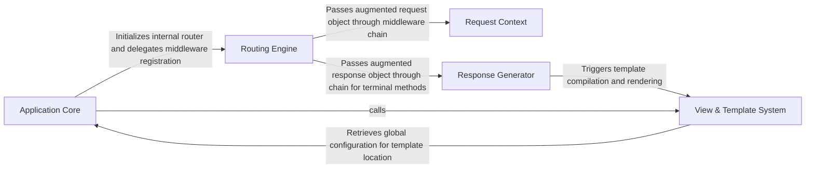

## Details

The Express architecture follows a linear 'Chain of Responsibility' pattern where the Application Core initializes a Routing Engine to act as the primary request handler. Incoming HTTP requests are augmented by the Request Context to provide high-level APIs, then passed through a pipeline of middleware and routes. The Response Generator provides a fluent interface for the final output, delegating to the View & Template System when dynamic HTML rendering is required. This modular approach allows for a minimalist core that is highly extensible through middleware.

### Application Core
The central orchestrator and factory that manages application settings, environment configuration, and the integration of all sub-systems.

**Related Classes/Methods**:

- <a href="https://github.com/expressjs/express/blob/master//home/ivan/StartUp/repos/express/lib/express.js#L36-L56" target="_blank" rel="noopener noreferrer">`lib.express.createApplication`:36-56</a>
- <a href="https://github.com/expressjs/express/blob/master//home/ivan/StartUp/repos/express/lib/application.js#L59-L83" target="_blank" rel="noopener noreferrer">`lib.application.init`:59-83</a>
- <a href="https://github.com/expressjs/express/blob/master//home/ivan/StartUp/repos/express/lib/application.js#L598-L606" target="_blank" rel="noopener noreferrer">`lib.application.listen`:598-606</a>

**Source Files:**

- [`lib/application.js`](https://github.com/expressjs/express/blob/master/lib/application.js)
  - `lib.application.init` ([L59-L83](https://github.com/expressjs/express/blob/master/lib/application.js#L59-L83)) - Function
  - `lib.application.init.get` ([L72-L81](https://github.com/expressjs/express/blob/master/lib/application.js#L72-L81)) - Method
  - `lib.application.defaultConfiguration` ([L90-L141](https://github.com/expressjs/express/blob/master/lib/application.js#L90-L141)) - Function
  - `lib.application.defaultConfiguration.onmount` ([L109-L122](https://github.com/expressjs/express/blob/master/lib/application.js#L109-L122)) - Function
  - `lib.application.use.fns.forEach() callback` ([L219-L241](https://github.com/expressjs/express/blob/master/lib/application.js#L219-L241)) - Function
  - `lib.application.use.fns.forEach() callback.mounted_app` ([L230-L237](https://github.com/expressjs/express/blob/master/lib/application.js#L230-L237)) - Function
  - `lib.application.use.fns.forEach() callback.mounted_app.fn.handle() callback` ([L232-L236](https://github.com/expressjs/express/blob/master/lib/application.js#L232-L236)) - Function
  - `lib.application.route` ([L256-L258](https://github.com/expressjs/express/blob/master/lib/application.js#L256-L258)) - Function
  - `lib.application.engine` ([L294-L308](https://github.com/expressjs/express/blob/master/lib/application.js#L294-L308)) - Function
  - `lib.application.param` ([L322-L334](https://github.com/expressjs/express/blob/master/lib/application.js#L322-L334)) - Function
  - `lib.application.set` ([L351-L383](https://github.com/expressjs/express/blob/master/lib/application.js#L351-L383)) - Function
  - `lib.application.path` ([L399-L403](https://github.com/expressjs/express/blob/master/lib/application.js#L399-L403)) - Function
  - `lib.application.enabled` ([L420-L422](https://github.com/expressjs/express/blob/master/lib/application.js#L420-L422)) - Function
  - `lib.application.disabled` ([L439-L441](https://github.com/expressjs/express/blob/master/lib/application.js#L439-L441)) - Function
  - `lib.application.enable` ([L451-L453](https://github.com/expressjs/express/blob/master/lib/application.js#L451-L453)) - Function
  - `lib.application.disable` ([L463-L465](https://github.com/expressjs/express/blob/master/lib/application.js#L463-L465)) - Function
  - `lib.application.methods.forEach() callback` ([L471-L482](https://github.com/expressjs/express/blob/master/lib/application.js#L471-L482)) - Function
  - `lib.application.all` ([L494-L503](https://github.com/expressjs/express/blob/master/lib/application.js#L494-L503)) - Function
  - `lib.application.listen` ([L598-L606](https://github.com/expressjs/express/blob/master/lib/application.js#L598-L606)) - Function
- [`lib/express.js`](https://github.com/expressjs/express/blob/master/lib/express.js)
  - `lib.express.createApplication` ([L36-L56](https://github.com/expressjs/express/blob/master/lib/express.js#L36-L56)) - Function
- [`lib/request.js`](https://github.com/expressjs/express/blob/master/lib/request.js)
  - `lib.request.header` ([L64-L83](https://github.com/expressjs/express/blob/master/lib/request.js#L64-L83)) - Function
  - `lib.request.protocol` ([L297-L315](https://github.com/expressjs/express/blob/master/lib/request.js#L297-L315)) - Function
  - `lib.request.secure` ([L326-L328](https://github.com/expressjs/express/blob/master/lib/request.js#L326-L328)) - Function
  - `lib.request.ips` ([L357-L366](https://github.com/expressjs/express/blob/master/lib/request.js#L357-L366)) - Function
  - `lib.request.host` ([L418-L431](https://github.com/expressjs/express/blob/master/lib/request.js#L418-L431)) - Function
  - `lib.request.hostname` ([L444-L458](https://github.com/expressjs/express/blob/master/lib/request.js#L444-L458)) - Function
  - `lib.request.stale` ([L497-L499](https://github.com/expressjs/express/blob/master/lib/request.js#L497-L499)) - Function
  - `lib.request.xhr` ([L508-L511](https://github.com/expressjs/express/blob/master/lib/request.js#L508-L511)) - Function
  - `lib.request.defineGetter` ([L521-L527](https://github.com/expressjs/express/blob/master/lib/request.js#L521-L527)) - Function

### Routing Engine
The heart of the framework's logic. It manages the middleware stack and route matching, ensuring requests flow through the correct sequence of handlers.

**Related Classes/Methods**:

- <a href="https://github.com/expressjs/express/blob/master//home/ivan/StartUp/repos/express/lib/application.js#L152-L178" target="_blank" rel="noopener noreferrer">`lib.application.handle`:152-178</a>
- <a href="https://github.com/expressjs/express/blob/master//home/ivan/StartUp/repos/express/lib/application.js#L190-L244" target="_blank" rel="noopener noreferrer">`lib.application.use`:190-244</a>

**Source Files:**

- [`lib/application.js`](https://github.com/expressjs/express/blob/master/lib/application.js)
  - `lib.application.handle` ([L152-L178](https://github.com/expressjs/express/blob/master/lib/application.js#L152-L178)) - Function
  - `lib.application.use` ([L190-L244](https://github.com/expressjs/express/blob/master/lib/application.js#L190-L244)) - Function
  - `lib.application.methods.forEach() callback.[method]` ([L472-L481](https://github.com/expressjs/express/blob/master/lib/application.js#L472-L481)) - Function
  - `lib.application.logerror` ([L615-L618](https://github.com/expressjs/express/blob/master/lib/application.js#L615-L618)) - Function

### Request Context
An abstraction layer that wraps the native Node.js http.IncomingMessage, providing helper methods for parsing URLs, headers, and metadata.

**Related Classes/Methods**:

- <a href="https://github.com/expressjs/express/blob/master//home/ivan/StartUp/repos/express/lib/request.js" target="_blank" rel="noopener noreferrer">`lib.request.accepts`</a>

**Source Files:**

- [`lib/request.js`](https://github.com/expressjs/express/blob/master/lib/request.js)
  - `lib.request.acceptsEncodings` ([L140-L143](https://github.com/expressjs/express/blob/master/lib/request.js#L140-L143)) - Function
  - `lib.request.acceptsCharsets` ([L171-L174](https://github.com/expressjs/express/blob/master/lib/request.js#L171-L174)) - Function
  - `lib.request.acceptsLanguages` ([L185-L187](https://github.com/expressjs/express/blob/master/lib/request.js#L185-L187)) - Function
  - `lib.request.range` ([L214-L218](https://github.com/expressjs/express/blob/master/lib/request.js#L214-L218)) - Function
  - `lib.request.query` ([L230-L241](https://github.com/expressjs/express/blob/master/lib/request.js#L230-L241)) - Function
  - `lib.request.is` ([L269-L281](https://github.com/expressjs/express/blob/master/lib/request.js#L269-L281)) - Function
  - `lib.request.ip` ([L340-L343](https://github.com/expressjs/express/blob/master/lib/request.js#L340-L343)) - Function
  - `lib.request.subdomains` ([L383-L394](https://github.com/expressjs/express/blob/master/lib/request.js#L383-L394)) - Function
  - `lib.request.path` ([L403-L405](https://github.com/expressjs/express/blob/master/lib/request.js#L403-L405)) - Function
  - `lib.request.defineGetter('fresh') callback` ([L469-L486](https://github.com/expressjs/express/blob/master/lib/request.js#L469-L486)) - Function

### Response Generator
An extension of Node.js http.ServerResponse providing a fluent API for sending data formats, cookies, and handling redirects.

**Related Classes/Methods**:

- <a href="https://github.com/expressjs/express/blob/master//home/ivan/StartUp/repos/express/lib/response.js" target="_blank" rel="noopener noreferrer">`lib.response.send`</a>
- <a href="https://github.com/expressjs/express/blob/master//home/ivan/StartUp/repos/express/lib/response.js#L232-L246" target="_blank" rel="noopener noreferrer">`lib.response.json`:232-246</a>

**Source Files:**

- [`lib/response.js`](https://github.com/expressjs/express/blob/master/lib/response.js)
  - `lib.response.status` ([L64-L76](https://github.com/expressjs/express/blob/master/lib/response.js#L64-L76)) - Function
  - `lib.response.links` ([L97-L110](https://github.com/expressjs/express/blob/master/lib/response.js#L97-L110)) - Function
  - `lib.response.links.map() callback` ([L100-L109](https://github.com/expressjs/express/blob/master/lib/response.js#L100-L109)) - Function
  - `lib.response.links.map() callback.map() callback` ([L103-L105](https://github.com/expressjs/express/blob/master/lib/response.js#L103-L105)) - Function
  - `lib.response.json` ([L232-L246](https://github.com/expressjs/express/blob/master/lib/response.js#L232-L246)) - Function
  - `lib.response.jsonp` ([L260-L304](https://github.com/expressjs/express/blob/master/lib/response.js#L260-L304)) - Function
  - `lib.response.sendStatus` ([L321-L328](https://github.com/expressjs/express/blob/master/lib/response.js#L321-L328)) - Function
  - `lib.response.sendFile` ([L371-L413](https://github.com/expressjs/express/blob/master/lib/response.js#L371-L413)) - Function
  - `lib.response.sendFile.sendfile() callback` ([L404-L412](https://github.com/expressjs/express/blob/master/lib/response.js#L404-L412)) - Function
  - `lib.response.download` ([L433-L482](https://github.com/expressjs/express/blob/master/lib/response.js#L433-L482)) - Function
  - `lib.response.contentType` ([L504-L510](https://github.com/expressjs/express/blob/master/lib/response.js#L504-L510)) - Function
  - `lib.response.format` ([L569-L594](https://github.com/expressjs/express/blob/master/lib/response.js#L569-L594)) - Function
  - `lib.response.format.keys` ([L573-L574](https://github.com/expressjs/express/blob/master/lib/response.js#L573-L574)) - Class
  - `lib.response.format.keys.filter() callback` ([L574-L574](https://github.com/expressjs/express/blob/master/lib/response.js#L574-L574)) - Function
  - `lib.response.format.types.map() callback` ([L589-L589](https://github.com/expressjs/express/blob/master/lib/response.js#L589-L589)) - Function
  - `lib.response.attachment` ([L604-L612](https://github.com/expressjs/express/blob/master/lib/response.js#L604-L612)) - Function
  - `lib.response.append` ([L629-L641](https://github.com/expressjs/express/blob/master/lib/response.js#L629-L641)) - Function
  - `lib.response.header` ([L665-L686](https://github.com/expressjs/express/blob/master/lib/response.js#L665-L686)) - Function
  - `lib.response.get` ([L696-L698](https://github.com/expressjs/express/blob/master/lib/response.js#L696-L698)) - Function
  - `lib.response.clearCookie` ([L709-L716](https://github.com/expressjs/express/blob/master/lib/response.js#L709-L716)) - Function
  - `lib.response.location` ([L794-L796](https://github.com/expressjs/express/blob/master/lib/response.js#L794-L796)) - Function
  - `lib.response.redirect` ([L812-L864](https://github.com/expressjs/express/blob/master/lib/response.js#L812-L864)) - Function
  - `lib.response.redirect.text` ([L840-L842](https://github.com/expressjs/express/blob/master/lib/response.js#L840-L842)) - Method
  - `lib.response.redirect.html` ([L844-L848](https://github.com/expressjs/express/blob/master/lib/response.js#L844-L848)) - Method
  - `lib.response.redirect.default` ([L850-L852](https://github.com/expressjs/express/blob/master/lib/response.js#L850-L852)) - Method
  - `lib.response.render` ([L894-L918](https://github.com/expressjs/express/blob/master/lib/response.js#L894-L918)) - Function
  - `lib.response.sendfile` ([L921-L1009](https://github.com/expressjs/express/blob/master/lib/response.js#L921-L1009)) - Function
  - `lib.response.sendfile.onaborted` ([L926-L933](https://github.com/expressjs/express/blob/master/lib/response.js#L926-L933)) - Function
  - `lib.response.sendfile.ondirectory` ([L936-L943](https://github.com/expressjs/express/blob/master/lib/response.js#L936-L943)) - Function
  - `lib.response.sendfile.onerror` ([L946-L950](https://github.com/expressjs/express/blob/master/lib/response.js#L946-L950)) - Function
  - `lib.response.sendfile.onend` ([L953-L957](https://github.com/expressjs/express/blob/master/lib/response.js#L953-L957)) - Function
  - `lib.response.sendfile.onfile` ([L960-L962](https://github.com/expressjs/express/blob/master/lib/response.js#L960-L962)) - Function
  - `lib.response.sendfile.onfinish` ([L965-L980](https://github.com/expressjs/express/blob/master/lib/response.js#L965-L980)) - Function
  - `lib.response.sendfile.onfinish.setImmediate() callback` ([L970-L979](https://github.com/expressjs/express/blob/master/lib/response.js#L970-L979)) - Function
  - `lib.response.sendfile.onstream` ([L983-L985](https://github.com/expressjs/express/blob/master/lib/response.js#L983-L985)) - Function
  - `lib.response.sendfile.headers` ([L996-L1004](https://github.com/expressjs/express/blob/master/lib/response.js#L996-L1004)) - Function
  - `lib.response.stringify` ([L1023-L1047](https://github.com/expressjs/express/blob/master/lib/response.js#L1023-L1047)) - Function
  - `lib.response.stringify.json.replace() callback` ([L1031-L1043](https://github.com/expressjs/express/blob/master/lib/response.js#L1031-L1043)) - Function

### View & Template System
Manages the rendering of dynamic HTML templates, handling engine lookups and template caching.

**Related Classes/Methods**:

- <a href="https://github.com/expressjs/express/blob/master//home/ivan/StartUp/repos/express/lib/view.js#L52-L187" target="_blank" rel="noopener noreferrer">`lib.view.View`:52-187</a>
- <a href="https://github.com/expressjs/express/blob/master//home/ivan/StartUp/repos/express/lib/application.js#L522-L575" target="_blank" rel="noopener noreferrer">`lib.application.render`:522-575</a>
- <a href="https://github.com/expressjs/express/blob/master//home/ivan/StartUp/repos/express/lib/utils.js" target="_blank" rel="noopener noreferrer">`lib.utils.etag`</a>

**Source Files:**

- [`lib/application.js`](https://github.com/expressjs/express/blob/master/lib/application.js)
  - `lib.application.render` ([L522-L575](https://github.com/expressjs/express/blob/master/lib/application.js#L522-L575)) - Function
  - `lib.application.tryRender` ([L625-L631](https://github.com/expressjs/express/blob/master/lib/application.js#L625-L631)) - Function
- [`lib/utils.js`](https://github.com/expressjs/express/blob/master/lib/utils.js)
  - `lib.utils.methods` ([L29-L29](https://github.com/expressjs/express/blob/master/lib/utils.js#L29-L29)) - Class
  - `lib.utils.methods.METHODS.map() callback` ([L29-L29](https://github.com/expressjs/express/blob/master/lib/utils.js#L29-L29)) - Function
  - `lib.utils.normalizeType.normalizeType` ([L61-L65](https://github.com/expressjs/express/blob/master/lib/utils.js#L61-L65)) - Function
  - `lib.utils.normalizeTypes.normalizeTypes` ([L75-L77](https://github.com/expressjs/express/blob/master/lib/utils.js#L75-L77)) - Function
  - `lib.utils.acceptParams` ([L89-L120](https://github.com/expressjs/express/blob/master/lib/utils.js#L89-L120)) - Function
  - `lib.utils.compileETag.compileETag` ([L130-L152](https://github.com/expressjs/express/blob/master/lib/utils.js#L130-L152)) - Function
  - `lib.utils.compileQueryParser.compileQueryParser` ([L162-L184](https://github.com/expressjs/express/blob/master/lib/utils.js#L162-L184)) - Function
  - `lib.utils.compileTrust.compileTrust` ([L194-L214](https://github.com/expressjs/express/blob/master/lib/utils.js#L194-L214)) - Function
  - `lib.utils.compileTrust.compileTrust.map() callback` ([L210-L210](https://github.com/expressjs/express/blob/master/lib/utils.js#L210-L210)) - Function
  - `lib.utils.setCharset.setCharset` ([L225-L238](https://github.com/expressjs/express/blob/master/lib/utils.js#L225-L238)) - Function
  - `lib.utils.createETagGenerator` ([L249-L257](https://github.com/expressjs/express/blob/master/lib/utils.js#L249-L257)) - Function
  - `lib.utils.createETagGenerator.generateETag` ([L250-L256](https://github.com/expressjs/express/blob/master/lib/utils.js#L250-L256)) - Function
  - `lib.utils.parseExtendedQueryString` ([L267-L271](https://github.com/expressjs/express/blob/master/lib/utils.js#L267-L271)) - Function
- [`lib/view.js`](https://github.com/expressjs/express/blob/master/lib/view.js)
  - `lib.view.View.constructor` ([L52-L95](https://github.com/expressjs/express/blob/master/lib/view.js#L52-L95)) - Constructor
  - `lib.view.View` ([L52-L187](https://github.com/expressjs/express/blob/master/lib/view.js#L52-L187)) - Class
  - `lib.view.View.lookup` ([L104-L123](https://github.com/expressjs/express/blob/master/lib/view.js#L104-L123)) - Function
  - `lib.view.View.render` ([L133-L159](https://github.com/expressjs/express/blob/master/lib/view.js#L133-L159)) - Function
  - `lib.view.View.render.onRender` ([L139-L156](https://github.com/expressjs/express/blob/master/lib/view.js#L139-L156)) - Function
  - `lib.view.View.render.onRender.renderTick` ([L153-L155](https://github.com/expressjs/express/blob/master/lib/view.js#L153-L155)) - Function
  - `lib.view.View.resolve` ([L169-L187](https://github.com/expressjs/express/blob/master/lib/view.js#L169-L187)) - Function
  - `lib.view.tryStat` ([L197-L205](https://github.com/expressjs/express/blob/master/lib/view.js#L197-L205)) - Function

### [FAQ](https://github.com/CodeBoarding/GeneratedOnBoardings/tree/main?tab=readme-ov-file#faq)