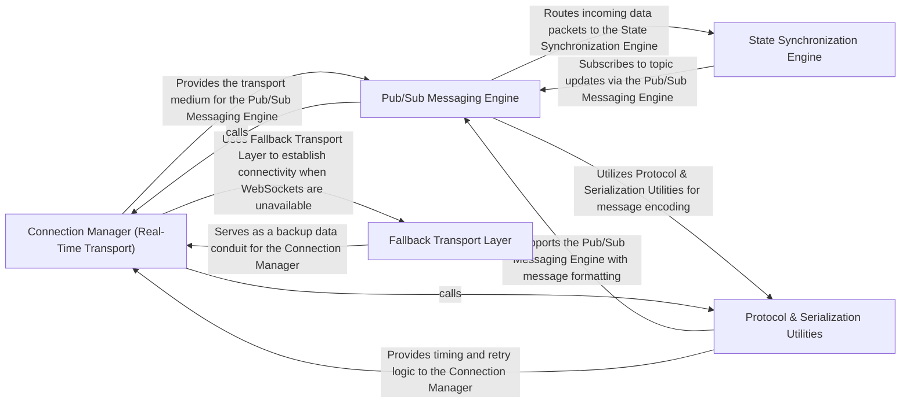

## Details

This architectural analysis of the phoenix platform focuses on its real-time communication backbone, which facilitates the ingestion and synchronization of observability data (traces, evaluations, and state). The system follows a layered transport architecture where a central Connection Manager orchestrates persistent links, delegating to a Fallback Transport layer when necessary. Data is logically segmented via a Pub/Sub Messaging Engine, which supports higher-level protocols like the State Synchronization Engine for consistent multi-client views.

### Connection Manager (Real-Time Transport)
The primary entry point for client-server communication. it manages the lifecycle of persistent connections, handling heartbeats, connection retries, and multiplexing.

**Related Classes/Methods**:

- <a href="https://github.com/phoenixframework/phoenix/blob/main//home/ivan/StartUp/repos/phoenix/assets/js/phoenix/socket.js#L279-L290" target="_blank" rel="noopener noreferrer">`assets.js.phoenix.socket.Socket.connect`:279-290</a>
- <a href="https://github.com/phoenixframework/phoenix/blob/main//home/ivan/StartUp/repos/phoenix/assets/js/phoenix/socket.js#L481-L489" target="_blank" rel="noopener noreferrer">`assets.js.phoenix.socket.Socket.heartbeatTimeout`:481-489</a>

**Source Files:**

- [`assets/js/phoenix/channel.js`](https://github.com/phoenixframework/phoenix/blob/main/assets/js/phoenix/channel.js)
  - `assets.js.phoenix.channel.Channel` ([L16-L311](https://github.com/phoenixframework/phoenix/blob/main/assets/js/phoenix/channel.js#L16-L311)) - Class
  - `assets.js.phoenix.channel.Channel.constructor` ([L17-L72](https://github.com/phoenixframework/phoenix/blob/main/assets/js/phoenix/channel.js#L17-L72)) - Constructor
  - `assets.js.phoenix.channel.Channel.constructor.socket.onError() callback` ([L33-L33](https://github.com/phoenixframework/phoenix/blob/main/assets/js/phoenix/channel.js#L33-L33)) - Function
  - `assets.js.phoenix.channel.Channel.constructor.socket.onOpen() callback` ([L34-L37](https://github.com/phoenixframework/phoenix/blob/main/assets/js/phoenix/channel.js#L34-L37)) - Function
  - `assets.js.phoenix.channel.Channel.constructor.joinPush.receive("ok") callback` ([L39-L44](https://github.com/phoenixframework/phoenix/blob/main/assets/js/phoenix/channel.js#L39-L44)) - Function
  - `assets.js.phoenix.channel.Channel.constructor.joinPush.receive("ok") callback.pushBuffer.forEach() callback` ([L42-L42](https://github.com/phoenixframework/phoenix/blob/main/assets/js/phoenix/channel.js#L42-L42)) - Function
  - `assets.js.phoenix.channel.Channel.constructor.joinPush.receive("error") callback` ([L45-L48](https://github.com/phoenixframework/phoenix/blob/main/assets/js/phoenix/channel.js#L45-L48)) - Function
  - `assets.js.phoenix.channel.Channel.constructor.onClose() callback` ([L49-L54](https://github.com/phoenixframework/phoenix/blob/main/assets/js/phoenix/channel.js#L49-L54)) - Function
  - `assets.js.phoenix.channel.Channel.constructor.onError() callback` ([L55-L60](https://github.com/phoenixframework/phoenix/blob/main/assets/js/phoenix/channel.js#L55-L60)) - Function
  - `assets.js.phoenix.channel.Channel.constructor.joinPush.receive("timeout") callback` ([L61-L68](https://github.com/phoenixframework/phoenix/blob/main/assets/js/phoenix/channel.js#L61-L68)) - Function
  - `assets.js.phoenix.channel.Channel.constructor.on() callback` ([L69-L71](https://github.com/phoenixframework/phoenix/blob/main/assets/js/phoenix/channel.js#L69-L71)) - Function
  - `assets.js.phoenix.channel.Channel.join` ([L79-L88](https://github.com/phoenixframework/phoenix/blob/main/assets/js/phoenix/channel.js#L79-L88)) - Method
  - `assets.js.phoenix.channel.Channel.onClose` ([L94-L96](https://github.com/phoenixframework/phoenix/blob/main/assets/js/phoenix/channel.js#L94-L96)) - Method
  - `assets.js.phoenix.channel.Channel.onError` ([L102-L104](https://github.com/phoenixframework/phoenix/blob/main/assets/js/phoenix/channel.js#L102-L104)) - Method
  - `assets.js.phoenix.channel.Channel.onError.on() callback` ([L103-L103](https://github.com/phoenixframework/phoenix/blob/main/assets/js/phoenix/channel.js#L103-L103)) - Function
  - `assets.js.phoenix.channel.Channel.on` ([L123-L127](https://github.com/phoenixframework/phoenix/blob/main/assets/js/phoenix/channel.js#L123-L127)) - Method
  - `assets.js.phoenix.channel.Channel.off` ([L147-L151](https://github.com/phoenixframework/phoenix/blob/main/assets/js/phoenix/channel.js#L147-L151)) - Method
  - `assets.js.phoenix.channel.Channel.off.bindings.filter() callback` ([L148-L150](https://github.com/phoenixframework/phoenix/blob/main/assets/js/phoenix/channel.js#L148-L150)) - Function
  - `assets.js.phoenix.channel.Channel.canPush` ([L156-L156](https://github.com/phoenixframework/phoenix/blob/main/assets/js/phoenix/channel.js#L156-L156)) - Method
  - `assets.js.phoenix.channel.Channel.push` ([L174-L188](https://github.com/phoenixframework/phoenix/blob/main/assets/js/phoenix/channel.js#L174-L188)) - Method
  - `assets.js.phoenix.channel.Channel.leave` ([L206-L222](https://github.com/phoenixframework/phoenix/blob/main/assets/js/phoenix/channel.js#L206-L222)) - Method
  - `assets.js.phoenix.channel.Channel.leave.leavePush.receive("ok") callback` ([L216-L216](https://github.com/phoenixframework/phoenix/blob/main/assets/js/phoenix/channel.js#L216-L216)) - Function
  - `assets.js.phoenix.channel.Channel.leave.receive("timeout") callback` ([L217-L217](https://github.com/phoenixframework/phoenix/blob/main/assets/js/phoenix/channel.js#L217-L217)) - Function
  - `assets.js.phoenix.channel.Channel.onMessage` ([L236-L236](https://github.com/phoenixframework/phoenix/blob/main/assets/js/phoenix/channel.js#L236-L236)) - Method
  - `assets.js.phoenix.channel.Channel.isMember` ([L241-L250](https://github.com/phoenixframework/phoenix/blob/main/assets/js/phoenix/channel.js#L241-L250)) - Method
  - `assets.js.phoenix.channel.Channel.joinRef` ([L255-L255](https://github.com/phoenixframework/phoenix/blob/main/assets/js/phoenix/channel.js#L255-L255)) - Method
  - `assets.js.phoenix.channel.Channel.rejoin` ([L260-L265](https://github.com/phoenixframework/phoenix/blob/main/assets/js/phoenix/channel.js#L260-L265)) - Method
  - `assets.js.phoenix.channel.Channel.trigger` ([L270-L280](https://github.com/phoenixframework/phoenix/blob/main/assets/js/phoenix/channel.js#L270-L280)) - Method
  - `assets.js.phoenix.channel.Channel.trigger.eventBindings` ([L274-L274](https://github.com/phoenixframework/phoenix/blob/main/assets/js/phoenix/channel.js#L274-L274)) - Class
  - `assets.js.phoenix.channel.Channel.trigger.eventBindings.bindings.filter() callback` ([L274-L274](https://github.com/phoenixframework/phoenix/blob/main/assets/js/phoenix/channel.js#L274-L274)) - Function
  - `assets.js.phoenix.channel.Channel.replyEventName` ([L285-L285](https://github.com/phoenixframework/phoenix/blob/main/assets/js/phoenix/channel.js#L285-L285)) - Method
  - `assets.js.phoenix.channel.Channel.isClosed` ([L290-L290](https://github.com/phoenixframework/phoenix/blob/main/assets/js/phoenix/channel.js#L290-L290)) - Method
  - `assets.js.phoenix.channel.Channel.isErrored` ([L295-L295](https://github.com/phoenixframework/phoenix/blob/main/assets/js/phoenix/channel.js#L295-L295)) - Method
  - `assets.js.phoenix.channel.Channel.isJoined` ([L300-L300](https://github.com/phoenixframework/phoenix/blob/main/assets/js/phoenix/channel.js#L300-L300)) - Method
  - `assets.js.phoenix.channel.Channel.isJoining` ([L305-L305](https://github.com/phoenixframework/phoenix/blob/main/assets/js/phoenix/channel.js#L305-L305)) - Method
  - `assets.js.phoenix.channel.Channel.isLeaving` ([L310-L310](https://github.com/phoenixframework/phoenix/blob/main/assets/js/phoenix/channel.js#L310-L310)) - Method
- [`assets/js/phoenix/push.js`](https://github.com/phoenixframework/phoenix/blob/main/assets/js/phoenix/push.js)
  - `assets.js.phoenix.push.Push` ([L8-L128](https://github.com/phoenixframework/phoenix/blob/main/assets/js/phoenix/push.js#L8-L128)) - Class
  - `assets.js.phoenix.push.Push.constructor` ([L9-L18](https://github.com/phoenixframework/phoenix/blob/main/assets/js/phoenix/push.js#L9-L18)) - Constructor
  - `assets.js.phoenix.push.Push.constructor.payload` ([L12-L12](https://github.com/phoenixframework/phoenix/blob/main/assets/js/phoenix/push.js#L12-L12)) - Function
  - `assets.js.phoenix.push.Push.resend` ([L24-L28](https://github.com/phoenixframework/phoenix/blob/main/assets/js/phoenix/push.js#L24-L28)) - Method
  - `assets.js.phoenix.push.Push.send` ([L33-L44](https://github.com/phoenixframework/phoenix/blob/main/assets/js/phoenix/push.js#L33-L44)) - Method
  - `assets.js.phoenix.push.Push.receive` ([L51-L58](https://github.com/phoenixframework/phoenix/blob/main/assets/js/phoenix/push.js#L51-L58)) - Method
  - `assets.js.phoenix.push.Push.reset` ([L63-L69](https://github.com/phoenixframework/phoenix/blob/main/assets/js/phoenix/push.js#L63-L69)) - Method
  - `assets.js.phoenix.push.Push.matchReceive` ([L74-L77](https://github.com/phoenixframework/phoenix/blob/main/assets/js/phoenix/push.js#L74-L77)) - Method
  - `assets.js.phoenix.push.Push.matchReceive.recHooks.filter() callback` ([L75-L75](https://github.com/phoenixframework/phoenix/blob/main/assets/js/phoenix/push.js#L75-L75)) - Function
  - `assets.js.phoenix.push.Push.matchReceive.forEach() callback` ([L76-L76](https://github.com/phoenixframework/phoenix/blob/main/assets/js/phoenix/push.js#L76-L76)) - Function
  - `assets.js.phoenix.push.Push.cancelRefEvent` ([L82-L85](https://github.com/phoenixframework/phoenix/blob/main/assets/js/phoenix/push.js#L82-L85)) - Method
  - `assets.js.phoenix.push.Push.cancelTimeout` ([L90-L93](https://github.com/phoenixframework/phoenix/blob/main/assets/js/phoenix/push.js#L90-L93)) - Method
  - `assets.js.phoenix.push.Push.startTimeout` ([L98-L113](https://github.com/phoenixframework/phoenix/blob/main/assets/js/phoenix/push.js#L98-L113)) - Method
  - `assets.js.phoenix.push.Push.startTimeout.channel.on() callback` ([L103-L108](https://github.com/phoenixframework/phoenix/blob/main/assets/js/phoenix/push.js#L103-L108)) - Function
  - `assets.js.phoenix.push.Push.startTimeout.setTimeout() callback` ([L110-L112](https://github.com/phoenixframework/phoenix/blob/main/assets/js/phoenix/push.js#L110-L112)) - Function
  - `assets.js.phoenix.push.Push.hasReceived` ([L118-L120](https://github.com/phoenixframework/phoenix/blob/main/assets/js/phoenix/push.js#L118-L120)) - Method
  - `assets.js.phoenix.push.Push.trigger` ([L125-L127](https://github.com/phoenixframework/phoenix/blob/main/assets/js/phoenix/push.js#L125-L127)) - Method
- [`assets/js/phoenix/serializer.js`](https://github.com/phoenixframework/phoenix/blob/main/assets/js/phoenix/serializer.js)
  - `assets.js.phoenix.serializer.default` ([L6-L130](https://github.com/phoenixframework/phoenix/blob/main/assets/js/phoenix/serializer.js#L6-L130)) - Class
  - `assets.js.phoenix.serializer.default.encode` ([L11-L18](https://github.com/phoenixframework/phoenix/blob/main/assets/js/phoenix/serializer.js#L11-L18)) - Method
  - `assets.js.phoenix.serializer.default.decode` ([L20-L27](https://github.com/phoenixframework/phoenix/blob/main/assets/js/phoenix/serializer.js#L20-L27)) - Method
  - `assets.js.phoenix.serializer.default.binaryEncode` ([L31-L65](https://github.com/phoenixframework/phoenix/blob/main/assets/js/phoenix/serializer.js#L31-L65)) - Method
  - `assets.js.phoenix.serializer.default.assertFieldSize` ([L67-L71](https://github.com/phoenixframework/phoenix/blob/main/assets/js/phoenix/serializer.js#L67-L71)) - Method
  - `assets.js.phoenix.serializer.default.binaryDecode` ([L73-L82](https://github.com/phoenixframework/phoenix/blob/main/assets/js/phoenix/serializer.js#L73-L82)) - Method
  - `assets.js.phoenix.serializer.default.decodePush` ([L84-L97](https://github.com/phoenixframework/phoenix/blob/main/assets/js/phoenix/serializer.js#L84-L97)) - Method
  - `assets.js.phoenix.serializer.default.decodeReply` ([L99-L116](https://github.com/phoenixframework/phoenix/blob/main/assets/js/phoenix/serializer.js#L99-L116)) - Method
  - `assets.js.phoenix.serializer.default.decodeBroadcast` ([L118-L129](https://github.com/phoenixframework/phoenix/blob/main/assets/js/phoenix/serializer.js#L118-L129)) - Method
- [`assets/js/phoenix/socket.js`](https://github.com/phoenixframework/phoenix/blob/main/assets/js/phoenix/socket.js)
  - `assets.js.phoenix.socket.Socket` ([L113-L710](https://github.com/phoenixframework/phoenix/blob/main/assets/js/phoenix/socket.js#L113-L710)) - Class
  - `assets.js.phoenix.socket.Socket.constructor` ([L114-L205](https://github.com/phoenixframework/phoenix/blob/main/assets/js/phoenix/socket.js#L114-L205)) - Constructor
  - `assets.js.phoenix.socket.Socket.constructor.phxWindow.addEventListener("pagehide") callback` ([L146-L151](https://github.com/phoenixframework/phoenix/blob/main/assets/js/phoenix/socket.js#L146-L151)) - Function
  - `assets.js.phoenix.socket.Socket.constructor.phxWindow.addEventListener("pageshow") callback` ([L152-L157](https://github.com/phoenixframework/phoenix/blob/main/assets/js/phoenix/socket.js#L152-L157)) - Function
  - `assets.js.phoenix.socket.Socket.constructor.phxWindow.addEventListener("visibilitychange") callback` ([L158-L168](https://github.com/phoenixframework/phoenix/blob/main/assets/js/phoenix/socket.js#L158-L168)) - Function
  - `assets.js.phoenix.socket.Socket.constructor.phxWindow.addEventListener("visibilitychange") callback.teardown() callback` ([L165-L165](https://github.com/phoenixframework/phoenix/blob/main/assets/js/phoenix/socket.js#L165-L165)) - Function
  - `assets.js.phoenix.socket.Socket.constructor.rejoinAfterMs` ([L171-L177](https://github.com/phoenixframework/phoenix/blob/main/assets/js/phoenix/socket.js#L171-L177)) - Function
  - `assets.js.phoenix.socket.Socket.constructor.reconnectAfterMs` ([L178-L184](https://github.com/phoenixframework/phoenix/blob/main/assets/js/phoenix/socket.js#L178-L184)) - Function
  - `assets.js.phoenix.socket.Socket.constructor.logger` ([L187-L187](https://github.com/phoenixframework/phoenix/blob/main/assets/js/phoenix/socket.js#L187-L187)) - Function
  - `assets.js.phoenix.socket.Socket.constructor.<function>` ([L196-L203](https://github.com/phoenixframework/phoenix/blob/main/assets/js/phoenix/socket.js#L196-L203)) - Function
  - `assets.js.phoenix.socket.Socket.constructor.<function>.teardown() callback` ([L202-L202](https://github.com/phoenixframework/phoenix/blob/main/assets/js/phoenix/socket.js#L202-L202)) - Function
  - `assets.js.phoenix.socket.Socket.getLongPollTransport` ([L210-L210](https://github.com/phoenixframework/phoenix/blob/main/assets/js/phoenix/socket.js#L210-L210)) - Method
  - `assets.js.phoenix.socket.Socket.replaceTransport` ([L218-L228](https://github.com/phoenixframework/phoenix/blob/main/assets/js/phoenix/socket.js#L218-L228)) - Method
  - `assets.js.phoenix.socket.Socket.protocol` ([L235-L235](https://github.com/phoenixframework/phoenix/blob/main/assets/js/phoenix/socket.js#L235-L235)) - Method
  - `assets.js.phoenix.socket.Socket.endPointURL` ([L242-L249](https://github.com/phoenixframework/phoenix/blob/main/assets/js/phoenix/socket.js#L242-L249)) - Method
  - `assets.js.phoenix.socket.Socket.disconnect` ([L260-L270](https://github.com/phoenixframework/phoenix/blob/main/assets/js/phoenix/socket.js#L260-L270)) - Method
  - `assets.js.phoenix.socket.Socket.disconnect.teardown() callback` ([L266-L269](https://github.com/phoenixframework/phoenix/blob/main/assets/js/phoenix/socket.js#L266-L269)) - Function
  - `assets.js.phoenix.socket.Socket.connect` ([L279-L290](https://github.com/phoenixframework/phoenix/blob/main/assets/js/phoenix/socket.js#L279-L290)) - Method
  - `assets.js.phoenix.socket.Socket.log` ([L298-L298](https://github.com/phoenixframework/phoenix/blob/main/assets/js/phoenix/socket.js#L298-L298)) - Method
  - `assets.js.phoenix.socket.Socket.hasLogger` ([L303-L303](https://github.com/phoenixframework/phoenix/blob/main/assets/js/phoenix/socket.js#L303-L303)) - Method
  - `assets.js.phoenix.socket.Socket.onOpen` ([L312-L316](https://github.com/phoenixframework/phoenix/blob/main/assets/js/phoenix/socket.js#L312-L316)) - Method
  - `assets.js.phoenix.socket.Socket.onClose` ([L322-L326](https://github.com/phoenixframework/phoenix/blob/main/assets/js/phoenix/socket.js#L322-L326)) - Method
  - `assets.js.phoenix.socket.Socket.onError` ([L335-L339](https://github.com/phoenixframework/phoenix/blob/main/assets/js/phoenix/socket.js#L335-L339)) - Method
  - `assets.js.phoenix.socket.Socket.onMessage` ([L345-L349](https://github.com/phoenixframework/phoenix/blob/main/assets/js/phoenix/socket.js#L345-L349)) - Method
  - `assets.js.phoenix.socket.Socket.ping` ([L357-L369](https://github.com/phoenixframework/phoenix/blob/main/assets/js/phoenix/socket.js#L357-L369)) - Method
  - `assets.js.phoenix.socket.Socket.ping.onMsgRef` ([L362-L367](https://github.com/phoenixframework/phoenix/blob/main/assets/js/phoenix/socket.js#L362-L367)) - Class
  - `assets.js.phoenix.socket.Socket.ping.onMsgRef.onMessage() callback` ([L362-L367](https://github.com/phoenixframework/phoenix/blob/main/assets/js/phoenix/socket.js#L362-L367)) - Function
  - `assets.js.phoenix.socket.Socket.transportName` ([L376-L387](https://github.com/phoenixframework/phoenix/blob/main/assets/js/phoenix/socket.js#L376-L387)) - Method
  - `assets.js.phoenix.socket.Socket.transportConnect` ([L392-L408](https://github.com/phoenixframework/phoenix/blob/main/assets/js/phoenix/socket.js#L392-L408)) - Method
  - `assets.js.phoenix.socket.Socket.getSession` ([L410-L410](https://github.com/phoenixframework/phoenix/blob/main/assets/js/phoenix/socket.js#L410-L410)) - Method
  - `assets.js.phoenix.socket.Socket.storeSession` ([L412-L412](https://github.com/phoenixframework/phoenix/blob/main/assets/js/phoenix/socket.js#L412-L412)) - Method
  - `assets.js.phoenix.socket.Socket.connectWithFallback` ([L414-L459](https://github.com/phoenixframework/phoenix/blob/main/assets/js/phoenix/socket.js#L414-L459)) - Method
  - `assets.js.phoenix.socket.Socket.connectWithFallback.onError() callback` ([L431-L437](https://github.com/phoenixframework/phoenix/blob/main/assets/js/phoenix/socket.js#L431-L437)) - Function
  - `assets.js.phoenix.socket.Socket.connectWithFallback.onOpen() callback` ([L441-L457](https://github.com/phoenixframework/phoenix/blob/main/assets/js/phoenix/socket.js#L441-L457)) - Function
  - `assets.js.phoenix.socket.Socket.connectWithFallback.onOpen() callback.ping() callback` ([L452-L456](https://github.com/phoenixframework/phoenix/blob/main/assets/js/phoenix/socket.js#L452-L456)) - Function
  - `assets.js.phoenix.socket.Socket.clearHeartbeats` ([L461-L464](https://github.com/phoenixframework/phoenix/blob/main/assets/js/phoenix/socket.js#L461-L464)) - Method
  - `assets.js.phoenix.socket.Socket.onConnOpen` ([L466-L475](https://github.com/phoenixframework/phoenix/blob/main/assets/js/phoenix/socket.js#L466-L475)) - Method
  - `assets.js.phoenix.socket.Socket.onConnOpen.stateChangeCallbacks.open.forEach() callback` ([L474-L474](https://github.com/phoenixframework/phoenix/blob/main/assets/js/phoenix/socket.js#L474-L474)) - Function
  - `assets.js.phoenix.socket.Socket.heartbeatTimeout` ([L481-L489](https://github.com/phoenixframework/phoenix/blob/main/assets/js/phoenix/socket.js#L481-L489)) - Method
  - `assets.js.phoenix.socket.Socket.heartbeatTimeout.teardown("heartbeat timeout") callback` ([L487-L487](https://github.com/phoenixframework/phoenix/blob/main/assets/js/phoenix/socket.js#L487-L487)) - Function
  - `assets.js.phoenix.socket.Socket.resetHeartbeat` ([L491-L496](https://github.com/phoenixframework/phoenix/blob/main/assets/js/phoenix/socket.js#L491-L496)) - Method
  - `assets.js.phoenix.socket.Socket.resetHeartbeat.setTimeout() callback` ([L495-L495](https://github.com/phoenixframework/phoenix/blob/main/assets/js/phoenix/socket.js#L495-L495)) - Function
  - `assets.js.phoenix.socket.Socket.teardown` ([L498-L522](https://github.com/phoenixframework/phoenix/blob/main/assets/js/phoenix/socket.js#L498-L522)) - Method
  - `assets.js.phoenix.socket.Socket.teardown.waitForBufferDone() callback` ([L507-L521](https://github.com/phoenixframework/phoenix/blob/main/assets/js/phoenix/socket.js#L507-L521)) - Function
  - `assets.js.phoenix.socket.Socket.teardown.waitForBufferDone() callback.waitForSocketClosed() callback` ([L510-L520](https://github.com/phoenixframework/phoenix/blob/main/assets/js/phoenix/socket.js#L510-L520)) - Function
  - `assets.js.phoenix.socket.Socket.waitForBufferDone` ([L524-L533](https://github.com/phoenixframework/phoenix/blob/main/assets/js/phoenix/socket.js#L524-L533)) - Method
  - `assets.js.phoenix.socket.Socket.waitForBufferDone.setTimeout() callback` ([L530-L532](https://github.com/phoenixframework/phoenix/blob/main/assets/js/phoenix/socket.js#L530-L532)) - Function
  - `assets.js.phoenix.socket.Socket.waitForSocketClosed` ([L535-L544](https://github.com/phoenixframework/phoenix/blob/main/assets/js/phoenix/socket.js#L535-L544)) - Method
  - `assets.js.phoenix.socket.Socket.waitForSocketClosed.setTimeout() callback` ([L541-L543](https://github.com/phoenixframework/phoenix/blob/main/assets/js/phoenix/socket.js#L541-L543)) - Function
  - `assets.js.phoenix.socket.Socket.onConnClose` ([L546-L556](https://github.com/phoenixframework/phoenix/blob/main/assets/js/phoenix/socket.js#L546-L556)) - Method
  - `assets.js.phoenix.socket.Socket.onConnClose.onclose` ([L547-L547](https://github.com/phoenixframework/phoenix/blob/main/assets/js/phoenix/socket.js#L547-L547)) - Function
  - `assets.js.phoenix.socket.Socket.onConnClose.stateChangeCallbacks.close.forEach() callback` ([L555-L555](https://github.com/phoenixframework/phoenix/blob/main/assets/js/phoenix/socket.js#L555-L555)) - Function
  - `assets.js.phoenix.socket.Socket.onConnError` ([L561-L571](https://github.com/phoenixframework/phoenix/blob/main/assets/js/phoenix/socket.js#L561-L571)) - Method
  - `assets.js.phoenix.socket.Socket.onConnError.stateChangeCallbacks.error.forEach() callback` ([L565-L567](https://github.com/phoenixframework/phoenix/blob/main/assets/js/phoenix/socket.js#L565-L567)) - Function
  - `assets.js.phoenix.socket.Socket.triggerChanError` ([L576-L582](https://github.com/phoenixframework/phoenix/blob/main/assets/js/phoenix/socket.js#L576-L582)) - Method
  - `assets.js.phoenix.socket.Socket.triggerChanError.channels.forEach() callback` ([L577-L581](https://github.com/phoenixframework/phoenix/blob/main/assets/js/phoenix/socket.js#L577-L581)) - Function
  - `assets.js.phoenix.socket.Socket.connectionState` ([L587-L594](https://github.com/phoenixframework/phoenix/blob/main/assets/js/phoenix/socket.js#L587-L594)) - Method
  - `assets.js.phoenix.socket.Socket.isConnected` ([L599-L599](https://github.com/phoenixframework/phoenix/blob/main/assets/js/phoenix/socket.js#L599-L599)) - Method
  - `assets.js.phoenix.socket.Socket.remove` ([L606-L609](https://github.com/phoenixframework/phoenix/blob/main/assets/js/phoenix/socket.js#L606-L609)) - Method
  - `assets.js.phoenix.socket.Socket.remove.channels.filter() callback` ([L608-L608](https://github.com/phoenixframework/phoenix/blob/main/assets/js/phoenix/socket.js#L608-L608)) - Function
  - `assets.js.phoenix.socket.Socket.off` ([L617-L623](https://github.com/phoenixframework/phoenix/blob/main/assets/js/phoenix/socket.js#L617-L623)) - Method
  - `assets.js.phoenix.socket.Socket.off.filter() callback` ([L619-L621](https://github.com/phoenixframework/phoenix/blob/main/assets/js/phoenix/socket.js#L619-L621)) - Function
  - `assets.js.phoenix.socket.Socket.channel` ([L632-L636](https://github.com/phoenixframework/phoenix/blob/main/assets/js/phoenix/socket.js#L632-L636)) - Method
  - `assets.js.phoenix.socket.Socket.push` ([L641-L652](https://github.com/phoenixframework/phoenix/blob/main/assets/js/phoenix/socket.js#L641-L652)) - Method
  - `assets.js.phoenix.socket.Socket.push.encode() callback` ([L648-L648](https://github.com/phoenixframework/phoenix/blob/main/assets/js/phoenix/socket.js#L648-L648)) - Function
  - `assets.js.phoenix.socket.Socket.push.sendBuffer.push() callback` ([L650-L650](https://github.com/phoenixframework/phoenix/blob/main/assets/js/phoenix/socket.js#L650-L650)) - Function
  - `assets.js.phoenix.socket.Socket.push.sendBuffer.push() callback.encode() callback` ([L650-L650](https://github.com/phoenixframework/phoenix/blob/main/assets/js/phoenix/socket.js#L650-L650)) - Function
  - `assets.js.phoenix.socket.Socket.makeRef` ([L658-L663](https://github.com/phoenixframework/phoenix/blob/main/assets/js/phoenix/socket.js#L658-L663)) - Method
  - `assets.js.phoenix.socket.Socket.sendHeartbeat` ([L665-L670](https://github.com/phoenixframework/phoenix/blob/main/assets/js/phoenix/socket.js#L665-L670)) - Method
  - `assets.js.phoenix.socket.Socket.sendHeartbeat.setTimeout() callback` ([L669-L669](https://github.com/phoenixframework/phoenix/blob/main/assets/js/phoenix/socket.js#L669-L669)) - Function
  - `assets.js.phoenix.socket.Socket.flushSendBuffer` ([L672-L677](https://github.com/phoenixframework/phoenix/blob/main/assets/js/phoenix/socket.js#L672-L677)) - Method
  - `assets.js.phoenix.socket.Socket.flushSendBuffer.sendBuffer.forEach() callback` ([L674-L674](https://github.com/phoenixframework/phoenix/blob/main/assets/js/phoenix/socket.js#L674-L674)) - Function
  - `assets.js.phoenix.socket.Socket.onConnMessage` ([L679-L701](https://github.com/phoenixframework/phoenix/blob/main/assets/js/phoenix/socket.js#L679-L701)) - Method
  - `assets.js.phoenix.socket.Socket.onConnMessage.decode() callback` ([L680-L700](https://github.com/phoenixframework/phoenix/blob/main/assets/js/phoenix/socket.js#L680-L700)) - Function
  - `assets.js.phoenix.socket.Socket.onConnMessage.decode() callback.setTimeout() callback` ([L685-L685](https://github.com/phoenixframework/phoenix/blob/main/assets/js/phoenix/socket.js#L685-L685)) - Function
  - `assets.js.phoenix.socket.Socket.leaveOpenTopic` ([L703-L709](https://github.com/phoenixframework/phoenix/blob/main/assets/js/phoenix/socket.js#L703-L709)) - Method
  - `assets.js.phoenix.socket.Socket.leaveOpenTopic.dupChannel` ([L704-L704](https://github.com/phoenixframework/phoenix/blob/main/assets/js/phoenix/socket.js#L704-L704)) - Class
  - `assets.js.phoenix.socket.Socket.leaveOpenTopic.dupChannel.channels.find() callback` ([L704-L704](https://github.com/phoenixframework/phoenix/blob/main/assets/js/phoenix/socket.js#L704-L704)) - Function
- [`assets/js/phoenix/timer.js`](https://github.com/phoenixframework/phoenix/blob/main/assets/js/phoenix/timer.js)
  - `assets.js.phoenix.timer.Timer` ([L18-L42](https://github.com/phoenixframework/phoenix/blob/main/assets/js/phoenix/timer.js#L18-L42)) - Class
  - `assets.js.phoenix.timer.Timer.constructor` ([L19-L24](https://github.com/phoenixframework/phoenix/blob/main/assets/js/phoenix/timer.js#L19-L24)) - Constructor
  - `assets.js.phoenix.timer.Timer.reset` ([L26-L29](https://github.com/phoenixframework/phoenix/blob/main/assets/js/phoenix/timer.js#L26-L29)) - Method
  - `assets.js.phoenix.timer.Timer.scheduleTimeout` ([L34-L41](https://github.com/phoenixframework/phoenix/blob/main/assets/js/phoenix/timer.js#L34-L41)) - Method
  - `assets.js.phoenix.timer.Timer.scheduleTimeout.setTimeout() callback` ([L37-L40](https://github.com/phoenixframework/phoenix/blob/main/assets/js/phoenix/timer.js#L37-L40)) - Function
- [`installer/templates/phx_static/app.js`](https://github.com/phoenixframework/phoenix/blob/main/installer/templates/phx_static/app.js)
  - `installer.templates.phx_static.app.forEach() callback` ([L15-L19](https://github.com/phoenixframework/phoenix/blob/main/installer/templates/phx_static/app.js#L15-L19)) - Function
  - `installer.templates.phx_static.app.forEach() callback.el.addEventListener("click") callback` ([L16-L18](https://github.com/phoenixframework/phoenix/blob/main/installer/templates/phx_static/app.js#L16-L18)) - Function
- [`priv/static/phoenix.cjs.js`](https://github.com/phoenixframework/phoenix/blob/main/priv/static/phoenix.cjs.js)
  - `priv.static.phoenix.cjs.__copyProps` ([L9-L16](https://github.com/phoenixframework/phoenix/blob/main/priv/static/phoenix.cjs.js#L9-L16)) - Class
  - `priv.static.phoenix.cjs.Channel` ([L22-L22](https://github.com/phoenixframework/phoenix/blob/main/priv/static/phoenix.cjs.js#L22-L22)) - Method
  - `priv.static.phoenix.cjs.LongPoll` ([L23-L23](https://github.com/phoenixframework/phoenix/blob/main/priv/static/phoenix.cjs.js#L23-L23)) - Method
  - `priv.static.phoenix.cjs.Presence` ([L24-L24](https://github.com/phoenixframework/phoenix/blob/main/priv/static/phoenix.cjs.js#L24-L24)) - Method
  - `priv.static.phoenix.cjs.Serializer` ([L25-L25](https://github.com/phoenixframework/phoenix/blob/main/priv/static/phoenix.cjs.js#L25-L25)) - Method
  - `priv.static.phoenix.cjs.Socket` ([L26-L26](https://github.com/phoenixframework/phoenix/blob/main/priv/static/phoenix.cjs.js#L26-L26)) - Method
  - `priv.static.phoenix.cjs.Push` ([L75-L189](https://github.com/phoenixframework/phoenix/blob/main/priv/static/phoenix.cjs.js#L75-L189)) - Class
  - `priv.static.phoenix.cjs.Timer` ([L192-L213](https://github.com/phoenixframework/phoenix/blob/main/priv/static/phoenix.cjs.js#L192-L213)) - Class
  - `priv.static.phoenix.cjs.Ajax` ([L528-L631](https://github.com/phoenixframework/phoenix/blob/main/priv/static/phoenix.cjs.js#L528-L631)) - Class
  - `priv.static.phoenix.cjs.Ajax.request` ([L529-L541](https://github.com/phoenixframework/phoenix/blob/main/priv/static/phoenix.cjs.js#L529-L541)) - Method
  - `priv.static.phoenix.cjs.Ajax.fetchRequest` ([L542-L562](https://github.com/phoenixframework/phoenix/blob/main/priv/static/phoenix.cjs.js#L542-L562)) - Method
  - `priv.static.phoenix.cjs.Ajax.xdomainRequest` ([L563-L577](https://github.com/phoenixframework/phoenix/blob/main/priv/static/phoenix.cjs.js#L563-L577)) - Method
  - `priv.static.phoenix.cjs.Ajax.xdomainRequest.onload` ([L566-L569](https://github.com/phoenixframework/phoenix/blob/main/priv/static/phoenix.cjs.js#L566-L569)) - Function
  - `priv.static.phoenix.cjs.Ajax.xdomainRequest.onprogress` ([L573-L574](https://github.com/phoenixframework/phoenix/blob/main/priv/static/phoenix.cjs.js#L573-L574)) - Function
  - `priv.static.phoenix.cjs.Ajax.xhrRequest` ([L578-L596](https://github.com/phoenixframework/phoenix/blob/main/priv/static/phoenix.cjs.js#L578-L596)) - Method
  - `priv.static.phoenix.cjs.Ajax.xhrRequest.onerror` ([L584-L584](https://github.com/phoenixframework/phoenix/blob/main/priv/static/phoenix.cjs.js#L584-L584)) - Function
  - `priv.static.phoenix.cjs.Ajax.xhrRequest.onreadystatechange` ([L585-L590](https://github.com/phoenixframework/phoenix/blob/main/priv/static/phoenix.cjs.js#L585-L590)) - Function
  - `priv.static.phoenix.cjs.Ajax.parseJSON` ([L597-L607](https://github.com/phoenixframework/phoenix/blob/main/priv/static/phoenix.cjs.js#L597-L607)) - Method
  - `priv.static.phoenix.cjs.Ajax.serialize` ([L608-L623](https://github.com/phoenixframework/phoenix/blob/main/priv/static/phoenix.cjs.js#L608-L623)) - Method
  - `priv.static.phoenix.cjs.Ajax.appendParams` ([L624-L630](https://github.com/phoenixframework/phoenix/blob/main/priv/static/phoenix.cjs.js#L624-L630)) - Method
  - `priv.static.phoenix.cjs.LongPoll.constructor` ([L644-L667](https://github.com/phoenixframework/phoenix/blob/main/priv/static/phoenix.cjs.js#L644-L667)) - Constructor
  - `priv.static.phoenix.cjs.LongPoll.normalizeEndpoint` ([L668-L670](https://github.com/phoenixframework/phoenix/blob/main/priv/static/phoenix.cjs.js#L668-L670)) - Method
  - `priv.static.phoenix.cjs.LongPoll.endpointURL` ([L671-L673](https://github.com/phoenixframework/phoenix/blob/main/priv/static/phoenix.cjs.js#L671-L673)) - Method
  - `priv.static.phoenix.cjs.LongPoll.closeAndRetry` ([L674-L677](https://github.com/phoenixframework/phoenix/blob/main/priv/static/phoenix.cjs.js#L674-L677)) - Method
  - `priv.static.phoenix.cjs.LongPoll.ontimeout` ([L678-L681](https://github.com/phoenixframework/phoenix/blob/main/priv/static/phoenix.cjs.js#L678-L681)) - Method
  - `priv.static.phoenix.cjs.LongPoll.isActive` ([L682-L684](https://github.com/phoenixframework/phoenix/blob/main/priv/static/phoenix.cjs.js#L682-L684)) - Method
  - `priv.static.phoenix.cjs.LongPoll.poll` ([L685-L730](https://github.com/phoenixframework/phoenix/blob/main/priv/static/phoenix.cjs.js#L685-L730)) - Method
  - `priv.static.phoenix.cjs.LongPoll.poll.ajax("GET") callback` ([L690-L729](https://github.com/phoenixframework/phoenix/blob/main/priv/static/phoenix.cjs.js#L690-L729)) - Function
  - `priv.static.phoenix.cjs.LongPoll.send` ([L734-L749](https://github.com/phoenixframework/phoenix/blob/main/priv/static/phoenix.cjs.js#L734-L749)) - Method
  - `priv.static.phoenix.cjs.LongPoll.send.setTimeout() callback` ([L744-L747](https://github.com/phoenixframework/phoenix/blob/main/priv/static/phoenix.cjs.js#L744-L747)) - Function
  - `priv.static.phoenix.cjs.LongPoll.batchSend` ([L750-L768](https://github.com/phoenixframework/phoenix/blob/main/priv/static/phoenix.cjs.js#L750-L768)) - Method
  - `priv.static.phoenix.cjs.LongPoll.batchSend.ajax("POST") callback` ([L754-L767](https://github.com/phoenixframework/phoenix/blob/main/priv/static/phoenix.cjs.js#L754-L767)) - Function
  - `priv.static.phoenix.cjs.LongPoll.close` ([L769-L783](https://github.com/phoenixframework/phoenix/blob/main/priv/static/phoenix.cjs.js#L769-L783)) - Method
  - `priv.static.phoenix.cjs.LongPoll.ajax` ([L784-L797](https://github.com/phoenixframework/phoenix/blob/main/priv/static/phoenix.cjs.js#L784-L797)) - Method
  - `priv.static.phoenix.cjs.LongPoll.ajax.Ajax.request() callback` ([L790-L795](https://github.com/phoenixframework/phoenix/blob/main/priv/static/phoenix.cjs.js#L790-L795)) - Function
  - `priv.static.phoenix.cjs.list` ([L845-L847](https://github.com/phoenixframework/phoenix/blob/main/priv/static/phoenix.cjs.js#L845-L847)) - Method
  - `priv.static.phoenix.cjs.serializer_default` ([L963-L1079](https://github.com/phoenixframework/phoenix/blob/main/priv/static/phoenix.cjs.js#L963-L1079)) - Class
  - `priv.static.phoenix.cjs.serializer_default.encode` ([L967-L974](https://github.com/phoenixframework/phoenix/blob/main/priv/static/phoenix.cjs.js#L967-L974)) - Method
  - `priv.static.phoenix.cjs.serializer_default.decode` ([L975-L982](https://github.com/phoenixframework/phoenix/blob/main/priv/static/phoenix.cjs.js#L975-L982)) - Method
  - `priv.static.phoenix.cjs.serializer_default.binaryEncode` ([L984-L1017](https://github.com/phoenixframework/phoenix/blob/main/priv/static/phoenix.cjs.js#L984-L1017)) - Method
  - `priv.static.phoenix.cjs.serializer_default.assertFieldSize` ([L1018-L1022](https://github.com/phoenixframework/phoenix/blob/main/priv/static/phoenix.cjs.js#L1018-L1022)) - Method
  - `priv.static.phoenix.cjs.serializer_default.binaryDecode` ([L1023-L1035](https://github.com/phoenixframework/phoenix/blob/main/priv/static/phoenix.cjs.js#L1023-L1035)) - Method
  - `priv.static.phoenix.cjs.serializer_default.decodePush` ([L1036-L1049](https://github.com/phoenixframework/phoenix/blob/main/priv/static/phoenix.cjs.js#L1036-L1049)) - Method
  - `priv.static.phoenix.cjs.serializer_default.decodeReply` ([L1050-L1067](https://github.com/phoenixframework/phoenix/blob/main/priv/static/phoenix.cjs.js#L1050-L1067)) - Method
  - `priv.static.phoenix.cjs.serializer_default.decodeBroadcast` ([L1068-L1078](https://github.com/phoenixframework/phoenix/blob/main/priv/static/phoenix.cjs.js#L1068-L1078)) - Method
  - `priv.static.phoenix.cjs.Socket.constructor` ([L1083-L1172](https://github.com/phoenixframework/phoenix/blob/main/priv/static/phoenix.cjs.js#L1083-L1172)) - Constructor
  - `priv.static.phoenix.cjs.Socket.constructor.phxWindow.addEventListener("pagehide") callback` ([L1112-L1117](https://github.com/phoenixframework/phoenix/blob/main/priv/static/phoenix.cjs.js#L1112-L1117)) - Function
  - `priv.static.phoenix.cjs.Socket.constructor.phxWindow.addEventListener("pageshow") callback` ([L1118-L1123](https://github.com/phoenixframework/phoenix/blob/main/priv/static/phoenix.cjs.js#L1118-L1123)) - Function
  - `priv.static.phoenix.cjs.Socket.constructor.phxWindow.addEventListener("visibilitychange") callback` ([L1124-L1133](https://github.com/phoenixframework/phoenix/blob/main/priv/static/phoenix.cjs.js#L1124-L1133)) - Function
  - `priv.static.phoenix.cjs.Socket.constructor.rejoinAfterMs` ([L1136-L1142](https://github.com/phoenixframework/phoenix/blob/main/priv/static/phoenix.cjs.js#L1136-L1142)) - Function
  - `priv.static.phoenix.cjs.Socket.constructor.reconnectAfterMs` ([L1143-L1149](https://github.com/phoenixframework/phoenix/blob/main/priv/static/phoenix.cjs.js#L1143-L1149)) - Function
  - `priv.static.phoenix.cjs.Socket.constructor.logger` ([L1152-L1154](https://github.com/phoenixframework/phoenix/blob/main/priv/static/phoenix.cjs.js#L1152-L1154)) - Function
  - `priv.static.phoenix.cjs.Socket.constructor.<function>` ([L1163-L1170](https://github.com/phoenixframework/phoenix/blob/main/priv/static/phoenix.cjs.js#L1163-L1170)) - Function
  - `priv.static.phoenix.cjs.Socket.getLongPollTransport` ([L1176-L1178](https://github.com/phoenixframework/phoenix/blob/main/priv/static/phoenix.cjs.js#L1176-L1178)) - Method
  - `priv.static.phoenix.cjs.Socket.replaceTransport` ([L1185-L1195](https://github.com/phoenixframework/phoenix/blob/main/priv/static/phoenix.cjs.js#L1185-L1195)) - Method
  - `priv.static.phoenix.cjs.Socket.protocol` ([L1201-L1203](https://github.com/phoenixframework/phoenix/blob/main/priv/static/phoenix.cjs.js#L1201-L1203)) - Method
  - `priv.static.phoenix.cjs.Socket.endPointURL` ([L1209-L1221](https://github.com/phoenixframework/phoenix/blob/main/priv/static/phoenix.cjs.js#L1209-L1221)) - Method
  - `priv.static.phoenix.cjs.Socket.disconnect` ([L1231-L1241](https://github.com/phoenixframework/phoenix/blob/main/priv/static/phoenix.cjs.js#L1231-L1241)) - Method
  - `priv.static.phoenix.cjs.Socket.connect` ([L1249-L1262](https://github.com/phoenixframework/phoenix/blob/main/priv/static/phoenix.cjs.js#L1249-L1262)) - Method
  - `priv.static.phoenix.cjs.Socket.log` ([L1269-L1271](https://github.com/phoenixframework/phoenix/blob/main/priv/static/phoenix.cjs.js#L1269-L1271)) - Method
  - `priv.static.phoenix.cjs.Socket.hasLogger` ([L1275-L1277](https://github.com/phoenixframework/phoenix/blob/main/priv/static/phoenix.cjs.js#L1275-L1277)) - Method
  - `priv.static.phoenix.cjs.Socket.onOpen` ([L1285-L1289](https://github.com/phoenixframework/phoenix/blob/main/priv/static/phoenix.cjs.js#L1285-L1289)) - Method
  - `priv.static.phoenix.cjs.Socket.onClose` ([L1294-L1298](https://github.com/phoenixframework/phoenix/blob/main/priv/static/phoenix.cjs.js#L1294-L1298)) - Method
  - `priv.static.phoenix.cjs.Socket.onError` ([L1306-L1310](https://github.com/phoenixframework/phoenix/blob/main/priv/static/phoenix.cjs.js#L1306-L1310)) - Method
  - `priv.static.phoenix.cjs.Socket.onMessage` ([L1315-L1319](https://github.com/phoenixframework/phoenix/blob/main/priv/static/phoenix.cjs.js#L1315-L1319)) - Method
  - `priv.static.phoenix.cjs.Socket.ping` ([L1326-L1340](https://github.com/phoenixframework/phoenix/blob/main/priv/static/phoenix.cjs.js#L1326-L1340)) - Method
  - `priv.static.phoenix.cjs.Socket.ping.onMsgRef.onMessage() callback` ([L1333-L1338](https://github.com/phoenixframework/phoenix/blob/main/priv/static/phoenix.cjs.js#L1333-L1338)) - Function
  - `priv.static.phoenix.cjs.Socket.transportName` ([L1346-L1353](https://github.com/phoenixframework/phoenix/blob/main/priv/static/phoenix.cjs.js#L1346-L1353)) - Method
  - `priv.static.phoenix.cjs.Socket.transportConnect` ([L1357-L1371](https://github.com/phoenixframework/phoenix/blob/main/priv/static/phoenix.cjs.js#L1357-L1371)) - Method
  - `priv.static.phoenix.cjs.Socket.getSession` ([L1372-L1374](https://github.com/phoenixframework/phoenix/blob/main/priv/static/phoenix.cjs.js#L1372-L1374)) - Method
  - `priv.static.phoenix.cjs.Socket.storeSession` ([L1375-L1377](https://github.com/phoenixframework/phoenix/blob/main/priv/static/phoenix.cjs.js#L1375-L1377)) - Method
  - `priv.static.phoenix.cjs.Socket.connectWithFallback` ([L1378-L1423](https://github.com/phoenixframework/phoenix/blob/main/priv/static/phoenix.cjs.js#L1378-L1423)) - Method
  - `priv.static.phoenix.cjs.Socket.connectWithFallback.onError() callback` ([L1395-L1401](https://github.com/phoenixframework/phoenix/blob/main/priv/static/phoenix.cjs.js#L1395-L1401)) - Function
  - `priv.static.phoenix.cjs.Socket.connectWithFallback.onOpen() callback` ([L1405-L1421](https://github.com/phoenixframework/phoenix/blob/main/priv/static/phoenix.cjs.js#L1405-L1421)) - Function
  - `priv.static.phoenix.cjs.Socket.connectWithFallback.onOpen() callback.ping() callback` ([L1416-L1420](https://github.com/phoenixframework/phoenix/blob/main/priv/static/phoenix.cjs.js#L1416-L1420)) - Function
  - `priv.static.phoenix.cjs.Socket.clearHeartbeats` ([L1424-L1427](https://github.com/phoenixframework/phoenix/blob/main/priv/static/phoenix.cjs.js#L1424-L1427)) - Method
  - `priv.static.phoenix.cjs.Socket.onConnOpen` ([L1428-L1437](https://github.com/phoenixframework/phoenix/blob/main/priv/static/phoenix.cjs.js#L1428-L1437)) - Method
  - `priv.static.phoenix.cjs.Socket.heartbeatTimeout` ([L1441-L1451](https://github.com/phoenixframework/phoenix/blob/main/priv/static/phoenix.cjs.js#L1441-L1451)) - Method
  - `priv.static.phoenix.cjs.Socket.resetHeartbeat` ([L1452-L1459](https://github.com/phoenixframework/phoenix/blob/main/priv/static/phoenix.cjs.js#L1452-L1459)) - Method
  - `priv.static.phoenix.cjs.Socket.teardown` ([L1460-L1486](https://github.com/phoenixframework/phoenix/blob/main/priv/static/phoenix.cjs.js#L1460-L1486)) - Method
  - `priv.static.phoenix.cjs.Socket.teardown.waitForBufferDone() callback` ([L1465-L1485](https://github.com/phoenixframework/phoenix/blob/main/priv/static/phoenix.cjs.js#L1465-L1485)) - Function
  - `priv.static.phoenix.cjs.Socket.waitForBufferDone` ([L1487-L1495](https://github.com/phoenixframework/phoenix/blob/main/priv/static/phoenix.cjs.js#L1487-L1495)) - Method
  - `priv.static.phoenix.cjs.Socket.waitForBufferDone.setTimeout() callback` ([L1492-L1494](https://github.com/phoenixframework/phoenix/blob/main/priv/static/phoenix.cjs.js#L1492-L1494)) - Function
  - `priv.static.phoenix.cjs.Socket.waitForSocketClosed` ([L1496-L1504](https://github.com/phoenixframework/phoenix/blob/main/priv/static/phoenix.cjs.js#L1496-L1504)) - Method
  - `priv.static.phoenix.cjs.Socket.waitForSocketClosed.setTimeout() callback` ([L1501-L1503](https://github.com/phoenixframework/phoenix/blob/main/priv/static/phoenix.cjs.js#L1501-L1503)) - Function
  - `priv.static.phoenix.cjs.Socket.onConnClose` ([L1505-L1516](https://github.com/phoenixframework/phoenix/blob/main/priv/static/phoenix.cjs.js#L1505-L1516)) - Method
  - `priv.static.phoenix.cjs.Socket.onConnError` ([L1520-L1530](https://github.com/phoenixframework/phoenix/blob/main/priv/static/phoenix.cjs.js#L1520-L1530)) - Method
  - `priv.static.phoenix.cjs.Socket.triggerChanError` ([L1534-L1540](https://github.com/phoenixframework/phoenix/blob/main/priv/static/phoenix.cjs.js#L1534-L1540)) - Method
  - `priv.static.phoenix.cjs.Socket.triggerChanError.channels.forEach() callback` ([L1535-L1539](https://github.com/phoenixframework/phoenix/blob/main/priv/static/phoenix.cjs.js#L1535-L1539)) - Function
  - `priv.static.phoenix.cjs.Socket.connectionState` ([L1544-L1555](https://github.com/phoenixframework/phoenix/blob/main/priv/static/phoenix.cjs.js#L1544-L1555)) - Method
  - `priv.static.phoenix.cjs.Socket.isConnected` ([L1559-L1561](https://github.com/phoenixframework/phoenix/blob/main/priv/static/phoenix.cjs.js#L1559-L1561)) - Method
  - `priv.static.phoenix.cjs.Socket.remove` ([L1567-L1570](https://github.com/phoenixframework/phoenix/blob/main/priv/static/phoenix.cjs.js#L1567-L1570)) - Method
  - `priv.static.phoenix.cjs.Socket.off` ([L1577-L1583](https://github.com/phoenixframework/phoenix/blob/main/priv/static/phoenix.cjs.js#L1577-L1583)) - Method
  - `priv.static.phoenix.cjs.Socket.channel` ([L1591-L1595](https://github.com/phoenixframework/phoenix/blob/main/priv/static/phoenix.cjs.js#L1591-L1595)) - Method
  - `priv.static.phoenix.cjs.Socket.push` ([L1599-L1609](https://github.com/phoenixframework/phoenix/blob/main/priv/static/phoenix.cjs.js#L1599-L1609)) - Method
  - `priv.static.phoenix.cjs.Socket.makeRef` ([L1614-L1622](https://github.com/phoenixframework/phoenix/blob/main/priv/static/phoenix.cjs.js#L1614-L1622)) - Method
  - `priv.static.phoenix.cjs.Socket.sendHeartbeat` ([L1623-L1630](https://github.com/phoenixframework/phoenix/blob/main/priv/static/phoenix.cjs.js#L1623-L1630)) - Method
  - `priv.static.phoenix.cjs.Socket.flushSendBuffer` ([L1631-L1636](https://github.com/phoenixframework/phoenix/blob/main/priv/static/phoenix.cjs.js#L1631-L1636)) - Method
  - `priv.static.phoenix.cjs.Socket.onConnMessage` ([L1637-L1658](https://github.com/phoenixframework/phoenix/blob/main/priv/static/phoenix.cjs.js#L1637-L1658)) - Method
  - `priv.static.phoenix.cjs.Socket.onConnMessage.decode() callback` ([L1638-L1657](https://github.com/phoenixframework/phoenix/blob/main/priv/static/phoenix.cjs.js#L1638-L1657)) - Function
  - `priv.static.phoenix.cjs.Socket.leaveOpenTopic` ([L1659-L1665](https://github.com/phoenixframework/phoenix/blob/main/priv/static/phoenix.cjs.js#L1659-L1665)) - Method
- [`priv/static/phoenix.js`](https://github.com/phoenixframework/phoenix/blob/main/priv/static/phoenix.js)
  - `priv.static.phoenix.Phoenix` ([L1-L1668](https://github.com/phoenixframework/phoenix/blob/main/priv/static/phoenix.js#L1-L1668)) - Class
  - `priv.static.phoenix.<function>.Channel` ([L216-L525](https://github.com/phoenixframework/phoenix/blob/main/priv/static/phoenix.js#L216-L525)) - Class
  - `priv.static.phoenix.<function>.LongPoll` ([L643-L798](https://github.com/phoenixframework/phoenix/blob/main/priv/static/phoenix.js#L643-L798)) - Class
  - `priv.static.phoenix.<function>.Presence` ([L801-L960](https://github.com/phoenixframework/phoenix/blob/main/priv/static/phoenix.js#L801-L960)) - Class
  - `priv.static.phoenix.Phoenix.<function>.serializer_default.encode` ([L967-L974](https://github.com/phoenixframework/phoenix/blob/main/priv/static/phoenix.js#L967-L974)) - Method
  - `priv.static.phoenix.Phoenix.<function>.serializer_default.decode` ([L975-L982](https://github.com/phoenixframework/phoenix/blob/main/priv/static/phoenix.js#L975-L982)) - Method
  - `priv.static.phoenix.Phoenix.<function>.serializer_default.binaryEncode` ([L984-L1017](https://github.com/phoenixframework/phoenix/blob/main/priv/static/phoenix.js#L984-L1017)) - Method
  - `priv.static.phoenix.Phoenix.<function>.serializer_default.assertFieldSize` ([L1018-L1022](https://github.com/phoenixframework/phoenix/blob/main/priv/static/phoenix.js#L1018-L1022)) - Method
  - `priv.static.phoenix.Phoenix.<function>.serializer_default.binaryDecode` ([L1023-L1035](https://github.com/phoenixframework/phoenix/blob/main/priv/static/phoenix.js#L1023-L1035)) - Method
  - `priv.static.phoenix.Phoenix.<function>.serializer_default.decodePush` ([L1036-L1049](https://github.com/phoenixframework/phoenix/blob/main/priv/static/phoenix.js#L1036-L1049)) - Method
  - `priv.static.phoenix.Phoenix.<function>.serializer_default.decodeReply` ([L1050-L1067](https://github.com/phoenixframework/phoenix/blob/main/priv/static/phoenix.js#L1050-L1067)) - Method
  - `priv.static.phoenix.Phoenix.<function>.serializer_default.decodeBroadcast` ([L1068-L1078](https://github.com/phoenixframework/phoenix/blob/main/priv/static/phoenix.js#L1068-L1078)) - Method
  - `priv.static.phoenix.<function>.Socket` ([L1082-L1666](https://github.com/phoenixframework/phoenix/blob/main/priv/static/phoenix.js#L1082-L1666)) - Class
  - `priv.static.phoenix.Phoenix.<function>.Socket.constructor` ([L1083-L1172](https://github.com/phoenixframework/phoenix/blob/main/priv/static/phoenix.js#L1083-L1172)) - Constructor
  - `priv.static.phoenix.Phoenix.<function>.Socket.constructor.phxWindow.addEventListener("pagehide") callback` ([L1112-L1117](https://github.com/phoenixframework/phoenix/blob/main/priv/static/phoenix.js#L1112-L1117)) - Function
  - `priv.static.phoenix.Phoenix.<function>.Socket.constructor.phxWindow.addEventListener("pageshow") callback` ([L1118-L1123](https://github.com/phoenixframework/phoenix/blob/main/priv/static/phoenix.js#L1118-L1123)) - Function
  - `priv.static.phoenix.Phoenix.<function>.Socket.constructor.phxWindow.addEventListener("visibilitychange") callback` ([L1124-L1133](https://github.com/phoenixframework/phoenix/blob/main/priv/static/phoenix.js#L1124-L1133)) - Function
  - `priv.static.phoenix.Phoenix.<function>.Socket.constructor.rejoinAfterMs` ([L1136-L1142](https://github.com/phoenixframework/phoenix/blob/main/priv/static/phoenix.js#L1136-L1142)) - Function
  - `priv.static.phoenix.Phoenix.<function>.Socket.constructor.reconnectAfterMs` ([L1143-L1149](https://github.com/phoenixframework/phoenix/blob/main/priv/static/phoenix.js#L1143-L1149)) - Function
  - `priv.static.phoenix.Phoenix.<function>.Socket.constructor.logger` ([L1152-L1154](https://github.com/phoenixframework/phoenix/blob/main/priv/static/phoenix.js#L1152-L1154)) - Function
  - `priv.static.phoenix.Phoenix.<function>.Socket.constructor.<function>` ([L1163-L1170](https://github.com/phoenixframework/phoenix/blob/main/priv/static/phoenix.js#L1163-L1170)) - Function
  - `priv.static.phoenix.Phoenix.<function>.Socket.getLongPollTransport` ([L1176-L1178](https://github.com/phoenixframework/phoenix/blob/main/priv/static/phoenix.js#L1176-L1178)) - Method
  - `priv.static.phoenix.Phoenix.<function>.Socket.replaceTransport` ([L1185-L1195](https://github.com/phoenixframework/phoenix/blob/main/priv/static/phoenix.js#L1185-L1195)) - Method
  - `priv.static.phoenix.Phoenix.<function>.Socket.protocol` ([L1201-L1203](https://github.com/phoenixframework/phoenix/blob/main/priv/static/phoenix.js#L1201-L1203)) - Method
  - `priv.static.phoenix.Phoenix.<function>.Socket.endPointURL` ([L1209-L1221](https://github.com/phoenixframework/phoenix/blob/main/priv/static/phoenix.js#L1209-L1221)) - Method
  - `priv.static.phoenix.Phoenix.<function>.Socket.disconnect` ([L1231-L1241](https://github.com/phoenixframework/phoenix/blob/main/priv/static/phoenix.js#L1231-L1241)) - Method
  - `priv.static.phoenix.Phoenix.<function>.Socket.connect` ([L1249-L1262](https://github.com/phoenixframework/phoenix/blob/main/priv/static/phoenix.js#L1249-L1262)) - Method
  - `priv.static.phoenix.Phoenix.<function>.Socket.log` ([L1269-L1271](https://github.com/phoenixframework/phoenix/blob/main/priv/static/phoenix.js#L1269-L1271)) - Method
  - `priv.static.phoenix.Phoenix.<function>.Socket.hasLogger` ([L1275-L1277](https://github.com/phoenixframework/phoenix/blob/main/priv/static/phoenix.js#L1275-L1277)) - Method
  - `priv.static.phoenix.Phoenix.<function>.Socket.onOpen` ([L1285-L1289](https://github.com/phoenixframework/phoenix/blob/main/priv/static/phoenix.js#L1285-L1289)) - Method
  - `priv.static.phoenix.Phoenix.<function>.Socket.onClose` ([L1294-L1298](https://github.com/phoenixframework/phoenix/blob/main/priv/static/phoenix.js#L1294-L1298)) - Method
  - `priv.static.phoenix.Phoenix.<function>.Socket.onError` ([L1306-L1310](https://github.com/phoenixframework/phoenix/blob/main/priv/static/phoenix.js#L1306-L1310)) - Method
  - `priv.static.phoenix.Phoenix.<function>.Socket.onMessage` ([L1315-L1319](https://github.com/phoenixframework/phoenix/blob/main/priv/static/phoenix.js#L1315-L1319)) - Method
  - `priv.static.phoenix.Phoenix.<function>.Socket.ping` ([L1326-L1340](https://github.com/phoenixframework/phoenix/blob/main/priv/static/phoenix.js#L1326-L1340)) - Method
  - `priv.static.phoenix.Phoenix.<function>.Socket.ping.onMsgRef.onMessage() callback` ([L1333-L1338](https://github.com/phoenixframework/phoenix/blob/main/priv/static/phoenix.js#L1333-L1338)) - Function
  - `priv.static.phoenix.Phoenix.<function>.Socket.transportName` ([L1346-L1353](https://github.com/phoenixframework/phoenix/blob/main/priv/static/phoenix.js#L1346-L1353)) - Method
  - `priv.static.phoenix.Phoenix.<function>.Socket.transportConnect` ([L1357-L1371](https://github.com/phoenixframework/phoenix/blob/main/priv/static/phoenix.js#L1357-L1371)) - Method
  - `priv.static.phoenix.Phoenix.<function>.Socket.getSession` ([L1372-L1374](https://github.com/phoenixframework/phoenix/blob/main/priv/static/phoenix.js#L1372-L1374)) - Method
  - `priv.static.phoenix.Phoenix.<function>.Socket.storeSession` ([L1375-L1377](https://github.com/phoenixframework/phoenix/blob/main/priv/static/phoenix.js#L1375-L1377)) - Method
  - `priv.static.phoenix.Phoenix.<function>.Socket.connectWithFallback` ([L1378-L1423](https://github.com/phoenixframework/phoenix/blob/main/priv/static/phoenix.js#L1378-L1423)) - Method
  - `priv.static.phoenix.Phoenix.<function>.Socket.connectWithFallback.onError() callback` ([L1395-L1401](https://github.com/phoenixframework/phoenix/blob/main/priv/static/phoenix.js#L1395-L1401)) - Function
  - `priv.static.phoenix.Phoenix.<function>.Socket.connectWithFallback.onOpen() callback` ([L1405-L1421](https://github.com/phoenixframework/phoenix/blob/main/priv/static/phoenix.js#L1405-L1421)) - Function
  - `priv.static.phoenix.Phoenix.<function>.Socket.connectWithFallback.onOpen() callback.ping() callback` ([L1416-L1420](https://github.com/phoenixframework/phoenix/blob/main/priv/static/phoenix.js#L1416-L1420)) - Function
  - `priv.static.phoenix.Phoenix.<function>.Socket.clearHeartbeats` ([L1424-L1427](https://github.com/phoenixframework/phoenix/blob/main/priv/static/phoenix.js#L1424-L1427)) - Method
  - `priv.static.phoenix.Phoenix.<function>.Socket.onConnOpen` ([L1428-L1437](https://github.com/phoenixframework/phoenix/blob/main/priv/static/phoenix.js#L1428-L1437)) - Method
  - `priv.static.phoenix.Phoenix.<function>.Socket.heartbeatTimeout` ([L1441-L1451](https://github.com/phoenixframework/phoenix/blob/main/priv/static/phoenix.js#L1441-L1451)) - Method
  - `priv.static.phoenix.Phoenix.<function>.Socket.resetHeartbeat` ([L1452-L1459](https://github.com/phoenixframework/phoenix/blob/main/priv/static/phoenix.js#L1452-L1459)) - Method
  - `priv.static.phoenix.Phoenix.<function>.Socket.teardown` ([L1460-L1486](https://github.com/phoenixframework/phoenix/blob/main/priv/static/phoenix.js#L1460-L1486)) - Method
  - `priv.static.phoenix.Phoenix.<function>.Socket.teardown.waitForBufferDone() callback` ([L1465-L1485](https://github.com/phoenixframework/phoenix/blob/main/priv/static/phoenix.js#L1465-L1485)) - Function
  - `priv.static.phoenix.Phoenix.<function>.Socket.waitForBufferDone` ([L1487-L1495](https://github.com/phoenixframework/phoenix/blob/main/priv/static/phoenix.js#L1487-L1495)) - Method
  - `priv.static.phoenix.Phoenix.<function>.Socket.waitForBufferDone.setTimeout() callback` ([L1492-L1494](https://github.com/phoenixframework/phoenix/blob/main/priv/static/phoenix.js#L1492-L1494)) - Function
  - `priv.static.phoenix.Phoenix.<function>.Socket.waitForSocketClosed` ([L1496-L1504](https://github.com/phoenixframework/phoenix/blob/main/priv/static/phoenix.js#L1496-L1504)) - Method
  - `priv.static.phoenix.Phoenix.<function>.Socket.waitForSocketClosed.setTimeout() callback` ([L1501-L1503](https://github.com/phoenixframework/phoenix/blob/main/priv/static/phoenix.js#L1501-L1503)) - Function
  - `priv.static.phoenix.Phoenix.<function>.Socket.onConnClose` ([L1505-L1516](https://github.com/phoenixframework/phoenix/blob/main/priv/static/phoenix.js#L1505-L1516)) - Method
  - `priv.static.phoenix.Phoenix.<function>.Socket.onConnError` ([L1520-L1530](https://github.com/phoenixframework/phoenix/blob/main/priv/static/phoenix.js#L1520-L1530)) - Method
  - `priv.static.phoenix.Phoenix.<function>.Socket.triggerChanError` ([L1534-L1540](https://github.com/phoenixframework/phoenix/blob/main/priv/static/phoenix.js#L1534-L1540)) - Method
  - `priv.static.phoenix.Phoenix.<function>.Socket.connectionState` ([L1544-L1555](https://github.com/phoenixframework/phoenix/blob/main/priv/static/phoenix.js#L1544-L1555)) - Method
  - `priv.static.phoenix.Phoenix.<function>.Socket.isConnected` ([L1559-L1561](https://github.com/phoenixframework/phoenix/blob/main/priv/static/phoenix.js#L1559-L1561)) - Method
  - `priv.static.phoenix.Phoenix.<function>.Socket.remove` ([L1567-L1570](https://github.com/phoenixframework/phoenix/blob/main/priv/static/phoenix.js#L1567-L1570)) - Method
  - `priv.static.phoenix.Phoenix.<function>.Socket.off` ([L1577-L1583](https://github.com/phoenixframework/phoenix/blob/main/priv/static/phoenix.js#L1577-L1583)) - Method
  - `priv.static.phoenix.Phoenix.<function>.Socket.channel` ([L1591-L1595](https://github.com/phoenixframework/phoenix/blob/main/priv/static/phoenix.js#L1591-L1595)) - Method
  - `priv.static.phoenix.Phoenix.<function>.Socket.push` ([L1599-L1609](https://github.com/phoenixframework/phoenix/blob/main/priv/static/phoenix.js#L1599-L1609)) - Method
  - `priv.static.phoenix.Phoenix.<function>.Socket.makeRef` ([L1614-L1622](https://github.com/phoenixframework/phoenix/blob/main/priv/static/phoenix.js#L1614-L1622)) - Method
  - `priv.static.phoenix.Phoenix.<function>.Socket.sendHeartbeat` ([L1623-L1630](https://github.com/phoenixframework/phoenix/blob/main/priv/static/phoenix.js#L1623-L1630)) - Method
  - `priv.static.phoenix.Phoenix.<function>.Socket.flushSendBuffer` ([L1631-L1636](https://github.com/phoenixframework/phoenix/blob/main/priv/static/phoenix.js#L1631-L1636)) - Method
  - `priv.static.phoenix.Phoenix.<function>.Socket.onConnMessage` ([L1637-L1658](https://github.com/phoenixframework/phoenix/blob/main/priv/static/phoenix.js#L1637-L1658)) - Method
  - `priv.static.phoenix.Phoenix.<function>.Socket.onConnMessage.decode() callback` ([L1638-L1657](https://github.com/phoenixframework/phoenix/blob/main/priv/static/phoenix.js#L1638-L1657)) - Function
  - `priv.static.phoenix.Phoenix.<function>.Socket.leaveOpenTopic` ([L1659-L1665](https://github.com/phoenixframework/phoenix/blob/main/priv/static/phoenix.js#L1659-L1665)) - Method
- [`priv/static/phoenix.mjs`](https://github.com/phoenixframework/phoenix/blob/main/priv/static/phoenix.mjs)
  - `priv.static.phoenix.Push` ([L46-L160](https://github.com/phoenixframework/phoenix/blob/main/priv/static/phoenix.mjs#L46-L160)) - Class
  - `priv.static.phoenix.Push.constructor.payload` ([L50-L52](https://github.com/phoenixframework/phoenix/blob/main/priv/static/phoenix.mjs#L50-L52)) - Function
  - `priv.static.phoenix.Push.matchReceive.forEach() callback` ([L111-L111](https://github.com/phoenixframework/phoenix/blob/main/priv/static/phoenix.mjs#L111-L111)) - Function
  - `priv.static.phoenix.Push.matchReceive.recHooks.filter() callback` ([L111-L111](https://github.com/phoenixframework/phoenix/blob/main/priv/static/phoenix.mjs#L111-L111)) - Function
  - `priv.static.phoenix.Timer` ([L163-L184](https://github.com/phoenixframework/phoenix/blob/main/priv/static/phoenix.mjs#L163-L184)) - Class
  - `priv.static.phoenix.Timer.scheduleTimeout.setTimeout() callback` ([L179-L182](https://github.com/phoenixframework/phoenix/blob/main/priv/static/phoenix.mjs#L179-L182)) - Function
  - `priv.static.phoenix.Channel` ([L187-L496](https://github.com/phoenixframework/phoenix/blob/main/priv/static/phoenix.mjs#L187-L496)) - Class
  - `priv.static.phoenix.Channel.constructor.joinPush.receive("ok") callback.pushBuffer.forEach() callback` ([L217-L217](https://github.com/phoenixframework/phoenix/blob/main/priv/static/phoenix.mjs#L217-L217)) - Function
  - `priv.static.phoenix.Channel.onError.on() callback` ([L283-L283](https://github.com/phoenixframework/phoenix/blob/main/priv/static/phoenix.mjs#L283-L283)) - Function
  - `priv.static.phoenix.Channel.off.bindings.filter() callback` ([L326-L328](https://github.com/phoenixframework/phoenix/blob/main/priv/static/phoenix.mjs#L326-L328)) - Function
  - `priv.static.phoenix.Channel.leave.leavePush.receive("ok") callback` ([L393-L393](https://github.com/phoenixframework/phoenix/blob/main/priv/static/phoenix.mjs#L393-L393)) - Function
  - `priv.static.phoenix.Channel.leave.receive("timeout") callback` ([L393-L393](https://github.com/phoenixframework/phoenix/blob/main/priv/static/phoenix.mjs#L393-L393)) - Function
  - `priv.static.phoenix.Channel.trigger.eventBindings` ([L454-L454](https://github.com/phoenixframework/phoenix/blob/main/priv/static/phoenix.mjs#L454-L454)) - Class
  - `priv.static.phoenix.Channel.trigger.eventBindings.bindings.filter() callback` ([L454-L454](https://github.com/phoenixframework/phoenix/blob/main/priv/static/phoenix.mjs#L454-L454)) - Function
  - `priv.static.phoenix.Ajax` ([L499-L602](https://github.com/phoenixframework/phoenix/blob/main/priv/static/phoenix.mjs#L499-L602)) - Class
  - `priv.static.phoenix.Ajax.request` ([L500-L512](https://github.com/phoenixframework/phoenix/blob/main/priv/static/phoenix.mjs#L500-L512)) - Method
  - `priv.static.phoenix.Ajax.fetchRequest` ([L513-L533](https://github.com/phoenixframework/phoenix/blob/main/priv/static/phoenix.mjs#L513-L533)) - Method
  - `priv.static.phoenix.Ajax.fetchRequest._timeoutId.setTimeout() callback` ([L522-L522](https://github.com/phoenixframework/phoenix/blob/main/priv/static/phoenix.mjs#L522-L522)) - Function
  - `priv.static.phoenix.Ajax.xdomainRequest` ([L534-L548](https://github.com/phoenixframework/phoenix/blob/main/priv/static/phoenix.mjs#L534-L548)) - Method
  - `priv.static.phoenix.Ajax.xdomainRequest.onload` ([L537-L540](https://github.com/phoenixframework/phoenix/blob/main/priv/static/phoenix.mjs#L537-L540)) - Function
  - `priv.static.phoenix.Ajax.xdomainRequest.onprogress` ([L544-L545](https://github.com/phoenixframework/phoenix/blob/main/priv/static/phoenix.mjs#L544-L545)) - Function
  - `priv.static.phoenix.Ajax.xhrRequest` ([L549-L567](https://github.com/phoenixframework/phoenix/blob/main/priv/static/phoenix.mjs#L549-L567)) - Method
  - `priv.static.phoenix.Ajax.xhrRequest.onerror` ([L555-L555](https://github.com/phoenixframework/phoenix/blob/main/priv/static/phoenix.mjs#L555-L555)) - Function
  - `priv.static.phoenix.Ajax.xhrRequest.onreadystatechange` ([L556-L561](https://github.com/phoenixframework/phoenix/blob/main/priv/static/phoenix.mjs#L556-L561)) - Function
  - `priv.static.phoenix.Ajax.parseJSON` ([L568-L578](https://github.com/phoenixframework/phoenix/blob/main/priv/static/phoenix.mjs#L568-L578)) - Method
  - `priv.static.phoenix.Ajax.serialize` ([L579-L594](https://github.com/phoenixframework/phoenix/blob/main/priv/static/phoenix.mjs#L579-L594)) - Method
  - `priv.static.phoenix.Ajax.appendParams` ([L595-L601](https://github.com/phoenixframework/phoenix/blob/main/priv/static/phoenix.mjs#L595-L601)) - Method
  - `priv.static.phoenix.LongPoll` ([L614-L769](https://github.com/phoenixframework/phoenix/blob/main/priv/static/phoenix.mjs#L614-L769)) - Class
  - `priv.static.phoenix.LongPoll.constructor` ([L615-L638](https://github.com/phoenixframework/phoenix/blob/main/priv/static/phoenix.mjs#L615-L638)) - Constructor
  - `priv.static.phoenix.LongPoll.normalizeEndpoint` ([L639-L641](https://github.com/phoenixframework/phoenix/blob/main/priv/static/phoenix.mjs#L639-L641)) - Method
  - `priv.static.phoenix.LongPoll.endpointURL` ([L642-L644](https://github.com/phoenixframework/phoenix/blob/main/priv/static/phoenix.mjs#L642-L644)) - Method
  - `priv.static.phoenix.LongPoll.closeAndRetry` ([L645-L648](https://github.com/phoenixframework/phoenix/blob/main/priv/static/phoenix.mjs#L645-L648)) - Method
  - `priv.static.phoenix.LongPoll.ontimeout` ([L649-L652](https://github.com/phoenixframework/phoenix/blob/main/priv/static/phoenix.mjs#L649-L652)) - Method
  - `priv.static.phoenix.LongPoll.isActive` ([L653-L655](https://github.com/phoenixframework/phoenix/blob/main/priv/static/phoenix.mjs#L653-L655)) - Method
  - `priv.static.phoenix.LongPoll.poll` ([L656-L701](https://github.com/phoenixframework/phoenix/blob/main/priv/static/phoenix.mjs#L656-L701)) - Method
  - `priv.static.phoenix.LongPoll.poll.ajax("GET") callback` ([L661-L700](https://github.com/phoenixframework/phoenix/blob/main/priv/static/phoenix.mjs#L661-L700)) - Function
  - `priv.static.phoenix.LongPoll.poll.ajax("GET") callback.messages.forEach() callback` ([L675-L677](https://github.com/phoenixframework/phoenix/blob/main/priv/static/phoenix.mjs#L675-L677)) - Function
  - `priv.static.phoenix.LongPoll.poll.ajax("GET") callback.messages.forEach() callback.setTimeout() callback` ([L676-L676](https://github.com/phoenixframework/phoenix/blob/main/priv/static/phoenix.mjs#L676-L676)) - Function
  - `priv.static.phoenix.LongPoll.send` ([L705-L720](https://github.com/phoenixframework/phoenix/blob/main/priv/static/phoenix.mjs#L705-L720)) - Method
  - `priv.static.phoenix.LongPoll.send.setTimeout() callback` ([L715-L718](https://github.com/phoenixframework/phoenix/blob/main/priv/static/phoenix.mjs#L715-L718)) - Function
  - `priv.static.phoenix.LongPoll.batchSend` ([L721-L739](https://github.com/phoenixframework/phoenix/blob/main/priv/static/phoenix.mjs#L721-L739)) - Method
  - `priv.static.phoenix.LongPoll.batchSend.ajax("POST") callback` ([L725-L738](https://github.com/phoenixframework/phoenix/blob/main/priv/static/phoenix.mjs#L725-L738)) - Function
  - `priv.static.phoenix.LongPoll.close` ([L740-L754](https://github.com/phoenixframework/phoenix/blob/main/priv/static/phoenix.mjs#L740-L754)) - Method
  - `priv.static.phoenix.LongPoll.ajax` ([L755-L768](https://github.com/phoenixframework/phoenix/blob/main/priv/static/phoenix.mjs#L755-L768)) - Method
  - `priv.static.phoenix.LongPoll.ajax.Ajax.request() callback` ([L761-L766](https://github.com/phoenixframework/phoenix/blob/main/priv/static/phoenix.mjs#L761-L766)) - Function
  - `priv.static.phoenix.Presence` ([L772-L931](https://github.com/phoenixframework/phoenix/blob/main/priv/static/phoenix.mjs#L772-L931)) - Class
  - `priv.static.phoenix.Presence.syncState.map() callback.newRefs.newPresence.metas.map() callback` ([L843-L843](https://github.com/phoenixframework/phoenix/blob/main/priv/static/phoenix.mjs#L843-L843)) - Function
  - `priv.static.phoenix.Presence.syncState.map() callback.curRefs.currentPresence.metas.map() callback` ([L844-L844](https://github.com/phoenixframework/phoenix/blob/main/priv/static/phoenix.mjs#L844-L844)) - Function
  - `priv.static.phoenix.Presence.syncState.map() callback.joinedMetas.newPresence.metas.filter() callback` ([L845-L845](https://github.com/phoenixframework/phoenix/blob/main/priv/static/phoenix.mjs#L845-L845)) - Function
  - `priv.static.phoenix.Presence.syncState.map() callback.leftMetas.currentPresence.metas.filter() callback` ([L846-L846](https://github.com/phoenixframework/phoenix/blob/main/priv/static/phoenix.mjs#L846-L846)) - Function
  - `priv.static.phoenix.Presence.syncDiff.map() callback.joinedRefs.metas.map() callback` ([L884-L884](https://github.com/phoenixframework/phoenix/blob/main/priv/static/phoenix.mjs#L884-L884)) - Function
  - `priv.static.phoenix.Presence.syncDiff.map() callback.curMetas.currentPresence.metas.filter() callback` ([L885-L885](https://github.com/phoenixframework/phoenix/blob/main/priv/static/phoenix.mjs#L885-L885)) - Function
  - `priv.static.phoenix.Presence.syncDiff.map() callback.refsToRemove.leftPresence.metas.map() callback` ([L895-L895](https://github.com/phoenixframework/phoenix/blob/main/priv/static/phoenix.mjs#L895-L895)) - Function
  - `priv.static.phoenix.Presence.syncDiff.map() callback.currentPresence.metas.filter() callback` ([L896-L898](https://github.com/phoenixframework/phoenix/blob/main/priv/static/phoenix.mjs#L896-L898)) - Function
  - `priv.static.phoenix.Presence.map.map() callback` ([L926-L926](https://github.com/phoenixframework/phoenix/blob/main/priv/static/phoenix.mjs#L926-L926)) - Function
  - `priv.static.phoenix.serializer_default` ([L934-L1050](https://github.com/phoenixframework/phoenix/blob/main/priv/static/phoenix.mjs#L934-L1050)) - Class
  - `priv.static.phoenix.serializer_default.encode` ([L938-L945](https://github.com/phoenixframework/phoenix/blob/main/priv/static/phoenix.mjs#L938-L945)) - Method
  - `priv.static.phoenix.serializer_default.decode` ([L946-L953](https://github.com/phoenixframework/phoenix/blob/main/priv/static/phoenix.mjs#L946-L953)) - Method
  - `priv.static.phoenix.serializer_default.binaryEncode` ([L955-L988](https://github.com/phoenixframework/phoenix/blob/main/priv/static/phoenix.mjs#L955-L988)) - Method
  - `priv.static.phoenix.serializer_default.assertFieldSize` ([L989-L993](https://github.com/phoenixframework/phoenix/blob/main/priv/static/phoenix.mjs#L989-L993)) - Method
  - `priv.static.phoenix.serializer_default.binaryDecode` ([L994-L1006](https://github.com/phoenixframework/phoenix/blob/main/priv/static/phoenix.mjs#L994-L1006)) - Method
  - `priv.static.phoenix.serializer_default.decodePush` ([L1007-L1020](https://github.com/phoenixframework/phoenix/blob/main/priv/static/phoenix.mjs#L1007-L1020)) - Method
  - `priv.static.phoenix.serializer_default.decodeReply` ([L1021-L1038](https://github.com/phoenixframework/phoenix/blob/main/priv/static/phoenix.mjs#L1021-L1038)) - Method
  - `priv.static.phoenix.serializer_default.decodeBroadcast` ([L1039-L1049](https://github.com/phoenixframework/phoenix/blob/main/priv/static/phoenix.mjs#L1039-L1049)) - Method
  - `priv.static.phoenix.Socket` ([L1053-L1637](https://github.com/phoenixframework/phoenix/blob/main/priv/static/phoenix.mjs#L1053-L1637)) - Class
  - `priv.static.phoenix.Socket.constructor` ([L1054-L1143](https://github.com/phoenixframework/phoenix/blob/main/priv/static/phoenix.mjs#L1054-L1143)) - Constructor
  - `priv.static.phoenix.Socket.constructor.phxWindow.addEventListener("pagehide") callback` ([L1083-L1088](https://github.com/phoenixframework/phoenix/blob/main/priv/static/phoenix.mjs#L1083-L1088)) - Function
  - `priv.static.phoenix.Socket.constructor.phxWindow.addEventListener("pageshow") callback` ([L1089-L1094](https://github.com/phoenixframework/phoenix/blob/main/priv/static/phoenix.mjs#L1089-L1094)) - Function
  - `priv.static.phoenix.Socket.constructor.phxWindow.addEventListener("visibilitychange") callback` ([L1095-L1104](https://github.com/phoenixframework/phoenix/blob/main/priv/static/phoenix.mjs#L1095-L1104)) - Function
  - `priv.static.phoenix.Socket.constructor.phxWindow.addEventListener("visibilitychange") callback.teardown() callback` ([L1101-L1101](https://github.com/phoenixframework/phoenix/blob/main/priv/static/phoenix.mjs#L1101-L1101)) - Function
  - `priv.static.phoenix.Socket.constructor.rejoinAfterMs` ([L1107-L1113](https://github.com/phoenixframework/phoenix/blob/main/priv/static/phoenix.mjs#L1107-L1113)) - Function
  - `priv.static.phoenix.Socket.constructor.reconnectAfterMs` ([L1114-L1120](https://github.com/phoenixframework/phoenix/blob/main/priv/static/phoenix.mjs#L1114-L1120)) - Function
  - `priv.static.phoenix.Socket.constructor.logger` ([L1123-L1125](https://github.com/phoenixframework/phoenix/blob/main/priv/static/phoenix.mjs#L1123-L1125)) - Function
  - `priv.static.phoenix.Socket.constructor.<function>` ([L1134-L1141](https://github.com/phoenixframework/phoenix/blob/main/priv/static/phoenix.mjs#L1134-L1141)) - Function
  - `priv.static.phoenix.Socket.constructor.<function>.teardown() callback` ([L1140-L1140](https://github.com/phoenixframework/phoenix/blob/main/priv/static/phoenix.mjs#L1140-L1140)) - Function
  - `priv.static.phoenix.Socket.getLongPollTransport` ([L1147-L1149](https://github.com/phoenixframework/phoenix/blob/main/priv/static/phoenix.mjs#L1147-L1149)) - Method
  - `priv.static.phoenix.Socket.replaceTransport` ([L1156-L1166](https://github.com/phoenixframework/phoenix/blob/main/priv/static/phoenix.mjs#L1156-L1166)) - Method
  - `priv.static.phoenix.Socket.protocol` ([L1172-L1174](https://github.com/phoenixframework/phoenix/blob/main/priv/static/phoenix.mjs#L1172-L1174)) - Method
  - `priv.static.phoenix.Socket.endPointURL` ([L1180-L1192](https://github.com/phoenixframework/phoenix/blob/main/priv/static/phoenix.mjs#L1180-L1192)) - Method
  - `priv.static.phoenix.Socket.disconnect` ([L1202-L1212](https://github.com/phoenixframework/phoenix/blob/main/priv/static/phoenix.mjs#L1202-L1212)) - Method
  - `priv.static.phoenix.Socket.disconnect.teardown() callback` ([L1208-L1211](https://github.com/phoenixframework/phoenix/blob/main/priv/static/phoenix.mjs#L1208-L1211)) - Function
  - `priv.static.phoenix.Socket.connect` ([L1220-L1233](https://github.com/phoenixframework/phoenix/blob/main/priv/static/phoenix.mjs#L1220-L1233)) - Method
  - `priv.static.phoenix.Socket.log` ([L1240-L1242](https://github.com/phoenixframework/phoenix/blob/main/priv/static/phoenix.mjs#L1240-L1242)) - Method
  - `priv.static.phoenix.Socket.hasLogger` ([L1246-L1248](https://github.com/phoenixframework/phoenix/blob/main/priv/static/phoenix.mjs#L1246-L1248)) - Method
  - `priv.static.phoenix.Socket.onOpen` ([L1256-L1260](https://github.com/phoenixframework/phoenix/blob/main/priv/static/phoenix.mjs#L1256-L1260)) - Method
  - `priv.static.phoenix.Socket.onClose` ([L1265-L1269](https://github.com/phoenixframework/phoenix/blob/main/priv/static/phoenix.mjs#L1265-L1269)) - Method
  - `priv.static.phoenix.Socket.onError` ([L1277-L1281](https://github.com/phoenixframework/phoenix/blob/main/priv/static/phoenix.mjs#L1277-L1281)) - Method
  - `priv.static.phoenix.Socket.onMessage` ([L1286-L1290](https://github.com/phoenixframework/phoenix/blob/main/priv/static/phoenix.mjs#L1286-L1290)) - Method
  - `priv.static.phoenix.Socket.ping` ([L1297-L1311](https://github.com/phoenixframework/phoenix/blob/main/priv/static/phoenix.mjs#L1297-L1311)) - Method
  - `priv.static.phoenix.Socket.ping.onMsgRef` ([L1304-L1309](https://github.com/phoenixframework/phoenix/blob/main/priv/static/phoenix.mjs#L1304-L1309)) - Class
  - `priv.static.phoenix.Socket.ping.onMsgRef.onMessage() callback` ([L1304-L1309](https://github.com/phoenixframework/phoenix/blob/main/priv/static/phoenix.mjs#L1304-L1309)) - Function
  - `priv.static.phoenix.Socket.transportName` ([L1317-L1324](https://github.com/phoenixframework/phoenix/blob/main/priv/static/phoenix.mjs#L1317-L1324)) - Method
  - `priv.static.phoenix.Socket.transportConnect` ([L1328-L1342](https://github.com/phoenixframework/phoenix/blob/main/priv/static/phoenix.mjs#L1328-L1342)) - Method
  - `priv.static.phoenix.Socket.getSession` ([L1343-L1345](https://github.com/phoenixframework/phoenix/blob/main/priv/static/phoenix.mjs#L1343-L1345)) - Method
  - `priv.static.phoenix.Socket.storeSession` ([L1346-L1348](https://github.com/phoenixframework/phoenix/blob/main/priv/static/phoenix.mjs#L1346-L1348)) - Method
  - `priv.static.phoenix.Socket.connectWithFallback` ([L1349-L1394](https://github.com/phoenixframework/phoenix/blob/main/priv/static/phoenix.mjs#L1349-L1394)) - Method
  - `priv.static.phoenix.Socket.connectWithFallback.onError() callback` ([L1366-L1372](https://github.com/phoenixframework/phoenix/blob/main/priv/static/phoenix.mjs#L1366-L1372)) - Function
  - `priv.static.phoenix.Socket.connectWithFallback.onOpen() callback` ([L1376-L1392](https://github.com/phoenixframework/phoenix/blob/main/priv/static/phoenix.mjs#L1376-L1392)) - Function
  - `priv.static.phoenix.Socket.connectWithFallback.onOpen() callback.ping() callback` ([L1387-L1391](https://github.com/phoenixframework/phoenix/blob/main/priv/static/phoenix.mjs#L1387-L1391)) - Function
  - `priv.static.phoenix.Socket.clearHeartbeats` ([L1395-L1398](https://github.com/phoenixframework/phoenix/blob/main/priv/static/phoenix.mjs#L1395-L1398)) - Method
  - `priv.static.phoenix.Socket.onConnOpen` ([L1399-L1408](https://github.com/phoenixframework/phoenix/blob/main/priv/static/phoenix.mjs#L1399-L1408)) - Method
  - `priv.static.phoenix.Socket.onConnOpen.stateChangeCallbacks.open.forEach() callback` ([L1407-L1407](https://github.com/phoenixframework/phoenix/blob/main/priv/static/phoenix.mjs#L1407-L1407)) - Function
  - `priv.static.phoenix.Socket.heartbeatTimeout` ([L1412-L1422](https://github.com/phoenixframework/phoenix/blob/main/priv/static/phoenix.mjs#L1412-L1422)) - Method
  - `priv.static.phoenix.Socket.heartbeatTimeout.teardown("heartbeat timeout") callback` ([L1420-L1420](https://github.com/phoenixframework/phoenix/blob/main/priv/static/phoenix.mjs#L1420-L1420)) - Function
  - `priv.static.phoenix.Socket.resetHeartbeat` ([L1423-L1430](https://github.com/phoenixframework/phoenix/blob/main/priv/static/phoenix.mjs#L1423-L1430)) - Method
  - `priv.static.phoenix.Socket.resetHeartbeat.setTimeout() callback` ([L1429-L1429](https://github.com/phoenixframework/phoenix/blob/main/priv/static/phoenix.mjs#L1429-L1429)) - Function
  - `priv.static.phoenix.Socket.teardown` ([L1431-L1457](https://github.com/phoenixframework/phoenix/blob/main/priv/static/phoenix.mjs#L1431-L1457)) - Method
  - `priv.static.phoenix.Socket.teardown.waitForBufferDone() callback` ([L1436-L1456](https://github.com/phoenixframework/phoenix/blob/main/priv/static/phoenix.mjs#L1436-L1456)) - Function
  - `priv.static.phoenix.Socket.teardown.waitForBufferDone() callback.waitForSocketClosed() callback` ([L1442-L1455](https://github.com/phoenixframework/phoenix/blob/main/priv/static/phoenix.mjs#L1442-L1455)) - Function
  - `priv.static.phoenix.Socket.waitForBufferDone` ([L1458-L1466](https://github.com/phoenixframework/phoenix/blob/main/priv/static/phoenix.mjs#L1458-L1466)) - Method
  - `priv.static.phoenix.Socket.waitForBufferDone.setTimeout() callback` ([L1463-L1465](https://github.com/phoenixframework/phoenix/blob/main/priv/static/phoenix.mjs#L1463-L1465)) - Function
  - `priv.static.phoenix.Socket.waitForSocketClosed` ([L1467-L1475](https://github.com/phoenixframework/phoenix/blob/main/priv/static/phoenix.mjs#L1467-L1475)) - Method
  - `priv.static.phoenix.Socket.waitForSocketClosed.setTimeout() callback` ([L1472-L1474](https://github.com/phoenixframework/phoenix/blob/main/priv/static/phoenix.mjs#L1472-L1474)) - Function
  - `priv.static.phoenix.Socket.onConnClose` ([L1476-L1487](https://github.com/phoenixframework/phoenix/blob/main/priv/static/phoenix.mjs#L1476-L1487)) - Method
  - `priv.static.phoenix.Socket.onConnClose.onclose` ([L1477-L1478](https://github.com/phoenixframework/phoenix/blob/main/priv/static/phoenix.mjs#L1477-L1478)) - Function
  - `priv.static.phoenix.Socket.onConnClose.stateChangeCallbacks.close.forEach() callback` ([L1486-L1486](https://github.com/phoenixframework/phoenix/blob/main/priv/static/phoenix.mjs#L1486-L1486)) - Function
  - `priv.static.phoenix.Socket.onConnError` ([L1491-L1501](https://github.com/phoenixframework/phoenix/blob/main/priv/static/phoenix.mjs#L1491-L1501)) - Method
  - `priv.static.phoenix.Socket.onConnError.stateChangeCallbacks.error.forEach() callback` ([L1495-L1497](https://github.com/phoenixframework/phoenix/blob/main/priv/static/phoenix.mjs#L1495-L1497)) - Function
  - `priv.static.phoenix.Socket.triggerChanError` ([L1505-L1511](https://github.com/phoenixframework/phoenix/blob/main/priv/static/phoenix.mjs#L1505-L1511)) - Method
  - `priv.static.phoenix.Socket.triggerChanError.channels.forEach() callback` ([L1506-L1510](https://github.com/phoenixframework/phoenix/blob/main/priv/static/phoenix.mjs#L1506-L1510)) - Function
  - `priv.static.phoenix.Socket.connectionState` ([L1515-L1526](https://github.com/phoenixframework/phoenix/blob/main/priv/static/phoenix.mjs#L1515-L1526)) - Method
  - `priv.static.phoenix.Socket.isConnected` ([L1530-L1532](https://github.com/phoenixframework/phoenix/blob/main/priv/static/phoenix.mjs#L1530-L1532)) - Method
  - `priv.static.phoenix.Socket.remove` ([L1538-L1541](https://github.com/phoenixframework/phoenix/blob/main/priv/static/phoenix.mjs#L1538-L1541)) - Method
  - `priv.static.phoenix.Socket.remove.channels.filter() callback` ([L1540-L1540](https://github.com/phoenixframework/phoenix/blob/main/priv/static/phoenix.mjs#L1540-L1540)) - Function
  - `priv.static.phoenix.Socket.off` ([L1548-L1554](https://github.com/phoenixframework/phoenix/blob/main/priv/static/phoenix.mjs#L1548-L1554)) - Method
  - `priv.static.phoenix.Socket.off.filter() callback` ([L1550-L1552](https://github.com/phoenixframework/phoenix/blob/main/priv/static/phoenix.mjs#L1550-L1552)) - Function
  - `priv.static.phoenix.Socket.channel` ([L1562-L1566](https://github.com/phoenixframework/phoenix/blob/main/priv/static/phoenix.mjs#L1562-L1566)) - Method
  - `priv.static.phoenix.Socket.push` ([L1570-L1580](https://github.com/phoenixframework/phoenix/blob/main/priv/static/phoenix.mjs#L1570-L1580)) - Method
  - `priv.static.phoenix.Socket.push.encode() callback` ([L1576-L1576](https://github.com/phoenixframework/phoenix/blob/main/priv/static/phoenix.mjs#L1576-L1576)) - Function
  - `priv.static.phoenix.Socket.push.sendBuffer.push() callback` ([L1578-L1578](https://github.com/phoenixframework/phoenix/blob/main/priv/static/phoenix.mjs#L1578-L1578)) - Function
  - `priv.static.phoenix.Socket.push.sendBuffer.push() callback.encode() callback` ([L1578-L1578](https://github.com/phoenixframework/phoenix/blob/main/priv/static/phoenix.mjs#L1578-L1578)) - Function
  - `priv.static.phoenix.Socket.makeRef` ([L1585-L1593](https://github.com/phoenixframework/phoenix/blob/main/priv/static/phoenix.mjs#L1585-L1593)) - Method
  - `priv.static.phoenix.Socket.sendHeartbeat` ([L1594-L1601](https://github.com/phoenixframework/phoenix/blob/main/priv/static/phoenix.mjs#L1594-L1601)) - Method
  - `priv.static.phoenix.Socket.sendHeartbeat.setTimeout() callback` ([L1600-L1600](https://github.com/phoenixframework/phoenix/blob/main/priv/static/phoenix.mjs#L1600-L1600)) - Function
  - `priv.static.phoenix.Socket.flushSendBuffer` ([L1602-L1607](https://github.com/phoenixframework/phoenix/blob/main/priv/static/phoenix.mjs#L1602-L1607)) - Method
  - `priv.static.phoenix.Socket.flushSendBuffer.sendBuffer.forEach() callback` ([L1604-L1604](https://github.com/phoenixframework/phoenix/blob/main/priv/static/phoenix.mjs#L1604-L1604)) - Function
  - `priv.static.phoenix.Socket.onConnMessage` ([L1608-L1629](https://github.com/phoenixframework/phoenix/blob/main/priv/static/phoenix.mjs#L1608-L1629)) - Method
  - `priv.static.phoenix.Socket.onConnMessage.decode() callback` ([L1609-L1628](https://github.com/phoenixframework/phoenix/blob/main/priv/static/phoenix.mjs#L1609-L1628)) - Function
  - `priv.static.phoenix.Socket.onConnMessage.decode() callback.setTimeout() callback` ([L1614-L1614](https://github.com/phoenixframework/phoenix/blob/main/priv/static/phoenix.mjs#L1614-L1614)) - Function
  - `priv.static.phoenix.Socket.leaveOpenTopic` ([L1630-L1636](https://github.com/phoenixframework/phoenix/blob/main/priv/static/phoenix.mjs#L1630-L1636)) - Method
  - `priv.static.phoenix.Socket.leaveOpenTopic.dupChannel` ([L1631-L1631](https://github.com/phoenixframework/phoenix/blob/main/priv/static/phoenix.mjs#L1631-L1631)) - Class
  - `priv.static.phoenix.Socket.leaveOpenTopic.dupChannel.channels.find() callback` ([L1631-L1631](https://github.com/phoenixframework/phoenix/blob/main/priv/static/phoenix.mjs#L1631-L1631)) - Function

### Pub/Sub Messaging Engine
Manages logical communication channels and the request-response (Push/Reply) cycle over an established connection. It ensures messages are routed to the correct topics.

**Related Classes/Methods**:

- <a href="https://github.com/phoenixframework/phoenix/blob/main//home/ivan/StartUp/repos/phoenix/assets/js/phoenix/channel.js#L16-L311" target="_blank" rel="noopener noreferrer">`assets.js.phoenix.channel.Channel`:16-311</a>
- <a href="https://github.com/phoenixframework/phoenix/blob/main//home/ivan/StartUp/repos/phoenix/assets/js/phoenix/channel.js" target="_blank" rel="noopener noreferrer">`assets.js.phoenix.channel.Channel.canPush`</a>
- <a href="https://github.com/phoenixframework/phoenix/blob/main//home/ivan/StartUp/repos/phoenix/assets/js/phoenix/channel.js#L79-L88" target="_blank" rel="noopener noreferrer">`assets.js.phoenix.channel.Channel.join`:79-88</a>

**Source Files:**

- [`assets/js/phoenix/longpoll.js`](https://github.com/phoenixframework/phoenix/blob/main/assets/js/phoenix/longpoll.js)
  - `assets.js.phoenix.longpoll.LongPoll.constructor.onopen` ([L34-L34](https://github.com/phoenixframework/phoenix/blob/main/assets/js/phoenix/longpoll.js#L34-L34)) - Function
  - `assets.js.phoenix.longpoll.LongPoll.constructor.onerror` ([L35-L35](https://github.com/phoenixframework/phoenix/blob/main/assets/js/phoenix/longpoll.js#L35-L35)) - Function
  - `assets.js.phoenix.longpoll.LongPoll.constructor.onmessage` ([L36-L36](https://github.com/phoenixframework/phoenix/blob/main/assets/js/phoenix/longpoll.js#L36-L36)) - Function
  - `assets.js.phoenix.longpoll.LongPoll.constructor.onclose` ([L37-L37](https://github.com/phoenixframework/phoenix/blob/main/assets/js/phoenix/longpoll.js#L37-L37)) - Function
  - `assets.js.phoenix.longpoll.LongPoll.constructor.setTimeout() callback` ([L41-L41](https://github.com/phoenixframework/phoenix/blob/main/assets/js/phoenix/longpoll.js#L41-L41)) - Function
- [`priv/static/phoenix.cjs.js`](https://github.com/phoenixframework/phoenix/blob/main/priv/static/phoenix.cjs.js)
  - `priv.static.phoenix.cjs.Push.constructor` ([L76-L87](https://github.com/phoenixframework/phoenix/blob/main/priv/static/phoenix.cjs.js#L76-L87)) - Constructor
  - `priv.static.phoenix.cjs.Push.resend` ([L92-L96](https://github.com/phoenixframework/phoenix/blob/main/priv/static/phoenix.cjs.js#L92-L96)) - Method
  - `priv.static.phoenix.cjs.Push.send` ([L100-L113](https://github.com/phoenixframework/phoenix/blob/main/priv/static/phoenix.cjs.js#L100-L113)) - Method
  - `priv.static.phoenix.cjs.Push.receive` ([L119-L125](https://github.com/phoenixframework/phoenix/blob/main/priv/static/phoenix.cjs.js#L119-L125)) - Method
  - `priv.static.phoenix.cjs.Push.reset` ([L129-L135](https://github.com/phoenixframework/phoenix/blob/main/priv/static/phoenix.cjs.js#L129-L135)) - Method
  - `priv.static.phoenix.cjs.Push.matchReceive` ([L139-L141](https://github.com/phoenixframework/phoenix/blob/main/priv/static/phoenix.cjs.js#L139-L141)) - Method
  - `priv.static.phoenix.cjs.Push.cancelRefEvent` ([L145-L150](https://github.com/phoenixframework/phoenix/blob/main/priv/static/phoenix.cjs.js#L145-L150)) - Method
  - `priv.static.phoenix.cjs.Push.cancelTimeout` ([L154-L157](https://github.com/phoenixframework/phoenix/blob/main/priv/static/phoenix.cjs.js#L154-L157)) - Method
  - `priv.static.phoenix.cjs.Push.startTimeout` ([L161-L176](https://github.com/phoenixframework/phoenix/blob/main/priv/static/phoenix.cjs.js#L161-L176)) - Method
  - `priv.static.phoenix.cjs.Push.startTimeout.channel.on() callback` ([L167-L172](https://github.com/phoenixframework/phoenix/blob/main/priv/static/phoenix.cjs.js#L167-L172)) - Function
  - `priv.static.phoenix.cjs.Push.startTimeout.setTimeout() callback` ([L173-L175](https://github.com/phoenixframework/phoenix/blob/main/priv/static/phoenix.cjs.js#L173-L175)) - Function
  - `priv.static.phoenix.cjs.Push.hasReceived` ([L180-L182](https://github.com/phoenixframework/phoenix/blob/main/priv/static/phoenix.cjs.js#L180-L182)) - Method
  - `priv.static.phoenix.cjs.Push.trigger` ([L186-L188](https://github.com/phoenixframework/phoenix/blob/main/priv/static/phoenix.cjs.js#L186-L188)) - Method
  - `priv.static.phoenix.cjs.Timer.constructor` ([L193-L198](https://github.com/phoenixframework/phoenix/blob/main/priv/static/phoenix.cjs.js#L193-L198)) - Constructor
  - `priv.static.phoenix.cjs.Timer.reset` ([L199-L202](https://github.com/phoenixframework/phoenix/blob/main/priv/static/phoenix.cjs.js#L199-L202)) - Method
  - `priv.static.phoenix.cjs.Timer.scheduleTimeout` ([L206-L212](https://github.com/phoenixframework/phoenix/blob/main/priv/static/phoenix.cjs.js#L206-L212)) - Method
  - `priv.static.phoenix.cjs.Channel.constructor` ([L217-L284](https://github.com/phoenixframework/phoenix/blob/main/priv/static/phoenix.cjs.js#L217-L284)) - Constructor
  - `priv.static.phoenix.cjs.Channel.constructor.socket.onError() callback` ([L234-L234](https://github.com/phoenixframework/phoenix/blob/main/priv/static/phoenix.cjs.js#L234-L234)) - Function
  - `priv.static.phoenix.cjs.Channel.constructor.socket.onOpen() callback` ([L236-L241](https://github.com/phoenixframework/phoenix/blob/main/priv/static/phoenix.cjs.js#L236-L241)) - Function
  - `priv.static.phoenix.cjs.Channel.constructor.joinPush.receive("ok") callback` ([L243-L248](https://github.com/phoenixframework/phoenix/blob/main/priv/static/phoenix.cjs.js#L243-L248)) - Function
  - `priv.static.phoenix.cjs.Channel.constructor.joinPush.receive("error") callback` ([L249-L254](https://github.com/phoenixframework/phoenix/blob/main/priv/static/phoenix.cjs.js#L249-L254)) - Function
  - `priv.static.phoenix.cjs.Channel.constructor.onClose() callback` ([L255-L260](https://github.com/phoenixframework/phoenix/blob/main/priv/static/phoenix.cjs.js#L255-L260)) - Function
  - `priv.static.phoenix.cjs.Channel.constructor.onError() callback` ([L261-L270](https://github.com/phoenixframework/phoenix/blob/main/priv/static/phoenix.cjs.js#L261-L270)) - Function
  - `priv.static.phoenix.cjs.Channel.constructor.joinPush.receive("timeout") callback` ([L271-L280](https://github.com/phoenixframework/phoenix/blob/main/priv/static/phoenix.cjs.js#L271-L280)) - Function
  - `priv.static.phoenix.cjs.Channel.constructor.on() callback` ([L281-L283](https://github.com/phoenixframework/phoenix/blob/main/priv/static/phoenix.cjs.js#L281-L283)) - Function
  - `priv.static.phoenix.cjs.Channel.join` ([L290-L299](https://github.com/phoenixframework/phoenix/blob/main/priv/static/phoenix.cjs.js#L290-L299)) - Method
  - `priv.static.phoenix.cjs.Channel.onClose` ([L304-L306](https://github.com/phoenixframework/phoenix/blob/main/priv/static/phoenix.cjs.js#L304-L306)) - Method
  - `priv.static.phoenix.cjs.Channel.onError` ([L311-L313](https://github.com/phoenixframework/phoenix/blob/main/priv/static/phoenix.cjs.js#L311-L313)) - Method
  - `priv.static.phoenix.cjs.Channel.on` ([L331-L335](https://github.com/phoenixframework/phoenix/blob/main/priv/static/phoenix.cjs.js#L331-L335)) - Method
  - `priv.static.phoenix.cjs.Channel.off` ([L354-L358](https://github.com/phoenixframework/phoenix/blob/main/priv/static/phoenix.cjs.js#L354-L358)) - Method
  - `priv.static.phoenix.cjs.Channel.canPush` ([L362-L364](https://github.com/phoenixframework/phoenix/blob/main/priv/static/phoenix.cjs.js#L362-L364)) - Method
  - `priv.static.phoenix.cjs.Channel.push` ([L381-L396](https://github.com/phoenixframework/phoenix/blob/main/priv/static/phoenix.cjs.js#L381-L396)) - Method
  - `priv.static.phoenix.cjs.Channel.leave` ([L413-L428](https://github.com/phoenixframework/phoenix/blob/main/priv/static/phoenix.cjs.js#L413-L428)) - Method
  - `priv.static.phoenix.cjs.Channel.onMessage` ([L441-L443](https://github.com/phoenixframework/phoenix/blob/main/priv/static/phoenix.cjs.js#L441-L443)) - Method
  - `priv.static.phoenix.cjs.Channel.isMember` ([L447-L457](https://github.com/phoenixframework/phoenix/blob/main/priv/static/phoenix.cjs.js#L447-L457)) - Method
  - `priv.static.phoenix.cjs.Channel.joinRef` ([L461-L463](https://github.com/phoenixframework/phoenix/blob/main/priv/static/phoenix.cjs.js#L461-L463)) - Method
  - `priv.static.phoenix.cjs.Channel.rejoin` ([L467-L474](https://github.com/phoenixframework/phoenix/blob/main/priv/static/phoenix.cjs.js#L467-L474)) - Method
  - `priv.static.phoenix.cjs.Channel.trigger` ([L478-L488](https://github.com/phoenixframework/phoenix/blob/main/priv/static/phoenix.cjs.js#L478-L488)) - Method
  - `priv.static.phoenix.cjs.Channel.replyEventName` ([L492-L494](https://github.com/phoenixframework/phoenix/blob/main/priv/static/phoenix.cjs.js#L492-L494)) - Method
  - `priv.static.phoenix.cjs.Channel.isClosed` ([L498-L500](https://github.com/phoenixframework/phoenix/blob/main/priv/static/phoenix.cjs.js#L498-L500)) - Method
  - `priv.static.phoenix.cjs.Channel.isErrored` ([L504-L506](https://github.com/phoenixframework/phoenix/blob/main/priv/static/phoenix.cjs.js#L504-L506)) - Method
  - `priv.static.phoenix.cjs.Channel.isJoined` ([L510-L512](https://github.com/phoenixframework/phoenix/blob/main/priv/static/phoenix.cjs.js#L510-L512)) - Method
  - `priv.static.phoenix.cjs.Channel.isJoining` ([L516-L518](https://github.com/phoenixframework/phoenix/blob/main/priv/static/phoenix.cjs.js#L516-L518)) - Method
  - `priv.static.phoenix.cjs.Channel.isLeaving` ([L522-L524](https://github.com/phoenixframework/phoenix/blob/main/priv/static/phoenix.cjs.js#L522-L524)) - Method
  - `priv.static.phoenix.cjs.LongPoll.constructor.onopen` ([L656-L657](https://github.com/phoenixframework/phoenix/blob/main/priv/static/phoenix.cjs.js#L656-L657)) - Function
  - `priv.static.phoenix.cjs.LongPoll.constructor.onerror` ([L658-L659](https://github.com/phoenixframework/phoenix/blob/main/priv/static/phoenix.cjs.js#L658-L659)) - Function
  - `priv.static.phoenix.cjs.LongPoll.constructor.onmessage` ([L660-L661](https://github.com/phoenixframework/phoenix/blob/main/priv/static/phoenix.cjs.js#L660-L661)) - Function
  - `priv.static.phoenix.cjs.LongPoll.constructor.onclose` ([L662-L663](https://github.com/phoenixframework/phoenix/blob/main/priv/static/phoenix.cjs.js#L662-L663)) - Function
  - `priv.static.phoenix.cjs.LongPoll.constructor.setTimeout() callback` ([L666-L666](https://github.com/phoenixframework/phoenix/blob/main/priv/static/phoenix.cjs.js#L666-L666)) - Function
- [`priv/static/phoenix.js`](https://github.com/phoenixframework/phoenix/blob/main/priv/static/phoenix.js)
  - `priv.static.phoenix.Phoenix.<function>.LongPoll.constructor.onopen` ([L656-L657](https://github.com/phoenixframework/phoenix/blob/main/priv/static/phoenix.js#L656-L657)) - Function
  - `priv.static.phoenix.Phoenix.<function>.LongPoll.constructor.onerror` ([L658-L659](https://github.com/phoenixframework/phoenix/blob/main/priv/static/phoenix.js#L658-L659)) - Function
  - `priv.static.phoenix.Phoenix.<function>.LongPoll.constructor.onmessage` ([L660-L661](https://github.com/phoenixframework/phoenix/blob/main/priv/static/phoenix.js#L660-L661)) - Function
  - `priv.static.phoenix.Phoenix.<function>.LongPoll.constructor.onclose` ([L662-L663](https://github.com/phoenixframework/phoenix/blob/main/priv/static/phoenix.js#L662-L663)) - Function
  - `priv.static.phoenix.Phoenix.<function>.LongPoll.constructor.setTimeout() callback` ([L666-L666](https://github.com/phoenixframework/phoenix/blob/main/priv/static/phoenix.js#L666-L666)) - Function
- [`priv/static/phoenix.mjs`](https://github.com/phoenixframework/phoenix/blob/main/priv/static/phoenix.mjs)
  - `priv.static.phoenix.Push.constructor` ([L47-L58](https://github.com/phoenixframework/phoenix/blob/main/priv/static/phoenix.mjs#L47-L58)) - Constructor
  - `priv.static.phoenix.Push.resend` ([L63-L67](https://github.com/phoenixframework/phoenix/blob/main/priv/static/phoenix.mjs#L63-L67)) - Method
  - `priv.static.phoenix.Push.send` ([L71-L84](https://github.com/phoenixframework/phoenix/blob/main/priv/static/phoenix.mjs#L71-L84)) - Method
  - `priv.static.phoenix.Push.receive` ([L90-L96](https://github.com/phoenixframework/phoenix/blob/main/priv/static/phoenix.mjs#L90-L96)) - Method
  - `priv.static.phoenix.Push.reset` ([L100-L106](https://github.com/phoenixframework/phoenix/blob/main/priv/static/phoenix.mjs#L100-L106)) - Method
  - `priv.static.phoenix.Push.matchReceive` ([L110-L112](https://github.com/phoenixframework/phoenix/blob/main/priv/static/phoenix.mjs#L110-L112)) - Method
  - `priv.static.phoenix.Push.cancelRefEvent` ([L116-L121](https://github.com/phoenixframework/phoenix/blob/main/priv/static/phoenix.mjs#L116-L121)) - Method
  - `priv.static.phoenix.Push.cancelTimeout` ([L125-L128](https://github.com/phoenixframework/phoenix/blob/main/priv/static/phoenix.mjs#L125-L128)) - Method
  - `priv.static.phoenix.Push.startTimeout` ([L132-L147](https://github.com/phoenixframework/phoenix/blob/main/priv/static/phoenix.mjs#L132-L147)) - Method
  - `priv.static.phoenix.Push.startTimeout.channel.on() callback` ([L138-L143](https://github.com/phoenixframework/phoenix/blob/main/priv/static/phoenix.mjs#L138-L143)) - Function
  - `priv.static.phoenix.Push.startTimeout.setTimeout() callback` ([L144-L146](https://github.com/phoenixframework/phoenix/blob/main/priv/static/phoenix.mjs#L144-L146)) - Function
  - `priv.static.phoenix.Push.hasReceived` ([L151-L153](https://github.com/phoenixframework/phoenix/blob/main/priv/static/phoenix.mjs#L151-L153)) - Method
  - `priv.static.phoenix.Push.trigger` ([L157-L159](https://github.com/phoenixframework/phoenix/blob/main/priv/static/phoenix.mjs#L157-L159)) - Method
  - `priv.static.phoenix.Timer.constructor` ([L164-L169](https://github.com/phoenixframework/phoenix/blob/main/priv/static/phoenix.mjs#L164-L169)) - Constructor
  - `priv.static.phoenix.Timer.reset` ([L170-L173](https://github.com/phoenixframework/phoenix/blob/main/priv/static/phoenix.mjs#L170-L173)) - Method
  - `priv.static.phoenix.Timer.scheduleTimeout` ([L177-L183](https://github.com/phoenixframework/phoenix/blob/main/priv/static/phoenix.mjs#L177-L183)) - Method
  - `priv.static.phoenix.Channel.constructor` ([L188-L255](https://github.com/phoenixframework/phoenix/blob/main/priv/static/phoenix.mjs#L188-L255)) - Constructor
  - `priv.static.phoenix.Channel.constructor.socket.onError() callback` ([L205-L205](https://github.com/phoenixframework/phoenix/blob/main/priv/static/phoenix.mjs#L205-L205)) - Function
  - `priv.static.phoenix.Channel.constructor.socket.onOpen() callback` ([L207-L212](https://github.com/phoenixframework/phoenix/blob/main/priv/static/phoenix.mjs#L207-L212)) - Function
  - `priv.static.phoenix.Channel.constructor.joinPush.receive("ok") callback` ([L214-L219](https://github.com/phoenixframework/phoenix/blob/main/priv/static/phoenix.mjs#L214-L219)) - Function
  - `priv.static.phoenix.Channel.constructor.joinPush.receive("error") callback` ([L220-L225](https://github.com/phoenixframework/phoenix/blob/main/priv/static/phoenix.mjs#L220-L225)) - Function
  - `priv.static.phoenix.Channel.constructor.onClose() callback` ([L226-L231](https://github.com/phoenixframework/phoenix/blob/main/priv/static/phoenix.mjs#L226-L231)) - Function
  - `priv.static.phoenix.Channel.constructor.onError() callback` ([L232-L241](https://github.com/phoenixframework/phoenix/blob/main/priv/static/phoenix.mjs#L232-L241)) - Function
  - `priv.static.phoenix.Channel.constructor.joinPush.receive("timeout") callback` ([L242-L251](https://github.com/phoenixframework/phoenix/blob/main/priv/static/phoenix.mjs#L242-L251)) - Function
  - `priv.static.phoenix.Channel.constructor.on() callback` ([L252-L254](https://github.com/phoenixframework/phoenix/blob/main/priv/static/phoenix.mjs#L252-L254)) - Function
  - `priv.static.phoenix.Channel.join` ([L261-L270](https://github.com/phoenixframework/phoenix/blob/main/priv/static/phoenix.mjs#L261-L270)) - Method
  - `priv.static.phoenix.Channel.onClose` ([L275-L277](https://github.com/phoenixframework/phoenix/blob/main/priv/static/phoenix.mjs#L275-L277)) - Method
  - `priv.static.phoenix.Channel.onError` ([L282-L284](https://github.com/phoenixframework/phoenix/blob/main/priv/static/phoenix.mjs#L282-L284)) - Method
  - `priv.static.phoenix.Channel.on` ([L302-L306](https://github.com/phoenixframework/phoenix/blob/main/priv/static/phoenix.mjs#L302-L306)) - Method
  - `priv.static.phoenix.Channel.off` ([L325-L329](https://github.com/phoenixframework/phoenix/blob/main/priv/static/phoenix.mjs#L325-L329)) - Method
  - `priv.static.phoenix.Channel.canPush` ([L333-L335](https://github.com/phoenixframework/phoenix/blob/main/priv/static/phoenix.mjs#L333-L335)) - Method
  - `priv.static.phoenix.Channel.push` ([L352-L367](https://github.com/phoenixframework/phoenix/blob/main/priv/static/phoenix.mjs#L352-L367)) - Method
  - `priv.static.phoenix.Channel.leave` ([L384-L399](https://github.com/phoenixframework/phoenix/blob/main/priv/static/phoenix.mjs#L384-L399)) - Method
  - `priv.static.phoenix.Channel.onMessage` ([L412-L414](https://github.com/phoenixframework/phoenix/blob/main/priv/static/phoenix.mjs#L412-L414)) - Method
  - `priv.static.phoenix.Channel.isMember` ([L418-L428](https://github.com/phoenixframework/phoenix/blob/main/priv/static/phoenix.mjs#L418-L428)) - Method
  - `priv.static.phoenix.Channel.joinRef` ([L432-L434](https://github.com/phoenixframework/phoenix/blob/main/priv/static/phoenix.mjs#L432-L434)) - Method
  - `priv.static.phoenix.Channel.rejoin` ([L438-L445](https://github.com/phoenixframework/phoenix/blob/main/priv/static/phoenix.mjs#L438-L445)) - Method
  - `priv.static.phoenix.Channel.trigger` ([L449-L459](https://github.com/phoenixframework/phoenix/blob/main/priv/static/phoenix.mjs#L449-L459)) - Method
  - `priv.static.phoenix.Channel.replyEventName` ([L463-L465](https://github.com/phoenixframework/phoenix/blob/main/priv/static/phoenix.mjs#L463-L465)) - Method
  - `priv.static.phoenix.Channel.isClosed` ([L469-L471](https://github.com/phoenixframework/phoenix/blob/main/priv/static/phoenix.mjs#L469-L471)) - Method
  - `priv.static.phoenix.Channel.isErrored` ([L475-L477](https://github.com/phoenixframework/phoenix/blob/main/priv/static/phoenix.mjs#L475-L477)) - Method
  - `priv.static.phoenix.Channel.isJoined` ([L481-L483](https://github.com/phoenixframework/phoenix/blob/main/priv/static/phoenix.mjs#L481-L483)) - Method
  - `priv.static.phoenix.Channel.isJoining` ([L487-L489](https://github.com/phoenixframework/phoenix/blob/main/priv/static/phoenix.mjs#L487-L489)) - Method
  - `priv.static.phoenix.Channel.isLeaving` ([L493-L495](https://github.com/phoenixframework/phoenix/blob/main/priv/static/phoenix.mjs#L493-L495)) - Method
  - `priv.static.phoenix.LongPoll.constructor.onopen` ([L627-L628](https://github.com/phoenixframework/phoenix/blob/main/priv/static/phoenix.mjs#L627-L628)) - Function
  - `priv.static.phoenix.LongPoll.constructor.onerror` ([L629-L630](https://github.com/phoenixframework/phoenix/blob/main/priv/static/phoenix.mjs#L629-L630)) - Function
  - `priv.static.phoenix.LongPoll.constructor.onmessage` ([L631-L632](https://github.com/phoenixframework/phoenix/blob/main/priv/static/phoenix.mjs#L631-L632)) - Function
  - `priv.static.phoenix.LongPoll.constructor.onclose` ([L633-L634](https://github.com/phoenixframework/phoenix/blob/main/priv/static/phoenix.mjs#L633-L634)) - Function
  - `priv.static.phoenix.LongPoll.constructor.setTimeout() callback` ([L637-L637](https://github.com/phoenixframework/phoenix/blob/main/priv/static/phoenix.mjs#L637-L637)) - Function

### State Synchronization Engine
Implements the Phoenix Presence protocol to maintain a consistent shared state across distributed clients, handling diffs and state merges for real-time updates.

**Related Classes/Methods**:

- <a href="https://github.com/phoenixframework/phoenix/blob/main//home/ivan/StartUp/repos/phoenix/assets/js/phoenix/presence.js#L7-L162" target="_blank" rel="noopener noreferrer">`assets.js.phoenix.presence.Presence`:7-162</a>
- <a href="https://github.com/phoenixframework/phoenix/blob/main//home/ivan/StartUp/repos/phoenix/assets/js/phoenix/presence.js#L109-L137" target="_blank" rel="noopener noreferrer">`assets.js.phoenix.presence.Presence.syncDiff`:109-137</a>
- <a href="https://github.com/phoenixframework/phoenix/blob/main//home/ivan/StartUp/repos/phoenix/assets/js/phoenix/presence.js#L147-L153" target="_blank" rel="noopener noreferrer">`assets.js.phoenix.presence.Presence.list`:147-153</a>

**Source Files:**

- [`assets/js/phoenix/presence.js`](https://github.com/phoenixframework/phoenix/blob/main/assets/js/phoenix/presence.js)
  - `assets.js.phoenix.presence.Presence` ([L7-L162](https://github.com/phoenixframework/phoenix/blob/main/assets/js/phoenix/presence.js#L7-L162)) - Class
  - `assets.js.phoenix.presence.Presence.constructor` ([L9-L44](https://github.com/phoenixframework/phoenix/blob/main/assets/js/phoenix/presence.js#L9-L44)) - Constructor
  - `assets.js.phoenix.presence.Presence.constructor.onJoin` ([L16-L16](https://github.com/phoenixframework/phoenix/blob/main/assets/js/phoenix/presence.js#L16-L16)) - Method
  - `assets.js.phoenix.presence.Presence.constructor.onLeave` ([L17-L17](https://github.com/phoenixframework/phoenix/blob/main/assets/js/phoenix/presence.js#L17-L17)) - Method
  - `assets.js.phoenix.presence.Presence.constructor.onSync` ([L18-L18](https://github.com/phoenixframework/phoenix/blob/main/assets/js/phoenix/presence.js#L18-L18)) - Method
  - `assets.js.phoenix.presence.constructor.channel.on() callback` ([L21-L32](https://github.com/phoenixframework/phoenix/blob/main/assets/js/phoenix/presence.js#L21-L32)) - Function
  - `assets.js.phoenix.presence.Presence.constructor.channel.on() callback.pendingDiffs.forEach() callback` ([L27-L29](https://github.com/phoenixframework/phoenix/blob/main/assets/js/phoenix/presence.js#L27-L29)) - Function
  - `assets.js.phoenix.presence.Presence.constructor.channel.on() callback` ([L34-L43](https://github.com/phoenixframework/phoenix/blob/main/assets/js/phoenix/presence.js#L34-L43)) - Function
  - `assets.js.phoenix.presence.Presence.onJoin` ([L46-L46](https://github.com/phoenixframework/phoenix/blob/main/assets/js/phoenix/presence.js#L46-L46)) - Method
  - `assets.js.phoenix.presence.Presence.onLeave` ([L48-L48](https://github.com/phoenixframework/phoenix/blob/main/assets/js/phoenix/presence.js#L48-L48)) - Method
  - `assets.js.phoenix.presence.Presence.onSync` ([L50-L50](https://github.com/phoenixframework/phoenix/blob/main/assets/js/phoenix/presence.js#L50-L50)) - Method
  - `assets.js.phoenix.presence.list` ([L52-L52](https://github.com/phoenixframework/phoenix/blob/main/assets/js/phoenix/presence.js#L52-L52)) - Method
  - `assets.js.phoenix.presence.Presence.inPendingSyncState` ([L54-L56](https://github.com/phoenixframework/phoenix/blob/main/assets/js/phoenix/presence.js#L54-L56)) - Method
  - `assets.js.phoenix.presence.Presence.syncState` ([L68-L98](https://github.com/phoenixframework/phoenix/blob/main/assets/js/phoenix/presence.js#L68-L98)) - Method
  - `assets.js.phoenix.presence.syncState.map() callback` ([L73-L77](https://github.com/phoenixframework/phoenix/blob/main/assets/js/phoenix/presence.js#L73-L77)) - Function
  - `assets.js.phoenix.presence.Presence.syncState.map() callback` ([L78-L96](https://github.com/phoenixframework/phoenix/blob/main/assets/js/phoenix/presence.js#L78-L96)) - Function
  - `assets.js.phoenix.presence.Presence.syncState.map() callback.newRefs` ([L81-L81](https://github.com/phoenixframework/phoenix/blob/main/assets/js/phoenix/presence.js#L81-L81)) - Class
  - `assets.js.phoenix.presence.Presence.syncState.map() callback.newRefs.newPresence.metas.map() callback` ([L81-L81](https://github.com/phoenixframework/phoenix/blob/main/assets/js/phoenix/presence.js#L81-L81)) - Function
  - `assets.js.phoenix.presence.Presence.syncState.map() callback.curRefs` ([L82-L82](https://github.com/phoenixframework/phoenix/blob/main/assets/js/phoenix/presence.js#L82-L82)) - Class
  - `assets.js.phoenix.presence.Presence.syncState.map() callback.curRefs.currentPresence.metas.map() callback` ([L82-L82](https://github.com/phoenixframework/phoenix/blob/main/assets/js/phoenix/presence.js#L82-L82)) - Function
  - `assets.js.phoenix.presence.Presence.syncState.map() callback.joinedMetas` ([L83-L83](https://github.com/phoenixframework/phoenix/blob/main/assets/js/phoenix/presence.js#L83-L83)) - Class
  - `assets.js.phoenix.presence.Presence.syncState.map() callback.joinedMetas.newPresence.metas.filter() callback` ([L83-L83](https://github.com/phoenixframework/phoenix/blob/main/assets/js/phoenix/presence.js#L83-L83)) - Function
  - `assets.js.phoenix.presence.Presence.syncState.map() callback.leftMetas` ([L84-L84](https://github.com/phoenixframework/phoenix/blob/main/assets/js/phoenix/presence.js#L84-L84)) - Class
  - `assets.js.phoenix.presence.Presence.syncState.map() callback.leftMetas.currentPresence.metas.filter() callback` ([L84-L84](https://github.com/phoenixframework/phoenix/blob/main/assets/js/phoenix/presence.js#L84-L84)) - Function
  - `assets.js.phoenix.presence.Presence.syncDiff` ([L109-L137](https://github.com/phoenixframework/phoenix/blob/main/assets/js/phoenix/presence.js#L109-L137)) - Method
  - `assets.js.phoenix.presence.Presence.syncDiff.onJoin` ([L111-L111](https://github.com/phoenixframework/phoenix/blob/main/assets/js/phoenix/presence.js#L111-L111)) - Function
  - `assets.js.phoenix.presence.Presence.syncDiff.onLeave` ([L112-L112](https://github.com/phoenixframework/phoenix/blob/main/assets/js/phoenix/presence.js#L112-L112)) - Function
  - `assets.js.phoenix.presence.syncDiff.map() callback` ([L114-L123](https://github.com/phoenixframework/phoenix/blob/main/assets/js/phoenix/presence.js#L114-L123)) - Function
  - `assets.js.phoenix.presence.Presence.syncDiff.map() callback.joinedRefs` ([L118-L118](https://github.com/phoenixframework/phoenix/blob/main/assets/js/phoenix/presence.js#L118-L118)) - Class
  - `assets.js.phoenix.presence.Presence.syncDiff.map() callback.joinedRefs.metas.map() callback` ([L118-L118](https://github.com/phoenixframework/phoenix/blob/main/assets/js/phoenix/presence.js#L118-L118)) - Function
  - `assets.js.phoenix.presence.Presence.syncDiff.map() callback.curMetas` ([L119-L119](https://github.com/phoenixframework/phoenix/blob/main/assets/js/phoenix/presence.js#L119-L119)) - Class
  - `assets.js.phoenix.presence.Presence.syncDiff.map() callback.curMetas.currentPresence.metas.filter() callback` ([L119-L119](https://github.com/phoenixframework/phoenix/blob/main/assets/js/phoenix/presence.js#L119-L119)) - Function
  - `assets.js.phoenix.presence.Presence.syncDiff.map() callback` ([L124-L135](https://github.com/phoenixframework/phoenix/blob/main/assets/js/phoenix/presence.js#L124-L135)) - Function
  - `assets.js.phoenix.presence.Presence.syncDiff.map() callback.refsToRemove` ([L127-L127](https://github.com/phoenixframework/phoenix/blob/main/assets/js/phoenix/presence.js#L127-L127)) - Class
  - `assets.js.phoenix.presence.Presence.syncDiff.map() callback.refsToRemove.leftPresence.metas.map() callback` ([L127-L127](https://github.com/phoenixframework/phoenix/blob/main/assets/js/phoenix/presence.js#L127-L127)) - Function
  - `assets.js.phoenix.presence.Presence.syncDiff.map() callback.currentPresence.metas.filter() callback` ([L128-L130](https://github.com/phoenixframework/phoenix/blob/main/assets/js/phoenix/presence.js#L128-L130)) - Function
  - `assets.js.phoenix.presence.Presence.list` ([L147-L153](https://github.com/phoenixframework/phoenix/blob/main/assets/js/phoenix/presence.js#L147-L153)) - Method
  - `assets.js.phoenix.presence.Presence.list.chooser` ([L148-L148](https://github.com/phoenixframework/phoenix/blob/main/assets/js/phoenix/presence.js#L148-L148)) - Function
  - `assets.js.phoenix.presence.Presence.list.map() callback` ([L150-L152](https://github.com/phoenixframework/phoenix/blob/main/assets/js/phoenix/presence.js#L150-L152)) - Function
  - `assets.js.phoenix.presence.Presence.map` ([L157-L159](https://github.com/phoenixframework/phoenix/blob/main/assets/js/phoenix/presence.js#L157-L159)) - Method
  - `assets.js.phoenix.presence.Presence.map.map() callback` ([L158-L158](https://github.com/phoenixframework/phoenix/blob/main/assets/js/phoenix/presence.js#L158-L158)) - Function
  - `assets.js.phoenix.presence.Presence.clone` ([L161-L161](https://github.com/phoenixframework/phoenix/blob/main/assets/js/phoenix/presence.js#L161-L161)) - Method
- [`priv/static/phoenix.cjs.js`](https://github.com/phoenixframework/phoenix/blob/main/priv/static/phoenix.cjs.js)
  - `priv.static.phoenix.cjs.Presence.constructor` ([L802-L835](https://github.com/phoenixframework/phoenix/blob/main/priv/static/phoenix.cjs.js#L802-L835)) - Constructor
  - `priv.static.phoenix.cjs.Presence.constructor.onJoin` ([L809-L810](https://github.com/phoenixframework/phoenix/blob/main/priv/static/phoenix.cjs.js#L809-L810)) - Method
  - `priv.static.phoenix.cjs.Presence.constructor.onLeave` ([L811-L812](https://github.com/phoenixframework/phoenix/blob/main/priv/static/phoenix.cjs.js#L811-L812)) - Method
  - `priv.static.phoenix.cjs.Presence.constructor.onSync` ([L813-L814](https://github.com/phoenixframework/phoenix/blob/main/priv/static/phoenix.cjs.js#L813-L814)) - Method
  - `priv.static.phoenix.cjs.Presence.constructor.channel.on() callback.pendingDiffs.forEach() callback` ([L820-L822](https://github.com/phoenixframework/phoenix/blob/main/priv/static/phoenix.cjs.js#L820-L822)) - Function
  - `priv.static.phoenix.cjs.Presence.constructor.channel.on() callback` ([L826-L834](https://github.com/phoenixframework/phoenix/blob/main/priv/static/phoenix.cjs.js#L826-L834)) - Function
  - `priv.static.phoenix.cjs.Presence.onJoin` ([L836-L838](https://github.com/phoenixframework/phoenix/blob/main/priv/static/phoenix.cjs.js#L836-L838)) - Method
  - `priv.static.phoenix.cjs.Presence.onLeave` ([L839-L841](https://github.com/phoenixframework/phoenix/blob/main/priv/static/phoenix.cjs.js#L839-L841)) - Method
  - `priv.static.phoenix.cjs.Presence.onSync` ([L842-L844](https://github.com/phoenixframework/phoenix/blob/main/priv/static/phoenix.cjs.js#L842-L844)) - Method
  - `priv.static.phoenix.cjs.Presence.inPendingSyncState` ([L848-L850](https://github.com/phoenixframework/phoenix/blob/main/priv/static/phoenix.cjs.js#L848-L850)) - Method
  - `priv.static.phoenix.cjs.Presence.syncState` ([L860-L889](https://github.com/phoenixframework/phoenix/blob/main/priv/static/phoenix.cjs.js#L860-L889)) - Method
  - `priv.static.phoenix.cjs.Presence.syncState.map() callback` ([L869-L887](https://github.com/phoenixframework/phoenix/blob/main/priv/static/phoenix.cjs.js#L869-L887)) - Function
  - `priv.static.phoenix.cjs.Presence.syncState.map() callback.newRefs` ([L872-L872](https://github.com/phoenixframework/phoenix/blob/main/priv/static/phoenix.cjs.js#L872-L872)) - Class
  - `priv.static.phoenix.cjs.Presence.syncState.map() callback.curRefs` ([L873-L873](https://github.com/phoenixframework/phoenix/blob/main/priv/static/phoenix.cjs.js#L873-L873)) - Class
  - `priv.static.phoenix.cjs.Presence.syncState.map() callback.joinedMetas` ([L874-L874](https://github.com/phoenixframework/phoenix/blob/main/priv/static/phoenix.cjs.js#L874-L874)) - Class
  - `priv.static.phoenix.cjs.Presence.syncState.map() callback.leftMetas` ([L875-L875](https://github.com/phoenixframework/phoenix/blob/main/priv/static/phoenix.cjs.js#L875-L875)) - Class
  - `priv.static.phoenix.cjs.Presence.syncDiff` ([L899-L934](https://github.com/phoenixframework/phoenix/blob/main/priv/static/phoenix.cjs.js#L899-L934)) - Method
  - `priv.static.phoenix.cjs.Presence.syncDiff.onJoin` ([L902-L903](https://github.com/phoenixframework/phoenix/blob/main/priv/static/phoenix.cjs.js#L902-L903)) - Function
  - `priv.static.phoenix.cjs.Presence.syncDiff.onLeave` ([L906-L907](https://github.com/phoenixframework/phoenix/blob/main/priv/static/phoenix.cjs.js#L906-L907)) - Function
  - `priv.static.phoenix.cjs.Presence.syncDiff.map() callback.joinedRefs` ([L913-L913](https://github.com/phoenixframework/phoenix/blob/main/priv/static/phoenix.cjs.js#L913-L913)) - Class
  - `priv.static.phoenix.cjs.Presence.syncDiff.map() callback.curMetas` ([L914-L914](https://github.com/phoenixframework/phoenix/blob/main/priv/static/phoenix.cjs.js#L914-L914)) - Class
  - `priv.static.phoenix.cjs.Presence.syncDiff.map() callback` ([L919-L932](https://github.com/phoenixframework/phoenix/blob/main/priv/static/phoenix.cjs.js#L919-L932)) - Function
  - `priv.static.phoenix.cjs.Presence.syncDiff.map() callback.refsToRemove` ([L924-L924](https://github.com/phoenixframework/phoenix/blob/main/priv/static/phoenix.cjs.js#L924-L924)) - Class
  - `priv.static.phoenix.cjs.Presence.list` ([L943-L952](https://github.com/phoenixframework/phoenix/blob/main/priv/static/phoenix.cjs.js#L943-L952)) - Method
  - `priv.static.phoenix.cjs.Presence.list.chooser` ([L945-L947](https://github.com/phoenixframework/phoenix/blob/main/priv/static/phoenix.cjs.js#L945-L947)) - Function
  - `priv.static.phoenix.cjs.Presence.list.map() callback` ([L949-L951](https://github.com/phoenixframework/phoenix/blob/main/priv/static/phoenix.cjs.js#L949-L951)) - Function
  - `priv.static.phoenix.cjs.Presence.map` ([L954-L956](https://github.com/phoenixframework/phoenix/blob/main/priv/static/phoenix.cjs.js#L954-L956)) - Method
  - `priv.static.phoenix.cjs.Presence.clone` ([L957-L959](https://github.com/phoenixframework/phoenix/blob/main/priv/static/phoenix.cjs.js#L957-L959)) - Method
- [`priv/static/phoenix.js`](https://github.com/phoenixframework/phoenix/blob/main/priv/static/phoenix.js)
  - `priv.static.phoenix.Phoenix.<function>.Presence.constructor` ([L802-L835](https://github.com/phoenixframework/phoenix/blob/main/priv/static/phoenix.js#L802-L835)) - Constructor
  - `priv.static.phoenix.Phoenix.<function>.Presence.constructor.onJoin` ([L809-L810](https://github.com/phoenixframework/phoenix/blob/main/priv/static/phoenix.js#L809-L810)) - Method
  - `priv.static.phoenix.Phoenix.<function>.Presence.constructor.onLeave` ([L811-L812](https://github.com/phoenixframework/phoenix/blob/main/priv/static/phoenix.js#L811-L812)) - Method
  - `priv.static.phoenix.Phoenix.<function>.Presence.constructor.onSync` ([L813-L814](https://github.com/phoenixframework/phoenix/blob/main/priv/static/phoenix.js#L813-L814)) - Method
  - `priv.static.phoenix.Phoenix.<function>.Presence.constructor.channel.on() callback.pendingDiffs.forEach() callback` ([L820-L822](https://github.com/phoenixframework/phoenix/blob/main/priv/static/phoenix.js#L820-L822)) - Function
  - `priv.static.phoenix.Phoenix.<function>.Presence.constructor.channel.on() callback` ([L826-L834](https://github.com/phoenixframework/phoenix/blob/main/priv/static/phoenix.js#L826-L834)) - Function
  - `priv.static.phoenix.Phoenix.<function>.Presence.onJoin` ([L836-L838](https://github.com/phoenixframework/phoenix/blob/main/priv/static/phoenix.js#L836-L838)) - Method
  - `priv.static.phoenix.Phoenix.<function>.Presence.onLeave` ([L839-L841](https://github.com/phoenixframework/phoenix/blob/main/priv/static/phoenix.js#L839-L841)) - Method
  - `priv.static.phoenix.Phoenix.<function>.Presence.onSync` ([L842-L844](https://github.com/phoenixframework/phoenix/blob/main/priv/static/phoenix.js#L842-L844)) - Method
  - `priv.static.phoenix.Phoenix.<function>.Presence.inPendingSyncState` ([L848-L850](https://github.com/phoenixframework/phoenix/blob/main/priv/static/phoenix.js#L848-L850)) - Method
  - `priv.static.phoenix.Phoenix.<function>.Presence.syncState` ([L860-L889](https://github.com/phoenixframework/phoenix/blob/main/priv/static/phoenix.js#L860-L889)) - Method
  - `priv.static.phoenix.Phoenix.<function>.Presence.syncState.map() callback` ([L869-L887](https://github.com/phoenixframework/phoenix/blob/main/priv/static/phoenix.js#L869-L887)) - Function
  - `priv.static.phoenix.Phoenix.<function>.Presence.syncState.map() callback.newRefs` ([L872-L872](https://github.com/phoenixframework/phoenix/blob/main/priv/static/phoenix.js#L872-L872)) - Class
  - `priv.static.phoenix.Phoenix.<function>.Presence.syncState.map() callback.curRefs` ([L873-L873](https://github.com/phoenixframework/phoenix/blob/main/priv/static/phoenix.js#L873-L873)) - Class
  - `priv.static.phoenix.Phoenix.<function>.Presence.syncState.map() callback.joinedMetas` ([L874-L874](https://github.com/phoenixframework/phoenix/blob/main/priv/static/phoenix.js#L874-L874)) - Class
  - `priv.static.phoenix.Phoenix.<function>.Presence.syncState.map() callback.leftMetas` ([L875-L875](https://github.com/phoenixframework/phoenix/blob/main/priv/static/phoenix.js#L875-L875)) - Class
  - `priv.static.phoenix.Phoenix.<function>.Presence.syncDiff` ([L899-L934](https://github.com/phoenixframework/phoenix/blob/main/priv/static/phoenix.js#L899-L934)) - Method
  - `priv.static.phoenix.Phoenix.<function>.Presence.syncDiff.onJoin` ([L902-L903](https://github.com/phoenixframework/phoenix/blob/main/priv/static/phoenix.js#L902-L903)) - Function
  - `priv.static.phoenix.Phoenix.<function>.Presence.syncDiff.onLeave` ([L906-L907](https://github.com/phoenixframework/phoenix/blob/main/priv/static/phoenix.js#L906-L907)) - Function
  - `priv.static.phoenix.Phoenix.<function>.Presence.syncDiff.map() callback.joinedRefs` ([L913-L913](https://github.com/phoenixframework/phoenix/blob/main/priv/static/phoenix.js#L913-L913)) - Class
  - `priv.static.phoenix.Phoenix.<function>.Presence.syncDiff.map() callback.curMetas` ([L914-L914](https://github.com/phoenixframework/phoenix/blob/main/priv/static/phoenix.js#L914-L914)) - Class
  - `priv.static.phoenix.Phoenix.<function>.Presence.syncDiff.map() callback` ([L919-L932](https://github.com/phoenixframework/phoenix/blob/main/priv/static/phoenix.js#L919-L932)) - Function
  - `priv.static.phoenix.Phoenix.<function>.Presence.syncDiff.map() callback.refsToRemove` ([L924-L924](https://github.com/phoenixframework/phoenix/blob/main/priv/static/phoenix.js#L924-L924)) - Class
  - `priv.static.phoenix.Phoenix.<function>.Presence.list` ([L943-L952](https://github.com/phoenixframework/phoenix/blob/main/priv/static/phoenix.js#L943-L952)) - Method
  - `priv.static.phoenix.Phoenix.<function>.Presence.list.chooser` ([L945-L947](https://github.com/phoenixframework/phoenix/blob/main/priv/static/phoenix.js#L945-L947)) - Function
  - `priv.static.phoenix.Phoenix.<function>.Presence.list.map() callback` ([L949-L951](https://github.com/phoenixframework/phoenix/blob/main/priv/static/phoenix.js#L949-L951)) - Function
  - `priv.static.phoenix.Phoenix.<function>.Presence.map` ([L954-L956](https://github.com/phoenixframework/phoenix/blob/main/priv/static/phoenix.js#L954-L956)) - Method
  - `priv.static.phoenix.Phoenix.<function>.Presence.clone` ([L957-L959](https://github.com/phoenixframework/phoenix/blob/main/priv/static/phoenix.js#L957-L959)) - Method
- [`priv/static/phoenix.mjs`](https://github.com/phoenixframework/phoenix/blob/main/priv/static/phoenix.mjs)
  - `priv.static.phoenix.Presence.constructor` ([L773-L806](https://github.com/phoenixframework/phoenix/blob/main/priv/static/phoenix.mjs#L773-L806)) - Constructor
  - `priv.static.phoenix.Presence.constructor.onJoin` ([L780-L781](https://github.com/phoenixframework/phoenix/blob/main/priv/static/phoenix.mjs#L780-L781)) - Method
  - `priv.static.phoenix.Presence.constructor.onLeave` ([L782-L783](https://github.com/phoenixframework/phoenix/blob/main/priv/static/phoenix.mjs#L782-L783)) - Method
  - `priv.static.phoenix.Presence.constructor.onSync` ([L784-L785](https://github.com/phoenixframework/phoenix/blob/main/priv/static/phoenix.mjs#L784-L785)) - Method
  - `priv.static.phoenix.Presence.constructor.channel.on() callback.pendingDiffs.forEach() callback` ([L791-L793](https://github.com/phoenixframework/phoenix/blob/main/priv/static/phoenix.mjs#L791-L793)) - Function
  - `priv.static.phoenix.Presence.constructor.channel.on() callback` ([L797-L805](https://github.com/phoenixframework/phoenix/blob/main/priv/static/phoenix.mjs#L797-L805)) - Function
  - `priv.static.phoenix.Presence.onJoin` ([L807-L809](https://github.com/phoenixframework/phoenix/blob/main/priv/static/phoenix.mjs#L807-L809)) - Method
  - `priv.static.phoenix.Presence.onLeave` ([L810-L812](https://github.com/phoenixframework/phoenix/blob/main/priv/static/phoenix.mjs#L810-L812)) - Method
  - `priv.static.phoenix.Presence.onSync` ([L813-L815](https://github.com/phoenixframework/phoenix/blob/main/priv/static/phoenix.mjs#L813-L815)) - Method
  - `priv.static.phoenix.Presence.inPendingSyncState` ([L819-L821](https://github.com/phoenixframework/phoenix/blob/main/priv/static/phoenix.mjs#L819-L821)) - Method
  - `priv.static.phoenix.Presence.syncState` ([L831-L860](https://github.com/phoenixframework/phoenix/blob/main/priv/static/phoenix.mjs#L831-L860)) - Method
  - `priv.static.phoenix.Presence.syncState.map() callback` ([L840-L858](https://github.com/phoenixframework/phoenix/blob/main/priv/static/phoenix.mjs#L840-L858)) - Function
  - `priv.static.phoenix.Presence.syncState.map() callback.newRefs` ([L843-L843](https://github.com/phoenixframework/phoenix/blob/main/priv/static/phoenix.mjs#L843-L843)) - Class
  - `priv.static.phoenix.Presence.syncState.map() callback.curRefs` ([L844-L844](https://github.com/phoenixframework/phoenix/blob/main/priv/static/phoenix.mjs#L844-L844)) - Class
  - `priv.static.phoenix.Presence.syncState.map() callback.joinedMetas` ([L845-L845](https://github.com/phoenixframework/phoenix/blob/main/priv/static/phoenix.mjs#L845-L845)) - Class
  - `priv.static.phoenix.Presence.syncState.map() callback.leftMetas` ([L846-L846](https://github.com/phoenixframework/phoenix/blob/main/priv/static/phoenix.mjs#L846-L846)) - Class
  - `priv.static.phoenix.Presence.syncDiff` ([L870-L905](https://github.com/phoenixframework/phoenix/blob/main/priv/static/phoenix.mjs#L870-L905)) - Method
  - `priv.static.phoenix.Presence.syncDiff.onJoin` ([L873-L874](https://github.com/phoenixframework/phoenix/blob/main/priv/static/phoenix.mjs#L873-L874)) - Function
  - `priv.static.phoenix.Presence.syncDiff.onLeave` ([L877-L878](https://github.com/phoenixframework/phoenix/blob/main/priv/static/phoenix.mjs#L877-L878)) - Function
  - `priv.static.phoenix.Presence.syncDiff.map() callback.joinedRefs` ([L884-L884](https://github.com/phoenixframework/phoenix/blob/main/priv/static/phoenix.mjs#L884-L884)) - Class
  - `priv.static.phoenix.Presence.syncDiff.map() callback.curMetas` ([L885-L885](https://github.com/phoenixframework/phoenix/blob/main/priv/static/phoenix.mjs#L885-L885)) - Class
  - `priv.static.phoenix.Presence.syncDiff.map() callback` ([L890-L903](https://github.com/phoenixframework/phoenix/blob/main/priv/static/phoenix.mjs#L890-L903)) - Function
  - `priv.static.phoenix.Presence.syncDiff.map() callback.refsToRemove` ([L895-L895](https://github.com/phoenixframework/phoenix/blob/main/priv/static/phoenix.mjs#L895-L895)) - Class
  - `priv.static.phoenix.Presence.list` ([L914-L923](https://github.com/phoenixframework/phoenix/blob/main/priv/static/phoenix.mjs#L914-L923)) - Method
  - `priv.static.phoenix.Presence.list.chooser` ([L916-L918](https://github.com/phoenixframework/phoenix/blob/main/priv/static/phoenix.mjs#L916-L918)) - Function
  - `priv.static.phoenix.Presence.list.map() callback` ([L920-L922](https://github.com/phoenixframework/phoenix/blob/main/priv/static/phoenix.mjs#L920-L922)) - Function
  - `priv.static.phoenix.Presence.map` ([L925-L927](https://github.com/phoenixframework/phoenix/blob/main/priv/static/phoenix.mjs#L925-L927)) - Method
  - `priv.static.phoenix.Presence.clone` ([L928-L930](https://github.com/phoenixframework/phoenix/blob/main/priv/static/phoenix.mjs#L928-L930)) - Method

### Fallback Transport Layer
Provides alternative communication paths using AJAX and Long Polling to ensure system resilience in restrictive network environments.

**Related Classes/Methods**:

- <a href="https://github.com/phoenixframework/phoenix/blob/main//home/ivan/StartUp/repos/phoenix/assets/js/phoenix/ajax.js#L6-L116" target="_blank" rel="noopener noreferrer">`assets.js.phoenix.ajax.Ajax`:6-116</a>
- <a href="https://github.com/phoenixframework/phoenix/blob/main//home/ivan/StartUp/repos/phoenix/assets/js/phoenix/ajax.js#L65-L82" target="_blank" rel="noopener noreferrer">`assets.js.phoenix.ajax.Ajax.xhrRequest`:65-82</a>

**Source Files:**

- [`assets/js/phoenix/ajax.js`](https://github.com/phoenixframework/phoenix/blob/main/assets/js/phoenix/ajax.js)
  - `assets.js.phoenix.ajax.Ajax` ([L6-L116](https://github.com/phoenixframework/phoenix/blob/main/assets/js/phoenix/ajax.js#L6-L116)) - Class
  - `assets.js.phoenix.ajax.Ajax.request` ([L8-L21](https://github.com/phoenixframework/phoenix/blob/main/assets/js/phoenix/ajax.js#L8-L21)) - Method
  - `assets.js.phoenix.ajax.Ajax.fetchRequest` ([L23-L47](https://github.com/phoenixframework/phoenix/blob/main/assets/js/phoenix/ajax.js#L23-L47)) - Method
  - `assets.js.phoenix.ajax.Ajax.fetchRequest._timeoutId` ([L32-L32](https://github.com/phoenixframework/phoenix/blob/main/assets/js/phoenix/ajax.js#L32-L32)) - Class
  - `assets.js.phoenix.ajax.Ajax.fetchRequest._timeoutId.setTimeout() callback` ([L32-L32](https://github.com/phoenixframework/phoenix/blob/main/assets/js/phoenix/ajax.js#L32-L32)) - Function
  - `assets.js.phoenix.ajax.fetchRequest.then() callback` ([L36-L36](https://github.com/phoenixframework/phoenix/blob/main/assets/js/phoenix/ajax.js#L36-L36)) - Function
  - `assets.js.phoenix.ajax.Ajax.fetchRequest.then() callback` ([L38-L38](https://github.com/phoenixframework/phoenix/blob/main/assets/js/phoenix/ajax.js#L38-L38)) - Function
  - `assets.js.phoenix.ajax.Ajax.fetchRequest.catch() callback` ([L39-L45](https://github.com/phoenixframework/phoenix/blob/main/assets/js/phoenix/ajax.js#L39-L45)) - Function
  - `assets.js.phoenix.ajax.Ajax.xdomainRequest` ([L49-L63](https://github.com/phoenixframework/phoenix/blob/main/assets/js/phoenix/ajax.js#L49-L63)) - Method
  - `assets.js.phoenix.ajax.Ajax.xdomainRequest.onload` ([L52-L55](https://github.com/phoenixframework/phoenix/blob/main/assets/js/phoenix/ajax.js#L52-L55)) - Function
  - `assets.js.phoenix.ajax.Ajax.xdomainRequest.onprogress` ([L59-L59](https://github.com/phoenixframework/phoenix/blob/main/assets/js/phoenix/ajax.js#L59-L59)) - Function
  - `assets.js.phoenix.ajax.Ajax.xhrRequest` ([L65-L82](https://github.com/phoenixframework/phoenix/blob/main/assets/js/phoenix/ajax.js#L65-L82)) - Method
  - `assets.js.phoenix.ajax.Ajax.xhrRequest.onerror` ([L71-L71](https://github.com/phoenixframework/phoenix/blob/main/assets/js/phoenix/ajax.js#L71-L71)) - Function
  - `assets.js.phoenix.ajax.Ajax.xhrRequest.onreadystatechange` ([L72-L77](https://github.com/phoenixframework/phoenix/blob/main/assets/js/phoenix/ajax.js#L72-L77)) - Function
  - `assets.js.phoenix.ajax.Ajax.parseJSON` ([L84-L93](https://github.com/phoenixframework/phoenix/blob/main/assets/js/phoenix/ajax.js#L84-L93)) - Method
  - `assets.js.phoenix.ajax.Ajax.serialize` ([L95-L108](https://github.com/phoenixframework/phoenix/blob/main/assets/js/phoenix/ajax.js#L95-L108)) - Method
  - `assets.js.phoenix.ajax.Ajax.appendParams` ([L110-L115](https://github.com/phoenixframework/phoenix/blob/main/assets/js/phoenix/ajax.js#L110-L115)) - Method
- [`assets/js/phoenix/longpoll.js`](https://github.com/phoenixframework/phoenix/blob/main/assets/js/phoenix/longpoll.js)
  - `assets.js.phoenix.longpoll.LongPoll` ([L18-L199](https://github.com/phoenixframework/phoenix/blob/main/assets/js/phoenix/longpoll.js#L18-L199)) - Class
  - `assets.js.phoenix.longpoll.LongPoll.constructor` ([L20-L42](https://github.com/phoenixframework/phoenix/blob/main/assets/js/phoenix/longpoll.js#L20-L42)) - Constructor
  - `assets.js.phoenix.longpoll.LongPoll.normalizeEndpoint` ([L44-L49](https://github.com/phoenixframework/phoenix/blob/main/assets/js/phoenix/longpoll.js#L44-L49)) - Method
  - `assets.js.phoenix.longpoll.LongPoll.endpointURL` ([L51-L53](https://github.com/phoenixframework/phoenix/blob/main/assets/js/phoenix/longpoll.js#L51-L53)) - Method
  - `assets.js.phoenix.longpoll.LongPoll.closeAndRetry` ([L55-L58](https://github.com/phoenixframework/phoenix/blob/main/assets/js/phoenix/longpoll.js#L55-L58)) - Method
  - `assets.js.phoenix.longpoll.LongPoll.ontimeout` ([L60-L63](https://github.com/phoenixframework/phoenix/blob/main/assets/js/phoenix/longpoll.js#L60-L63)) - Method
  - `assets.js.phoenix.longpoll.LongPoll.isActive` ([L65-L65](https://github.com/phoenixframework/phoenix/blob/main/assets/js/phoenix/longpoll.js#L65-L65)) - Method
  - `assets.js.phoenix.longpoll.LongPoll.poll` ([L67-L132](https://github.com/phoenixframework/phoenix/blob/main/assets/js/phoenix/longpoll.js#L67-L132)) - Method
  - `assets.js.phoenix.longpoll.poll.ajax("GET") callback` ([L72-L72](https://github.com/phoenixframework/phoenix/blob/main/assets/js/phoenix/longpoll.js#L72-L72)) - Function
  - `assets.js.phoenix.longpoll.LongPoll.poll.ajax("GET") callback` ([L72-L131](https://github.com/phoenixframework/phoenix/blob/main/assets/js/phoenix/longpoll.js#L72-L131)) - Function
  - `assets.js.phoenix.longpoll.LongPoll.poll.ajax("GET") callback.messages.forEach() callback` ([L89-L109](https://github.com/phoenixframework/phoenix/blob/main/assets/js/phoenix/longpoll.js#L89-L109)) - Function
  - `assets.js.phoenix.longpoll.LongPoll.poll.ajax("GET") callback.messages.forEach() callback.setTimeout() callback` ([L108-L108](https://github.com/phoenixframework/phoenix/blob/main/assets/js/phoenix/longpoll.js#L108-L108)) - Function
  - `assets.js.phoenix.longpoll.LongPoll.send` ([L138-L151](https://github.com/phoenixframework/phoenix/blob/main/assets/js/phoenix/longpoll.js#L138-L151)) - Method
  - `assets.js.phoenix.longpoll.LongPoll.send.setTimeout() callback` ([L146-L149](https://github.com/phoenixframework/phoenix/blob/main/assets/js/phoenix/longpoll.js#L146-L149)) - Function
  - `assets.js.phoenix.longpoll.LongPoll.batchSend` ([L153-L171](https://github.com/phoenixframework/phoenix/blob/main/assets/js/phoenix/longpoll.js#L153-L171)) - Method
  - `assets.js.phoenix.longpoll.batchSend.ajax("POST") callback` ([L157-L157](https://github.com/phoenixframework/phoenix/blob/main/assets/js/phoenix/longpoll.js#L157-L157)) - Function
  - `assets.js.phoenix.longpoll.LongPoll.batchSend.ajax("POST") callback` ([L157-L170](https://github.com/phoenixframework/phoenix/blob/main/assets/js/phoenix/longpoll.js#L157-L170)) - Function
  - `assets.js.phoenix.longpoll.LongPoll.close` ([L173-L185](https://github.com/phoenixframework/phoenix/blob/main/assets/js/phoenix/longpoll.js#L173-L185)) - Method
  - `assets.js.phoenix.longpoll.LongPoll.ajax` ([L187-L198](https://github.com/phoenixframework/phoenix/blob/main/assets/js/phoenix/longpoll.js#L187-L198)) - Method
  - `assets.js.phoenix.longpoll.LongPoll.ajax.Ajax.request() callback` ([L193-L196](https://github.com/phoenixframework/phoenix/blob/main/assets/js/phoenix/longpoll.js#L193-L196)) - Function
- [`priv/static/phoenix.cjs.js`](https://github.com/phoenixframework/phoenix/blob/main/priv/static/phoenix.cjs.js)
  - `priv.static.phoenix.cjs.Push.constructor.payload` ([L79-L81](https://github.com/phoenixframework/phoenix/blob/main/priv/static/phoenix.cjs.js#L79-L81)) - Function
  - `priv.static.phoenix.cjs.Push.matchReceive.forEach() callback` ([L140-L140](https://github.com/phoenixframework/phoenix/blob/main/priv/static/phoenix.cjs.js#L140-L140)) - Function
  - `priv.static.phoenix.cjs.Push.matchReceive.recHooks.filter() callback` ([L140-L140](https://github.com/phoenixframework/phoenix/blob/main/priv/static/phoenix.cjs.js#L140-L140)) - Function
  - `priv.static.phoenix.cjs.Timer.scheduleTimeout.setTimeout() callback` ([L208-L211](https://github.com/phoenixframework/phoenix/blob/main/priv/static/phoenix.cjs.js#L208-L211)) - Function
  - `priv.static.phoenix.cjs.Channel.constructor.joinPush.receive("ok") callback.pushBuffer.forEach() callback` ([L246-L246](https://github.com/phoenixframework/phoenix/blob/main/priv/static/phoenix.cjs.js#L246-L246)) - Function
  - `priv.static.phoenix.cjs.Channel.onError.on() callback` ([L312-L312](https://github.com/phoenixframework/phoenix/blob/main/priv/static/phoenix.cjs.js#L312-L312)) - Function
  - `priv.static.phoenix.cjs.Channel.off.bindings.filter() callback` ([L355-L357](https://github.com/phoenixframework/phoenix/blob/main/priv/static/phoenix.cjs.js#L355-L357)) - Function
  - `priv.static.phoenix.cjs.Channel.leave.leavePush.receive("ok") callback` ([L422-L422](https://github.com/phoenixframework/phoenix/blob/main/priv/static/phoenix.cjs.js#L422-L422)) - Function
  - `priv.static.phoenix.cjs.Channel.leave.receive("timeout") callback` ([L422-L422](https://github.com/phoenixframework/phoenix/blob/main/priv/static/phoenix.cjs.js#L422-L422)) - Function
  - `priv.static.phoenix.cjs.Channel.trigger.eventBindings` ([L483-L483](https://github.com/phoenixframework/phoenix/blob/main/priv/static/phoenix.cjs.js#L483-L483)) - Class
  - `priv.static.phoenix.cjs.Channel.trigger.eventBindings.bindings.filter() callback` ([L483-L483](https://github.com/phoenixframework/phoenix/blob/main/priv/static/phoenix.cjs.js#L483-L483)) - Function
  - `priv.static.phoenix.cjs.Ajax.fetchRequest._timeoutId` ([L551-L551](https://github.com/phoenixframework/phoenix/blob/main/priv/static/phoenix.cjs.js#L551-L551)) - Class
  - `priv.static.phoenix.cjs.Ajax.fetchRequest._timeoutId.setTimeout() callback` ([L551-L551](https://github.com/phoenixframework/phoenix/blob/main/priv/static/phoenix.cjs.js#L551-L551)) - Function
  - `priv.static.phoenix.cjs.Ajax.fetchRequest.then() callback` ([L554-L554](https://github.com/phoenixframework/phoenix/blob/main/priv/static/phoenix.cjs.js#L554-L554)) - Function
  - `priv.static.phoenix.cjs.Ajax.fetchRequest.catch() callback` ([L554-L560](https://github.com/phoenixframework/phoenix/blob/main/priv/static/phoenix.cjs.js#L554-L560)) - Function
  - `priv.static.phoenix.cjs.poll.ajax("GET") callback` ([L690-L690](https://github.com/phoenixframework/phoenix/blob/main/priv/static/phoenix.cjs.js#L690-L690)) - Function
  - `priv.static.phoenix.cjs.LongPoll.poll.ajax("GET") callback.messages.forEach() callback` ([L704-L706](https://github.com/phoenixframework/phoenix/blob/main/priv/static/phoenix.cjs.js#L704-L706)) - Function
  - `priv.static.phoenix.cjs.LongPoll.poll.ajax("GET") callback.messages.forEach() callback.setTimeout() callback` ([L705-L705](https://github.com/phoenixframework/phoenix/blob/main/priv/static/phoenix.cjs.js#L705-L705)) - Function
  - `priv.static.phoenix.cjs.batchSend.ajax("POST") callback` ([L754-L754](https://github.com/phoenixframework/phoenix/blob/main/priv/static/phoenix.cjs.js#L754-L754)) - Function
  - `priv.static.phoenix.cjs.constructor.channel.on() callback` ([L816-L825](https://github.com/phoenixframework/phoenix/blob/main/priv/static/phoenix.cjs.js#L816-L825)) - Function
  - `priv.static.phoenix.cjs.syncState.map() callback` ([L864-L868](https://github.com/phoenixframework/phoenix/blob/main/priv/static/phoenix.cjs.js#L864-L868)) - Function
  - `priv.static.phoenix.cjs.Presence.syncState.map() callback.newRefs.newPresence.metas.map() callback` ([L872-L872](https://github.com/phoenixframework/phoenix/blob/main/priv/static/phoenix.cjs.js#L872-L872)) - Function
  - `priv.static.phoenix.cjs.Presence.syncState.map() callback.curRefs.currentPresence.metas.map() callback` ([L873-L873](https://github.com/phoenixframework/phoenix/blob/main/priv/static/phoenix.cjs.js#L873-L873)) - Function
  - `priv.static.phoenix.cjs.Presence.syncState.map() callback.joinedMetas.newPresence.metas.filter() callback` ([L874-L874](https://github.com/phoenixframework/phoenix/blob/main/priv/static/phoenix.cjs.js#L874-L874)) - Function
  - `priv.static.phoenix.cjs.Presence.syncState.map() callback.leftMetas.currentPresence.metas.filter() callback` ([L875-L875](https://github.com/phoenixframework/phoenix/blob/main/priv/static/phoenix.cjs.js#L875-L875)) - Function
  - `priv.static.phoenix.cjs.syncDiff.map() callback` ([L909-L918](https://github.com/phoenixframework/phoenix/blob/main/priv/static/phoenix.cjs.js#L909-L918)) - Function
  - `priv.static.phoenix.cjs.Presence.syncDiff.map() callback.joinedRefs.metas.map() callback` ([L913-L913](https://github.com/phoenixframework/phoenix/blob/main/priv/static/phoenix.cjs.js#L913-L913)) - Function
  - `priv.static.phoenix.cjs.Presence.syncDiff.map() callback.curMetas.currentPresence.metas.filter() callback` ([L914-L914](https://github.com/phoenixframework/phoenix/blob/main/priv/static/phoenix.cjs.js#L914-L914)) - Function
  - `priv.static.phoenix.cjs.Presence.syncDiff.map() callback.refsToRemove.leftPresence.metas.map() callback` ([L924-L924](https://github.com/phoenixframework/phoenix/blob/main/priv/static/phoenix.cjs.js#L924-L924)) - Function
  - `priv.static.phoenix.cjs.Presence.syncDiff.map() callback.currentPresence.metas.filter() callback` ([L925-L927](https://github.com/phoenixframework/phoenix/blob/main/priv/static/phoenix.cjs.js#L925-L927)) - Function
  - `priv.static.phoenix.cjs.Presence.map.map() callback` ([L955-L955](https://github.com/phoenixframework/phoenix/blob/main/priv/static/phoenix.cjs.js#L955-L955)) - Function
  - `priv.static.phoenix.cjs.Socket.constructor.phxWindow.addEventListener("visibilitychange") callback.teardown() callback` ([L1130-L1130](https://github.com/phoenixframework/phoenix/blob/main/priv/static/phoenix.cjs.js#L1130-L1130)) - Function
  - `priv.static.phoenix.cjs.Socket.constructor.<function>.teardown() callback` ([L1169-L1169](https://github.com/phoenixframework/phoenix/blob/main/priv/static/phoenix.cjs.js#L1169-L1169)) - Function
  - `priv.static.phoenix.cjs.Socket.disconnect.teardown() callback` ([L1237-L1240](https://github.com/phoenixframework/phoenix/blob/main/priv/static/phoenix.cjs.js#L1237-L1240)) - Function
  - `priv.static.phoenix.cjs.Socket.ping.onMsgRef` ([L1333-L1338](https://github.com/phoenixframework/phoenix/blob/main/priv/static/phoenix.cjs.js#L1333-L1338)) - Class
  - `priv.static.phoenix.cjs.Socket.onConnOpen.stateChangeCallbacks.open.forEach() callback` ([L1436-L1436](https://github.com/phoenixframework/phoenix/blob/main/priv/static/phoenix.cjs.js#L1436-L1436)) - Function
  - `priv.static.phoenix.cjs.Socket.heartbeatTimeout.teardown("heartbeat timeout") callback` ([L1449-L1449](https://github.com/phoenixframework/phoenix/blob/main/priv/static/phoenix.cjs.js#L1449-L1449)) - Function
  - `priv.static.phoenix.cjs.Socket.resetHeartbeat.setTimeout() callback` ([L1458-L1458](https://github.com/phoenixframework/phoenix/blob/main/priv/static/phoenix.cjs.js#L1458-L1458)) - Function
  - `priv.static.phoenix.cjs.Socket.teardown.waitForBufferDone() callback.waitForSocketClosed() callback` ([L1471-L1484](https://github.com/phoenixframework/phoenix/blob/main/priv/static/phoenix.cjs.js#L1471-L1484)) - Function
  - `priv.static.phoenix.cjs.Socket.onConnClose.onclose` ([L1506-L1507](https://github.com/phoenixframework/phoenix/blob/main/priv/static/phoenix.cjs.js#L1506-L1507)) - Function
  - `priv.static.phoenix.cjs.Socket.onConnClose.stateChangeCallbacks.close.forEach() callback` ([L1515-L1515](https://github.com/phoenixframework/phoenix/blob/main/priv/static/phoenix.cjs.js#L1515-L1515)) - Function
  - `priv.static.phoenix.cjs.Socket.onConnError.stateChangeCallbacks.error.forEach() callback` ([L1524-L1526](https://github.com/phoenixframework/phoenix/blob/main/priv/static/phoenix.cjs.js#L1524-L1526)) - Function
  - `priv.static.phoenix.cjs.Socket.remove.channels.filter() callback` ([L1569-L1569](https://github.com/phoenixframework/phoenix/blob/main/priv/static/phoenix.cjs.js#L1569-L1569)) - Function
  - `priv.static.phoenix.cjs.Socket.off.filter() callback` ([L1579-L1581](https://github.com/phoenixframework/phoenix/blob/main/priv/static/phoenix.cjs.js#L1579-L1581)) - Function
  - `priv.static.phoenix.cjs.Socket.push.encode() callback` ([L1605-L1605](https://github.com/phoenixframework/phoenix/blob/main/priv/static/phoenix.cjs.js#L1605-L1605)) - Function
  - `priv.static.phoenix.cjs.Socket.push.sendBuffer.push() callback` ([L1607-L1607](https://github.com/phoenixframework/phoenix/blob/main/priv/static/phoenix.cjs.js#L1607-L1607)) - Function
  - `priv.static.phoenix.cjs.Socket.push.sendBuffer.push() callback.encode() callback` ([L1607-L1607](https://github.com/phoenixframework/phoenix/blob/main/priv/static/phoenix.cjs.js#L1607-L1607)) - Function
  - `priv.static.phoenix.cjs.Socket.sendHeartbeat.setTimeout() callback` ([L1629-L1629](https://github.com/phoenixframework/phoenix/blob/main/priv/static/phoenix.cjs.js#L1629-L1629)) - Function
  - `priv.static.phoenix.cjs.Socket.flushSendBuffer.sendBuffer.forEach() callback` ([L1633-L1633](https://github.com/phoenixframework/phoenix/blob/main/priv/static/phoenix.cjs.js#L1633-L1633)) - Function
  - `priv.static.phoenix.cjs.Socket.onConnMessage.decode() callback.setTimeout() callback` ([L1643-L1643](https://github.com/phoenixframework/phoenix/blob/main/priv/static/phoenix.cjs.js#L1643-L1643)) - Function
  - `priv.static.phoenix.cjs.Socket.leaveOpenTopic.dupChannel` ([L1660-L1660](https://github.com/phoenixframework/phoenix/blob/main/priv/static/phoenix.cjs.js#L1660-L1660)) - Class
  - `priv.static.phoenix.cjs.Socket.leaveOpenTopic.dupChannel.channels.find() callback` ([L1660-L1660](https://github.com/phoenixframework/phoenix/blob/main/priv/static/phoenix.cjs.js#L1660-L1660)) - Function
- [`priv/static/phoenix.js`](https://github.com/phoenixframework/phoenix/blob/main/priv/static/phoenix.js)
  - `priv.static.phoenix.Phoenix.<function>.Push.constructor.payload` ([L79-L81](https://github.com/phoenixframework/phoenix/blob/main/priv/static/phoenix.js#L79-L81)) - Function
  - `priv.static.phoenix.Phoenix.<function>.Push.matchReceive.forEach() callback` ([L140-L140](https://github.com/phoenixframework/phoenix/blob/main/priv/static/phoenix.js#L140-L140)) - Function
  - `priv.static.phoenix.Phoenix.<function>.Push.matchReceive.recHooks.filter() callback` ([L140-L140](https://github.com/phoenixframework/phoenix/blob/main/priv/static/phoenix.js#L140-L140)) - Function
  - `priv.static.phoenix.Phoenix.<function>.Timer.scheduleTimeout.setTimeout() callback` ([L208-L211](https://github.com/phoenixframework/phoenix/blob/main/priv/static/phoenix.js#L208-L211)) - Function
  - `priv.static.phoenix.Phoenix.<function>.Channel.constructor.joinPush.receive("ok") callback.pushBuffer.forEach() callback` ([L246-L246](https://github.com/phoenixframework/phoenix/blob/main/priv/static/phoenix.js#L246-L246)) - Function
  - `priv.static.phoenix.Phoenix.<function>.Channel.onError.on() callback` ([L312-L312](https://github.com/phoenixframework/phoenix/blob/main/priv/static/phoenix.js#L312-L312)) - Function
  - `priv.static.phoenix.Phoenix.<function>.Channel.off.bindings.filter() callback` ([L355-L357](https://github.com/phoenixframework/phoenix/blob/main/priv/static/phoenix.js#L355-L357)) - Function
  - `priv.static.phoenix.Phoenix.<function>.Channel.leave.leavePush.receive("ok") callback` ([L422-L422](https://github.com/phoenixframework/phoenix/blob/main/priv/static/phoenix.js#L422-L422)) - Function
  - `priv.static.phoenix.Phoenix.<function>.Channel.leave.receive("timeout") callback` ([L422-L422](https://github.com/phoenixframework/phoenix/blob/main/priv/static/phoenix.js#L422-L422)) - Function
  - `priv.static.phoenix.Phoenix.<function>.Channel.trigger.eventBindings` ([L483-L483](https://github.com/phoenixframework/phoenix/blob/main/priv/static/phoenix.js#L483-L483)) - Class
  - `priv.static.phoenix.Phoenix.<function>.Channel.trigger.eventBindings.bindings.filter() callback` ([L483-L483](https://github.com/phoenixframework/phoenix/blob/main/priv/static/phoenix.js#L483-L483)) - Function
  - `priv.static.phoenix.Phoenix.<function>.Ajax.request` ([L529-L541](https://github.com/phoenixframework/phoenix/blob/main/priv/static/phoenix.js#L529-L541)) - Method
  - `priv.static.phoenix.Phoenix.<function>.Ajax.fetchRequest` ([L542-L562](https://github.com/phoenixframework/phoenix/blob/main/priv/static/phoenix.js#L542-L562)) - Method
  - `priv.static.phoenix.Phoenix.<function>.Ajax.fetchRequest._timeoutId` ([L551-L551](https://github.com/phoenixframework/phoenix/blob/main/priv/static/phoenix.js#L551-L551)) - Class
  - `priv.static.phoenix.Phoenix.<function>.Ajax.fetchRequest._timeoutId.setTimeout() callback` ([L551-L551](https://github.com/phoenixframework/phoenix/blob/main/priv/static/phoenix.js#L551-L551)) - Function
  - `priv.static.phoenix.Phoenix.<function>.Ajax.fetchRequest.then() callback` ([L554-L554](https://github.com/phoenixframework/phoenix/blob/main/priv/static/phoenix.js#L554-L554)) - Function
  - `priv.static.phoenix.Phoenix.<function>.Ajax.fetchRequest.catch() callback` ([L554-L560](https://github.com/phoenixframework/phoenix/blob/main/priv/static/phoenix.js#L554-L560)) - Function
  - `priv.static.phoenix.Phoenix.<function>.Ajax.xdomainRequest` ([L563-L577](https://github.com/phoenixframework/phoenix/blob/main/priv/static/phoenix.js#L563-L577)) - Method
  - `priv.static.phoenix.Phoenix.<function>.Ajax.xdomainRequest.onload` ([L566-L569](https://github.com/phoenixframework/phoenix/blob/main/priv/static/phoenix.js#L566-L569)) - Function
  - `priv.static.phoenix.Phoenix.<function>.Ajax.xdomainRequest.onprogress` ([L573-L574](https://github.com/phoenixframework/phoenix/blob/main/priv/static/phoenix.js#L573-L574)) - Function
  - `priv.static.phoenix.Phoenix.<function>.Ajax.xhrRequest` ([L578-L596](https://github.com/phoenixframework/phoenix/blob/main/priv/static/phoenix.js#L578-L596)) - Method
  - `priv.static.phoenix.Phoenix.<function>.Ajax.xhrRequest.onerror` ([L584-L584](https://github.com/phoenixframework/phoenix/blob/main/priv/static/phoenix.js#L584-L584)) - Function
  - `priv.static.phoenix.Phoenix.<function>.Ajax.xhrRequest.onreadystatechange` ([L585-L590](https://github.com/phoenixframework/phoenix/blob/main/priv/static/phoenix.js#L585-L590)) - Function
  - `priv.static.phoenix.Phoenix.<function>.Ajax.parseJSON` ([L597-L607](https://github.com/phoenixframework/phoenix/blob/main/priv/static/phoenix.js#L597-L607)) - Method
  - `priv.static.phoenix.Phoenix.<function>.Ajax.serialize` ([L608-L623](https://github.com/phoenixframework/phoenix/blob/main/priv/static/phoenix.js#L608-L623)) - Method
  - `priv.static.phoenix.Phoenix.<function>.Ajax.appendParams` ([L624-L630](https://github.com/phoenixframework/phoenix/blob/main/priv/static/phoenix.js#L624-L630)) - Method
  - `priv.static.phoenix.Phoenix.<function>.LongPoll.constructor` ([L644-L667](https://github.com/phoenixframework/phoenix/blob/main/priv/static/phoenix.js#L644-L667)) - Constructor
  - `priv.static.phoenix.Phoenix.<function>.LongPoll.normalizeEndpoint` ([L668-L670](https://github.com/phoenixframework/phoenix/blob/main/priv/static/phoenix.js#L668-L670)) - Method
  - `priv.static.phoenix.Phoenix.<function>.LongPoll.endpointURL` ([L671-L673](https://github.com/phoenixframework/phoenix/blob/main/priv/static/phoenix.js#L671-L673)) - Method
  - `priv.static.phoenix.Phoenix.<function>.LongPoll.closeAndRetry` ([L674-L677](https://github.com/phoenixframework/phoenix/blob/main/priv/static/phoenix.js#L674-L677)) - Method
  - `priv.static.phoenix.Phoenix.<function>.LongPoll.ontimeout` ([L678-L681](https://github.com/phoenixframework/phoenix/blob/main/priv/static/phoenix.js#L678-L681)) - Method
  - `priv.static.phoenix.Phoenix.<function>.LongPoll.isActive` ([L682-L684](https://github.com/phoenixframework/phoenix/blob/main/priv/static/phoenix.js#L682-L684)) - Method
  - `priv.static.phoenix.Phoenix.<function>.LongPoll.poll` ([L685-L730](https://github.com/phoenixframework/phoenix/blob/main/priv/static/phoenix.js#L685-L730)) - Method
  - `priv.static.phoenix.<function>.LongPoll.poll.ajax("GET") callback` ([L690-L690](https://github.com/phoenixframework/phoenix/blob/main/priv/static/phoenix.js#L690-L690)) - Function
  - `priv.static.phoenix.Phoenix.<function>.LongPoll.poll.ajax("GET") callback` ([L690-L729](https://github.com/phoenixframework/phoenix/blob/main/priv/static/phoenix.js#L690-L729)) - Function
  - `priv.static.phoenix.Phoenix.<function>.LongPoll.poll.ajax("GET") callback.messages.forEach() callback` ([L704-L706](https://github.com/phoenixframework/phoenix/blob/main/priv/static/phoenix.js#L704-L706)) - Function
  - `priv.static.phoenix.Phoenix.<function>.LongPoll.poll.ajax("GET") callback.messages.forEach() callback.setTimeout() callback` ([L705-L705](https://github.com/phoenixframework/phoenix/blob/main/priv/static/phoenix.js#L705-L705)) - Function
  - `priv.static.phoenix.Phoenix.<function>.LongPoll.send` ([L734-L749](https://github.com/phoenixframework/phoenix/blob/main/priv/static/phoenix.js#L734-L749)) - Method
  - `priv.static.phoenix.Phoenix.<function>.LongPoll.send.setTimeout() callback` ([L744-L747](https://github.com/phoenixframework/phoenix/blob/main/priv/static/phoenix.js#L744-L747)) - Function
  - `priv.static.phoenix.Phoenix.<function>.LongPoll.batchSend` ([L750-L768](https://github.com/phoenixframework/phoenix/blob/main/priv/static/phoenix.js#L750-L768)) - Method
  - `priv.static.phoenix.<function>.LongPoll.batchSend.ajax("POST") callback` ([L754-L754](https://github.com/phoenixframework/phoenix/blob/main/priv/static/phoenix.js#L754-L754)) - Function
  - `priv.static.phoenix.Phoenix.<function>.LongPoll.batchSend.ajax("POST") callback` ([L754-L767](https://github.com/phoenixframework/phoenix/blob/main/priv/static/phoenix.js#L754-L767)) - Function
  - `priv.static.phoenix.Phoenix.<function>.LongPoll.close` ([L769-L783](https://github.com/phoenixframework/phoenix/blob/main/priv/static/phoenix.js#L769-L783)) - Method
  - `priv.static.phoenix.Phoenix.<function>.LongPoll.ajax` ([L784-L797](https://github.com/phoenixframework/phoenix/blob/main/priv/static/phoenix.js#L784-L797)) - Method
  - `priv.static.phoenix.Phoenix.<function>.LongPoll.ajax.Ajax.request() callback` ([L790-L795](https://github.com/phoenixframework/phoenix/blob/main/priv/static/phoenix.js#L790-L795)) - Function
  - `priv.static.phoenix.<function>.Presence.constructor.channel.on() callback` ([L816-L825](https://github.com/phoenixframework/phoenix/blob/main/priv/static/phoenix.js#L816-L825)) - Function
  - `priv.static.phoenix.<function>.Presence.list` ([L845-L847](https://github.com/phoenixframework/phoenix/blob/main/priv/static/phoenix.js#L845-L847)) - Method
  - `priv.static.phoenix.<function>.Presence.syncState.map() callback` ([L864-L868](https://github.com/phoenixframework/phoenix/blob/main/priv/static/phoenix.js#L864-L868)) - Function
  - `priv.static.phoenix.Phoenix.<function>.Presence.syncState.map() callback.newRefs.newPresence.metas.map() callback` ([L872-L872](https://github.com/phoenixframework/phoenix/blob/main/priv/static/phoenix.js#L872-L872)) - Function
  - `priv.static.phoenix.Phoenix.<function>.Presence.syncState.map() callback.curRefs.currentPresence.metas.map() callback` ([L873-L873](https://github.com/phoenixframework/phoenix/blob/main/priv/static/phoenix.js#L873-L873)) - Function
  - `priv.static.phoenix.Phoenix.<function>.Presence.syncState.map() callback.joinedMetas.newPresence.metas.filter() callback` ([L874-L874](https://github.com/phoenixframework/phoenix/blob/main/priv/static/phoenix.js#L874-L874)) - Function
  - `priv.static.phoenix.Phoenix.<function>.Presence.syncState.map() callback.leftMetas.currentPresence.metas.filter() callback` ([L875-L875](https://github.com/phoenixframework/phoenix/blob/main/priv/static/phoenix.js#L875-L875)) - Function
  - `priv.static.phoenix.<function>.Presence.syncDiff.map() callback` ([L909-L918](https://github.com/phoenixframework/phoenix/blob/main/priv/static/phoenix.js#L909-L918)) - Function
  - `priv.static.phoenix.Phoenix.<function>.Presence.syncDiff.map() callback.joinedRefs.metas.map() callback` ([L913-L913](https://github.com/phoenixframework/phoenix/blob/main/priv/static/phoenix.js#L913-L913)) - Function
  - `priv.static.phoenix.Phoenix.<function>.Presence.syncDiff.map() callback.curMetas.currentPresence.metas.filter() callback` ([L914-L914](https://github.com/phoenixframework/phoenix/blob/main/priv/static/phoenix.js#L914-L914)) - Function
  - `priv.static.phoenix.Phoenix.<function>.Presence.syncDiff.map() callback.refsToRemove.leftPresence.metas.map() callback` ([L924-L924](https://github.com/phoenixframework/phoenix/blob/main/priv/static/phoenix.js#L924-L924)) - Function
  - `priv.static.phoenix.Phoenix.<function>.Presence.syncDiff.map() callback.currentPresence.metas.filter() callback` ([L925-L927](https://github.com/phoenixframework/phoenix/blob/main/priv/static/phoenix.js#L925-L927)) - Function
  - `priv.static.phoenix.Phoenix.<function>.Presence.map.map() callback` ([L955-L955](https://github.com/phoenixframework/phoenix/blob/main/priv/static/phoenix.js#L955-L955)) - Function
  - `priv.static.phoenix.Phoenix.<function>.Socket.constructor.phxWindow.addEventListener("visibilitychange") callback.teardown() callback` ([L1130-L1130](https://github.com/phoenixframework/phoenix/blob/main/priv/static/phoenix.js#L1130-L1130)) - Function
  - `priv.static.phoenix.Phoenix.<function>.Socket.constructor.<function>.teardown() callback` ([L1169-L1169](https://github.com/phoenixframework/phoenix/blob/main/priv/static/phoenix.js#L1169-L1169)) - Function
  - `priv.static.phoenix.Phoenix.<function>.Socket.disconnect.teardown() callback` ([L1237-L1240](https://github.com/phoenixframework/phoenix/blob/main/priv/static/phoenix.js#L1237-L1240)) - Function
  - `priv.static.phoenix.Phoenix.<function>.Socket.ping.onMsgRef` ([L1333-L1338](https://github.com/phoenixframework/phoenix/blob/main/priv/static/phoenix.js#L1333-L1338)) - Class
  - `priv.static.phoenix.Phoenix.<function>.Socket.onConnOpen.stateChangeCallbacks.open.forEach() callback` ([L1436-L1436](https://github.com/phoenixframework/phoenix/blob/main/priv/static/phoenix.js#L1436-L1436)) - Function
  - `priv.static.phoenix.Phoenix.<function>.Socket.heartbeatTimeout.teardown("heartbeat timeout") callback` ([L1449-L1449](https://github.com/phoenixframework/phoenix/blob/main/priv/static/phoenix.js#L1449-L1449)) - Function
  - `priv.static.phoenix.Phoenix.<function>.Socket.resetHeartbeat.setTimeout() callback` ([L1458-L1458](https://github.com/phoenixframework/phoenix/blob/main/priv/static/phoenix.js#L1458-L1458)) - Function
  - `priv.static.phoenix.Phoenix.<function>.Socket.teardown.waitForBufferDone() callback.waitForSocketClosed() callback` ([L1471-L1484](https://github.com/phoenixframework/phoenix/blob/main/priv/static/phoenix.js#L1471-L1484)) - Function
  - `priv.static.phoenix.Phoenix.<function>.Socket.onConnClose.onclose` ([L1506-L1507](https://github.com/phoenixframework/phoenix/blob/main/priv/static/phoenix.js#L1506-L1507)) - Function
  - `priv.static.phoenix.Phoenix.<function>.Socket.onConnClose.stateChangeCallbacks.close.forEach() callback` ([L1515-L1515](https://github.com/phoenixframework/phoenix/blob/main/priv/static/phoenix.js#L1515-L1515)) - Function
  - `priv.static.phoenix.Phoenix.<function>.Socket.onConnError.stateChangeCallbacks.error.forEach() callback` ([L1524-L1526](https://github.com/phoenixframework/phoenix/blob/main/priv/static/phoenix.js#L1524-L1526)) - Function
  - `priv.static.phoenix.Phoenix.<function>.Socket.triggerChanError.channels.forEach() callback` ([L1535-L1539](https://github.com/phoenixframework/phoenix/blob/main/priv/static/phoenix.js#L1535-L1539)) - Function
  - `priv.static.phoenix.Phoenix.<function>.Socket.remove.channels.filter() callback` ([L1569-L1569](https://github.com/phoenixframework/phoenix/blob/main/priv/static/phoenix.js#L1569-L1569)) - Function
  - `priv.static.phoenix.Phoenix.<function>.Socket.off.filter() callback` ([L1579-L1581](https://github.com/phoenixframework/phoenix/blob/main/priv/static/phoenix.js#L1579-L1581)) - Function
  - `priv.static.phoenix.Phoenix.<function>.Socket.push.encode() callback` ([L1605-L1605](https://github.com/phoenixframework/phoenix/blob/main/priv/static/phoenix.js#L1605-L1605)) - Function
  - `priv.static.phoenix.Phoenix.<function>.Socket.push.sendBuffer.push() callback` ([L1607-L1607](https://github.com/phoenixframework/phoenix/blob/main/priv/static/phoenix.js#L1607-L1607)) - Function
  - `priv.static.phoenix.Phoenix.<function>.Socket.push.sendBuffer.push() callback.encode() callback` ([L1607-L1607](https://github.com/phoenixframework/phoenix/blob/main/priv/static/phoenix.js#L1607-L1607)) - Function
  - `priv.static.phoenix.Phoenix.<function>.Socket.sendHeartbeat.setTimeout() callback` ([L1629-L1629](https://github.com/phoenixframework/phoenix/blob/main/priv/static/phoenix.js#L1629-L1629)) - Function
  - `priv.static.phoenix.Phoenix.<function>.Socket.flushSendBuffer.sendBuffer.forEach() callback` ([L1633-L1633](https://github.com/phoenixframework/phoenix/blob/main/priv/static/phoenix.js#L1633-L1633)) - Function
  - `priv.static.phoenix.Phoenix.<function>.Socket.onConnMessage.decode() callback.setTimeout() callback` ([L1643-L1643](https://github.com/phoenixframework/phoenix/blob/main/priv/static/phoenix.js#L1643-L1643)) - Function
  - `priv.static.phoenix.Phoenix.<function>.Socket.leaveOpenTopic.dupChannel` ([L1660-L1660](https://github.com/phoenixframework/phoenix/blob/main/priv/static/phoenix.js#L1660-L1660)) - Class
  - `priv.static.phoenix.Phoenix.<function>.Socket.leaveOpenTopic.dupChannel.channels.find() callback` ([L1660-L1660](https://github.com/phoenixframework/phoenix/blob/main/priv/static/phoenix.js#L1660-L1660)) - Function
- [`priv/static/phoenix.mjs`](https://github.com/phoenixframework/phoenix/blob/main/priv/static/phoenix.mjs)
  - `priv.static.phoenix.Ajax.fetchRequest._timeoutId` ([L522-L522](https://github.com/phoenixframework/phoenix/blob/main/priv/static/phoenix.mjs#L522-L522)) - Class
  - `priv.static.phoenix.Ajax.fetchRequest.then() callback` ([L525-L525](https://github.com/phoenixframework/phoenix/blob/main/priv/static/phoenix.mjs#L525-L525)) - Function
  - `priv.static.phoenix.Ajax.fetchRequest.catch() callback` ([L525-L531](https://github.com/phoenixframework/phoenix/blob/main/priv/static/phoenix.mjs#L525-L531)) - Function

### Protocol & Serialization Utilities
The underlying infrastructure layer handling data serialization, timing logic, and low-level socket event shims.

**Related Classes/Methods**:

- <a href="https://github.com/phoenixframework/phoenix/blob/main//home/ivan/StartUp/repos/phoenix/priv/static/phoenix.js#L963-L1079" target="_blank" rel="noopener noreferrer">`priv.static.phoenix.Phoenix.<function>.serializer_default`:963-1079</a>
- <a href="https://github.com/phoenixframework/phoenix/blob/main//home/ivan/StartUp/repos/phoenix/assets/js/phoenix/timer.js#L18-L42" target="_blank" rel="noopener noreferrer">`assets.js.phoenix.timer.Timer`:18-42</a>
- <a href="https://github.com/phoenixframework/phoenix/blob/main//home/ivan/StartUp/repos/phoenix/assets/js/phoenix/socket.js#L392-L408" target="_blank" rel="noopener noreferrer">`assets.js.phoenix.socket.Socket.transportConnect`:392-408</a>

**Source Files:**

- [`assets/js/phoenix/socket.js`](https://github.com/phoenixframework/phoenix/blob/main/assets/js/phoenix/socket.js)
  - `assets.js.phoenix.socket.Socket.transportConnect.onopen` ([L404-L404](https://github.com/phoenixframework/phoenix/blob/main/assets/js/phoenix/socket.js#L404-L404)) - Function
  - `assets.js.phoenix.socket.Socket.transportConnect.onerror` ([L405-L405](https://github.com/phoenixframework/phoenix/blob/main/assets/js/phoenix/socket.js#L405-L405)) - Function
  - `assets.js.phoenix.socket.Socket.transportConnect.onmessage` ([L406-L406](https://github.com/phoenixframework/phoenix/blob/main/assets/js/phoenix/socket.js#L406-L406)) - Function
  - `assets.js.phoenix.socket.Socket.transportConnect.onclose` ([L407-L407](https://github.com/phoenixframework/phoenix/blob/main/assets/js/phoenix/socket.js#L407-L407)) - Function
  - `assets.js.phoenix.socket.Socket.teardown.waitForBufferDone() callback.waitForSocketClosed() callback.onopen` ([L512-L512](https://github.com/phoenixframework/phoenix/blob/main/assets/js/phoenix/socket.js#L512-L512)) - Function
  - `assets.js.phoenix.socket.Socket.teardown.waitForBufferDone() callback.waitForSocketClosed() callback.onerror` ([L513-L513](https://github.com/phoenixframework/phoenix/blob/main/assets/js/phoenix/socket.js#L513-L513)) - Function
  - `assets.js.phoenix.socket.Socket.teardown.waitForBufferDone() callback.waitForSocketClosed() callback.onmessage` ([L514-L514](https://github.com/phoenixframework/phoenix/blob/main/assets/js/phoenix/socket.js#L514-L514)) - Function
  - `assets.js.phoenix.socket.Socket.teardown.waitForBufferDone() callback.waitForSocketClosed() callback.onclose` ([L515-L515](https://github.com/phoenixframework/phoenix/blob/main/assets/js/phoenix/socket.js#L515-L515)) - Function
- [`priv/static/phoenix.cjs.js`](https://github.com/phoenixframework/phoenix/blob/main/priv/static/phoenix.cjs.js)
  - `priv.static.phoenix.cjs.__copyProps.get` ([L13-L13](https://github.com/phoenixframework/phoenix/blob/main/priv/static/phoenix.cjs.js#L13-L13)) - Method
  - `priv.static.phoenix.cjs.Socket.transportConnect.onopen` ([L1367-L1367](https://github.com/phoenixframework/phoenix/blob/main/priv/static/phoenix.cjs.js#L1367-L1367)) - Function
  - `priv.static.phoenix.cjs.Socket.transportConnect.onerror` ([L1368-L1368](https://github.com/phoenixframework/phoenix/blob/main/priv/static/phoenix.cjs.js#L1368-L1368)) - Function
  - `priv.static.phoenix.cjs.Socket.transportConnect.onmessage` ([L1369-L1369](https://github.com/phoenixframework/phoenix/blob/main/priv/static/phoenix.cjs.js#L1369-L1369)) - Function
  - `priv.static.phoenix.cjs.Socket.transportConnect.onclose` ([L1370-L1370](https://github.com/phoenixframework/phoenix/blob/main/priv/static/phoenix.cjs.js#L1370-L1370)) - Function
  - `priv.static.phoenix.cjs.Socket.teardown.waitForBufferDone() callback.waitForSocketClosed() callback.onopen` ([L1473-L1474](https://github.com/phoenixframework/phoenix/blob/main/priv/static/phoenix.cjs.js#L1473-L1474)) - Function
  - `priv.static.phoenix.cjs.Socket.teardown.waitForBufferDone() callback.waitForSocketClosed() callback.onerror` ([L1475-L1476](https://github.com/phoenixframework/phoenix/blob/main/priv/static/phoenix.cjs.js#L1475-L1476)) - Function
  - `priv.static.phoenix.cjs.Socket.teardown.waitForBufferDone() callback.waitForSocketClosed() callback.onmessage` ([L1477-L1478](https://github.com/phoenixframework/phoenix/blob/main/priv/static/phoenix.cjs.js#L1477-L1478)) - Function
  - `priv.static.phoenix.cjs.Socket.teardown.waitForBufferDone() callback.waitForSocketClosed() callback.onclose` ([L1479-L1480](https://github.com/phoenixframework/phoenix/blob/main/priv/static/phoenix.cjs.js#L1479-L1480)) - Function
- [`priv/static/phoenix.js`](https://github.com/phoenixframework/phoenix/blob/main/priv/static/phoenix.js)
  - `priv.static.phoenix.Phoenix.<function>` ([L1-L1668](https://github.com/phoenixframework/phoenix/blob/main/priv/static/phoenix.js#L1-L1668)) - Function
  - `priv.static.phoenix.Phoenix.<function>.__copyProps` ([L10-L17](https://github.com/phoenixframework/phoenix/blob/main/priv/static/phoenix.js#L10-L17)) - Class
  - `priv.static.phoenix.Phoenix.<function>.__copyProps.get` ([L14-L14](https://github.com/phoenixframework/phoenix/blob/main/priv/static/phoenix.js#L14-L14)) - Method
  - `priv.static.phoenix.Phoenix.<function>.Channel` ([L23-L23](https://github.com/phoenixframework/phoenix/blob/main/priv/static/phoenix.js#L23-L23)) - Method
  - `priv.static.phoenix.Phoenix.<function>.LongPoll` ([L24-L24](https://github.com/phoenixframework/phoenix/blob/main/priv/static/phoenix.js#L24-L24)) - Method
  - `priv.static.phoenix.Phoenix.<function>.Presence` ([L25-L25](https://github.com/phoenixframework/phoenix/blob/main/priv/static/phoenix.js#L25-L25)) - Method
  - `priv.static.phoenix.Phoenix.<function>.Serializer` ([L26-L26](https://github.com/phoenixframework/phoenix/blob/main/priv/static/phoenix.js#L26-L26)) - Method
  - `priv.static.phoenix.Phoenix.<function>.Socket` ([L27-L27](https://github.com/phoenixframework/phoenix/blob/main/priv/static/phoenix.js#L27-L27)) - Method
  - `priv.static.phoenix.Phoenix.<function>.Push` ([L75-L189](https://github.com/phoenixframework/phoenix/blob/main/priv/static/phoenix.js#L75-L189)) - Class
  - `priv.static.phoenix.Phoenix.<function>.Push.constructor` ([L76-L87](https://github.com/phoenixframework/phoenix/blob/main/priv/static/phoenix.js#L76-L87)) - Constructor
  - `priv.static.phoenix.Phoenix.<function>.Push.resend` ([L92-L96](https://github.com/phoenixframework/phoenix/blob/main/priv/static/phoenix.js#L92-L96)) - Method
  - `priv.static.phoenix.Phoenix.<function>.Push.send` ([L100-L113](https://github.com/phoenixframework/phoenix/blob/main/priv/static/phoenix.js#L100-L113)) - Method
  - `priv.static.phoenix.Phoenix.<function>.Push.receive` ([L119-L125](https://github.com/phoenixframework/phoenix/blob/main/priv/static/phoenix.js#L119-L125)) - Method
  - `priv.static.phoenix.Phoenix.<function>.Push.reset` ([L129-L135](https://github.com/phoenixframework/phoenix/blob/main/priv/static/phoenix.js#L129-L135)) - Method
  - `priv.static.phoenix.Phoenix.<function>.Push.matchReceive` ([L139-L141](https://github.com/phoenixframework/phoenix/blob/main/priv/static/phoenix.js#L139-L141)) - Method
  - `priv.static.phoenix.Phoenix.<function>.Push.cancelRefEvent` ([L145-L150](https://github.com/phoenixframework/phoenix/blob/main/priv/static/phoenix.js#L145-L150)) - Method
  - `priv.static.phoenix.Phoenix.<function>.Push.cancelTimeout` ([L154-L157](https://github.com/phoenixframework/phoenix/blob/main/priv/static/phoenix.js#L154-L157)) - Method
  - `priv.static.phoenix.Phoenix.<function>.Push.startTimeout` ([L161-L176](https://github.com/phoenixframework/phoenix/blob/main/priv/static/phoenix.js#L161-L176)) - Method
  - `priv.static.phoenix.Phoenix.<function>.Push.startTimeout.channel.on() callback` ([L167-L172](https://github.com/phoenixframework/phoenix/blob/main/priv/static/phoenix.js#L167-L172)) - Function
  - `priv.static.phoenix.Phoenix.<function>.Push.startTimeout.setTimeout() callback` ([L173-L175](https://github.com/phoenixframework/phoenix/blob/main/priv/static/phoenix.js#L173-L175)) - Function
  - `priv.static.phoenix.Phoenix.<function>.Push.hasReceived` ([L180-L182](https://github.com/phoenixframework/phoenix/blob/main/priv/static/phoenix.js#L180-L182)) - Method
  - `priv.static.phoenix.Phoenix.<function>.Push.trigger` ([L186-L188](https://github.com/phoenixframework/phoenix/blob/main/priv/static/phoenix.js#L186-L188)) - Method
  - `priv.static.phoenix.Phoenix.<function>.Timer` ([L192-L213](https://github.com/phoenixframework/phoenix/blob/main/priv/static/phoenix.js#L192-L213)) - Class
  - `priv.static.phoenix.Phoenix.<function>.Timer.constructor` ([L193-L198](https://github.com/phoenixframework/phoenix/blob/main/priv/static/phoenix.js#L193-L198)) - Constructor
  - `priv.static.phoenix.Phoenix.<function>.Timer.reset` ([L199-L202](https://github.com/phoenixframework/phoenix/blob/main/priv/static/phoenix.js#L199-L202)) - Method
  - `priv.static.phoenix.Phoenix.<function>.Timer.scheduleTimeout` ([L206-L212](https://github.com/phoenixframework/phoenix/blob/main/priv/static/phoenix.js#L206-L212)) - Method
  - `priv.static.phoenix.Phoenix.<function>.Channel.constructor` ([L217-L284](https://github.com/phoenixframework/phoenix/blob/main/priv/static/phoenix.js#L217-L284)) - Constructor
  - `priv.static.phoenix.Phoenix.<function>.Channel.constructor.socket.onError() callback` ([L234-L234](https://github.com/phoenixframework/phoenix/blob/main/priv/static/phoenix.js#L234-L234)) - Function
  - `priv.static.phoenix.Phoenix.<function>.Channel.constructor.socket.onOpen() callback` ([L236-L241](https://github.com/phoenixframework/phoenix/blob/main/priv/static/phoenix.js#L236-L241)) - Function
  - `priv.static.phoenix.Phoenix.<function>.Channel.constructor.joinPush.receive("ok") callback` ([L243-L248](https://github.com/phoenixframework/phoenix/blob/main/priv/static/phoenix.js#L243-L248)) - Function
  - `priv.static.phoenix.Phoenix.<function>.Channel.constructor.joinPush.receive("error") callback` ([L249-L254](https://github.com/phoenixframework/phoenix/blob/main/priv/static/phoenix.js#L249-L254)) - Function
  - `priv.static.phoenix.Phoenix.<function>.Channel.constructor.onClose() callback` ([L255-L260](https://github.com/phoenixframework/phoenix/blob/main/priv/static/phoenix.js#L255-L260)) - Function
  - `priv.static.phoenix.Phoenix.<function>.Channel.constructor.onError() callback` ([L261-L270](https://github.com/phoenixframework/phoenix/blob/main/priv/static/phoenix.js#L261-L270)) - Function
  - `priv.static.phoenix.Phoenix.<function>.Channel.constructor.joinPush.receive("timeout") callback` ([L271-L280](https://github.com/phoenixframework/phoenix/blob/main/priv/static/phoenix.js#L271-L280)) - Function
  - `priv.static.phoenix.Phoenix.<function>.Channel.constructor.on() callback` ([L281-L283](https://github.com/phoenixframework/phoenix/blob/main/priv/static/phoenix.js#L281-L283)) - Function
  - `priv.static.phoenix.Phoenix.<function>.Channel.join` ([L290-L299](https://github.com/phoenixframework/phoenix/blob/main/priv/static/phoenix.js#L290-L299)) - Method
  - `priv.static.phoenix.Phoenix.<function>.Channel.onClose` ([L304-L306](https://github.com/phoenixframework/phoenix/blob/main/priv/static/phoenix.js#L304-L306)) - Method
  - `priv.static.phoenix.Phoenix.<function>.Channel.onError` ([L311-L313](https://github.com/phoenixframework/phoenix/blob/main/priv/static/phoenix.js#L311-L313)) - Method
  - `priv.static.phoenix.Phoenix.<function>.Channel.on` ([L331-L335](https://github.com/phoenixframework/phoenix/blob/main/priv/static/phoenix.js#L331-L335)) - Method
  - `priv.static.phoenix.Phoenix.<function>.Channel.off` ([L354-L358](https://github.com/phoenixframework/phoenix/blob/main/priv/static/phoenix.js#L354-L358)) - Method
  - `priv.static.phoenix.Phoenix.<function>.Channel.canPush` ([L362-L364](https://github.com/phoenixframework/phoenix/blob/main/priv/static/phoenix.js#L362-L364)) - Method
  - `priv.static.phoenix.Phoenix.<function>.Channel.push` ([L381-L396](https://github.com/phoenixframework/phoenix/blob/main/priv/static/phoenix.js#L381-L396)) - Method
  - `priv.static.phoenix.Phoenix.<function>.Channel.leave` ([L413-L428](https://github.com/phoenixframework/phoenix/blob/main/priv/static/phoenix.js#L413-L428)) - Method
  - `priv.static.phoenix.Phoenix.<function>.Channel.onMessage` ([L441-L443](https://github.com/phoenixframework/phoenix/blob/main/priv/static/phoenix.js#L441-L443)) - Method
  - `priv.static.phoenix.Phoenix.<function>.Channel.isMember` ([L447-L457](https://github.com/phoenixframework/phoenix/blob/main/priv/static/phoenix.js#L447-L457)) - Method
  - `priv.static.phoenix.Phoenix.<function>.Channel.joinRef` ([L461-L463](https://github.com/phoenixframework/phoenix/blob/main/priv/static/phoenix.js#L461-L463)) - Method
  - `priv.static.phoenix.Phoenix.<function>.Channel.rejoin` ([L467-L474](https://github.com/phoenixframework/phoenix/blob/main/priv/static/phoenix.js#L467-L474)) - Method
  - `priv.static.phoenix.Phoenix.<function>.Channel.trigger` ([L478-L488](https://github.com/phoenixframework/phoenix/blob/main/priv/static/phoenix.js#L478-L488)) - Method
  - `priv.static.phoenix.Phoenix.<function>.Channel.replyEventName` ([L492-L494](https://github.com/phoenixframework/phoenix/blob/main/priv/static/phoenix.js#L492-L494)) - Method
  - `priv.static.phoenix.Phoenix.<function>.Channel.isClosed` ([L498-L500](https://github.com/phoenixframework/phoenix/blob/main/priv/static/phoenix.js#L498-L500)) - Method
  - `priv.static.phoenix.Phoenix.<function>.Channel.isErrored` ([L504-L506](https://github.com/phoenixframework/phoenix/blob/main/priv/static/phoenix.js#L504-L506)) - Method
  - `priv.static.phoenix.Phoenix.<function>.Channel.isJoined` ([L510-L512](https://github.com/phoenixframework/phoenix/blob/main/priv/static/phoenix.js#L510-L512)) - Method
  - `priv.static.phoenix.Phoenix.<function>.Channel.isJoining` ([L516-L518](https://github.com/phoenixframework/phoenix/blob/main/priv/static/phoenix.js#L516-L518)) - Method
  - `priv.static.phoenix.Phoenix.<function>.Channel.isLeaving` ([L522-L524](https://github.com/phoenixframework/phoenix/blob/main/priv/static/phoenix.js#L522-L524)) - Method
  - `priv.static.phoenix.Phoenix.<function>.Ajax` ([L528-L631](https://github.com/phoenixframework/phoenix/blob/main/priv/static/phoenix.js#L528-L631)) - Class
  - `priv.static.phoenix.Phoenix.<function>.serializer_default` ([L963-L1079](https://github.com/phoenixframework/phoenix/blob/main/priv/static/phoenix.js#L963-L1079)) - Class
  - `priv.static.phoenix.Phoenix.<function>.Socket.transportConnect.onopen` ([L1367-L1367](https://github.com/phoenixframework/phoenix/blob/main/priv/static/phoenix.js#L1367-L1367)) - Function
  - `priv.static.phoenix.Phoenix.<function>.Socket.transportConnect.onerror` ([L1368-L1368](https://github.com/phoenixframework/phoenix/blob/main/priv/static/phoenix.js#L1368-L1368)) - Function
  - `priv.static.phoenix.Phoenix.<function>.Socket.transportConnect.onmessage` ([L1369-L1369](https://github.com/phoenixframework/phoenix/blob/main/priv/static/phoenix.js#L1369-L1369)) - Function
  - `priv.static.phoenix.Phoenix.<function>.Socket.transportConnect.onclose` ([L1370-L1370](https://github.com/phoenixframework/phoenix/blob/main/priv/static/phoenix.js#L1370-L1370)) - Function
  - `priv.static.phoenix.Phoenix.<function>.Socket.teardown.waitForBufferDone() callback.waitForSocketClosed() callback.onopen` ([L1473-L1474](https://github.com/phoenixframework/phoenix/blob/main/priv/static/phoenix.js#L1473-L1474)) - Function
  - `priv.static.phoenix.Phoenix.<function>.Socket.teardown.waitForBufferDone() callback.waitForSocketClosed() callback.onerror` ([L1475-L1476](https://github.com/phoenixframework/phoenix/blob/main/priv/static/phoenix.js#L1475-L1476)) - Function
  - `priv.static.phoenix.Phoenix.<function>.Socket.teardown.waitForBufferDone() callback.waitForSocketClosed() callback.onmessage` ([L1477-L1478](https://github.com/phoenixframework/phoenix/blob/main/priv/static/phoenix.js#L1477-L1478)) - Function
  - `priv.static.phoenix.Phoenix.<function>.Socket.teardown.waitForBufferDone() callback.waitForSocketClosed() callback.onclose` ([L1479-L1480](https://github.com/phoenixframework/phoenix/blob/main/priv/static/phoenix.js#L1479-L1480)) - Function
- [`priv/static/phoenix.mjs`](https://github.com/phoenixframework/phoenix/blob/main/priv/static/phoenix.mjs)
  - `priv.static.phoenix.Socket.transportConnect.onopen` ([L1338-L1338](https://github.com/phoenixframework/phoenix/blob/main/priv/static/phoenix.mjs#L1338-L1338)) - Function
  - `priv.static.phoenix.Socket.transportConnect.onerror` ([L1339-L1339](https://github.com/phoenixframework/phoenix/blob/main/priv/static/phoenix.mjs#L1339-L1339)) - Function
  - `priv.static.phoenix.Socket.transportConnect.onmessage` ([L1340-L1340](https://github.com/phoenixframework/phoenix/blob/main/priv/static/phoenix.mjs#L1340-L1340)) - Function
  - `priv.static.phoenix.Socket.transportConnect.onclose` ([L1341-L1341](https://github.com/phoenixframework/phoenix/blob/main/priv/static/phoenix.mjs#L1341-L1341)) - Function
  - `priv.static.phoenix.Socket.teardown.waitForBufferDone() callback.waitForSocketClosed() callback.onopen` ([L1444-L1445](https://github.com/phoenixframework/phoenix/blob/main/priv/static/phoenix.mjs#L1444-L1445)) - Function
  - `priv.static.phoenix.Socket.teardown.waitForBufferDone() callback.waitForSocketClosed() callback.onerror` ([L1446-L1447](https://github.com/phoenixframework/phoenix/blob/main/priv/static/phoenix.mjs#L1446-L1447)) - Function
  - `priv.static.phoenix.Socket.teardown.waitForBufferDone() callback.waitForSocketClosed() callback.onmessage` ([L1448-L1449](https://github.com/phoenixframework/phoenix/blob/main/priv/static/phoenix.mjs#L1448-L1449)) - Function
  - `priv.static.phoenix.Socket.teardown.waitForBufferDone() callback.waitForSocketClosed() callback.onclose` ([L1450-L1451](https://github.com/phoenixframework/phoenix/blob/main/priv/static/phoenix.mjs#L1450-L1451)) - Function

### [FAQ](https://github.com/CodeBoarding/GeneratedOnBoardings/tree/main?tab=readme-ov-file#faq)